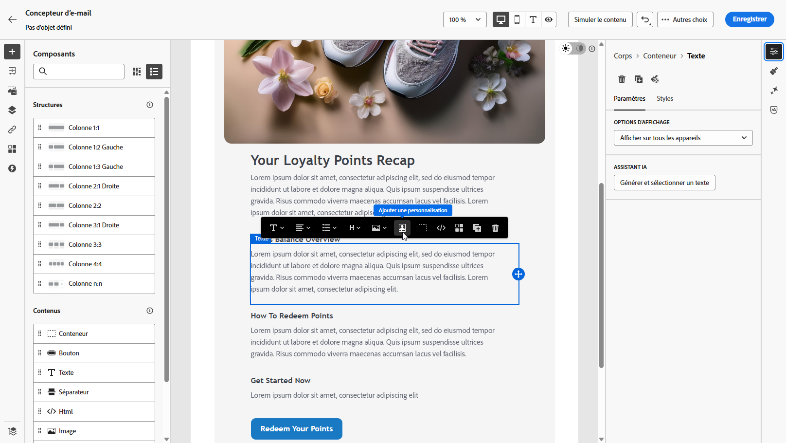
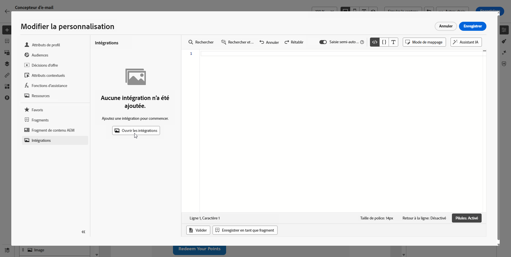
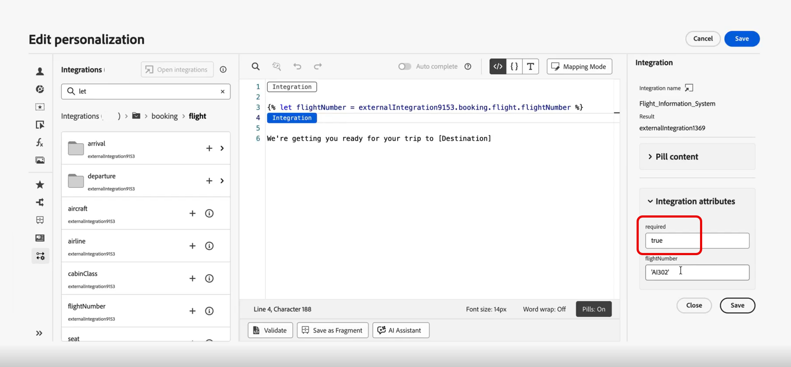
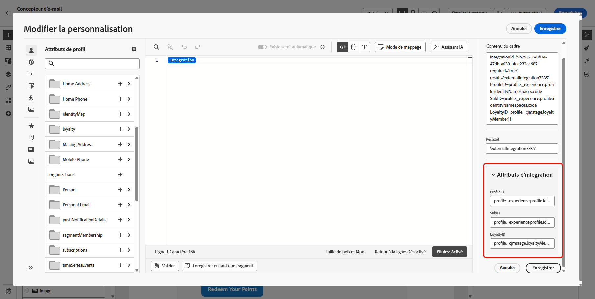
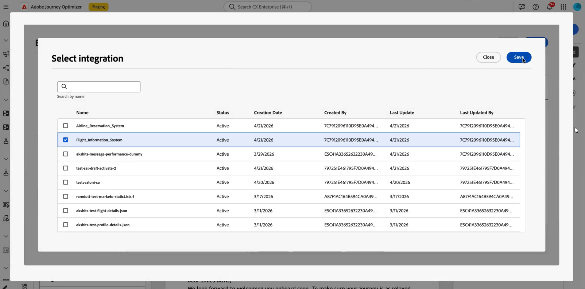
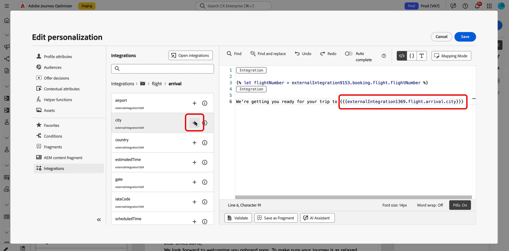

# Utiliser des intégrations externes pour la personnalisation {#integrations-personalization}

>[!BEGINSHADEBOX]

**Sur cette page :** découvrez comment les marketeurs appliquent des intégrations configurées pour personnaliser le contenu des e-mails, des SMS et des notifications push et enchaîner un appel API à un autre pour obtenir une messagerie plus riche et plus dynamique.

>[!ENDSHADEBOX]

Avant d’utiliser des intégrations externes dans votre contenu, vérifiez qu’un administrateur a **configuré et activé** chaque intégration (point d’entrée, authentification, politiques, payload de réponse et activation), comme décrit dans la section [&#x200B; Utiliser les intégrations &#x200B;](integrations.md).

Vous pouvez ajouter jusqu’à **3** intégrations par **[!UICONTROL fragment]** et jusqu’à **5** sur le message. Les intégrations qui proviennent uniquement de fragments ne sont pas comptabilisées dans le **5**.

## Application de la personnalisation de l’intégration à votre contenu {#apply-integration-personalization}

En tant que responsable marketing, vous pouvez utiliser des intégrations configurées pour personnaliser votre contenu. Procédez comme suit :

1. Accédez au contenu de votre campagne et cliquez sur **[!UICONTROL Ajouter une personnalisation]** dans le champ **[!UICONTROL Composants]** Texte ou HTML.

   [En savoir plus sur les composants](../email/content-components.md)

   

1. Accédez à la section **[!UICONTROL Intégrations]** et cliquez sur **[!UICONTROL Ouvrir les intégrations]** pour afficher toutes les intégrations actives.

   Notez que **les fragments** sont disponibles avec les intégrations , mais prennent uniquement en charge les canaux sortants. Une fois qu’un fragment est publié, l’ajout et l’enregistrement de nouvelles intégrations sont désactivés afin d’éviter tout impact sur les parcours et campagnes existants.

   

1. Sélectionnez une intégration et cliquez sur **[!UICONTROL Enregistrer]**.

   

1. Activez le mode **[!UICONTROL Pastilles]** pour déverrouiller le menu d’intégration avancé.

   

1. Lorsque vous créez la personnalisation de l’intégration, l’assistant Intégrations inclut un champ **`required`** qui définit la manière dont les données manquantes ou en échec interagissent avec le contenu par défaut :

   * **`required=true`** (par défaut) : le rendu s’arrête pour ce message. L’envoi est exclu avec **`ExternalDataLookupExclusion`** et cette exclusion est enregistrée dans le jeu de données de commentaires de messages **message**.
   * **`required=false`** : la variable de résultat est définie sur **`null`** et le rendu se poursuit. Utilisez du texte par défaut, des secours ou une logique conditionnelle dans votre modèle afin que les profils ne reçoivent pas de contenu vide lorsque l’intégration ne renvoie pas de données.

     

1. Pour terminer la configuration de votre intégration, définissez les attributs d’intégration, qui ont été précédemment spécifiés lors de la [configuration](integrations.md#configure).

   Vous pouvez attribuer des valeurs à ces attributs à l’aide de valeurs statiques, qui restent constantes, ou d’attributs de profil, qui extraient dynamiquement des informations des profils utilisateur.

   

1. Une fois les attributs d’intégration définis, vous pouvez utiliser les champs d’intégration de votre contenu pour envoyer des messages personnalisés en cliquant sur l’icône .

   

   >[!NOTE]
   >
   >Les jetons de votre modèle doivent utiliser uniquement les champs exposés par l’administrateur dans la configuration de l’intégration. Par exemple, `{{weatherResponse.temperature}}` est valide lorsque `temperature` est exposé ; `{{weatherResponse.humidity}}` est rejeté dans l’éditeur si `humidity` n’a pas été exposé.

1. Cliquez sur **[!UICONTROL Enregistrer]**.

Votre personnalisation d’intégration est maintenant appliquée avec succès à votre contenu, en veillant à ce que chaque destinataire reçoive une expérience adaptée et pertinente en fonction des attributs que vous avez configurés.


## Mapper un appel API à un autre {#map-integration-chain}

Vous pouvez enchaîner les intégrations de sorte que les résultats d’un appel alimentent les suivants, par exemple les segments de chemin d’accès, les en-têtes ou les paramètres de requête. Les appels s’exécutent dans l’ordre dans le même message, ce qui permet une personnalisation plus riche sans code personnalisé.

Avant de commencer, assurez-vous des points suivants :

* Un administrateur a configuré et activé chaque intégration dont vous avez besoin. Voir [Configuration de votre intégration](integrations.md).
* Les espaces réservés de chemin d’accès aux variables, les en-têtes et les paramètres de requête sont configurés dans la configuration de l’intégration avec des libellés destinés aux marketeurs.
* L’administrateur a exposé les champs de réponse dont vous avez besoin dans la **[!UICONTROL payload de réponse]** de chaque intégration afin qu’ils apparaissent lors de la création.

L’exemple ci-dessous utilise une intégration de réservation qui renvoie un numéro de vol de la réservation du profil, puis une intégration d’informations sur les vols qui utilise ce numéro pour le statut réel (retards, destination). Vous mappez les entrées de la seconde intégration à la réponse du premier appel.

1. Ouvrez votre message ou fragment et ouvrez l’éditeur de personnalisation.

   

1. Dans **[!UICONTROL Intégrations]**, cliquez sur **[!UICONTROL Ouvrir les intégrations]**.

   

1. Ajoutez l’intégration dont la réponse alimentera l’appel suivant, par exemple les données de réservation qui incluent l’identifiant du vol.

   

1. (Facultatif) Ouvrez le menu **[!UICONTROL Fonction d’assistance]** et ajoutez une fonction d’assistance, par exemple la fonction `Let`, si vous souhaitez lier une variable nommée à la réponse de réservation.

   >[!NOTE]
   >
   > Seuls les champs exposés dans la **[!UICONTROL payload de réponse]** définie par l’administrateur sont disponibles. Vous ne pouvez pas référencer des propriétés qui n’ont pas été exposées dans la configuration.

1. Si vous utilisez une variable d’assistance, mappez-la au champ que l’intégration de réservation renvoie pour une utilisation en aval, par exemple le numéro de vol dans le passager ou la payload de réservation.

   

1. Dans le menu **[!UICONTROL Intégrations ouvertes]**, ajoutez la deuxième intégration, par exemple, statut du vol.

   

1. Dans la seconde intégration, ouvrez **[!UICONTROL Attributs d’intégration]**. Pour chaque entrée qui doit réutiliser les données du premier appel, telles qu’une variable de chemin d’accès, un en-tête ou un paramètre de requête, sélectionnez une source de mappage à partir de la première réponse d’intégration.

   Dans l’expérience **[!UICONTROL Pilules]**, vous pouvez mapper la sortie du premier appel directement à l’entrée du second appel sans instruction `Let`. Si vous avez utilisé `Let`, vous pouvez mapper cette variable à la place.

   

1. Insérez des jetons de la deuxième intégration dans votre contenu avec le contrôle , par exemple la destination à partir de la réponse d’information de vol.

   

1. Enregistrez votre contenu.

Lors de la **[!UICONTROL Simulation]** ou de l’envoi, Journey Optimizer exécute les intégrations dans l’ordre : le premier appel utilise le contexte de profil que vous avez configuré et son résultat génère la seconde demande. L’exécution d’une intégration donnée au moment de la simulation ou de l’envoi dépend de votre configuration et de votre canal.


## Utilisation des données Adobe Target dans les modèles {#use-adobe-target-in-templates}

Cette section explique comment utiliser les **intégrations** dans Adobe Journey Optimizer pour récupérer les données de personnalisation de **[!DNL Adobe Target]** au moment de l’envoi et les utiliser dans des modèles de message. Elle suppose que l’API de diffusion Target a déjà été configurée en tant qu’intégration.

Pour connaître les étapes de configuration, consultez [Utilisation des intégrations](integrations.md) et l’exemple d’Adobe Target Recommendations[&#128279;](vendor-integration.md#adobe-target-recommendations) .

L’API Target Delivery renvoie un tableau `prefetch.mboxes`. Chaque mbox comprend un objet `options` avec des champs `content` et `type`. La valeur `type` détermine la manière dont vous utilisez `content` dans votre modèle. Ouvrez l’onglet correspondant à votre réponse mbox, puis suivez les étapes pour utiliser ces données dans votre message.

>[!BEGINTABS]

>[!TAB  Contenu JSON ]

Lorsque `type` est `json`, le champ `content` est une chaîne **JSON**. Analysez-le avant d’accéder aux champs imbriqués. L’exemple ci-dessous illustre une réponse type de l’API de diffusion pour une mbox JSON.

```json
{
  "status": 200,
  "prefetch": {
    "mboxes": [
      {
        "index": 0,
        "name": "SummerOffer",
        "options": {
          "content": "{\"recommendations\":[{\"productId\":\"p101\",\"name\":\"Noise Smartwatch\",\"price\":2999},{\"productId\":\"p205\",\"name\":\"Boat Earbuds\",\"price\":1499}],\"strategy\":\"collaborative-filtering\"}",
          "type": "json"
        }
      }
    ]
  }
}
```

Utilisez trois assistants en séquence pour récupérer, extraire et analyser la réponse de Target.

1. **Récupérer la réponse de Target.** Appelez votre intégration Target configurée avec `externalDataLookup`. Définissez `integrationName` sur le **[!UICONTROL Nom]** de cette intégration (remplacez l’exemple d’espace réservé `target_recommendations`). Utilisez le paramètre `result` pour nommer la variable de modèle qui contient la payload complète de l’API de diffusion, par exemple `targetResponse`.

   Vous pouvez également sélectionner l’intégration directement à partir du menu **[!UICONTROL Intégrations]** dans le volet de navigation de gauche de l’éditeur de personnalisation. Voir [Application de la personnalisation de l’intégration à votre contenu](#apply-integration-personalization).

   ```handlebars
   {{externalDataLookup integrationName="target_recommendations" result="targetResponse"}}
   ```

1. **Extraire une mbox spécifique à l’aide de valueAtPath.** `valueAtPath` extrait un élément d’un tableau par son index de base 0 et l’affecte à une variable de modèle. Utilisez le paramètre `idx` pour spécifier l’élément auquel accéder.

   ```handlebars
   {{valueAtPath targetResponse.prefetch.mboxes idx=0 result="summerOffer"}}
   ```

   | Paramètre | Description |
   | --- | --- |
   | `path` | Chemin d’accès au tableau (position, pas de mot-clé) |
   | `idx` | Index basé sur 0 pour l’accès aux tableaux (facultatif) |
   | `result` | Nom de variable pour stocker la valeur extraite |

   >[!NOTE]
   >
   > Si `idx` est hors limites, le rendu renvoie une exception. Protégez les index non valides avec des `` si l’index est non valide. Les expressions PQL ne peuvent pas être utilisées comme chemin d’accès. **Disponible depuis la version 2025.9.0.**

1. **Analysez la chaîne JSON à l’aide de parseJson.** Le champ `options.content` de la mbox est une chaîne JSON brute. `parseJson` le convertit en un objet structuré dont les champs sont directement accessibles dans le modèle.

   ```handlebars
   {{parseJson jsonStr=summerOffer.options.content result="summerOfferContent"}}
   ```

   | Paramètre | Description |
   | --- | --- |
   | `jsonStr` | Chemin d’accès au champ de chaîne contenant un fichier JSON valide |
   | `result` | Nom de la variable pour stocker l’objet analysé |

   >[!NOTE]
   >
   > Si la chaîne JSON n’est pas valide ou si la référence est nulle, `result` est défini sur `null` — aucune erreur de rendu n’est générée. Testez votre réponse Target réelle pour confirmer que le contenu est un fichier JSON valide. **Disponible depuis : 2026.6.0**

1. **Accéder aux données.** Une fois analysé, utilisez la notation par points pour accéder aux champs depuis `summerOfferContent`. Pour effectuer le rendu d’une liste de recommandations :

   ```handlebars
   {{externalDataLookup integrationName="target_recommendations" result="targetResponse"}}
   {{valueAtPath targetResponse.prefetch.mboxes idx=0 result="summerOffer"}}
   {{parseJson jsonStr=summerOffer.options.content result="summerOfferContent"}}
   
   Strategy: {{summerOfferContent.strategy}}
   {{#each summerOfferContent.recommendations as |rec|}}
     {{rec.name}} — {{rec.price}}
   {{/each}}
   ```

>[!TAB Contenu ]

Lorsque `type` est `html`, le champ `content` est une chaîne HTML prête à être rendue. Il n’est pas nécessaire de l’analyser. L’exemple ci-dessous illustre une réponse type de l’API de diffusion pour une mbox HTML.

```json
{
  "status": 200,
  "prefetch": {
    "mboxes": [
      {
        "index": 0,
        "name": "SummerOffer",
        "options": {
          "content": "<div class=\"offer\"><h2>Summer Sale</h2><p>50% off Smartwatch</p></div>",
          "type": "html"
        }
      }
    ]
  }
}
```

Récupérez et extrayez la mbox, puis effectuez directement le rendu de la `content`. Ignorer la `parseJson`.

```handlebars
{{externalDataLookup integrationName="target_recommendations" result="targetResponse"}}
{{valueAtPath targetResponse.prefetch.mboxes idx=0 result="summerOffer"}}
{{{summerOffer.options.content}}}
```

>[!NOTE]
>
> Utilisez des **accolades triples** `{{{...}}}` pour effectuer le rendu du contenu HTML en l’état. Les accolades doubles `{{...}}` permettront d’échapper les entités HTML et de générer des chaînes de balises brutes au lieu d’HTML.

>[!ENDTABS]

## Vidéo pratique {#video}

Cette vidéo montre comment **Intégrations** connecter Adobe Journey Optimizer à des API externes afin d’extraire des données et du contenu en direct dans des canaux **sortants**, des e-mails, des SMS et des notifications push, pour une personnalisation plus pertinente.

>[!VIDEO](https://video.tv.adobe.com/v/3484120/?captions=fre_fr&learn=on)
