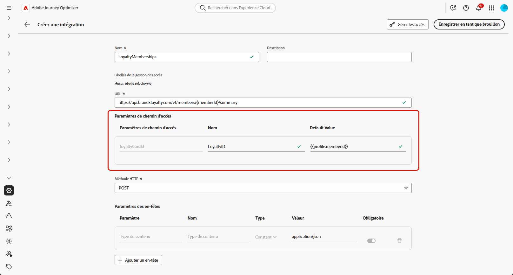
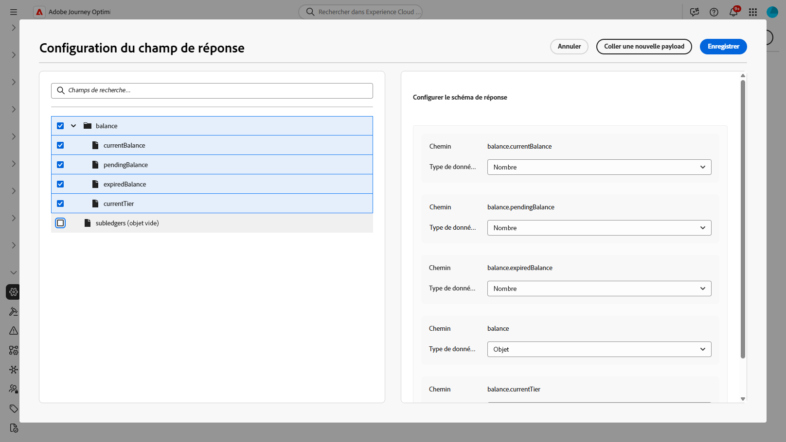
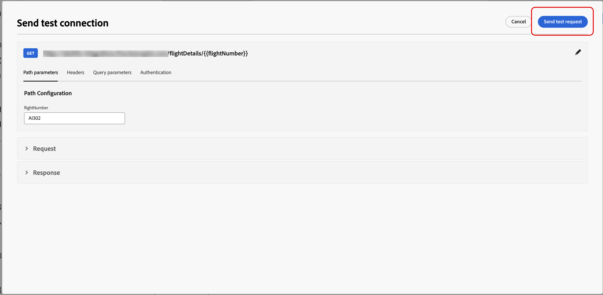
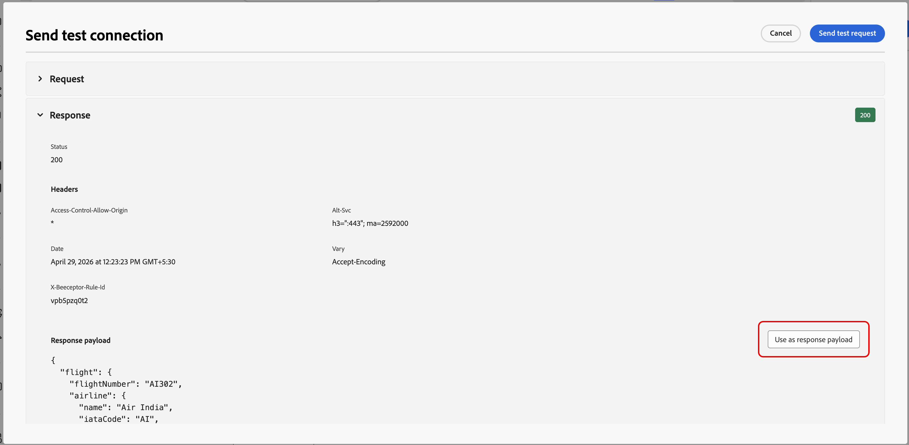

# Utiliser des intégrations {#external-sources}

>[!BEGINSHADEBOX]

**Sur cette page :** découvrez comment les administrateurs configurent, testent et activent les intégrations externes qui connectent Adobe Journey Optimizer à des API tierces pour un contenu personnalisé et dynamique dans les canaux sortants.

>[!ENDSHADEBOX]

## Vue d’ensemble

La fonctionnalité **Intégrations** relie Adobe Journey Optimizer à des systèmes tiers dont vous gérez déjà les données et le contenu composable ailleurs. Vous pouvez surfacer ce contenu pendant la création et au moment de l’envoi, ce qui permet d’offrir des expériences plus réactives et personnalisées sur les canaux que vous utilisez dans Journey Optimizer.

Vous pouvez utiliser cette fonctionnalité pour accéder à des données externes et extraire du contenu à partir d’outils tiers tels que :

* **Points de récompense** issus des systèmes de fidélité.
* **Informations sur les prix** pour les produits.
* **Recommandations de produits** à partir des moteurs de recommandation.
* **Mises à jour logistiques** comme le statut de la diffusion.

Pour commencer à utiliser les intégrations, les utilisateurs doivent disposer des autorisations **[!UICONTROL Gérer la configuration de l’intégration AJO]** et **[!UICONTROL Afficher la configuration de l’intégration AJO]**. [En savoir plus sur les autorisations](../administration/permissions.md)

+++ Découvrez comment attribuer des autorisations liées aux intégrations

1. Dans le produit **[!UICONTROL Autorisations]**, accédez à l’onglet **[!UICONTROL Rôles]** et sélectionnez le **[!UICONTROL Rôle]** de votre choix.

1. Cliquez sur **[!UICONTROL Modifier]** pour modifier les autorisations.

1. Ajoutez la ressource **[!UICONTROL Configuration de l’intégration]**, puis sélectionnez les autorisations d’intégration appropriées dans le menu déroulant.

   

1. Cliquez sur **[!UICONTROL Enregistrer]** pour appliquer vos modifications.

   Les autorisations des personnes déjà affectées à ce rôle seront automatiquement mises à jour.

1. Pour attribuer ce rôle à de nouvelles personnes, accédez à l’onglet **[!UICONTROL Utilisateurs et utilisatrices]** du tableau de bord **[!UICONTROL Rôles]** et cliquez sur **[!UICONTROL Ajouter un utilisateur ou une utilisatrice]**.

1. Saisissez le nom de la personne, son adresse e-mail ou choisissez dans la liste, puis cliquez sur **[!UICONTROL Enregistrer]**.

Si le profil de l’utilisateur ou de l’utilisatrice n’a pas été créé auparavant, consultez [cette documentation](https://experienceleague.adobe.com/fr/docs/experience-platform/access-control/abac/permissions-ui/users).

+++

## Configurer votre intégration {#configure}

>[!AVAILABILITY]
>
> Cette fonctionnalité d’intégration est limitée aux canaux sortants (e-mail, SMS et notification push) et prend en charge l’extraction de fichiers JSON ou HTML.

En tant qu’administrateur ou administratrice, vous pouvez configurer des intégrations externes en procédant comme suit :

1. Accédez à la section **[!UICONTROL Configurations]** dans le menu de gauche, puis cliquez sur **[!UICONTROL Gérer]** dans la carte **[!UICONTROL Intégrations]**.

   Cliquez ensuite sur **[!UICONTROL Créer une intégration]** pour démarrer une nouvelle configuration.

   

1. Vous pouvez éventuellement coller une commande **cURL** pour remplir automatiquement l’URL, la méthode HTTP, les en-têtes et les paramètres de requête.

1. Indiquez un **[!UICONTROL nom]** et une **[!UICONTROL description]** pour votre intégration.

   >[!NOTE]
   >
   >Le champ **[!UICONTROL Nom]** ne peut pas contenir d’espaces.

1. Saisissez le point d’entrée de l’API **[!UICONTROL URL]**.

   Pour les variables de chemin d’accès, placez un libellé entre accolades doubles dans l’URL, par exemple `https://api.example.com/v1/products/{{productId}}`, puis définissez chaque espace réservé dans **[!UICONTROL Modèle de chemin d’accès]**.

1. Configurez le **[!UICONTROL Modèle de chemin d’accès]** avec **[!UICONTROL Nom]** et **[!UICONTROL Valeur par défaut]** pour chaque espace réservé ajouté dans l’URL.

   Notez que le **[!UICONTROL Nom]** est un libellé destiné aux professionnels du marketing dans l’éditeur uniquement. Il n’est pas envoyé sur la requête API.

   

1. Sélectionnez la **[!UICONTROL méthode HTTP]** entre GET et POST.

1. Cliquez sur **[!UICONTROL Ajouter un en-tête]** et/ou **[!UICONTROL Ajouter des paramètres de requête]** selon les besoins de votre intégration. Pour chaque paramètre, fournissez les détails suivants :

   * **[!UICONTROL Paramètre]** : nom réel de l’en-tête ou du paramètre de requête comme attendu par l’API.

   * **[!UICONTROL Nom]** : libellé convivial pour les professionnels du marketing pour ce paramètre, les auteurs et autrices le sélectionnent lors du mappage des valeurs dans les campagnes.

   * **[!UICONTROL Type]** : choisissez **Constante** pour une valeur fixe ou **Variable** pour une entrée dynamique.

   * **[!UICONTROL Valeur]** : saisissez directement la valeur pour les constantes ou sélectionnez un mappage de variables.

   * **[!UICONTROL Obligatoire]** : indiquez si ce paramètre est obligatoire. Pour les paramètres **[!UICONTROL Variable]** obligatoires, si aucune valeur n’est résolue au moment de l’exécution et qu’aucune valeur par défaut n’est fournie, la génération de la requête échoue avec une erreur et l’appel API sortant n’est pas effectué.

   

1. Choisissez un **[!UICONTROL type d’authentification]** :

   * **[!UICONTROL Aucune authentification]** : pour les API ouvertes qui ne nécessitent aucune information d’identification.

   * **[!UICONTROL Clé API]** : authentifiez les requêtes à l’aide d’une clé API statique. Saisissez votre **[!UICONTROL nom de clé API &#x200B;]**, la **[!UICONTROL valeur de la clé API &#x200B;]** et spécifiez votre **[!UICONTROL emplacement]**.

   * **[!UICONTROL Authentification de base]** : utilisez l’authentification HTTP de base standard. Saisissez le **[!UICONTROL nom d’utilisateur]** et le **[!UICONTROL mot de passe]**.

   * **[!UICONTROL OAuth 2.0]** : authentifiez-vous à l’aide du protocole OAuth 2.0. Cliquez sur l’icône  pour configurer ou mettre à jour la **[!UICONTROL payload]**.

   

1. Définissez la **[!UICONTROL Configuration de la politique]** comme le **[!UICONTROL Délai d’expiration]** pour les requêtes API et choisissez d’activer le ralentissement, la mise en cache et/ou la reprise.

   >[!NOTE]
   >
   >Lorsque la limitation est activée, les taux pris en charge sont compris entre 50 et 5 000 TPS. Les limites s’appliquent à l’**intégration**, et non à chaque point d’entrée de l’API.
   >
   >Lorsque la reprise est activée, d’autres échecs réessayent **trois** par défaut, avec **200 ms**, **400 ms** et **800 ms** entre les tentatives.

1. Avec le champ **[!UICONTROL payload de réponse]**, vous pouvez déterminer quels champs de l’exemple de sortie doivent être utilisés pour la personnalisation des messages.

   Cliquez sur l’icône  et collez un exemple de payload de réponse JSON pour détecter automatiquement les types de données.

1. Choisissez les champs à exposer pour la personnalisation et spécifiez leurs types de données correspondants.

   

   >[!NOTE]
   >
   >La configuration **[!UICONTROL Payload de réponse]** définit la réponse attendue pour la création, y compris tout schéma appliqué à cette étape. Les marketeurs peuvent référencer uniquement les champs exposés. Les jetons pour d’autres chemins ne sont pas validés dans l’éditeur.

1. Utilisez **[!UICONTROL Envoyer une connexion de test]** pour valider l’intégration. [En savoir plus sur la manière de tester votre connexion](#connection)

   Une fois la validation effectuée, cliquez sur **[!UICONTROL Activer]**.

1. Accédez à l’intégration que vous venez de créer pour :

   * **Mise à jour** : modifiez uniquement les détails **Authentification** et **Configuration de la stratégie**. Les mises à jour s’appliquent aux parcours et aux campagnes en direct. Avant d’enregistrer les modifications, utilisez le menu **[!UICONTROL Explorer les références]** pour confirmer où l’intégration est utilisée.
   * **Archiver** : archivez une configuration d’intégration.

   

Après l’activation, cliquez sur l’icône  pour accéder au menu **[!UICONTROL Explorer les références]** et passer en revue l’utilisation de cette configuration, y compris les parcours et les campagnes qui en dépendent.

### Limites de l’heure d’envoi et comportement {#configure-send-time}

Au moment de l’envoi, les réponses de l’API externe peuvent être jusqu’à **4 Mo** par défaut. Toute valeur supérieure est traitée comme une erreur d’intégration et **aucune tentative n’est effectuée** lorsque l’échec est dû à la taille de la réponse.

Les appels respectent le taux **de limitation** que vous avez configuré : Journey Optimizer planifie les tentatives jusqu’à cette limite même lorsque le système externe est en panne ou renvoie des erreurs. Si le **cache** est activé, seules les réponses **réussies** sont stockées et réutilisées jusqu’à l’expiration du cache **TTL** que vous avez défini ; les réponses en échec ne sont jamais mises en cache.

Chaque message mis en file d’attente comporte également une fenêtre de validité (TTL). Si le traitement prend du retard et qu’un message reste au-delà de cette fenêtre, le système **ignore** et émet un événement **`MessageValidityExclusion`** afin que le travail obsolète soit effacé de la file d’attente et que les ressources restent disponibles.

## Test de votre connexion {#connection}

**[!UICONTROL Envoyer la connexion de test]** valide l’URL du point d’entrée, l’authentification et la structure de requête par rapport à l’API cible avant l’activation, ce qui réduit le risque d’échecs d’exécution pendant le traitement des messages.

1. Lorsque l’URL, la méthode HTTP, les en-têtes et les paramètres de requête sont définis, cliquez sur **[!UICONTROL Envoyer la connexion de test]** pour exécuter un test de connectivité et confirmer la configuration.

1. Dans la boîte de dialogue **[!UICONTROL Envoyer la connexion de test]**, saisissez les valeurs par défaut des espaces réservés **[!UICONTROL Variable]** dans le chemin d’accès de l’URL, les en-têtes et les paramètres de requête.

   Ces valeurs sont incluses dans la requête de test. Journey Optimizer appelle le point d’entrée et indique si la connexion a réussi ou échoué.

   

1. Si le test renvoie une réponse réussie, sélectionnez **[!UICONTROL Utiliser comme payload de réponse]** pour copier le corps de la réponse dans le champ **[!UICONTROL Payload de réponse]**, voir l’étape 10 sous [Configurer votre intégration](#configure), où les types de données peuvent être détectés et les champs peuvent être sélectionnés pour la personnalisation.

   

1. Si le test échoue, développez le menu déroulant **[!UICONTROL Erreur]** pour consulter les détails de l’échec, mettez à jour la configuration de l’intégration si nécessaire et exécutez à nouveau **[!UICONTROL Envoyer la connexion de test]**.

   

Une fois le test réussi, sélectionnez **[!UICONTROL Activer]** dans la configuration de l’intégration. Voir [Configuration de votre intégration](#configure).

