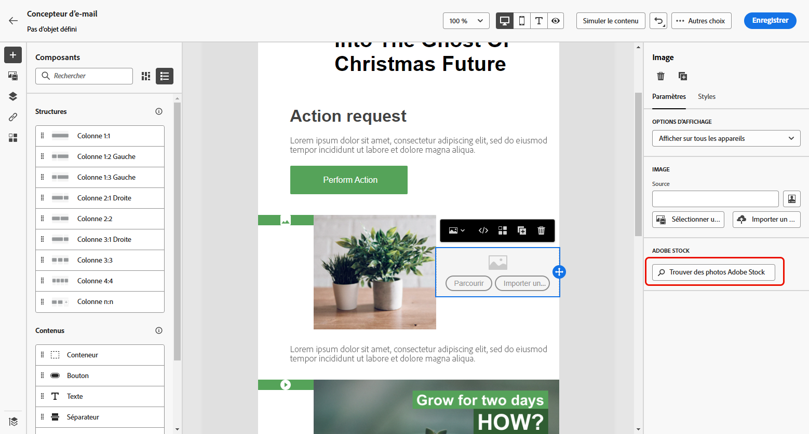
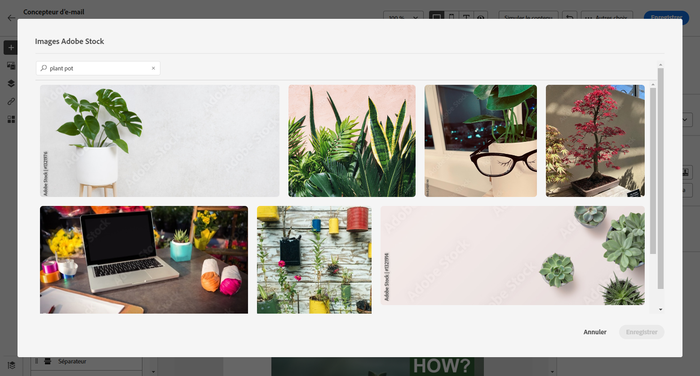
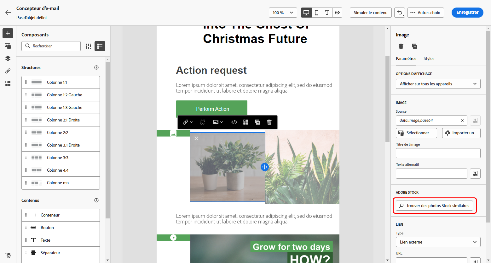
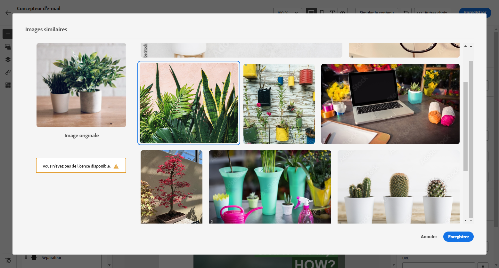
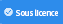
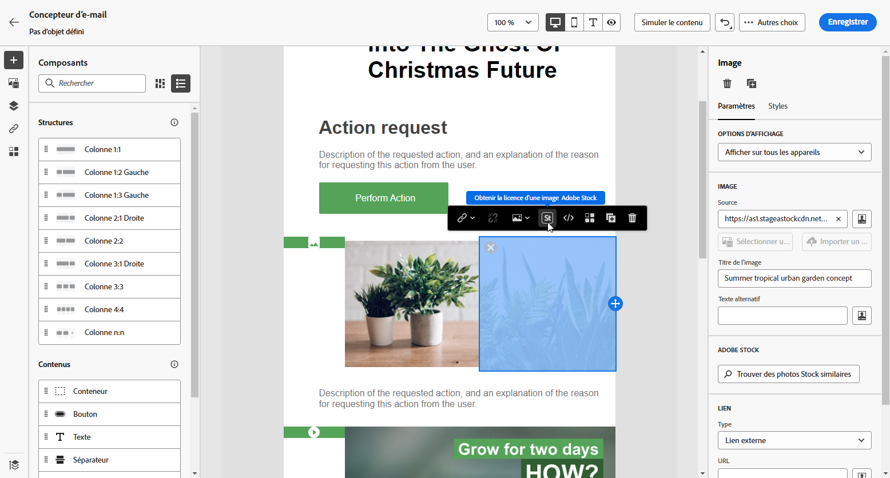
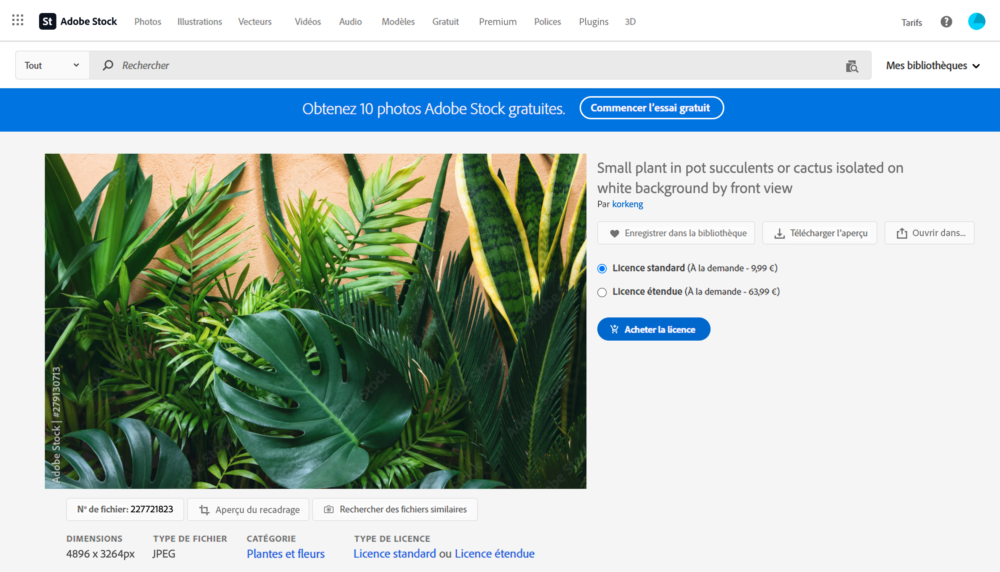
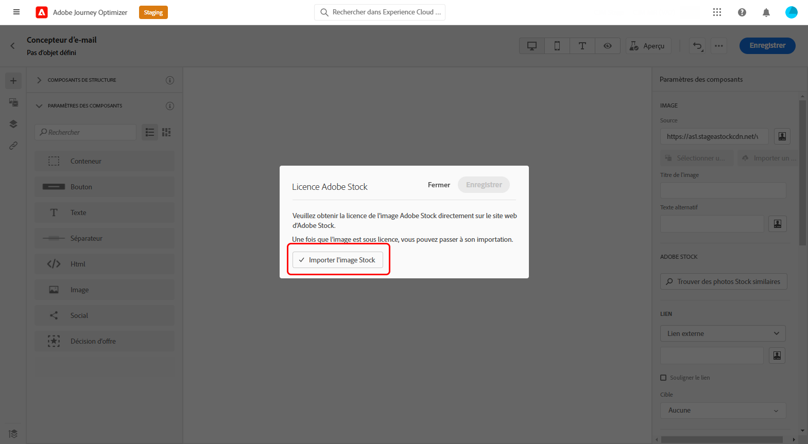

# Utiliser des images [!DNL Adobe Stock] {#stock}

## Prise en main d’[!DNL Adobe Stock] {#get-started-stock}

Le plug-in d’intégration d’[!DNL Adobe Stock] et du concepteur d’e-mail [!DNL Adobe Journey Optimizer] fournit aux clients une façon simple de naviguer, d’acquérir des produits sous licence et d’enregistrer des images en vue de les utiliser dans la création de messages.

[Adobe Stock](https://helpx.adobe.com/fr/stock/get-started.html){target="_blank"} permet d’accéder à des millions de photos, vidéos, illustrations et graphiques vectoriels de qualité supérieure, organisés et libres de droits. Vous pouvez choisir d’acheter un pack de crédits pour acquérir des ressources sous licence ou d’acheter uniquement une licence Standard ou Étendue pour la ressource nécessaire. Adobe Stock fournit également une collection gratuite de ressources.

Avec [!DNL Adobe Journey Optimizer], vous pouvez charger des images dans vos e-mails directement depuis [!DNL Adobe Stock] et les ajouter à votre dossier **[!UICONTROL Ressources]** à l’aide de l’option **[!UICONTROL Trouver des photos Adobe Stock]**. En outre, l’option **[!UICONTROL Trouver des photos Stock similaires]** vous permet de trouver les images correspondant au contenu, à la couleur et à la composition de la ressource utilisée dans votre diffusion.

## Autorisations{#stock-permissions}

Les options **[!UICONTROL Trouver des photos Adobe Stock]** et **[!UICONTROL Rechercher une image similaire]** sont disponibles pour les utilisateurs ayant accès à un profil de produit AEM Assets Essentials.

Pour en savoir plus à ce sujet, consultez la [documentation d’Experience Manager Assets](https://experienceleague.adobe.com/docs/experience-manager-assets-essentials/help/get-started-admins/deploy-administer.html?lang=fr#add-users-to-essentials){target="_blank"}.

## Insérer une image depuis [!DNL Adobe Stock] {#add-stock-image}

Pour ajouter des images à votre contenu depuis [!DNL Adobe Stock], procédez comme suit :

1. Dans la section **[!UICONTROL Composants de contenu]** du concepteur d’e-mail, effectuez un glisser-déposer d’une **Image**.

1. Cliquez sur le bouton **[!UICONTROL Trouver des photos Adobe Stock]** sur le côté gauche du concepteur d’e-mail.

   

1. Naviguez dans la bibliothèque ou saisissez un terme dans le champ de recherche.

   

1. Sélectionnez l’image choisie, puis cliquez sur **[!UICONTROL Enregistrer]**.

   Si l’image que vous avez sélectionnée n’est pas sous licence, vous devez [obtenir la licence](#license-stock-image).

## Rechercher des photos similaires {#similar-stock-image}

Vous pouvez remplacer n’importe quelle image existante dans le contenu de votre e-mail par une photo issue d’[!DNL Adobe Stock]. Notez que cette option est disponible pour toutes les images : images Stock sous licence/sans licence et images de votre dossier Ressources.

Pour parcourir des photos similaires, procédez comme suit :

1. Sélectionnez l’image à remplacer.
1. Cliquez sur le bouton **[!UICONTROL Trouver des photos Stock similaires]** pour afficher les ressources dans [!DNL Adobe Stock] qui correspondent au contenu, à la couleur et à la composition de l’image.

   

1. Sélectionnez l’image choisie, puis cliquez sur **[!UICONTROL Enregistrer]**.

   

   Si l’image que vous avez sélectionnée n’est pas sous licence, vous devez [obtenir la licence](#license-stock-image).

1. Si nécessaire, personnalisez votre image avec les onglets **[!UICONTROL Paramètres]** et **[!UICONTROL Styles]**. [En savoir plus sur les paramètres des composants](../email/content-components.md).

## Obtenir la licence depuis [!DNL Adobe Stock] {#license-stock-image}

Si votre image est déjà sous licence, elle sera représentée par l’icône . Si ce n&#39;est pas le cas, vous devez obtenir une licence.

Pour acquérir votre image sous licence et la télécharger, procédez comme suit :

1. Sélectionnez-la et cliquez sur l’icône **[!UICONTROL Obtenir la licence d’une image Adobe Stock]**.

   

   Le site web [!DNL Adobe Stock] de redirection vous invite à acheter la licence.

   

1. Depuis le site web [!DNL Adobe Stock], vous devez acheter votre ressource pour pouvoir télécharger l’image et supprimer le filigrane.

   Cet achat dépend de votre abonnement ou de votre formule Adobe Stock. Si vous disposez de plusieurs comptes Adobe Stock, vous serez redirigé vers le dernier identifiant Stock utilisé. Dans ce cas, assurez-vous d’être connecté au compte approprié avant d’obtenir une licence pour votre ressource.

   Pour en savoir plus sur les tarifs et les forfaits Adobe Stock, consultez la [documentation Adobe Stock](https://stock.adobe.com/plans){target="_blank"}.

   >[!WARNING]
   > Si un e-mail contenant une image sans licence est envoyé, l’image conserve son aspect sans licence avec le filigrane.

1. Une fois votre achat terminé, vous pouvez revenir à votre e-mail dans [!DNL Adobe Journey Optimizer] et sélectionner **[!UICONTROL Importer un catalogue d’images]** pour importer votre image sous licence dans vos ressources.

   

1. Sélectionnez dans quel dossier stocker votre ressource. Pour plus d’informations sur [!DNL Experience Manager Assets], consultez cette [page](assets.md#get-started-assets).

## Rubriques connexes{#stock-related-topics}

* [Conception d’e-mails dans Journey Optimizer](../email/get-started-email-design.md)
* [Paramètres des composants pour la conception d’un e-mail](../email/content-components.md)
* [Commencer avec Adobe Stock](https://helpx.adobe.com/fr/stock/get-started.html){target="_blank"}.

