# Création et publication de landing pages {#create-lp}

>[!CAUTION]
>
>L’utilisation des landing pages est actuellement disponible en accès anticipé pour certains utilisateurs uniquement. Si vous souhaitez utiliser cette fonctionnalité, contactez votre chargé de compte d’Adobe.

## Accès aux landing pages

Pour accéder à la liste des landing pages, sélectionnez **[!UICONTROL Gestion des parcours]** > **[!UICONTROL Landing pages]** dans le menu de gauche.

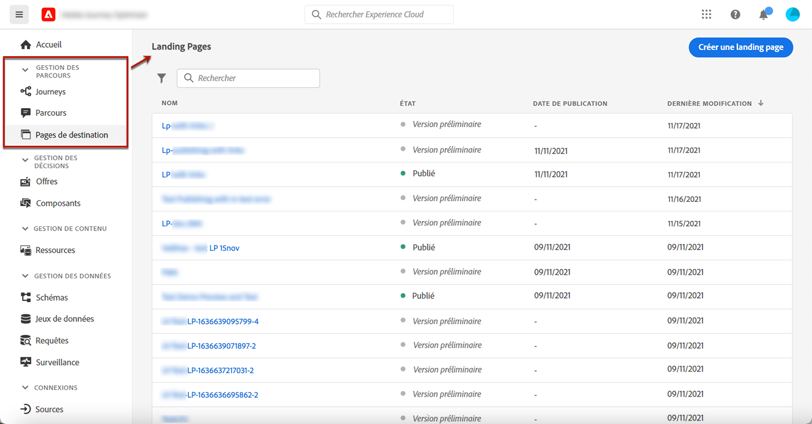

Le **[!UICONTROL Pages d’entrée]** liste affiche tous les éléments créés. Vous pouvez les filtrer selon leur état ou leur date de modification.

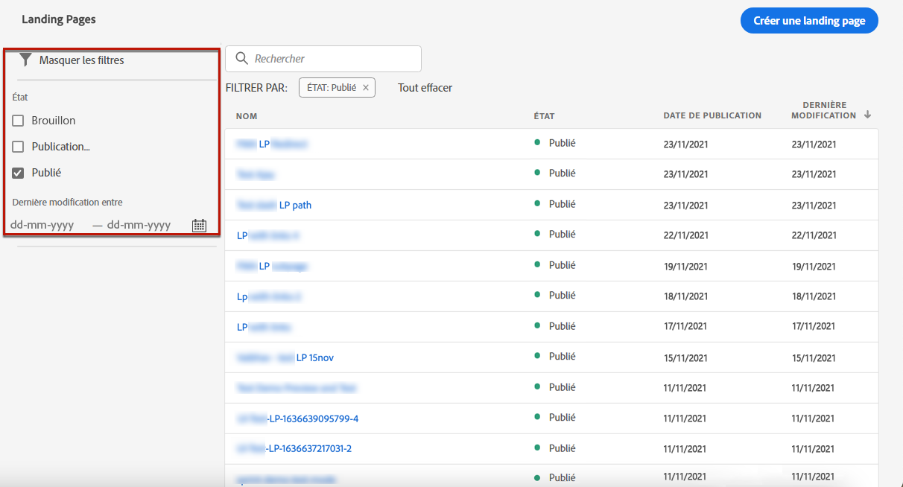

## Création d’une landing page

Les étapes de création d&#39;une landing page sont les suivantes.

1. Dans la liste des landing pages, cliquez sur **[!UICONTROL Créer une landing page]**.

   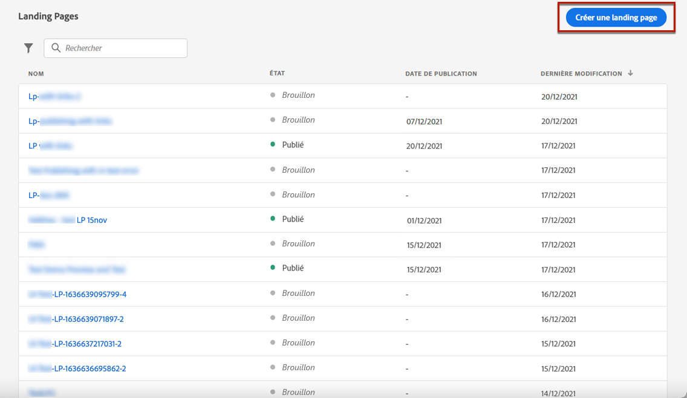

1. Ajoutez un titre. Si nécessaire, vous pouvez ajouter une description.

   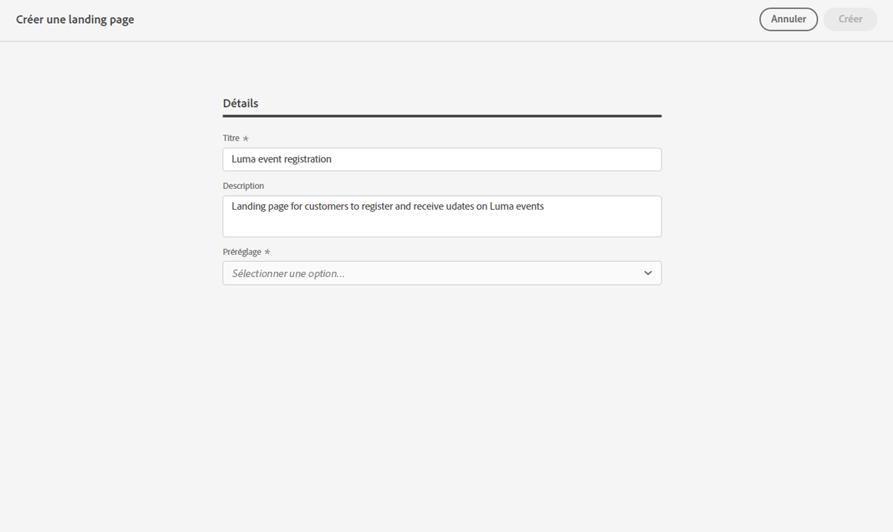

1. Sélectionnez un paramètre prédéfini.

   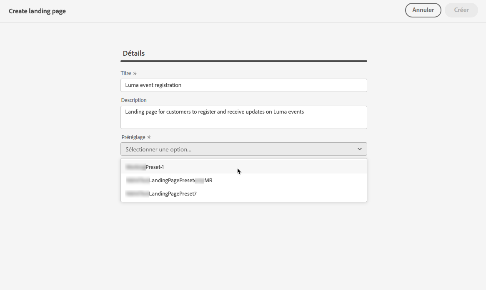

   >[!NOTE]
   >
   >Pour définir des paramètres prédéfinis de page d’entrée, contactez votre gestionnaire de compte d’Adobe ou le [Équipe d’assistance clientèle d’Adobe](https://helpx.adobe.com/fr/enterprise/admin-guide.html/enterprise/using/support-for-experience-cloud.ug.html){target=&quot;_blank&quot;}.

1. Cliquez sur **[!UICONTROL Créer]**.

1. La Principale page et ses propriétés s’affichent. Découvrez comment configurer les paramètres de page Principaux [here](#configure-primary-page).

   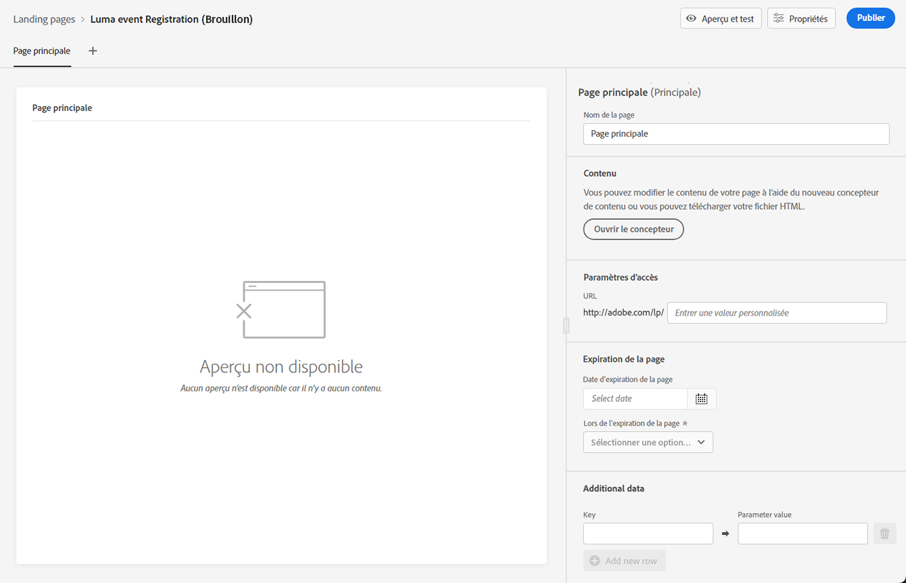

1. Cliquez sur l’icône + pour ajouter une sous-page. Découvrez comment configurer les paramètres de sous-page [here](#configure-subpages).

   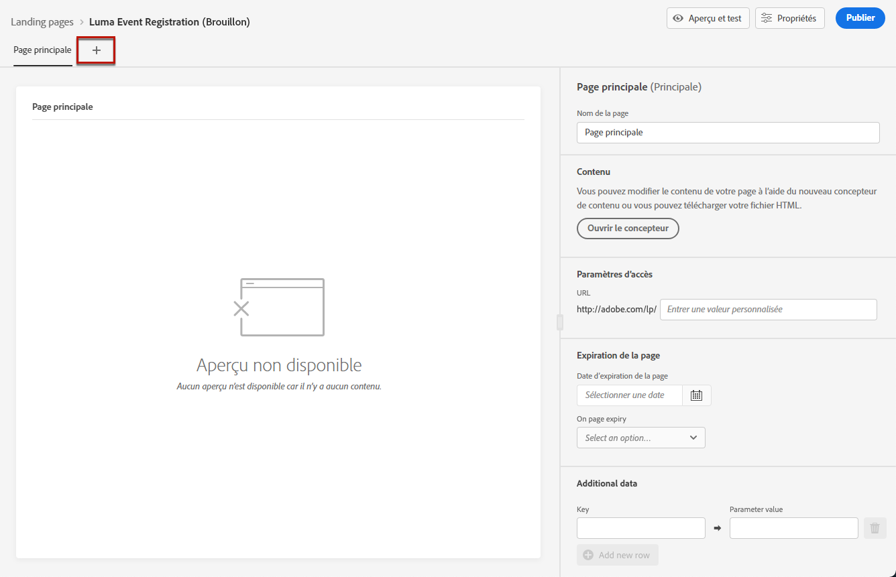

Une fois que vous avez configuré et conçu la variable [Principale page](#configure-primary-page), et la variable [sous-pages](#configure-subpages) le cas échéant, vous pouvez [test](#test) et [publier](#publish) votre landing page.

## Configuration de la Principale page {#configure-primary-page}

La Principale page est la page qui s’affiche immédiatement pour les utilisateurs lorsqu’ils cliquent sur le lien vers votre page d’entrée (provenant d’un courrier électronique ou d’un site web, par exemple).

Pour définir les Principaux paramètres de page, procédez comme suit.

1. Vous pouvez modifier le nom de la page : **[!UICONTROL Principale page]** par défaut.

1. Modifiez le contenu de votre page à l’aide du concepteur de contenu. Découvrez comment définir le contenu d&#39;une landing page [here](design-lp.md).

   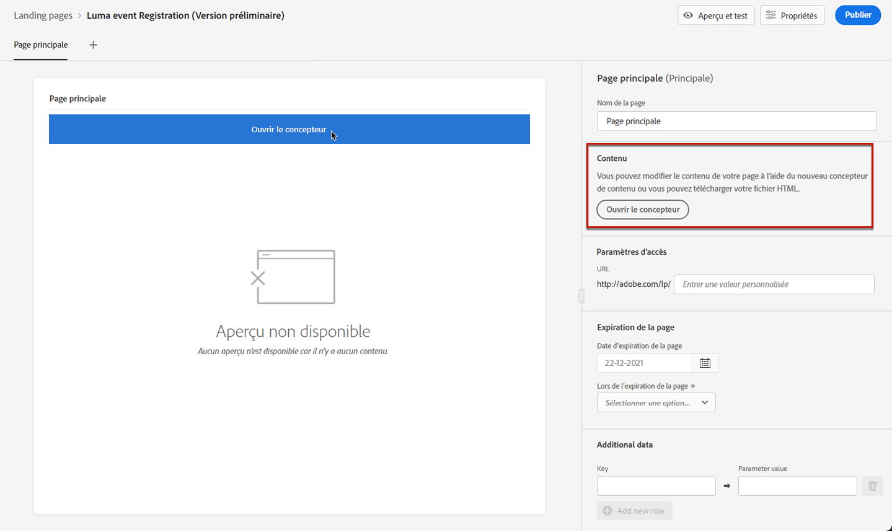

1. Définissez l&#39;URL de votre landing page. La première partie de l’URL nécessite l’exécution de la délégation de domaine. Il est prérempli et ne peut pas être modifié dans l’interface utilisateur. Pour le configurer, contactez votre gestionnaire de compte d’Adobe ou le [Équipe d’assistance clientèle d’Adobe](https://helpx.adobe.com/enterprise/admin-guide.html/enterprise/using/support-for-experience-cloud.ug.html){target=&quot;_blank&quot;}.

   >[!CAUTION]
   >
   >L&#39;URL de la landing page doit être unique.

   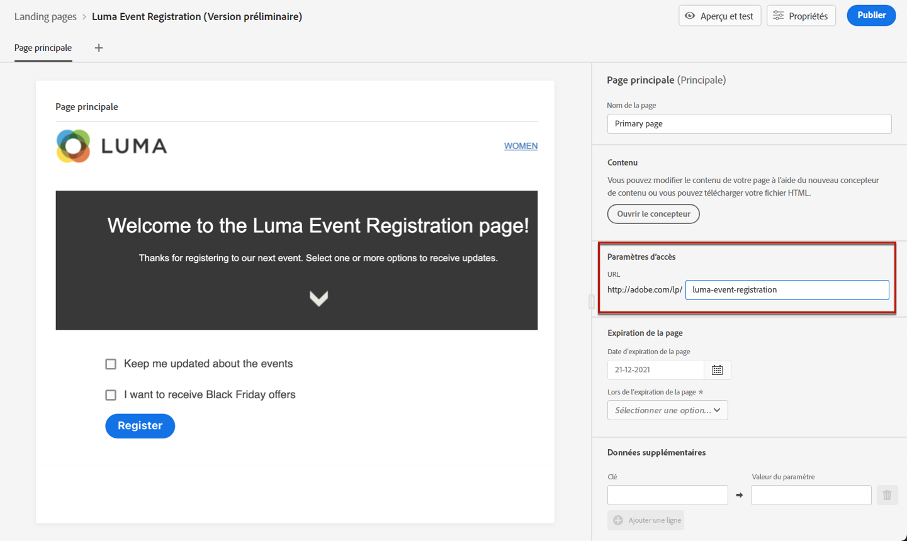

1. Vous pouvez définir une date d’expiration pour votre page. Dans ce cas, vous devez sélectionner une action à l’expiration de la page :

   * **[!UICONTROL URL de redirection]**: Saisissez l’URL de la page vers laquelle les utilisateurs seront redirigés à l’expiration de la page.
   * **[!UICONTROL Page personnalisée]**: [Configuration d’une sous-page](#configure-subpages) et sélectionnez-le dans la liste déroulante qui s’affiche.
   * **[!UICONTROL Erreur du navigateur]**: Saisissez le texte de l’erreur qui s’affichera à la place de la page.

   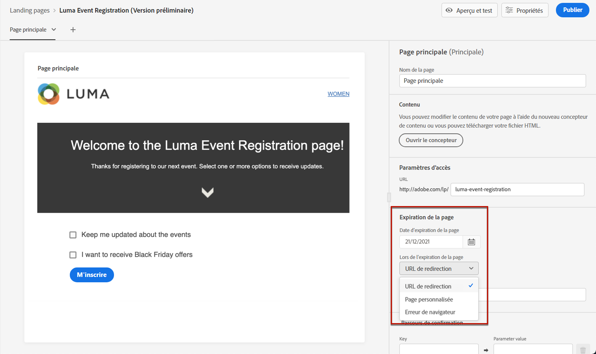

   <!--1. In the **[!UICONTROL Additional data]** section, define a **[!UICONTROL Key]** and the corresponding **[!UICONTROL Parameter value]**. // you can define how the data entered in the landing page is managed once it has been submitted by a user??-->

1. Si vous avez sélectionné une ou plusieurs listes d’abonnements lors de la [conception de la Principale page](design-lp.md), elles s’affichent dans la variable **[!UICONTROL Liste d&#39;abonnements]** .

   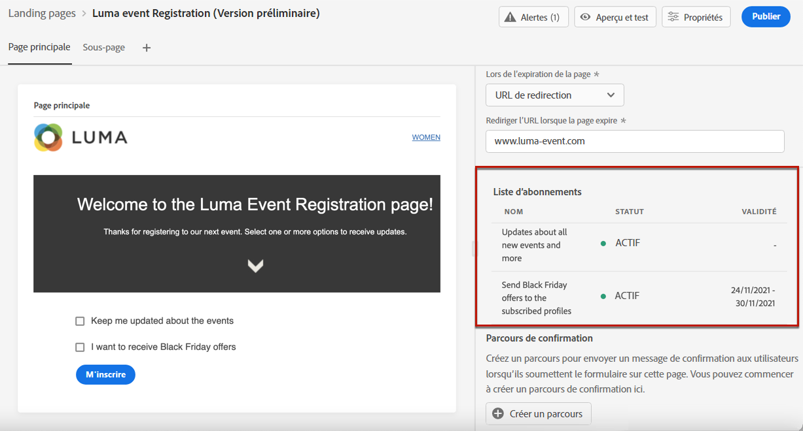

1. Depuis la landing page, vous pouvez [création d’un parcours](../building-journeys/journey-gs.md#jo-build) qui enverra un message de confirmation aux utilisateurs lorsqu’ils envoient le formulaire. Découvrez comment créer un tel parcours à la fin de ce [cas pratique](lp-use-cases.md#subscription-to-a-service).

   

   Cliquez sur **[!UICONTROL Créer un parcours]** pour être redirigé vers le **[!UICONTROL Gestion des parcours]** > **[!UICONTROL Parcours]** liste.

## Configuration des sous-pages {#configure-subpages}

Vous pouvez ajouter jusqu’à 2 sous-pages. Par exemple, vous pouvez créer une page de remerciement qui s’affichera une fois que les utilisateurs auront envoyé le formulaire, et vous pouvez définir une page d’erreur qui sera appelée en cas de problème avec la page d’entrée.

Pour définir les paramètres de sous-page, procédez comme suit.

1. Vous pouvez modifier le nom de la page : **[!UICONTROL Sous-page 1]** par défaut.

1. Modifiez le contenu de votre page à l’aide du concepteur de contenu. Découvrez comment définir le contenu d&#39;une landing page [here](design-lp.md).

1. Définissez l&#39;URL de votre landing page. La première partie de l’URL nécessite l’exécution de la délégation de domaine. Il est prérempli et ne peut pas être modifié dans l’interface utilisateur. Pour le configurer, contactez votre gestionnaire de compte d’Adobe ou le [Équipe d’assistance clientèle d’Adobe](https://helpx.adobe.com/enterprise/admin-guide.html/enterprise/using/support-for-experience-cloud.ug.html){target=&quot;_blank&quot;}.

   >[!CAUTION]
   >
   >L&#39;URL de la landing page doit être unique.

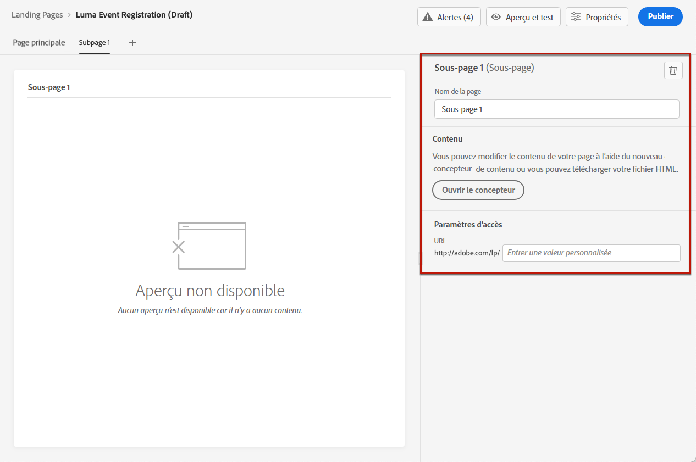

## Tester la landing page {#test}

Une fois les paramètres et le contenu de votre landing page définis, vous pouvez utiliser des profils de test pour la prévisualiser. Si vous avez inséré [contenu personnalisé](../personalization/personalize.md), vous pourrez vérifier l’affichage de ce contenu dans la page d’entrée en exploitant les données de profil de test.

>[!CAUTION]
>
>Vous devez disposer de profils de test pour pouvoir prévisualisation vos messages et envoyer des BAT. Découvrez comment [créer un profil de test](../building-journeys/creating-test-profiles.md).

1. Dans l’interface de la landing page, cliquez sur le bouton **[!UICONTROL Aperçu et test]** pour accéder à la sélection du profil de test.

   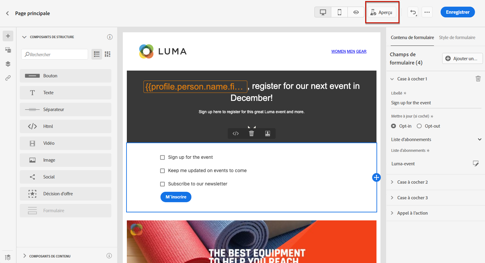

   >[!NOTE]
   >
   >Le **[!UICONTROL Aperçu]** est également accessible à partir du concepteur de contenu.

1. Dans la **[!UICONTROL Aperçu et test]** sélectionnez un ou plusieurs profils de test.

   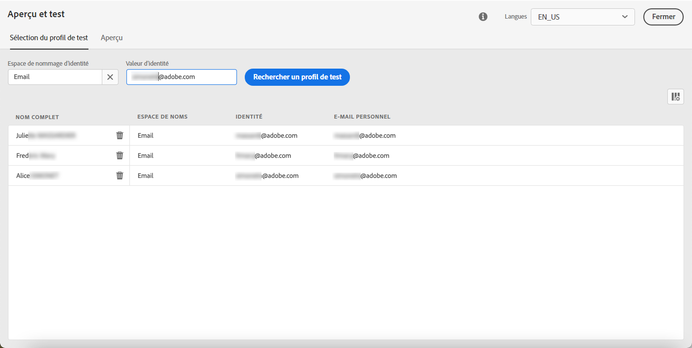

   Les étapes de sélection des profils de test sont les mêmes que lors du test d’un message. Elles sont présentées dans [cette section](../preview.md#select-test-profiles).

1. Sélectionnez la **[!UICONTROL Aperçu]** et cliquez sur **[!UICONTROL Ouvrir l’aperçu]** pour tester votre landing page.

   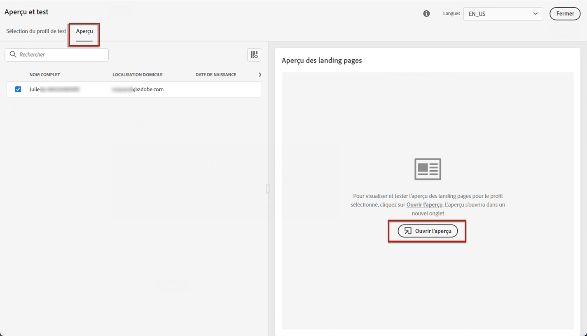

1. L&#39;aperçu de votre landing page s&#39;ouvre dans un nouvel onglet. Les éléments personnalisés sont remplacés par les données de profil de test sélectionnées.

   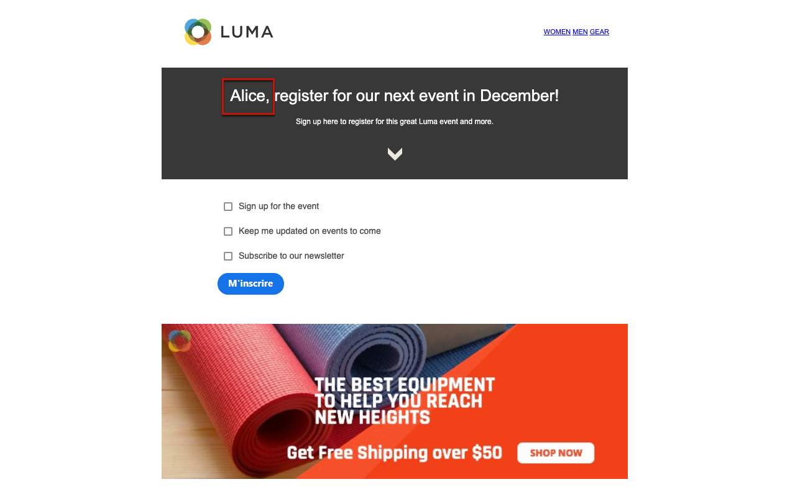

1. Sélectionnez d&#39;autres profils de test pour prévisualiser le rendu pour chaque variante de votre landing page.

## Vérification des alertes {#alerts}

Lorsque vous créez votre landing page, des alertes vous avertissent lorsque vous devez effectuer des actions importantes avant de la publier.

Les alertes s’affichent en haut à droite de l’écran, comme illustré ci-dessous :

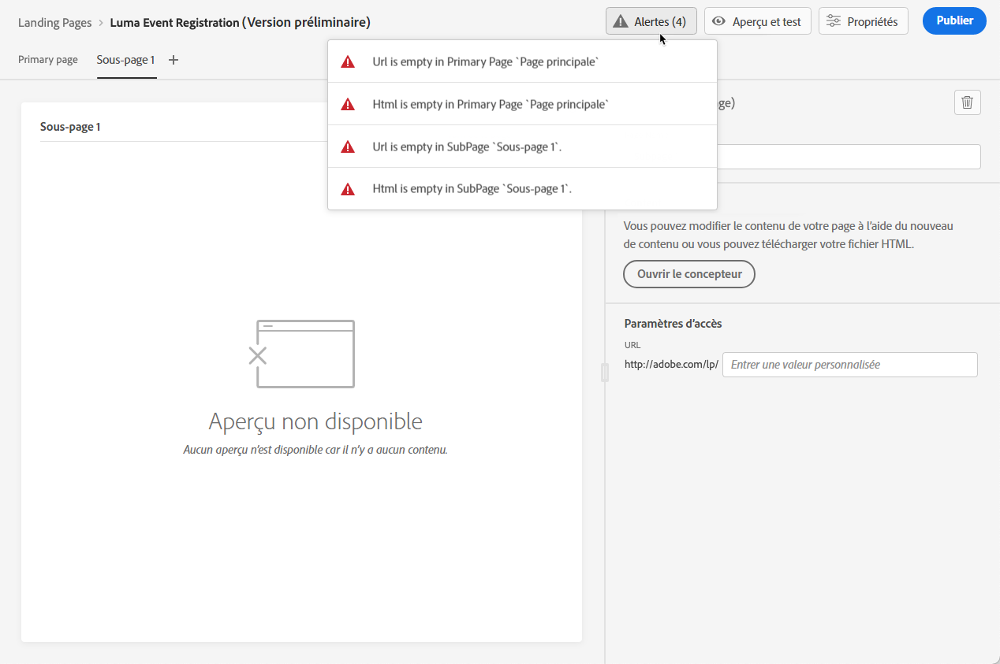

>[!NOTE]
>
>Si ce bouton ne s’affiche pas, aucune alerte n’a été détectée.

Deux types d’alertes peuvent avoir lieu :

* Les **avertissements** se rapportent aux recommandations et aux bonnes pratiques. <!--For example, a message will display if -->

* Les **erreurs** vous empêchent de publier le message tant qu’elles ne sont pas corrigées. Par exemple, un avertissement s’affiche si l’URL de la Principale page est manquante.

<!--All possible warnings and errors are detailed [below](#alerts-and-warnings).-->

>[!CAUTION]
>
> Vous devez résoudre toutes les alertes d’**erreur** avant de procéder à la publication.

<!--The settings and elements checked by the system are listed below. You will also find information on how to adapt your configuration to resolve the corresponding issues.

**Warnings**:

* 

**Errors**:

* 

>[!CAUTION]
>
> To be able to publish your message, you need to resolve all **error** alerts.
-->

## Publier la landing page {#publish}

Une fois votre landing page prête, vous pouvez la publier afin de la rendre disponible pour une utilisation dans un message.

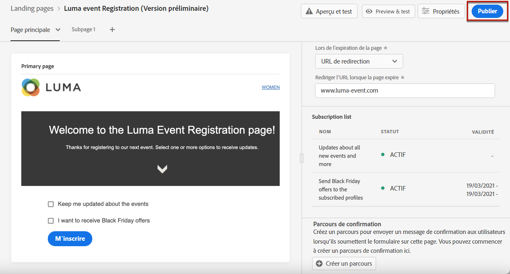

>[!CAUTION]
>
>Avant de publier, vérifiez et résolvez les alertes. [En savoir plus](#alerts)

Une fois votre landing page publiée, elle est ajoutée à la liste des landing pages avec l&#39;événement **[!UICONTROL Publié]** statut.

Il est maintenant en ligne et prêt à être utilisé dans une [!DNL Journey Optimizer] [message](../create-message.md) qui sera envoyé par l’intermédiaire d’un [parcours](../building-journeys/journey.md).

>[!NOTE]
>
>Vous pouvez surveiller les impacts de votre landing page par le biais de rapports spécifiques. [En savoir plus](lp-report.md)

