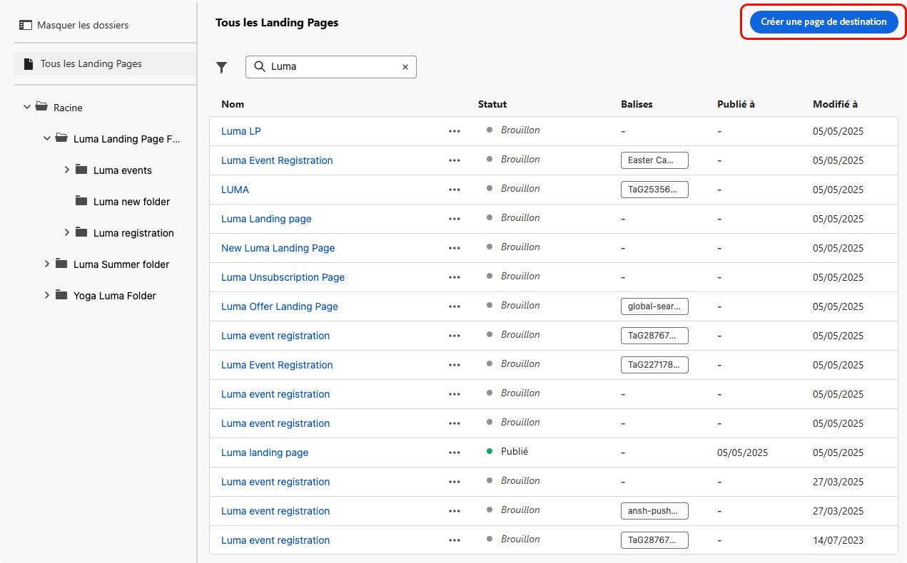
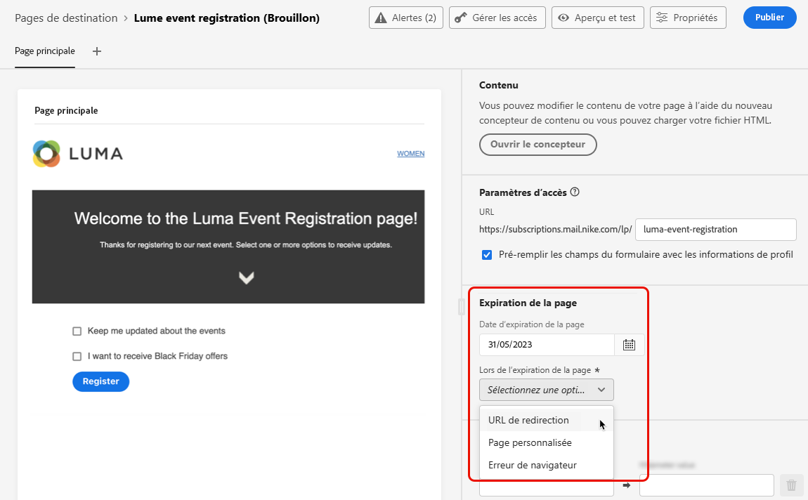
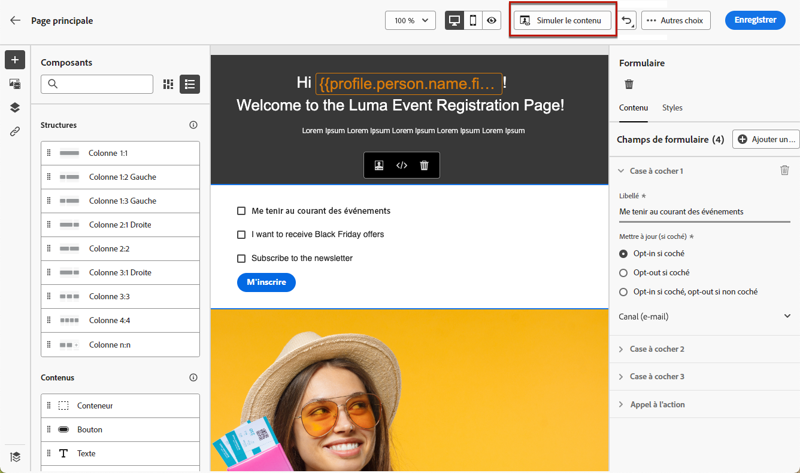

# Créer et publer des pages de destination {#create-lp}

Pour rediriger vos clientes et clients vers une page web définie que vous souhaitez afficher lorsqu’ils cliquent sur un lien spécifique, créez une page de destination dans [!DNL Journey Optimizer], configurez la page principale et les sous-pages, puis testez-la et publiez-la.

Suivez les étapes principales de création de pages de destination décrites ci-après :

## Créer une page de destination {#create-landing-page}

>[!CONTEXTUALHELP]
>id="ajo_lp_create"
>title="Définissez et configurez votre page de destination."
>abstract="Pour créer une page de destination, vous devez sélectionner un préréglage, puis configurer la page principale et les sous-pages, et enfin tester la page avant de la publier."

>[!CONTEXTUALHELP]
>id="ajo_lp_access_management_labels"
>title="Attribuer des libellés à votre page de destination"
>abstract="Pour protéger les ressources numériques sensibles, vous pouvez définir des autorisations afin de gérer l&#39;accès aux données de votre page de destination à l&#39;aide de libellés."
>additional-url="https://experienceleague.adobe.com/docs/journey-optimizer/using/access-control/object-based-access.html?lang=fr" text="Contrôle d’accès au niveau des objets"

Pour créer une page de destination, vous devez sélectionner un préréglage, puis configurer la page principale et les sous-pages, et enfin tester la page avant de la publier. Ces méthodes sont décrites ci-dessous :

1. Accédez à **[!UICONTROL Gestion de contenu]** > **[!UICONTROL Pages de destination]** à partir du menu de gauche.

1. Dans la liste des pages de destination, cliquez sur **[!UICONTROL Créer une page de destination]**.

   

1. Donnez-lui un titre. Si nécessaire, vous pouvez ajouter une description.

   

1. Pour attribuer des libellés d’utilisation des données personnalisés ou de base à la page de destination, sélectionnez **[!UICONTROL Gérer l’accès]**. [En savoir plus sur le contrôle d’accès au niveau de l’objet (OLAC)](../administration/object-based-access.md)

1. Sélectionnez ou créez des balises Adobe Experience Platform à partir du champ **[!UICONTROL Balises]** pour classer votre page de destination en vue d’une recherche améliorée. [En savoir plus](../start/search-filter-categorize.md#tags).

1. Sélectionnez un préréglage. Découvrez comment créer des préréglages de page de destination dans [cette section](../landing-pages/lp-presets.md#lp-create-preset).

   

1. Cliquez sur **[!UICONTROL Créer]**.

1. La page principale sʼaffiche ainsi que ses propriétés. Découvrez comment configurer les paramètres de la page principale [ici](#configure-primary-page).

   

1. Cliquez sur l’icône + pour ajouter une sous-page. Découvrez comment configurer les paramètres des sous-pages [ici](#configure-subpages).

   

Une fois que vous avez configuré et conçu la [page principale](#configure-primary-page) et les [sous-pages](#configure-subpages) si vous en avez, vous pouvez [tester](#test-landing-page) et [publier](#publish-landing-page) votre page de destination.

>[!CAUTION]
>
>Vous ne pouvez pas accéder à votre page de destination en copiant-collant l’URL définie dans un navigateur web, même si elle est publiée. Vous pouvez plutôt la tester à l’aide de la fonction de prévisualisation, comme décrit dans [cette section](#test-landing-page).

## Configurer la page principale {#configure-primary-page}

>[!CONTEXTUALHELP]
>id="ajo_lp_primary_page"
>title="Définissez les paramètres de votre page principale."
>abstract="La page principale est la page que les utilisateurs voient en premier lorsqu’ils cliquent sur le lien de votre page de destination (à partir d’un e-mail ou d’un site Web, par exemple)."
<!--
>additional-url="https://experienceleague.adobe.com/docs/journey-optimizer/using/landing-pages/landing-pages-design/design-lp.html" text="Design the landing page content"-->

>[!CONTEXTUALHELP]
>id="ajo_lp_access_settings"
>title="Définissez lʼURL de votre page de destination."
>abstract="Dans cette section, définissez une URL de page de destination unique. La première partie de l’URL nécessite la configuration préalable d’un sous-domaine de page de destination dans le cadre du préréglage que vous avez sélectionné."
>additional-url="https://experienceleague.adobe.com/fr/docs/journey-optimizer/using/content-management/landing-pages/lp-configuration/lp-subdomains" text="Configurer les sous-domaines des pages de destination"
>additional-url="https://experienceleague.adobe.com/fr/docs/journey-optimizer/using/content-management/landing-pages/lp-configuration/lp-presets#lp-create-preset" text="Créer des préréglages de page de destination"

La page principale est la page que les utilisateurs voient en premier lorsqu’ils cliquent sur le lien de votre page de destination (à partir d’un e-mail ou d’un site Web, par exemple).

Pour définir les paramètres de la page principale, procédez comme suit.

1. Vous pouvez modifier le nom de la page (par défaut, **[!UICONTROL Page principale]**).

1. Modifiez le contenu de votre page à l’aide du concepteur de contenu. Découvrez comment définir le contenu de la page de destination [ici](design-lp.md).

   

1. Définissez lʼURL de votre page de destination. La première partie de l’URL nécessite la configuration préalable d’un sous-domaine de page de destination dans le cadre du [préréglage](../landing-pages/lp-presets.md#lp-create-preset) que vous avez sélectionné. [En savoir plus](../landing-pages/lp-subdomains.md)

   >[!CAUTION]
   >
   >LʼURL de la page de destination doit être unique.
   >
   >Vous ne pouvez pas accéder à votre page de destination en copiant-collant cette URL dans un navigateur web, même si elle est publiée. Vous pouvez plutôt la tester à l’aide de la fonction d’aperçu, comme décrit dans [cette section](#test-landing-page).

   

1. Si vous souhaitez que la page de destination précharge les données de formulaire déjà disponibles, sélectionnez **[!UICONTROL Préremplir les champs de formulaire avec les informations de profil]**.

   

   Lorsque cette option est activée, si un profil s’est déjà inscrit/désinscrit ou a déjà été ajouté à une liste d’abonnements, ses choix seront pris en compte lors de l’affichage de la page de destination.

   Par exemple, si un profil a choisi de recevoir des communications sur des événements futurs, la case à cocher correspondante sera déjà sélectionnée la prochaine fois que la page de destination sera affichée pour ce profil.

   

1. Vous pouvez définir une date d’expiration pour votre page. Dans ce cas, vous devez sélectionner une action à déclencher lors de l’expiration de la page :

   * **[!UICONTROL URL de redirection]** : saisissez l’URL de la page vers laquelle les utilisateurs seront redirigés à l’expiration de votre page.
   * **[!UICONTROL Page personnalisée]** : [configurez une sous-page](#configure-subpages) et sélectionnez-la dans la liste déroulante qui s’affiche.
   * **[!UICONTROL Erreur de navigateur]** : saisissez le texte de l’erreur qui s’affichera à la place de la page.

   

<!--1. In the **[!UICONTROL Additional data]** section, define one or more keys and their corresponding parameter values. You will be able to leverage these keys in the content of your primary page and subpages using the [personalization editor](../personalization/personalization-build-expressions.md). Learn more in [this section](lp-content.md#use-additional-data).

    -->

1. Si vous avez sélectionné une ou plusieurs listes dʼabonnements lors de la [conception de la page principale](design-lp.md), elles sont affichées dans la section **[!UICONTROL Liste dʼabonnements]**.

   

1. Depuis la page de destination, vous pouvez directement [créer un parcours](../building-journeys/journey-gs.md#jo-build) qui enverra un message de confirmation aux utilisateurs lorsqu’ils soumettent le formulaire. Découvrez comment créer un tel parcours à la fin de ce [cas d’utilisation](lp-use-cases.md#subscription-to-a-service).

   

   Cliquez sur **[!UICONTROL Créer un parcours]** pour être redirigé vers la liste **[!UICONTROL Gestion des parcours]** > **[!UICONTROL Parcours]**.

## Configuration des sous-pages {#configure-subpages}

>[!CONTEXTUALHELP]
>id="ajo_lp_subpage"
>title="Définir les paramètres de sous-page"
>abstract="Vous pouvez ajouter jusquʼà 2 sous-pages. Par exemple, vous pouvez créer une page de remerciement qui s’affichera une fois que les utilisateurs auront envoyé le formulaire. Vous pouvez également définir une page d’erreur, qui sera affichée si la page de destination rencontre un problème."
>additional-url="https://experienceleague.adobe.com/fr/docs/journey-optimizer/using/content-management/landing-pages/landing-pages-design/design-lp" text="Concevoir le contenu de la page de destination"

>[!CONTEXTUALHELP]
>id="ajo_lp_access_settings-subpage"
>title="Définissez lʼURL de votre page de destination."
>abstract="Dans cette section, définissez une URL de page de destination unique. La première partie de l’URL nécessite la configuration préalable d’un sous-domaine de page de destination dans le cadre du préréglage que vous avez sélectionné."
>additional-url="https://experienceleague.adobe.com/docs/journey-optimizer/using/content-management/landing-pages/lp-configuration/lp-subdomains.html" text="Configurer les sous-domaines des pages de destination"
>additional-url="https://experienceleague.adobe.com/docs/journey-optimizer/using/content-management/landing-pages/lp-configuration/lp-presets.html#lp-create-preset" text="Créer des préréglages de page de destination"

Vous pouvez ajouter jusquʼà 2 sous-pages. Par exemple, vous pouvez créer une page de remerciement qui s’affichera une fois que les utilisateurs auront envoyé le formulaire. Vous pouvez également définir une page d’erreur, qui sera affichée si la page de destination rencontre un problème.

Pour définir les paramètres des sous-pages, procédez comme suit.

1. Vous pouvez modifier le nom de la page (par défaut, **[!UICONTROL Sous-page 1]**).

1. Modifiez le contenu de votre page à l’aide du concepteur de contenu. Découvrez comment définir le contenu de la page de destination [ici](design-lp.md).

   >[!NOTE]
   >
   >Vous pouvez insérer un lien vers la page principale depuis n&#39;importe quelle sous-page de la même page de destination. Par exemple, pour rediriger les utilisateurs qui ont commis une erreur et qui souhaitent s’abonner à nouveau, vous pouvez ajouter un lien depuis la sous-page de confirmation vers la page principale d’abonnement. Découvrez comment insérer des liens dans [cette section](../email/message-tracking.md#insert-links).

1. Définissez lʼURL de votre page de destination. La première partie de l’URL nécessite la configuration préalable d’un sous-domaine de page de destination. [En savoir plus](../landing-pages/lp-subdomains.md)

   >[!CAUTION]
   >
   >LʼURL de la page de destination doit être unique.
   >
   >Vous ne pouvez pas accéder à votre sous-page en copiant-collant cette URL dans un navigateur web, même si elle est publiée. Vous pouvez plutôt la tester à l’aide de la fonction de prévisualisation, comme décrit dans [cette section](#test-landing-page).

## Tester la page de destination {#test-landing-page}

>[!CONTEXTUALHELP]
>id="ac_preview_lp_profiles"
>title="Prévisualiser et tester votre page de destination"
>abstract="Une fois que vous avez défini les paramètres et le contenu de votre page de destination, vous pouvez utiliser des profils de test pour la prévisualiser."
>additional-url="https://experienceleague.adobe.com/docs/journey-optimizer/using/audiences-profiles-identities/profiles/creating-test-profiles.html?lang=fr" text="Sélectionner des profils de test"

Une fois les paramètres et le contenu de votre page de destination définis, vous pouvez utiliser des profils de test pour la prévisualiser. Si vous avez inséré du [contenu personnalisé](../personalization/personalize.md), vous pourrez vérifier l’affichage de ce dernier dans la page de destination à l’aide des données de profil de test.

>[!CAUTION]
>
>Pour pouvoir tester des pages de destination, vous devez disposer de l’autorisation **[!UICONTROL Publier des messages]**.
>
>Vous devez disposer de profils de test pour pouvoir prévisualiser vos messages et envoyer des BAT. Découvrez comment [créer des profils de test](../audience/creating-test-profiles.md).

1. Dans l’interface de la page de destination, cliquez sur le bouton **[!UICONTROL Simuler du contenu]** pour accéder à la sélection du profil de test.

   

   >[!NOTE]
   >
   >Le bouton **[!UICONTROL Simuler du contenu]** est également accessible à partir du Concepteur de contenu.

1. À partir de lʼécran **[!UICONTROL Simuler]**, sélectionnez un ou plusieurs profils de test.

   

   Les étapes de sélection des profils de test sont identiques à celles du test d’un message. Elles sont détaillées dans la section [Gestion de contenu](../content-management/test-profiles.md).

1. Sélectionnez **[!UICONTROL Ouvrir l’aperçu]** pour tester votre page de destination.

   

1. La prévisualisation de votre page de destination sʼouvre dans un nouvel onglet. Les éléments personnalisés sont remplacés par les données du profil de test sélectionné.

   <!---->

1. Sélectionnez dʼautres profils de test pour prévisualiser le rendu de chaque variante de votre page de destination.

## Vérifier les alertes {#check-alerts}

Lorsque vous créez votre page de destination, des alertes vous avertissent si vous devez effectuer des actions importantes avant de la publier.

Les alertes s’affichent en haut à droite de l’écran, comme illustré ci-dessous :

>[!NOTE]
>
>Si ce bouton ne s’affiche pas, aucune alerte n’a été détectée.

Deux types d’alertes peuvent avoir lieu :

* Les **avertissements** se rapportent aux recommandations et aux bonnes pratiques. <!--For example, a message will display if -->

* Les **erreurs** vous empêchent de publier la page de destination tant qu’elles ne sont pas corrigées. Par exemple, un avertissement s’affiche si l’URL de la page principale est manquante.

<!--All possible warnings and errors are detailed [below](#alerts-and-warnings).-->

>[!CAUTION]
>
> Vous devez résoudre toutes les alertes d’**erreur** avant de procéder à la publication.

<!--The settings and elements checked by the system are listed below. You will also find information on how to adapt your configuration to resolve the corresponding issues.

**Warnings**:

* 

**Errors**:

-->

## Publier la page de destination {#publish-landing-page}

>[!CAUTION]
>
>Pour publier des pages de destination, les utilisateurs et utilisatrices doivent disposer de l’autorisation **[!UICONTROL Publier des messages]**.

Une fois votre page de destination configurée, vous pouvez la publier pour quʼelle puisse être utilisée dans un message.

>[!CAUTION]
>
>Avant de publier votre page, vérifiez et résolvez les alertes. [En savoir plus](#check-alerts)

Une fois votre page de destination publiée, elle est ajoutée à la liste de pages de destination avec le statut **[!UICONTROL Publié]**.

Votre page est désormais en ligne et peut être utilisée dans un message [!DNL Journey Optimizer] qui sera envoyé par l’intermédiaire d’un [parcours](../building-journeys/journey.md).

>[!NOTE]
>
>Vous ne pouvez pas accéder à votre page de destination en copiant-collant dans un navigateur web l’URL définie lors de la [création de la page](#create-landing-page), même si elle est publiée. Vous pouvez plutôt la tester à l’aide de la fonction de prévisualisation, comme décrit dans [cette section](#test-landing-page).

Vous pouvez surveiller lʼimpact de votre page de destination au moyen de rapports spécifiques. [En savoir plus](../reports/lp-report-live.md)
