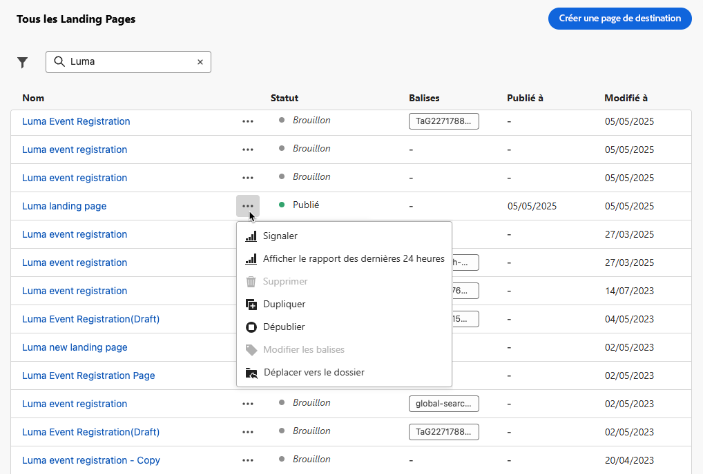
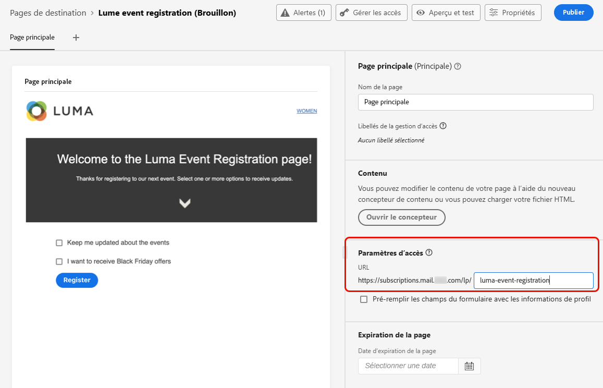

# Création et publication de landing pages {#create-lp}

## Accès aux landing pages {#access-landing-pages}

Pour accéder à la liste des landing pages, sélectionnez **[!UICONTROL Journey Management]** > **[!UICONTROL Landing pages]** dans le menu de gauche.

Le **[!UICONTROL Landing Pages]** liste affiche tous les éléments créés. Vous pouvez les filtrer selon leur état ou leur date de modification.

Depuis cette liste, vous pouvez accéder au [Rapport en direct de la page d’entrée](../reports/lp-report-live.md) ou [Rapport global de page d’entrée](../reports/lp-report-global.md) pour les éléments publiés.

Vous pouvez également supprimer, dupliquer et dépublier une landing page.

>[!CAUTION]
>
>Si vous dépubliez une landing page référencée dans un message, le lien vers la landing page est rompu et une page d&#39;erreur s&#39;affiche.

Cliquez sur les trois points en regard d’une landing page pour sélectionner l’action souhaitée.

>[!NOTE]
>
>Vous ne pouvez pas supprimer un [publié](#publish-landing-page) landing page. Pour le supprimer, vous devez d’abord l’annuler.

## Créer une landing page {#create-landing-page}

>[!CONTEXTUALHELP]
>id="ajo_lp_create"
>title="Définir et configurer votre landing page"
>abstract="Pour créer une landing page, vous devez sélectionner un paramètre prédéfini, puis configurer la page principale et les sous-pages, et enfin tester votre page avant de la publier."
>additional-url="https://experienceleague.adobe.com/docs/journey-optimizer/using/landing-pages/lp-configuration/lp-presets.html#lp-create-preset" text="Créer des paramètres prédéfinis de landing page"
>additional-url="https://experienceleague.adobe.com/docs/journey-optimizer/using/landing-pages/create-lp.html#publish-landing-page" text="Publier la landing page"

>[!CONTEXTUALHELP]
>id="ajo_lp_access_management_labels"
>title="Attribuer des libellés à votre landing page"
>abstract="Pour protéger les ressources numériques sensibles, vous pouvez définir des autorisations afin de gérer l&#39;accès aux données de votre landing page à l&#39;aide de libellés."
>additional-url="https://experienceleague.adobe.com/docs/journey-optimizer/using/access-control/object-based-access.html" text="Créer des paramètres prédéfinis de landing page"

Les étapes de création d&#39;une landing page sont les suivantes.

1. Dans la liste des landing pages, cliquez sur **[!UICONTROL Create landing page]**.

   

1. Ajoutez un titre. Si nécessaire, vous pouvez ajouter une description.

   

1. Pour attribuer des libellés d’utilisation des données personnalisés ou de base à la page d’entrée, sélectionnez **[!UICONTROL Manage access]**. [En savoir plus sur le contrôle d’accès au niveau de l’objet (OLAC)](../administration/object-based-access.md)

   <!--You can add a tag. See AEP documentation?-->

1. Sélectionnez un paramètre prédéfini. Découvrez comment créer des paramètres prédéfinis de page d’entrée dans [cette section](../landing-pages/lp-presets.md#lp-create-preset).

   

1. Cliquez sur **[!UICONTROL Create]**.

1. La page principale et ses propriétés s’affichent. Découvrez comment configurer les paramètres de la page principale [here](#configure-primary-page).

   

1. Cliquez sur l’icône + pour ajouter une sous-page. Découvrez comment configurer les paramètres de sous-page [here](#configure-subpages).

   

Une fois que vous avez configuré et conçu la variable [page principale](#configure-primary-page), et la variable [sous-pages](#configure-subpages) le cas échéant, vous pouvez [test](#test-landing-page) et [publier](#publish-landing-page) votre landing page.

## Configuration de la page principale {#configure-primary-page}

>[!CONTEXTUALHELP]
>id="ajo_lp_primary_page"
>title="Définition des paramètres de page principale"
>abstract="La page principale s’affiche immédiatement pour les utilisateurs qui cliquent sur le lien vers votre page d’entrée (provenant, par exemple, d’un courrier électronique ou d’un site web)."
>additional-url="https://experienceleague.adobe.com/docs/journey-optimizer/using/landing-pages/landing-pages-design/design-lp.html" text="Concevoir le contenu de la landing page"

>[!CONTEXTUALHELP]
>id="ajo_lp_access_settings"
>title="Définition de l’URL de votre landing page"
>abstract="Dans cette section, définissez une URL de page d’entrée unique. La première partie de l’URL nécessite la configuration préalable d’un sous-domaine de page d’entrée dans le cadre du paramètre prédéfini que vous avez sélectionné."
>additional-url="https://experienceleague.adobe.com/docs/journey-optimizer/using/landing-pages/lp-configuration/lp-subdomains.html" text="Configuration des sous-domaines de landing page"
>additional-url="https://experienceleague.adobe.com/docs/journey-optimizer/using/landing-pages/lp-configuration/lp-presets.html#lp-create-preset" text="Créer des paramètres prédéfinis de landing page"

La page principale est la page qui s’affiche immédiatement pour les utilisateurs lorsqu’ils cliquent sur le lien vers votre page d’entrée (provenant d’un courrier électronique ou d’un site web, par exemple).

Pour définir les paramètres de la page principale, procédez comme suit.

1. Vous pouvez modifier le nom de la page : **[!UICONTROL Primary page]** par défaut.

1. Modifiez le contenu de votre page à l’aide du concepteur de contenu. Découvrez comment définir le contenu d&#39;une landing page [here](design-lp.md).

   

1. Définissez l&#39;URL de votre landing page. La première partie de l’URL nécessite la configuration préalable d’un sous-domaine de page d’entrée dans le cadre du [paramètre prédéfini](../landing-pages/lp-presets.md#lp-create-preset) vous avez sélectionné. [En savoir plus](../landing-pages/lp-subdomains.md)

   >[!CAUTION]
   >
   >L&#39;URL de la landing page doit être unique.

   

   >[!NOTE]
   >
   >Vous ne pouvez pas accéder à votre landing page en copiant-collant cette URL dans un navigateur web, même si elle est publiée. Vous pouvez plutôt le tester à l’aide de la fonction d’aperçu, comme décrit dans la section [cette section](#test-landing-page).

1. Si vous souhaitez que la landing page pré-charge les données de formulaire déjà disponibles, sélectionnez la **[!UICONTROL Pre-fill form fields with profile information]**.

   

   Lorsque cette option est activée, si un profil s’est déjà inscrit/désinscrit ou a déjà été ajouté à une liste d’abonnements, ses choix seront pris en compte lors de l’affichage de la landing page.

   Par exemple, si un profil a choisi de recevoir des communications sur des événements futurs, la case à cocher correspondante sera déjà sélectionnée la prochaine fois que la landing page sera affichée sur ce profil.

   

1. Vous pouvez définir une date d’expiration pour votre page. Dans ce cas, vous devez sélectionner une action à l’expiration de la page :

   * **[!UICONTROL Redirect URL]**: Saisissez l’URL de la page vers laquelle les utilisateurs seront redirigés à l’expiration de la page.
   * **[!UICONTROL Custom page]**: [Configuration d’une sous-page](#configure-subpages) et sélectionnez-le dans la liste déroulante qui s’affiche.
   * **[!UICONTROL Browser error]**: Saisissez le texte de l’erreur qui s’affichera à la place de la page.

   

1. Dans le **[!UICONTROL Additional data]** , définissez une ou plusieurs clés et leurs valeurs de paramètre correspondantes. Vous pourrez utiliser ces clés dans le contenu de votre page principale et de vos sous-pages à l’aide de la variable [Editeur d&#39;expression](../personalization/personalization-build-expressions.md). En savoir plus dans [cette section](lp-content.md#use-form-component#use-additional-data).

   

1. Si vous avez sélectionné une ou plusieurs listes d’abonnements lors de la [conception de la page principale](design-lp.md), elles s’affichent dans la variable **[!UICONTROL Subscription list]** .

   

1. Depuis la landing page, vous pouvez [création d’un parcours](../building-journeys/journey-gs.md#jo-build) qui enverra un message de confirmation aux utilisateurs lorsqu’ils envoient le formulaire. Découvrez comment créer un tel parcours à la fin de ce [cas pratique](lp-use-cases.md#subscription-to-a-service).

   

   Cliquez sur **[!UICONTROL Create journey]** pour être redirigé vers le **[!UICONTROL Journey Management]** > **[!UICONTROL Journeys]** liste.

## Configuration des sous-pages {#configure-subpages}

>[!CONTEXTUALHELP]
>id="ajo_lp_subpage"
>title="Définition des paramètres de sous-page"
>abstract="Vous pouvez ajouter jusqu’à 2 sous-pages. Par exemple, vous pouvez créer une page de remerciement qui s’affichera une fois que les utilisateurs auront envoyé le formulaire, et vous pouvez définir une page d’erreur qui sera appelée en cas de problème avec la page d’entrée."
>additional-url="https://experienceleague.adobe.com/docs/journey-optimizer/using/landing-pages/landing-pages-design/design-lp.html" text="Concevoir le contenu de la landing page"

>[!CONTEXTUALHELP]
>id="ajo_lp_access_settings-subpage"
>title="Définition de l’URL de votre landing page"
>abstract="Dans cette section, définissez une URL de page d’entrée unique. La première partie de l’URL nécessite la configuration préalable d’un sous-domaine de page d’entrée dans le cadre du paramètre prédéfini que vous avez sélectionné."
>additional-url="https://experienceleague.adobe.com/docs/journey-optimizer/using/configuration/lp-configuration/lp-subdomains.html" text="Configuration des sous-domaines de landing page"
>additional-url="https://experienceleague.adobe.com/docs/journey-optimizer/using/configuration/lp-configuration/lp-presets.html#lp-create-preset" text="Créer des paramètres prédéfinis de landing page"

Vous pouvez ajouter jusqu’à 2 sous-pages. Par exemple, vous pouvez créer une page de remerciement qui s’affichera une fois que les utilisateurs auront envoyé le formulaire, et vous pouvez définir une page d’erreur qui sera appelée en cas de problème avec la page d’entrée.

Pour définir les paramètres de sous-page, procédez comme suit.

1. Vous pouvez modifier le nom de la page : **[!UICONTROL Subpage 1]** par défaut.

1. Modifiez le contenu de votre page à l’aide du concepteur de contenu. Découvrez comment définir le contenu d&#39;une landing page [here](design-lp.md).

   >[!NOTE]
   >
   >Vous pouvez insérer un lien vers la page principale depuis n&#39;importe quelle sous-page de la même landing page. Par exemple, pour rediriger les utilisateurs qui ont commis une erreur et qui souhaitent s’abonner à nouveau, vous pouvez ajouter un lien depuis la sous-page de confirmation vers la page principale de l’abonnement. Découvrez comment insérer des liens dans [cette section](../email/message-tracking.md#insert-links).

1. Définissez l&#39;URL de votre landing page. La première partie de l’URL nécessite la configuration préalable d’un sous-domaine de page d’entrée. [En savoir plus](../landing-pages/lp-subdomains.md)

   >[!CAUTION]
   >
   >L&#39;URL de la landing page doit être unique.

## Tester la landing page {#test-landing-page}

Une fois les paramètres et le contenu de votre landing page définis, vous pouvez utiliser des profils de test pour la prévisualiser. Si vous avez inséré [contenu personnalisé](../personalization/personalize.md), vous pourrez vérifier l’affichage de ce contenu dans la landing page à l’aide des données de profil de test.

>[!CAUTION]
>
>Vous devez disposer de profils de test pour pouvoir prévisualiser vos messages et envoyer des bons à tirer. Découvrez comment [créer des profils de test](../segment/creating-test-profiles.md).

1. Dans l’interface de la landing page, cliquez sur le bouton **[!UICONTROL Preview & test]** pour accéder à la sélection du profil de test.

   

   >[!NOTE]
   >
   >Le **[!UICONTROL Preview]** est également accessible à partir du concepteur de contenu.

1. Dans la **[!UICONTROL Preview & test]** sélectionnez un ou plusieurs profils de test.

   

   Les étapes de sélection des profils de test sont les mêmes que lors du test d’un message. Elles sont présentées dans la section [cette section](../email/preview.md#select-test-profiles).

1. Sélectionnez la **[!UICONTROL Preview]** et cliquez sur **[!UICONTROL Open preview]** pour tester votre landing page.

   

1. L&#39;aperçu de votre landing page s&#39;ouvre dans un nouvel onglet. Les éléments personnalisés sont remplacés par les données de profil de test sélectionnées.

   

1. Sélectionnez d&#39;autres profils de test pour prévisualiser le rendu pour chaque variante de votre landing page.

## Vérifier les alertes {#check-alerts}

Lorsque vous créez une landing page, des alertes vous avertissent lorsque vous devez effectuer des actions importantes avant de la publier.

Les alertes s’affichent en haut à droite de l’écran, comme illustré ci-dessous :

>[!NOTE]
>
>Si ce bouton n’est pas visible, aucune alerte n’a été détectée.

Deux types d’alertes peuvent se produire :

* **Avertissements** voir recommandations et bonnes pratiques. <!--For example, a message will display if -->

* **Erreurs** vous empêche de publier la landing page tant qu&#39;elle n&#39;est pas résolue. Par exemple, un avertissement s’affiche si l’URL de la page principale est manquante.

<!--All possible warnings and errors are detailed [below](#alerts-and-warnings).-->

>[!CAUTION]
>
> Vous devez résoudre tous les **error** alertes avant publication.

<!--The settings and elements checked by the system are listed below. You will also find information on how to adapt your configuration to resolve the corresponding issues.

**Warnings**:

* 

**Errors**:

* 

>[!CAUTION]
>
> To be able to publish your message, you must resolve all **error** alerts.
-->

## Publier la landing page {#publish-landing-page}

Une fois votre landing page prête, vous pouvez la publier afin de la rendre disponible pour une utilisation dans un message.

>[!CAUTION]
>
>Avant de publier, vérifiez et résolvez les alertes. [En savoir plus](#check-alerts)

Une fois votre landing page publiée, elle est ajoutée à la liste des landing pages avec l&#39;événement **[!UICONTROL Published]** statut.

Il est maintenant en ligne et prêt à être utilisé dans une [!DNL Journey Optimizer] message qui sera envoyé par le biais d’un [parcours](../building-journeys/journey.md).

>[!NOTE]
>
>Vous pouvez surveiller les impacts de votre landing page par le biais de rapports spécifiques. [En savoir plus](../reports/lp-report-live.md)

