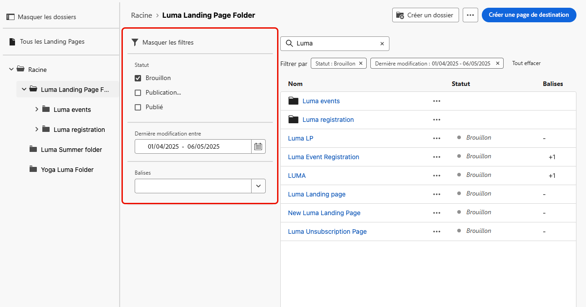
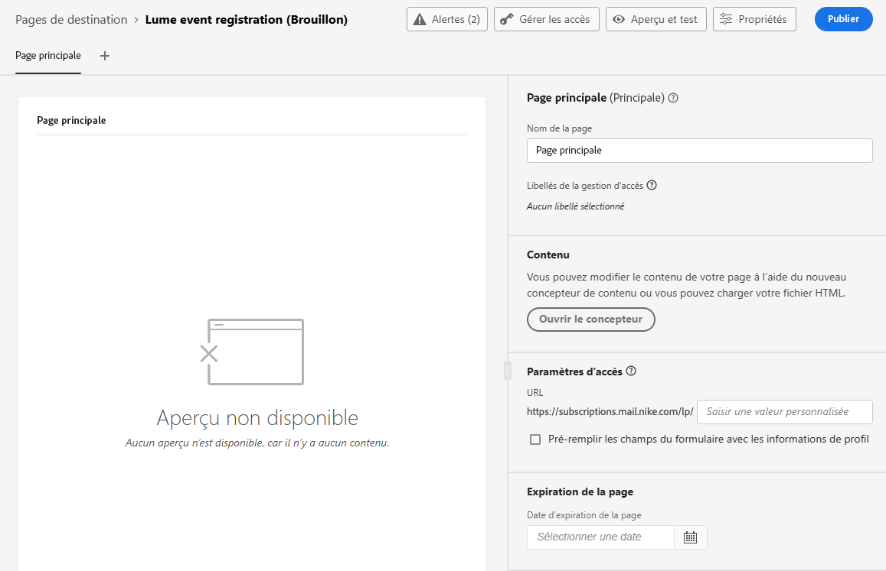
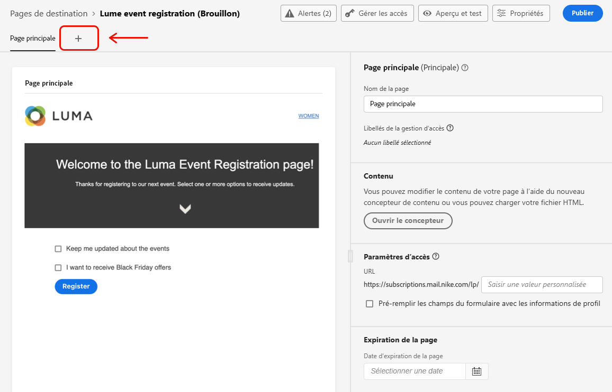
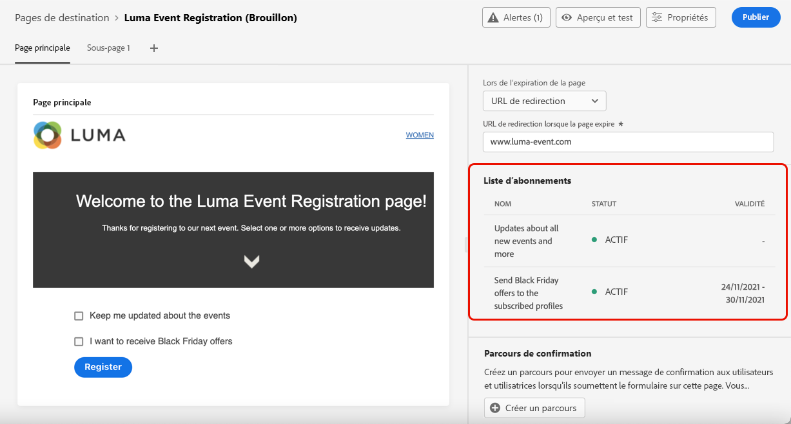

# Création et publication de pages de destination {#create-lp}

## Accès aux pages de destination {#access-landing-pages}

Pour accéder à la liste des pages de destination, sélectionnez **[!UICONTROL Gestion des parcours]** > **[!UICONTROL Pages de destination]** dans le menu de gauche.

La liste des **[!UICONTROL Pages de destination]** affiche tous les éléments créés. Vous pouvez les filtrer selon leur état ou leur date de modification.

Depuis cette liste, vous pouvez accéder au [rapports de page d’entrée](lp-report.md) pour les éléments publiés.

Vous pouvez également supprimer, dupliquer et dépublier une landing page.

>[!CAUTION]
>
>Si vous dépubliez une landing page référencée dans un message non publié, le message ne peut pas être publié tant que la landing page n’est pas republiée. Si le message est déjà publié, le lien vers la landing page est rompu et une page d&#39;erreur s&#39;affiche.

Cliquez sur les trois points en regard d’une landing page pour sélectionner l’action souhaitée.

>[!NOTE]
>
>Vous ne pouvez pas supprimer une landing page publiée. Pour le supprimer, vous devez d’abord l’annuler.

## Création d’une page de destination {#create-landing-page}

Suivez les étapes de création dʼune page de destination décrites ci-après.

1. Dans la liste des pages de destination, cliquez sur **[!UICONTROL Créer une page de destination]**.

   

1. Donnez-lui un titre. Si nécessaire, vous pouvez ajouter une description.

   

1. Sélectionnez un préréglage. Découvrez comment créer des paramètres prédéfinis de page d’entrée dans [cette section](../configuration/lp-configuration.md#lp-create-preset).

   

1. Cliquez sur **[!UICONTROL Créer]**.

1. La page principale sʼaffiche ainsi que ses propriétés. Découvrez comment configurer les paramètres de la page principale [ici](#configure-primary-page).

   

1. Cliquez sur l’icône + pour ajouter une sous-page. Découvrez comment configurer les paramètres des sous-pages [ici](#configure-subpages).

   

Une fois que vous avez configuré et conçu la [page principale](#configure-primary-page) et les [sous-pages](#configure-subpages) si vous en avez, vous pouvez [tester](#test-landing-page) et [publier](#publish-landing-page) votre page de destination.

## Configuration de la page principale {#configure-primary-page}

La page principale est la page que les utilisateurs voient en premier lorsqu’ils cliquent sur le lien de votre page de destination (à partir d’un e-mail ou d’un site Web, par exemple).

Pour définir les paramètres de la page principale, procédez comme suit.

1. Vous pouvez modifier le nom de la page (par défaut, **[!UICONTROL Page principale]**).

1. Modifiez le contenu de votre page à l’aide du concepteur de contenu. Découvrez comment définir le contenu de la page de destination [ici](design-lp.md).

   

1. Définissez lʼURL de votre page de destination. La première partie de l’URL nécessite la configuration préalable d’un sous-domaine de page d’entrée. [En savoir plus](../configuration/lp-configuration.md#lp-subdomains)

   >[!CAUTION]
   >
   >LʼURL de la page de destination doit être unique.

   

1. Vous pouvez définir une date d’expiration pour votre page. Dans ce cas, vous devez sélectionner une action à déclencher lors de l’expiration de la page :

   * **[!UICONTROL URL de redirection]** : saisissez l’URL de la page vers laquelle les utilisateurs seront redirigés à l’expiration de votre page.
   * **[!UICONTROL Page personnalisée]** : [configurez une sous-page](#configure-subpages) et sélectionnez-la dans la liste déroulante qui s’affiche.
   * **[!UICONTROL Erreur du navigateur]** : saisissez le texte de l’erreur qui s’affichera à la place de la page.

   

   <!--1. In the **[!UICONTROL Additional data]** section, define a **[!UICONTROL Key]** and the corresponding **[!UICONTROL Parameter value]**. // you can define how the data entered in the landing page is managed once it has been submitted by a user??-->

1. Si vous avez sélectionné une ou plusieurs listes dʼabonnements lors de la [conception de la page principale](design-lp.md), elles sont affichées dans la section **[!UICONTROL Liste dʼabonnements]**.

   

1. Depuis la page de destination, vous pouvez directement [créer un parcours](../building-journeys/journey-gs.md#jo-build) qui enverra un message de confirmation aux utilisateurs lorsqu’ils soumettent le formulaire. Découvrez comment créer un tel parcours à la fin de ce [cas d’utilisation](lp-use-cases.md#subscription-to-a-service).

   

   Cliquez sur **[!UICONTROL Créer un parcours]** pour être redirigé vers la liste **[!UICONTROL Gestion des parcours]** > **[!UICONTROL Parcours]**.

## Configuration des sous-pages {#configure-subpages}

Vous pouvez ajouter jusquʼà 2 sous-pages. Par exemple, vous pouvez créer une page de remerciement qui s’affichera une fois que les utilisateurs auront envoyé le formulaire. Vous pouvez également définir une page d’erreur, qui sera affichée si la page de destination rencontre un problème.

Pour définir les paramètres des sous-pages, procédez comme suit.

1. Vous pouvez modifier le nom de la page (par défaut, **[!UICONTROL Sous-page 1]**).

1. Modifiez le contenu de votre page à l’aide du concepteur de contenu. Découvrez comment définir le contenu de la page de destination [ici](design-lp.md).

1. Définissez lʼURL de votre page de destination. La première partie de l’URL nécessite la configuration préalable d’un sous-domaine de page d’entrée. [En savoir plus](../configuration/lp-configuration.md#lp-subdomains)

   >[!CAUTION]
   >
   >LʼURL de la page de destination doit être unique.

## Test de la page de destination {#test-landing-page}

Une fois les paramètres et le contenu de votre page de destination définis, vous pouvez utiliser des profils de test pour la prévisualiser. Si vous avez inséré du [contenu personnalisé](../personalization/personalize.md), vous pourrez vérifier comment ce contenu s’affiche sur la page de destination en exploitant les données du profil de test.

>[!CAUTION]
>
>Vous devez disposer de profils de test pour pouvoir prévisualiser vos messages et envoyer des bons à tirer. Découvrez comment [créer des profils de test](../building-journeys/creating-test-profiles.md).

1. Dans l’interface de la page de destination, cliquez sur le bouton **[!UICONTROL Prévisualisation et test]** pour accéder à la sélection du profil de test.

   

   >[!NOTE]
   >
   >Le bouton **[!UICONTROL Prévisualisation]** est également accessible à partir du concepteur de contenu.

1. À partir de lʼécran **[!UICONTROL Prévisualisation et test]**, sélectionnez un ou plusieurs profils de test.

   

   Les étapes de sélection des profils de test sont identiques à celles du test d’un message. Elles sont présentées dans [cette section](../messages/preview.md#select-test-profiles).

1. Sélectionnez lʼonglet **[!UICONTROL Prévisualisation]** et cliquez sur **[!UICONTROL Ouvrir la prévisualisation]** pour tester votre page de destination.

   

1. La prévisualisation de votre page de destination sʼouvre dans un nouvel onglet. Les éléments personnalisés sont remplacés par les données du profil de test sélectionné.

   

1. Sélectionnez dʼautres profils de test pour prévisualiser le rendu de chaque variante de votre page de destination.

## Vérification des alertes {#check-alerts}

Lorsque vous créez une landing page, des alertes vous avertissent lorsque vous devez effectuer des actions importantes avant de la publier.

Les alertes s’affichent en haut à droite de l’écran, comme illustré ci-dessous :

>[!NOTE]
>
>Si ce bouton ne s’affiche pas, aucune alerte n’a été détectée.

Deux types d’alertes peuvent avoir lieu :

* Les **avertissements** se rapportent aux recommandations et aux bonnes pratiques. <!--For example, a message will display if -->

* Les **erreurs** vous empêchent de publier le message tant qu’elles ne sont pas corrigées. Par exemple, un avertissement s’affiche si l’URL de la page principale est manquante.

<!--All possible warnings and errors are detailed [below](#alerts-and-warnings).-->

>[!CAUTION]
>
> Vous devez résoudre tous les **error** alertes avant publication.

<!--The settings and elements checked by the system are listed below. You will also find information on how to adapt your configuration to resolve the corresponding issues.

**Warnings**:

* 

**Errors**:

* 

>[!CAUTION]
>
> To be able to publish your message, you must resolve all **error** alerts.
-->

## Publication de la page de destination {#publish-landing-page}

Une fois votre page de destination configurée, vous pouvez la publier pour quʼelle puisse être utilisée dans un message.

>[!CAUTION]
>
>Avant de publier votre page, vérifiez et résolvez les alertes. [En savoir plus](#check-alerts)

Une fois votre page de destination publiée, elle est ajoutée à la liste de pages de destination avec le statut **[!UICONTROL Publié]**.

Votre page est désormais en ligne et peut être utilisée dans un [!DNL Journey Optimizer] [message](../messages/create-message.md) qui sera envoyé par l’intermédiaire d’un [parcours](../building-journeys/journey.md).

>[!NOTE]
>
>Vous pouvez surveiller lʼimpact de votre page de destination au moyen de rapports spécifiques. [En savoir plus](lp-report.md)

