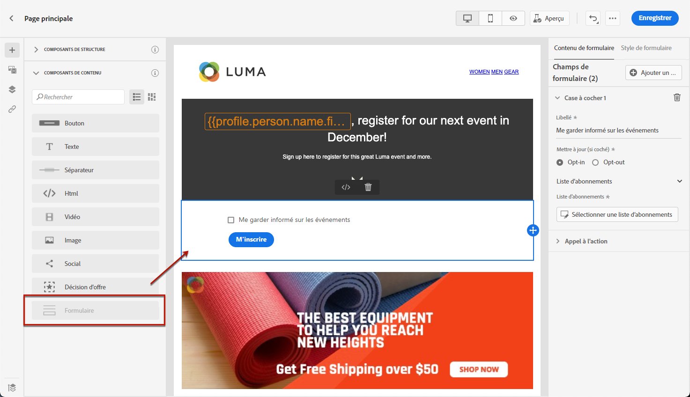
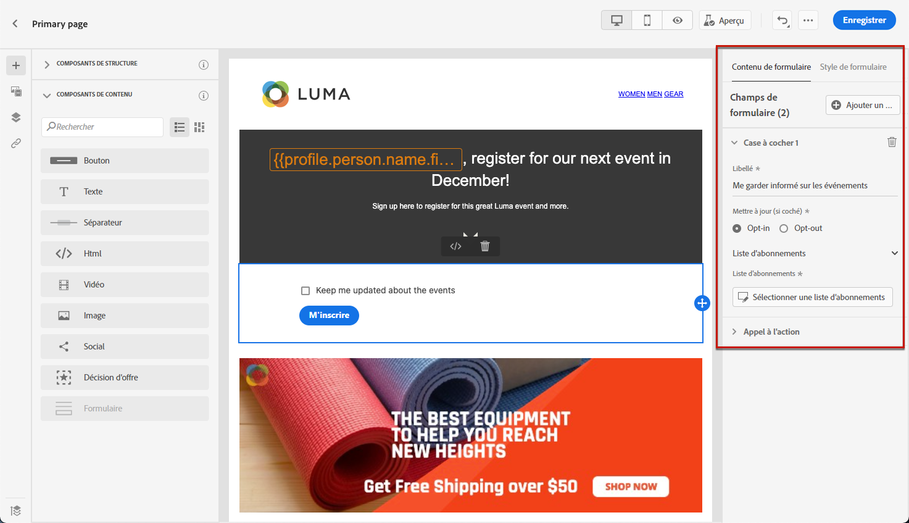
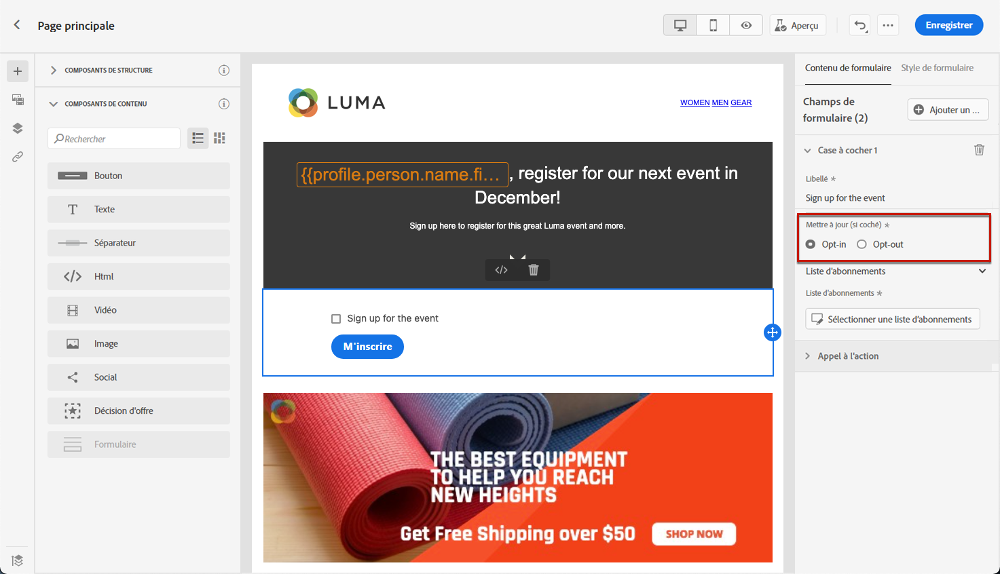
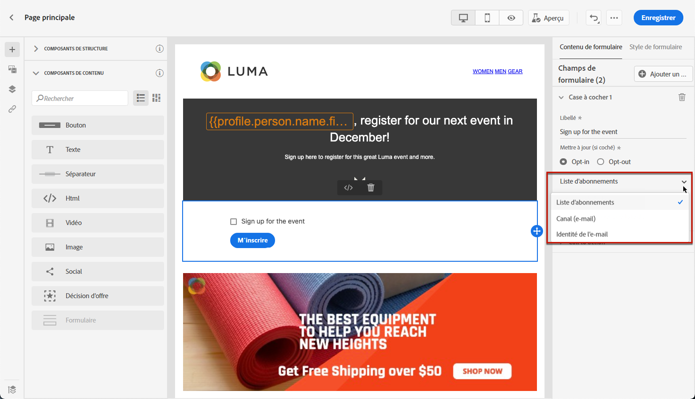
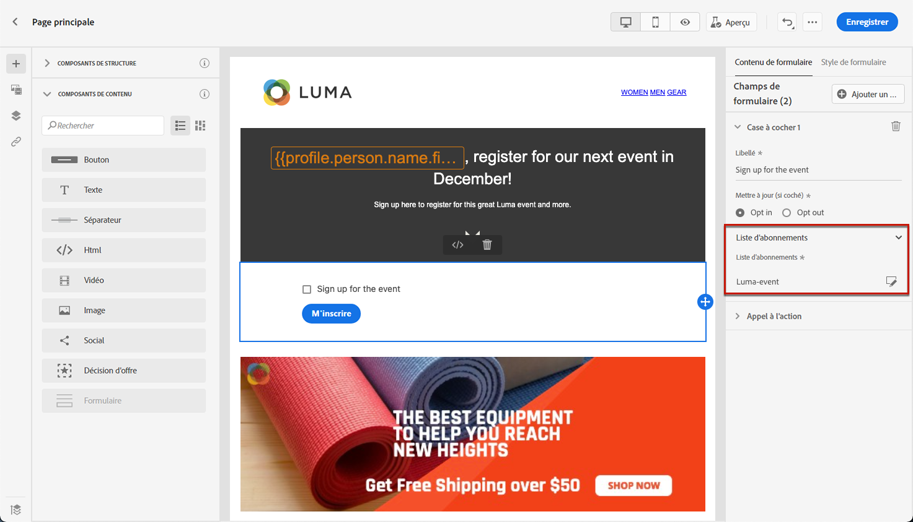
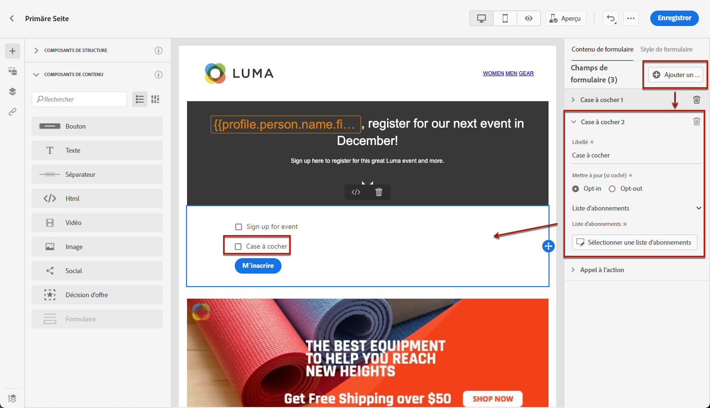
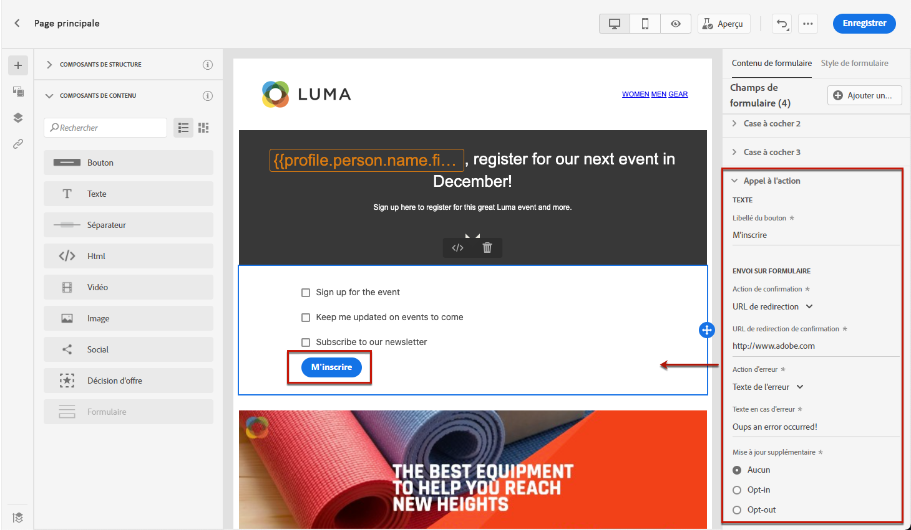
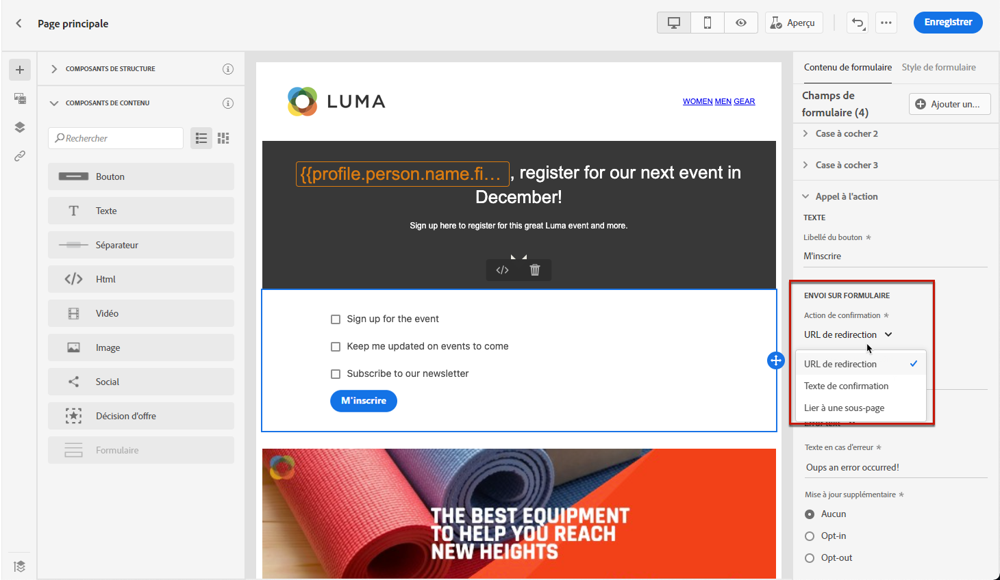
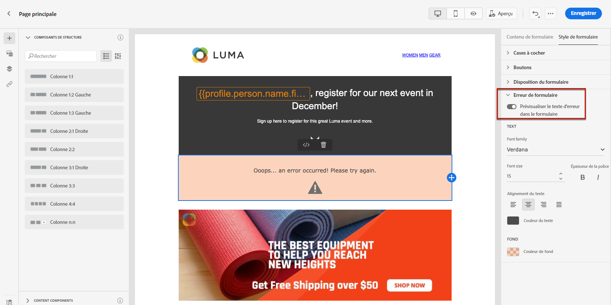
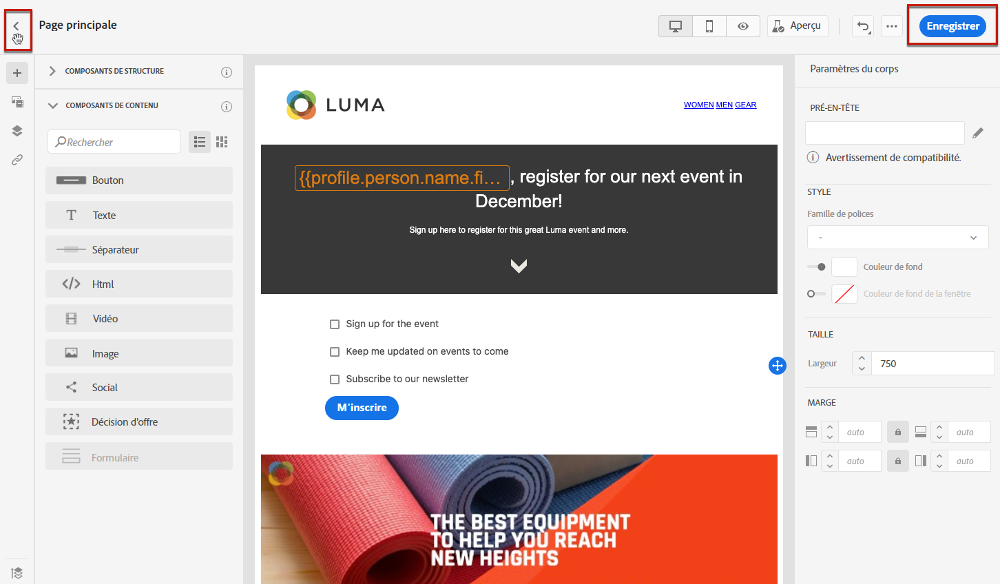

# Concevoir le contenu de la landing page {#design-lp-content}

Pour commencer à créer du contenu à partir de votre landing page [Principale page](create-lp.md#configure-primary-page) ou [subpage](create-lp.md#configure-subpages), placez le pointeur de la souris sur le contenu de la Principale page, puis cliquez sur **[!UICONTROL Ouvrir Designer]** ou cliquez sur le bouton correspondant dans la palette de droite.

À partir de là, vous pouvez :

* **Concevoir entièrement votre landing page** à travers l’interface du concepteur de contenu et utilisez des images à partir de [Adobe Experience Manager Assets Essentials](../assets-essentials.md). Découvrez comment concevoir votre contenu ou utiliser des modèles intégrés [dans cette section](../create-email-content.md).

* **Code ou coller un HTML brut** directement dans le concepteur de contenu. Découvrez comment coder votre propre contenu [dans cette section](../existing-content.md#import-raw-html-code).

* **Importez du contenu HTML existant** à partir d’un fichier ou d’un dossier .zip. Découvrez comment importer du contenu [dans cette section](../existing-content.md#import-html-content-from-file).

>[!NOTE]
>
>Le concepteur de contenu de page d’entrée est essentiellement similaire au concepteur d’email. En savoir plus sur la conception de contenu avec [!DNL Journey Optimizer] [here](../design-emails.md).

Pour définir le contenu spécifique à une landing page, procédez comme suit.

1. Effectuez un glisser-déposer d&#39;une landing page spécifique **[!UICONTROL Formulaire]** de la palette gauche vers l’espace de travail principal.

   

   >[!NOTE]
   >
   >Le **[!UICONTROL Formulaire]** ne peut être utilisé qu’une seule fois sur la même page.

1. Sélectionnez-le. Le **[!UICONTROL Contenu du formulaire]** s’affiche dans la palette de droite pour vous permettre de modifier les différents champs du formulaire.

   

1. Dans la **[!UICONTROL Case à cocher 1]** , vous pouvez modifier le libellé correspondant à cette case à cocher.

1. Définissez si cette case à cocher permet d’exclure ou de désactiver les utilisateurs : acceptent-ils de recevoir des communications ou demandent-ils de ne plus être contactés ?

   

1. Choisissez les options qui seront mises à jour parmi les trois options suivantes :

   

   * **[!UICONTROL Liste d&#39;abonnements]**: Vous devez sélectionner la liste d&#39;abonnements qui sera mise à jour si le profil coche cette case. En savoir plus sur les listes d’abonnements dans [cette section](subscription-list.md).

      

   * **[!UICONTROL Canal (email)]**: L’opt-in ou l’opt-out s’applique à l’ensemble du canal. Par exemple, si un profil qui s’exclut possède deux adresses électroniques, les deux adresses seront exclues de toutes vos communications.

   * **[!UICONTROL Email entity]**: L&#39;opt-in ou l&#39;opt-out ne s&#39;applique qu&#39;à l&#39;adresse email utilisée pour accéder à la landing page. Par exemple, si un profil comporte deux adresses électroniques, seule celle qui a été utilisée pour l’inclusion recevra les communications de votre marque.

1. Cliquez sur **[!UICONTROL Ajouter un champ]** > **[!UICONTROL Case à cocher]** pour ajouter une autre case à cocher. Répétez les étapes ci-dessus pour définir ses propriétés.

   

1. Cliquez sur **[!UICONTROL Appel à l’action]** pour développer la section correspondante. Il permet de définir le comportement du bouton dans la variable **[!UICONTROL Formulaire]** composant.

   

1. Définissez ce qui se passe lorsque vous cliquez sur le bouton :

   * **[!UICONTROL URL de redirection]**: Saisissez l’URL de la page vers laquelle les utilisateurs seront redirigés.
   * **[!UICONTROL Texte de confirmation]**: Saisissez le texte de confirmation qui s’affichera.
   * **[!UICONTROL Lien vers une sous-page]**: Configurez une [subpage](create-lp.md#configure-subpages) et sélectionnez-le dans la liste déroulante qui s’affiche.

   

1. Définissez ce qui se passera lorsque vous cliquez sur le bouton en cas d’erreur :

   * **[!UICONTROL URL de redirection]**: Saisissez l’URL de la page vers laquelle les utilisateurs seront redirigés.
   * **[!UICONTROL Texte de l’erreur]**: Saisissez le texte de l’erreur qui s’affichera. Vous pouvez prévisualiser le texte de l’erreur en cochant la case correspondante.

      

   * **[!UICONTROL Lien vers une sous-page]**: Configurez une [subpage](create-lp.md#configure-subpages) et sélectionnez-le dans la liste déroulante qui s’affiche.

1. Si vous souhaitez effectuer des mises à jour supplémentaires lors de l’envoi du formulaire, sélectionnez **[!UICONTROL Inclusion]** ou **[!UICONTROL Exclusion]** et définissez si vous souhaitez mettre à jour une liste d’abonnements, le canal ou uniquement l’adresse électronique utilisée.

   

1. Enregistrez votre contenu et cliquez sur la flèche en regard du nom de la page pour revenir au [propriétés de page d’entrée](create-lp.md#configure-primary-page).

   

<!--Will the name Email Designer be kept if you can also design LP with the same tool? > To modify in Messages section > content designer or Designer-->

