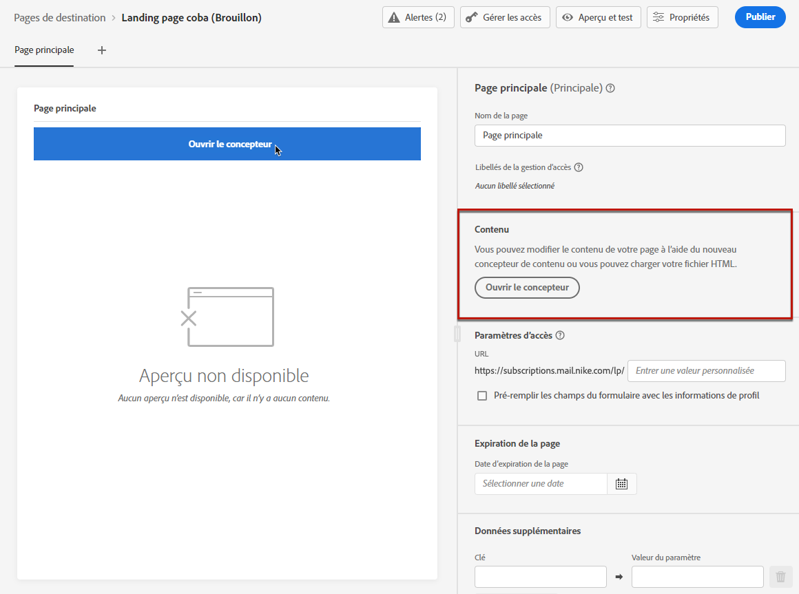

# Concevoir le contenu de la page de destination {#design-lp}

>[!BEGINSHADEBOX]

**Sur cette page :** découvrez comment concevoir le contenu de votre page de destination dans le concepteur de contenu (en partant de zéro, avec l’assistant AI, avec votre propre HTML ou à partir d’un modèle enregistré) pour une expérience client sur la marque.

>[!ENDSHADEBOX]

Pour commencer à créer du contenu pour la [page principale](create-lp.md#configure-primary-page) ou [sous-page](create-lp.md#configure-subpages) de votre page de destination, placez le pointeur de la souris sur le contenu de votre page, puis cliquez sur **[!UICONTROL Ouvrir le concepteur]**. Vous pouvez également cliquer sur le bouton correspondant dans la palette de droite.

Plusieurs possibilités sʼoffrent alors à vous :

* **Concevez votre page de destination en partant de zéro** dans lʼinterface du concepteur de contenu et tirez parti des images provenant dʼ[Adobe Experience Manager Assets](../integrations/assets.md). Découvrez comment concevoir le contenu de vos <!--or use built-in templates--> [dans cette section](../email/content-from-scratch.md).

* **Générez du contenu avec l’assistant IA** pour accélérer la création de pages de destination avec du texte et des images générés par l’IA. [En savoir plus sur l’assistant IA](../content-management/generative-full-content.md).

* **Codez ou collez du code HTML brut** directement dans le concepteur de contenu. Découvrez comment coder votre propre contenu [dans cette section](../email/code-content.md).

* **Importez du contenu HTML existant** à partir d’un fichier ou d’un dossier .zip. Découvrez comment importer du contenu [dans cette section](../email/existing-content.md).

* **Utiliser un modèle de page de destination enregistré** créé dans [!DNL Journey Optimizer]. [En savoir plus](lp-templates.md)

Une fois dans le concepteur de contenu de page de destination, vous pouvez utiliser les mêmes composants que pour un e-mail et définir un contenu spécifique à la page de destination à l’aide du composant de formulaire. [Voici comment procéder](lp-content.md)

>[!NOTE]
>
>Le concepteur de contenu de page de destination est très similaire au concepteur d’e-mail. En savoir plus sur la [conception de contenu avec  [!DNL Journey Optimizer]](../email/get-started-email-design.md).
>
>La [loi européenne sur l’accessibilité](https://eur-lex.europa.eu/legal-content/FR/TXT/?uri=CELEX%3A32019L0882){target="_blank"} stipule que toutes les communications numériques doivent être accessibles. Veillez à suivre les instructions spécifiques répertoriées sur [cette page](../email/accessible-content.md) lors de la conception de contenu dans [!DNL Journey Optimizer].
