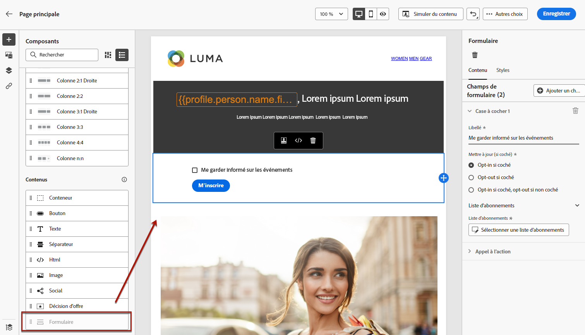
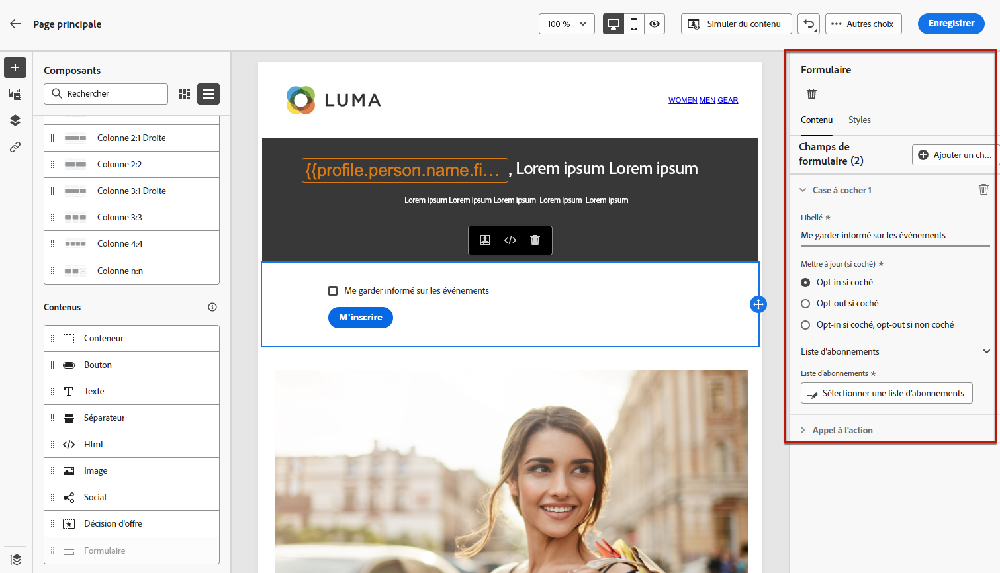
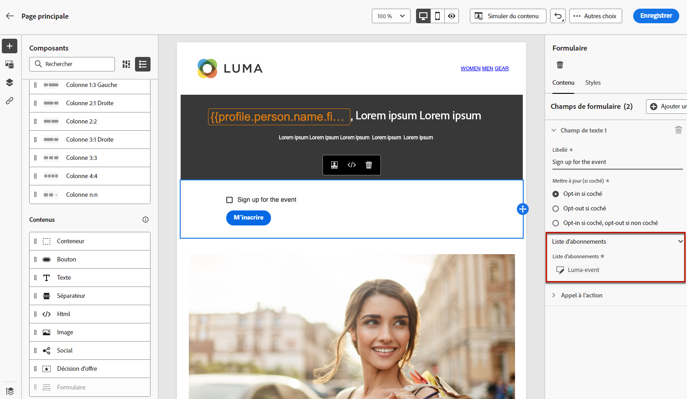
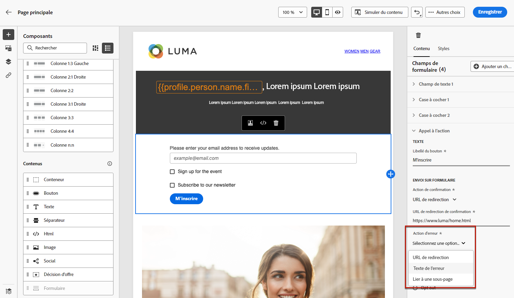
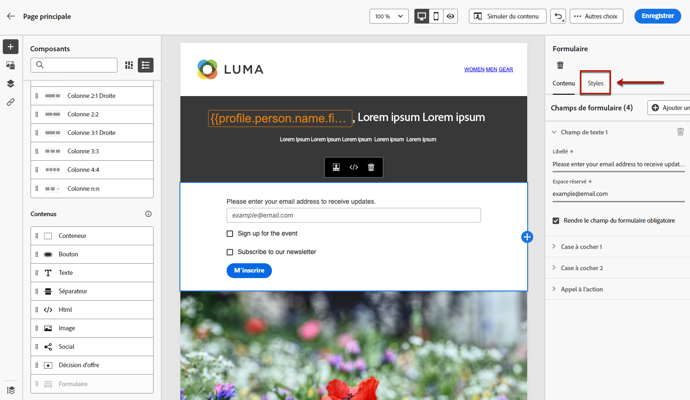
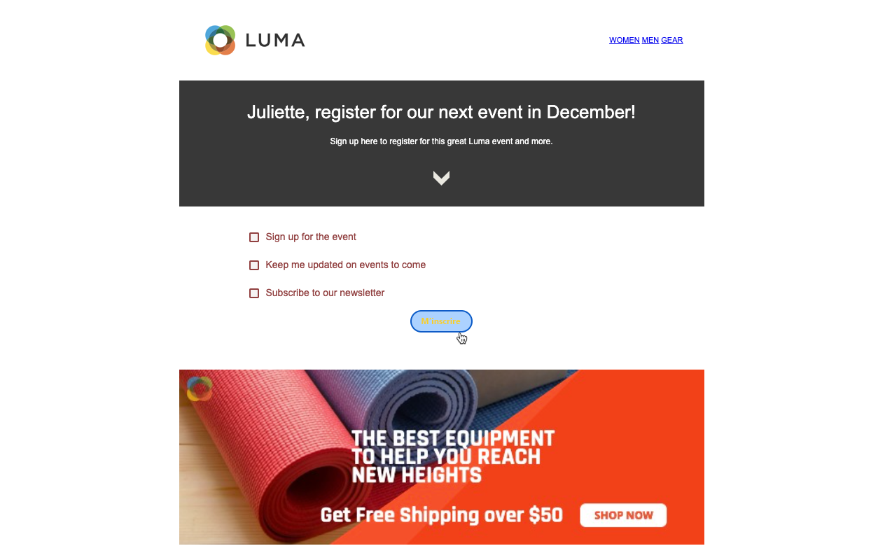

# Conception du contenu de la page de destination {#design-lp-content}

Pour commencer à créer du contenu pour votre [page principale](create-lp.md#configure-primary-page) ou [sous-page](create-lp.md#configure-subpages) de la page de destination, placez le pointeur de la souris sur le contenu de la page principale, puis cliquez sur **[!UICONTROL Ouvrir le concepteur]**. Vous pouvez également cliquer sur le bouton correspondant dans la palette de droite.

Plusieurs possibilités sʼoffrent alors à vous :

* **Concevez votre page de destination à partir de rien** dans lʼinterface du concepteur de contenu et tirez parti des images provenant dʼ[Adobe Experience Manager Assets Essentials](../design/assets-essentials.md). Découvrez comment concevoir votre contenu ou utiliser des modèles intégrés [dans cette section](../design/create-email-content.md).

* **Codez ou collez du code HTML brut** directement dans le concepteur de contenu. Découvrez comment coder votre propre contenu [dans cette section](../design/code-content.md).

* **Importez du contenu HTML existant** à partir d’un fichier ou d’un dossier .zip. Découvrez comment importer du contenu [dans cette section](../design/existing-content.md).

>[!NOTE]
>
>Le concepteur de contenu pour la page de destination est très similaire au concepteur d’e-mail. En savoir plus sur la [conception de contenu avec  [!DNL Journey Optimizer]](../design/design-emails.md).

## Définition de contenu spécifique aux pages de destination {#define-lp-specific-content}

Pour définir un contenu spécifique qui permettra aux utilisateurs de sélectionner et dʼenvoyer leurs choix depuis votre page de destination, procédez comme suit.

1. Faites glisser, puis déposez le composant **[!UICONTROL Formulaire]** conçu pour les pages de destination de la palette de gauche vers l’espace de travail principal.

   

   >[!NOTE]
   >
   >Le composant **[!UICONTROL Formulaire]** ne peut être utilisé qu’une seule fois sur la même page.

1. Sélectionnez-le. Lʼonglet **[!UICONTROL Contenu du formulaire]** s’affiche dans le panneau de droite et vous permet de modifier les différents champs du formulaire.

   

   >[!NOTE]
   >
   >Passez à tout moment à lʼonglet **[!UICONTROL Style de formulaire]** pour modifier les styles du contenu de votre composant Formulaire. [En savoir plus](#define-lp-styles)

1. Dans la **[!UICONTROL Case à cocher 1]**, vous pouvez modifier le libellé correspondant à cette case à cocher.

1. Définissez si cette case à cocher permet d’inscrire ou de désinscrire les utilisateurs : acceptent-ils de recevoir des communications ou demandent-ils à ne plus être contactés ?

   

1. Parmi les trois options suivantes, choisissez celles qui seront mises à jour :

   

   * **[!UICONTROL Liste dʼabonnements]** : vous devez sélectionner la liste dʼabonnements à mettre à jour si le profil coche cette case. En savoir plus sur les [listes dʼabonnements](subscription-list.md).

      

   * **[!UICONTROL Canal (e-mail)]** : lʼinscription ou la désinscription sʼapplique à l’ensemble du canal. Par exemple, si un profil qui se désinscrit possède deux adresses e-mail, celles-ci seront exclues de toutes vos communications.

   * **[!UICONTROL Identité de lʼadresse e-mail]** : lʼinscription ou la désinscription ne sʼapplique quʼà lʼadresse e-mail utilisée pour accéder à la page de destination. Par exemple, si un profil comporte deux adresses e-mail, seule celle utilisée lors de lʼinscription recevra les communications de votre marque.

1. Cliquez sur **[!UICONTROL Ajouter un champ]** > **[!UICONTROL Case à cocher]** pour ajouter une autre case à cocher. Répétez les étapes ci-dessus pour définir ses propriétés.

   

1. Une fois que vous avez ajouté toutes les cases à cocher souhaitées, cliquez sur **[!UICONTROL Appel à lʼaction]** pour développer la section correspondante. Il permet de définir le comportement du bouton dans le composant **[!UICONTROL Formulaire]**.

   

1. Définissez lʼaction à effectuer lors du clic sur le bouton :

   * **[!UICONTROL URL de redirection]** : saisissez l’URL de la page vers laquelle les utilisateurs seront redirigés.
   * **[!UICONTROL Texte de confirmation]** : saisissez le texte de confirmation qui sʼaffichera.
   * **[!UICONTROL Lien vers une sous-page]** : configurez une [sous-page](create-lp.md#configure-subpages) et sélectionnez-la dans la liste déroulante qui sʼaffiche.

   

1. Définissez lʼaction à effectuer lors du clic sur le bouton en cas d’erreur :

   * **[!UICONTROL URL de redirection]** : saisissez l’URL de la page vers laquelle les utilisateurs seront redirigés.
   * **[!UICONTROL Texte de l’erreur]** : saisissez le texte de l’erreur qui sʼaffichera. Vous pouvez prévisualiser le texte de l’erreur lors de la définition des [styles de formulaire](#define-lp-styles).

   * **[!UICONTROL Lien vers une sous-page]** : configurez une [sous-page](create-lp.md#configure-subpages) et sélectionnez-la dans la liste déroulante qui s’affiche.

   

1. Si vous souhaitez effectuer des mises à jour supplémentaires lors de la soumission du formulaire, sélectionnez **[!UICONTROL Inscription]** ou **[!UICONTROL Désinscription]** et définissez si vous souhaitez mettre à jour une liste d’abonnements, le canal ou uniquement l’adresse e-mail utilisée.

   

1. Enregistrez votre contenu et cliquez sur la flèche en regard du nom de la page pour revenir aux [propriétés de la page de destination](create-lp.md#configure-primary-page).

   

<!--Will the name Email Designer be kept if you can also design LP with the same tool? > To modify in Messages section > content designer or Designer-->

## Définition des styles de formulaire de page de destination {#define-lp-styles}

1. Pour modifier les styles du contenu de votre composant de formulaire, passez à tout moment à lʼonglet **[!UICONTROL Style de formulaire]**.

   

1. Développez la section **[!UICONTROL Cases à cocher]** pour définir lʼaspect des cases à cocher et du texte correspondant. Par exemple, vous pouvez ajuster la famille ou la taille de la police, ainsi que la couleur de la bordure de la case à cocher.

   

1. Développez la section **[!UICONTROL Boutons]** pour modifier l’aspect du bouton dans le composant de formulaire. Par exemple, vous pouvez ajouter une bordure, modifier la couleur du libellé en le survolant avec votre souris ou ajuster lʼalignement du bouton.

   

   Vous pouvez prévisualiser certains de vos paramètres, tels que la couleur du libellé du bouton au survol à lʼaide du bouton **[!UICONTROL Prévisualiser]**. En savoir plus sur le test des pages de destination [ici](create-lp.md#test-landing-page).

   

1. Développez la section **[!UICONTROL Disposition du formulaire]** pour modifier les paramètres de disposition, tels que la couleur d’arrière-plan, le remplissage ou la marge.

   

1. Développez la section **[!UICONTROL Erreur du formulaire]** pour ajuster l’affichage du message d’erreur qui est visible en cas de problème. Cochez lʼoption correspondante pour prévisualiser le texte dʼerreur sur le formulaire.

   

