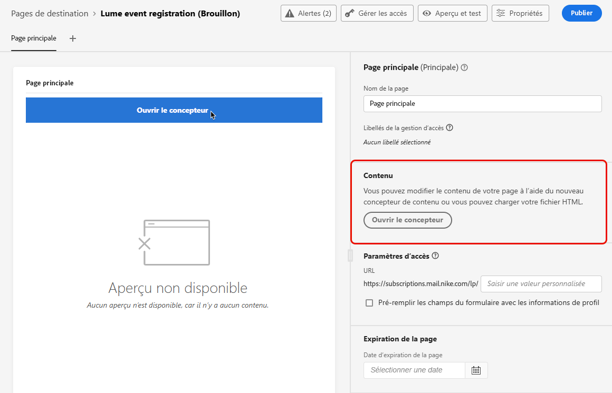

# Concevoir le contenu de la page de destination {#design-lp}

Pour commencer à créer du contenu pour la [page principale](create-lp.md#configure-primary-page) ou [sous-page](create-lp.md#configure-subpages) de votre page de destination, placez le pointeur de la souris sur le contenu de votre page, puis cliquez sur **[!UICONTROL Ouvrir le concepteur]**. Vous pouvez également cliquer sur le bouton correspondant dans la palette de droite.

Plusieurs possibilités sʼoffrent alors à vous :

* **Concevez votre page de destination en partant de zéro** dans lʼinterface du concepteur de contenu et tirez parti des images provenant dʼ[Adobe Experience Manager Assets](../integrations/assets.md). Découvrez comment concevoir le contenu de vos <!--or use built-in templates--> [dans cette section](../email/content-from-scratch.md).

* **Codez ou collez du code HTML brut** directement dans le concepteur de contenu. Découvrez comment coder votre propre contenu [dans cette section](../email/code-content.md).

* **Importez du contenu HTML existant** à partir d’un fichier ou d’un dossier .zip. Découvrez comment importer du contenu [dans cette section](../email/existing-content.md).

* **Utiliser un modèle de page de destination enregistré** créé dans [!DNL Journey Optimizer]. [En savoir plus](lp-templates.md)

>[!NOTE]
>
>Le concepteur de contenu pour la page de destination est très similaire au concepteur d’e-mail. En savoir plus sur la [conception de contenu avec [!DNL Journey Optimizer]](../email/get-started-email-design.md).
