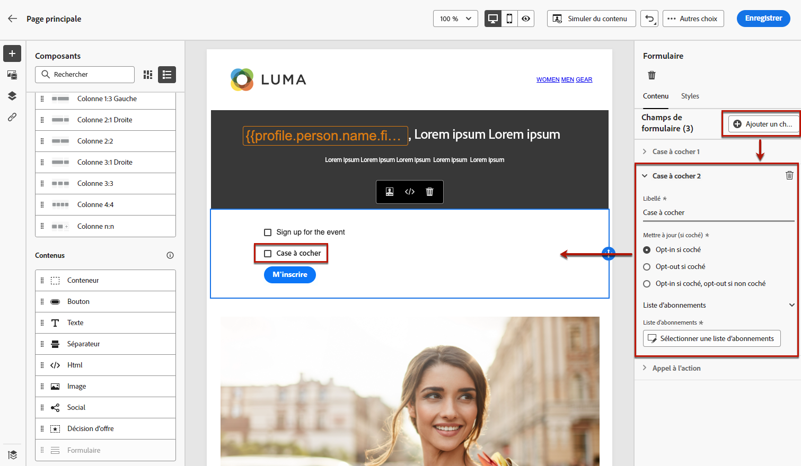

# Définition du contenu spécifique à une landing page {#lp-content}

Pour définir un contenu spécifique qui permettra aux utilisateurs de sélectionner et d’envoyer leurs choix depuis votre landing page, utilisez le **[!UICONTROL Form]** composant. Pour ce faire, procédez comme suit.

>[!NOTE]
>
>Vous pouvez également créer une page d’entrée de clics publicitaires sans **[!UICONTROL Form]** composant. Dans ce cas, la landing page s&#39;affichera aux utilisateurs, mais ils n&#39;auront pas à envoyer de formulaire. Cela peut s’avérer utile si vous souhaitez uniquement afficher une landing page sans nécessiter d’action de la part de vos destinataires, comme l’inclusion ou l’exclusion, ou si vous souhaitez fournir des informations qui ne nécessitent pas d’entrée de la part de l’utilisateur.

## Utilisation du composant de formulaire {#use-form-component}

1. Effectuez un glisser-déposer d&#39;une landing page spécifique **[!UICONTROL Form]** de la palette gauche vers l’espace de travail principal.

   

   >[!NOTE]
   >
   >Le **[!UICONTROL Form]** ne peut être utilisé qu’une seule fois sur la même page.

1. Sélectionnez-le. Le **[!UICONTROL Form content]** s’affiche dans la palette de droite pour vous permettre de modifier les différents champs du formulaire.

   

   >[!NOTE]
   >
   >Basculez vers le **[!UICONTROL Form style]** à tout moment pour modifier les styles du contenu de votre composant de formulaire. [En savoir plus](#define-lp-styles)

1. Dans la **[!UICONTROL Checkbox 1]** , vous pouvez modifier le libellé correspondant à cette case à cocher.

1. Définissez si cette case à cocher permet d’exclure ou de désactiver les utilisateurs : acceptent-ils de recevoir des communications ou demandent-ils de ne plus être contactés ?

   

   Sélectionnez l’une des trois options suivantes :

   * **[!UICONTROL Opt in if checked]**: les utilisateurs doivent cocher la case pour accepter (opt-in).
   * **[!UICONTROL Opt out if checked]**: les utilisateurs doivent cocher la case pour retirer leur consentement (opt-out).
   * **[!UICONTROL Opt in if checked, opt out if unchecked]**: cette option vous permet d’insérer une seule case à cocher pour l’inclusion/exclusion. Les utilisateurs doivent cocher la case pour accepter (opt-in) et la décocher pour supprimer leur consentement (opt-out).

1. Choisissez les options qui seront mises à jour parmi les trois options suivantes :

   

   * **[!UICONTROL Subscription list]**: Vous devez sélectionner la liste d&#39;abonnements qui sera mise à jour si le profil coche cette case. En savoir plus sur [listes d’abonnements](subscription-list.md).

      

   * **[!UICONTROL Channel (email)]**: L’opt-in ou l’opt-out s’applique à l’ensemble du canal. Par exemple, si un profil qui s’exclut possède deux adresses électroniques, les deux adresses seront exclues de toutes vos communications.

   * **[!UICONTROL Email identity]**: L&#39;opt-in ou l&#39;opt-out ne s&#39;applique qu&#39;à l&#39;adresse email utilisée pour accéder à la landing page. Par exemple, si un profil comporte deux adresses électroniques, seule celle qui a été utilisée pour l’inclusion recevra les communications de votre marque.

1. Cliquez sur **[!UICONTROL Add field]** > **[!UICONTROL Checkbox]** pour ajouter une autre case à cocher. Répétez les étapes ci-dessus pour définir ses propriétés.

   

1. Une fois que vous avez ajouté toutes les cases à cocher de votre choix, cliquez sur **[!UICONTROL Call to action]** pour développer la section correspondante. Il permet de définir le comportement du bouton dans la variable **[!UICONTROL Form]** composant.

   

1. Définissez ce qui se passe lorsque vous cliquez sur le bouton :

   * **[!UICONTROL Redirect URL]**: Saisissez l’URL de la page vers laquelle les utilisateurs seront redirigés.
   * **[!UICONTROL Confirmation text]**: Saisissez le texte de confirmation qui s’affichera.
   * **[!UICONTROL Link to a subpage]**: Configurez une [subpage](create-lp.md#configure-subpages) et sélectionnez-le dans la liste déroulante qui s’affiche.

   

1. Définissez ce qui se passera lorsque vous cliquez sur le bouton en cas d’erreur :

   * **[!UICONTROL Redirect URL]**: Saisissez l’URL de la page vers laquelle les utilisateurs seront redirigés.
   * **[!UICONTROL Error text]**: Saisissez le texte de l’erreur qui s’affichera. Vous pouvez prévisualiser le texte de l’erreur lors de la définition de la variable [styles de formulaire](#define-lp-styles).

   * **[!UICONTROL Link to a subpage]**: Configurez une [subpage](create-lp.md#configure-subpages) et sélectionnez-le dans la liste déroulante qui s’affiche.

   

1. Si vous souhaitez apporter des mises à jour supplémentaires lors de l’envoi du formulaire, sélectionnez **[!UICONTROL Opt in]** ou **[!UICONTROL Opt out]** et définissez si vous souhaitez mettre à jour une liste d’abonnements, le canal ou uniquement l’adresse électronique utilisée.

   

1. Enregistrez votre contenu et cliquez sur la flèche en regard du nom de la page pour revenir au [propriétés de page d’entrée](create-lp.md#configure-primary-page).

   

## Définition des styles de formulaire de landing page {#lp-form-styles}

1. Pour modifier les styles du contenu de votre composant de formulaire, basculez à tout moment vers la fonction **[!UICONTROL Form style]** .

   

1. Développez l’objet **[!UICONTROL Checkboxes]** pour définir l’aspect des cases à cocher et du texte correspondant. Par exemple, vous pouvez ajuster la famille ou la taille de police, ainsi que la couleur de la bordure de la case à cocher.

   

1. Développez l’objet **[!UICONTROL Buttons]** pour modifier l’aspect du bouton dans le formulaire du composant. Vous pouvez par exemple ajouter une bordure, modifier la couleur du libellé au survol ou ajuster l’alignement du bouton.

   

   Vous pouvez prévisualiser certains de vos paramètres, comme la couleur de l’étiquette du bouton lorsque vous survolez en utilisant la fonction **[!UICONTROL Preview]** bouton . En savoir plus sur le test des landing pages [here](create-lp.md#test-landing-page).

   

1. Développez l’objet **[!UICONTROL Form layout]** pour modifier les paramètres de mise en page, tels que la couleur d’arrière-plan, la marge intérieure ou la marge.

   

1. Développez l’objet **[!UICONTROL Form error]** pour ajuster l’affichage du message d’erreur qui s’affiche en cas de problème. Cochez l&#39;option correspondante pour prévisualiser le texte de l&#39;erreur sur le formulaire.

   

## Utiliser le contexte de page principale {#use-primary-page-context}

Vous pouvez utiliser des données contextuelles provenant d&#39;une autre page dans la même landing page.

Par exemple, si vous liez une case à cocher<!-- or the submission of the page--> à [liste d&#39;abonnements](subscription-list.md) sur la page d’entrée principale, vous pouvez utiliser cette liste d’abonnements sur la sous-page &quot;merci&quot;.

Supposons que vous liiez deux cases à cocher sur votre page principale à deux listes d’abonnement différentes. Si un utilisateur s’abonne à l’un de ces éléments, vous souhaitez afficher un message spécifique lors de l’envoi du formulaire, en fonction de la case à cocher qu’il a sélectionnée.

Pour ce faire, procédez comme suit :

1. Sur la page principale, associez chaque case à cocher à la liste d’abonnements correspondante. [En savoir plus](#use-form-component).

   

1. Dans la sous-page, placez le pointeur de la souris à l’endroit où vous souhaitez insérer votre texte et sélectionnez **[!UICONTROL Add personalization]** dans la barre d’outils contextuelle.

   

1. Dans le **[!UICONTROL Edit personalization]** fenêtre, sélectionnez **[!UICONTROL Contextual attributes]** > **[!UICONTROL Landing Pages]** > **[!UICONTROL Primary Page Context]** > **[!UICONTROL Subscription]**.

1. Toutes les listes d’abonnements que vous avez sélectionnées sur la page principale sont répertoriées. Sélectionnez les éléments appropriés à l’aide de l’icône + .

   

1. Ajoutez les conditions appropriées à l&#39;aide des fonctions d&#39;assistance de l&#39;éditeur d&#39;expression. [En savoir plus](../personalization/functions/functions.md)

   

   >[!CAUTION]
   >
   >Si l’expression comporte un caractère spécial, tel qu’un trait d’union, vous devez placer le texte dans une séquence d’échappement, y compris le trait d’union.

1. Enregistrez vos modifications.

Désormais, lorsque les utilisateurs cochent l’une des cases, le message correspondant à la case sélectionnée s’affiche lors de l’envoi du formulaire.

>[!NOTE]
>
>Si un utilisateur sélectionne les deux cases à cocher, les deux textes s’affichent.

<!--
## Use landing page additional data {#use-additional-data}

When [configuring the primary page](create-lp.md#configure-primary-page), you can create additional data to enable storing information when the landing page is being submitted.

>[!NOTE]
>
>This data may not be visible to users who visit the page.

If you defined one or more keys with their corresponding values when [configuring the primary page](create-lp.md#configure-primary-page), you can leverage these keys in the content of your primary page and subpages using the [Expression editor](../personalization/personalization-build-expressions.md).

///When you reuse the same text on a page, this enables you to dynamically change that text if needed, without going through each occurrence.

For example, if you define the company name as a key, you can quickly update it everywhere (on all the pages of a given landing page) by changing it only once in the [primary page settings](create-lp.md#configure-primary-page).///

To leverage these keys in a landing page, follow the steps below:

1. When configuring the primary page, define a key and its corresponding value in the **[!UICONTROL Additional data]** section. [Learn more](create-lp.md#configure-primary-page)

    

1. When editing your primary page with the designer, place the pointer of your mouse where you want to insert your key and select **[!UICONTROL Add personalization]** from the contextual toolbar.

    

1. In the **[!UICONTROL Edit Personalization]** window, select **[!UICONTROL Contextual attributes]** > **[!UICONTROL Landing Pages]** > **[!UICONTROL Additional Context]**.

    

1. All the keys that you created when configuring the primary page are listed. Select the key of your choice using the + icon.

    

1. Save your changes and repeat the steps above as many times as needed.

    

    You can see that the personalization item corresponding to your key is now displayed everywhere you inserted it.
-->