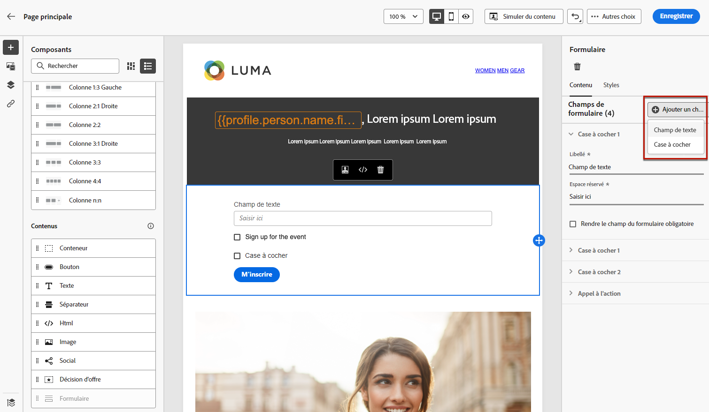

# Définir le contenu spécifique aux pages de destination {#lp-content}

>[!CONTEXTUALHELP]
>id="ac_lp_components"
>title="Utiliser des composants de contenu"
>abstract="Les composants de contenu sont des espaces réservés de contenu vides que vous pouvez utiliser pour créer la disposition d’une page de destination. Pour définir un contenu spécifique qui permettra aux utilisateurs et utilisatrices de sélectionner et dʼenvoyer leurs choix, utilisez le composant de formulaire."
>additional-url="https://experienceleague.adobe.com/fr/docs/journey-optimizer/using/channels/email/design-email/add-content/content-components#add-content-components" text="Ajouter des composants de contenu"

Pour concevoir le contenu de votre page de destination, vous pouvez utiliser les mêmes composants que pour un e-mail. [En savoir plus](../email/content-components.md#add-content-components).

Pour concevoir un contenu spécifique qui permettra aux utilisateurs et utilisatrices de sélectionner et d’envoyer leurs choix, [utilisez le composant de formulaire](#use-form-component) et définissez ses [styles spécifiques aux pages de destination](#lp-form-styles).

>[!NOTE]
>
>Vous pouvez également créer une page de destination de clics publicitaires sans composant **[!UICONTROL Formulaire]**. Dans ce cas, la page de destination s&#39;affichera aux utilisateurs, mais ils n&#39;auront pas à envoyer de formulaire. Cela peut s’avérer utile si vous souhaitez uniquement afficher une page de destination sans nécessiter d’action de la part de vos destinataires, comme l’opt-in ou l’opt-out, ou si vous souhaitez fournir des informations qui ne nécessitent pas d’entrée de la part de l’utilisateur.

Grâce au concepteur de contenu de page de destination, vous pouvez également utiliser les données contextuelles provenant de la page principale dans une sous-page. [En savoir plus](#use-primary-page-context).

>[!NOTE]
>
>La [directive européenne sur l’accessibilité](https://eur-lex.europa.eu/legal-content/EN/TXT/?uri=CELEX%3A32019L0882){target="_blank"} stipule que toutes les communications numériques doivent être accessibles. Veillez à suivre les instructions spécifiques répertoriées sur [cette page](../email/accessible-content.md) lors de la conception de contenu dans [!DNL Journey Optimizer].

## Utiliser le composant de formulaire {#use-form-component}

>[!CONTEXTUALHELP]
>id="ac_lp_formfield"
>title="Définir les champs de composant de formulaire"
>abstract="Définissez la manière dont vos destinataires verront et soumettront leurs choix depuis votre page de destination."
>additional-url="https://experienceleague.adobe.com/fr/docs/journey-optimizer/using/landing-pages/landing-pages-design/lp-content#lp-form-styles" text="Définir les styles de formulaire de page de destination"

>[!CONTEXTUALHELP]
>id="ac_lp_submission"
>title="Que se passe-t-il après avoir cliqué sur le bouton ?"
>abstract="Définissez ce qui se passera lorsque les utilisateurs et utilisatrices soumettent le formulaire de page de destination."

Pour définir un contenu spécifique qui permettra aux utilisateurs et utilisatrices de sélectionner et de soumettre leurs choix depuis votre page de destination, utilisez le composant **[!UICONTROL Formulaire]**. Pour ce faire, procédez comme suit.

1. Faites glisser, puis déposez le composant **[!UICONTROL Formulaire]** conçu pour les pages de destination de la palette de gauche vers l’espace de travail principal.

   

   >[!NOTE]
   >
   >Le composant **[!UICONTROL Formulaire]** ne peut être utilisé qu’une seule fois sur la même page.

1. Sélectionnez-le. Lʼonglet **[!UICONTROL Contenu du formulaire]** s’affiche dans le panneau de droite et vous permet de modifier les différents champs du formulaire.

   

   >[!NOTE]
   >
   >Passez à tout moment à lʼonglet **[!UICONTROL Styles]** pour modifier les styles du contenu de votre composant de formulaire. [En savoir plus](#define-lp-styles)

1. Dans la **[!UICONTROL Case à cocher 1]**, vous pouvez modifier le libellé correspondant à cette case à cocher.

1. Définissez si cette case à cocher permet d’inscrire ou de désinscrire les utilisateurs : acceptent-ils de recevoir des communications ou demandent-ils à ne plus être contactés ?

   

   Sélectionnez l’une des trois options suivantes :

   * **[!UICONTROL Opt-in si coché]** : les utilisateurs doivent cocher la case pour accepter (opt-in).
   * **[!UICONTROL Opt-out si coché]** : les utilisateurs doivent cocher la case pour retirer leur consentement (opt-out).
   * **[!UICONTROL Opt-in si coché, opt-out si non coché]** : cette option vous permet d’insérer une seule case à cocher pour l’inclusion/exclusion. Les utilisateurs doivent cocher la case pour donner leur consentement (opt-in), et la décocher pour supprimer leur consentement (opt-out).

1. Parmi les trois options suivantes, choisissez celles qui seront mises à jour :

   

   * **[!UICONTROL Liste dʼabonnements]** : vous devez sélectionner la liste dʼabonnements à mettre à jour si le profil coche cette case. En savoir plus sur les [listes dʼabonnements](subscription-list.md).

     <!---->

   * **[!UICONTROL Canal (e-mail)]** : le processus d’opt-in ou d’opt-out sʼapplique à l’ensemble du canal. Par exemple, si un profil qui se désinscrit possède deux adresses e-mail, celles-ci seront exclues de toutes vos communications.

   * **[!UICONTROL Identité de lʼadresse e-mail]** : le processus d’opt-in ou d’opt-out ne sʼapplique quʼà lʼadresse e-mail utilisée pour accéder à la page de destination. Par exemple, si un profil comporte deux adresses e-mail, seule celle utilisée lors de l’opt-in recevra les communications de votre marque.

1. Cliquez sur **[!UICONTROL Ajouter un champ]** > **[!UICONTROL Case à cocher]** pour ajouter une autre case à cocher. Répétez les étapes ci-dessus pour définir ses propriétés.

   

1. Vous pouvez également ajouter un **[!UICONTROL Champ de texte]**.

   

   * Saisissez le **[!UICONTROL Libellé]** à afficher au-dessus du champ du formulaire.

   * Rédigez le texte de l’**[!UICONTROL Espace réservé]**. Il s’affiche dans le champ avant que l’utilisateur ou l’utilisatrice ne le remplisse.

   * Cochez l’option **[!UICONTROL Rendre le champ de formulaire obligatoire]**, si nécessaire. Dans ce cas, la page de destination ne peut être envoyée que si l&#39;utilisateur ou l’utilisatrice a renseigné ce champ. Si un champ obligatoire n’est pas renseigné, un message d’erreur s’affiche lorsque l’utilisateur ou l’utilisatrice envoie la page.

   

1. Une fois que vous avez ajouté toutes les cases à cocher et/ou les champs de texte souhaités, cliquez sur **[!UICONTROL Appel à lʼaction]** pour développer la section correspondante. Il permet de définir le comportement du bouton dans le composant **[!UICONTROL Formulaire]**.

   

1. Définissez lʼaction à effectuer lors du clic sur le bouton :

   * **[!UICONTROL URL de redirection]** : saisissez l’URL de la page vers laquelle les utilisateurs seront redirigés.
   * **[!UICONTROL Texte de confirmation]** : saisissez le texte de confirmation qui sʼaffichera.
   * **[!UICONTROL Lien vers une sous-page]** : configurez une [sous-page](create-lp.md#configure-subpages) et sélectionnez-la dans la liste déroulante qui sʼaffiche.

   

1. Définissez lʼaction à effectuer lors du clic sur le bouton en cas d’erreur :

   * **[!UICONTROL URL de redirection]** : saisissez l’URL de la page vers laquelle les utilisateurs seront redirigés.
   * **[!UICONTROL Texte de l’erreur]** : saisissez le texte de l’erreur qui sʼaffichera. Vous pouvez prévisualiser le texte de l’erreur lors de la définition des [styles de formulaire](#define-lp-styles).

   * **[!UICONTROL Lien vers une sous-page]** : configurez une [sous-page](create-lp.md#configure-subpages) et sélectionnez-la dans la liste déroulante qui s’affiche.

   

1. Si vous souhaitez effectuer des mises à jour supplémentaires lors de l’envoi du formulaire, sélectionnez **[!UICONTROL Opt-in]** ou **[!UICONTROL Opt-out]** et définissez si vous souhaitez mettre à jour une liste d’abonnements, le canal ou uniquement l’adresse e-mail utilisée.

   

1. Enregistrez votre contenu et cliquez sur la flèche en regard du nom de la page pour revenir aux [propriétés de la page de destination](create-lp.md#configure-primary-page).

   

## Définition des styles de formulaire de page de destination {#lp-form-styles}

1. Pour modifier les styles du contenu de votre composant de formulaire, passez à tout moment à lʼonglet **[!UICONTROL Styles]**.

   

1. La section **[!UICONTROL Champs]**, développée par défaut, permet de modifier l’apparence du champ de texte, comme le libellé et la police de l’espace réservé, la position du libellé, la couleur d’arrière-plan du champ ou la bordure du champ.

   

1. Développez la section **[!UICONTROL Cases à cocher]** pour définir lʼaspect des cases à cocher et du texte correspondant. Par exemple, vous pouvez ajuster la famille ou la taille de la police, ainsi que la couleur de la bordure de la case à cocher.

   

1. Développez la section **[!UICONTROL Boutons]** pour modifier l’aspect du bouton dans le composant de formulaire. Par exemple, vous pouvez modifier la police, ajouter une bordure, modifier la couleur du libellé au survol ou ajuster lʼalignement du bouton.

   

   Vous pouvez prévisualiser certains de vos paramètres, tels que la couleur du libellé du bouton au survol, à lʼaide du bouton **[!UICONTROL Simuler le contenu]**. En savoir plus sur le test des pages de destination [ici](create-lp.md#test-landing-page).

   <!---->

1. Développez la section **[!UICONTROL Disposition du formulaire]** pour modifier les paramètres de disposition, tels que la couleur d’arrière-plan, le remplissage ou la marge.

   

1. Développez la section **[!UICONTROL Erreur du formulaire]** pour ajuster l’affichage du message d’erreur qui est visible en cas de problème. Cochez lʼoption correspondante pour prévisualiser le texte dʼerreur sur le formulaire.

   

## Utiliser le contexte de la page principale {#use-primary-page-context}

Vous pouvez utiliser des données contextuelles provenant d’une autre page dans la même page de destination.

Par exemple, si vous liez une case à cocher<!-- or the submission of the page--> à une [liste d’abonnements](subscription-list.md) sur la page de destination principale, vous pouvez utiliser cette liste d’abonnements sur la sous-page « merci ».

Supposons que vous liez deux cases à cocher sur votre page principale à deux listes d’abonnement différentes. Si un utilisateur s’abonne à l’une de ces listes, affichez un message spécifique lors de l’envoi du formulaire suivant la case à cocher qu’il a sélectionnée.

Procédez comme suit :

1. Sur la page principale, liez chaque case à cocher du composant **[!UICONTROL Formulaire]** à la liste d’abonnements correspondante. [En savoir plus](#use-form-component).

   

1. Sur la sous-page, placez le pointeur de la souris à l’endroit où vous souhaitez insérer votre texte et sélectionnez **[!UICONTROL Ajouter une personnalisation]** dans la barre d’outils contextuelle.

   

1. Dans la fenêtre **[!UICONTROL Modifier la personnalisation]**, sélectionnez **[!UICONTROL Attributs contextuels]** > **[!UICONTROL Pages de destination]** > **[!UICONTROL Contexte de la page principale]** > **[!UICONTROL Abonnement]**.

1. Toutes les listes d’abonnements que vous avez sélectionnées sur la page principale sont répertoriées. Sélectionnez les éléments pertinents à l’aide de l’icône + .

   

1. Ajoutez les conditions appropriées à l’aide des fonctions d’assistance de l’éditeur de personnalisation. [En savoir plus](../personalization/functions/functions.md)

   

   >[!CAUTION]
   >
   >Si l’expression comporte un caractère spécial, tel qu’un trait d’union, vous devez placer le texte dans une séquence d’échappement, y compris le trait d’union.

1. Enregistrez vos modifications.

Désormais, lorsque les utilisateurs et utilisatrices cochent l’une des cases,

le message correspondant à la case cochée s’affiche lors de l’envoi du formulaire.

<!---->

>[!NOTE]
>
>Si un utilisateur ou une utilisatrice sélectionne les deux cases à cocher, les deux textes s’affichent.

<!--
## Use landing page additional data {#use-additional-data}

When [configuring the primary page](create-lp.md#configure-primary-page), you can create additional data to enable storing information when the landing page is being submitted.

>[!NOTE]
>
>This data may not be visible to users who visit the page.

If you defined one or more keys with their corresponding values when [configuring the primary page](create-lp.md#configure-primary-page), you can leverage these keys in the content of your primary page and subpages using the [personalization editor](../personalization/personalization-build-expressions.md).

///When you reuse the same text on a page, this enables you to dynamically change that text if needed, without going through each occurrence.

For example, if you define the company name as a key, you can quickly update it everywhere (on all the pages of a given landing page) by changing it only once in the [primary page settings](create-lp.md#configure-primary-page).///

To leverage these keys in a landing page, follow the steps below:

1. When configuring the primary page, define a key and its corresponding value in the **[!UICONTROL Additional data]** section. [Learn more](create-lp.md#configure-primary-page)

    

1. When editing your primary page with the designer, place the pointer of your mouse where you want to insert your key and select **[!UICONTROL Add personalization]** from the contextual toolbar.

    

1. In the **[!UICONTROL Edit Personalization]** window, select **[!UICONTROL Contextual attributes]** > **[!UICONTROL Landing Pages]** > **[!UICONTROL Additional Context]**.

    

1. All the keys that you created when configuring the primary page are listed. Select the key of your choice using the + icon.

    

1. Save your changes and repeat the steps above as many times as needed.

    

    You can see that the personalization item corresponding to your key is now displayed everywhere you inserted it.
-->