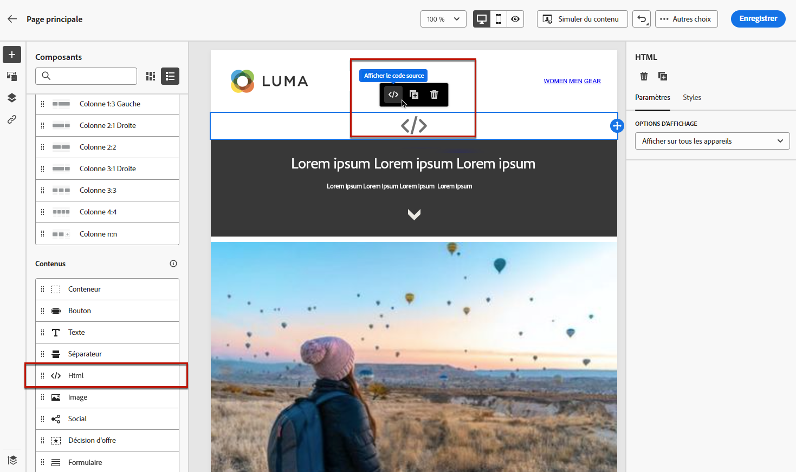

# Utilisation de code JavaScript personnalisé dans une page de destination {#lp-custom-js}

Vous pouvez définir le contenu de votre page de destination à l&#39;aide d&#39;un code JavaScript personnalisé. Par exemple, si vous devez appliquer un style avancé ou si vous souhaitez ajouter des comportements personnalisés à vos pages de destination, vous pouvez créer vos propres contrôles et les exécuter dans [!DNL Journey Optimizer].

## Insertion du code JavaScript dans une page de destination

Pour insérer du code JavaScript personnalisé dans le contenu d’une page de destination, vous pouvez effectuer l’une des opérations suivantes :

* Importez le contenu du HTML existant lorsque vous commencez à créer votre contenu, puis sélectionnez le fichier contenant votre code JavaScript personnalisé. Découvrez comment importer du contenu [dans cette section](../design/existing-content.md).

* Concevez votre page de destination à partir de zéro ou d&#39;un modèle enregistré. Effectuez un glisser-déposer du composant de contenu **[!UICONTROL HTML]** dans la zone de travail et affichez le code source pour ajouter votre JavaScript dans le composant. Découvrez comment utiliser le composant HTML dans [cette section](../design/content-components.md#HTML). <!--You can also simply switch the whole landing page content to code view and enter or paste your JavaScript code.-->

   

* Saisissez ou collez du code JavaScript directement dans le concepteur de contenu. Découvrez comment coder votre propre contenu [dans cette section](../design/code-content.md).

>[!NOTE]
>
>Actuellement, vous ne pouvez pas afficher JavaScript en action lors de l’[aperçu de la page de destination](create-lp.md#test-landing-page).

Pour que la page de destination s&#39;affiche correctement, utilisez la syntaxe suivante, comme décrit dans les sections ci-dessous.

## Initialisation du code

Pour initialiser votre code JavaScript, vous devez utiliser l’événement `lpRuntimeReady`. Cet événement sera déclenché après l’initialisation réussie de la bibliothèque. Le rappel est exécuté avec l’objet `lpRuntime` pour exposer la méthode et les points d’extension de la bibliothèque.

`LpRuntime` signifie « Landing page Runtime ». Cet objet est l’identifiant de bibliothèque principal. Il expose les points d’extension, les méthodes d’envoi de formulaire et d’autres méthodes d’utilitaire pouvant être utilisées dans du code JavaScript personnalisé.

**Exemple :**

```
if(window.lpRuntime){
    init(window.lpRuntime);
}else{
    window.addEventListener('lpRuntimeReady',function(e){
        init(e.detail);
    });
}
 
function init(lpRuntime){
    // Enter custom JavaScript here using methods from lpRuntime.
}
```

## Les points d&#39;extension

Les points d’extension permettent de joindre une méthode pendant le cycle de vie de l’envoi du formulaire. Par exemple, vous pouvez utiliser des points d’extension pour effectuer une validation de formulaire avant que le formulaire ne soit réellement envoyé.

Voici les points d’extension que vous pouvez utiliser :

| Nom | Description |
|--- |--- |
| addBeforeSubmitHook | Extension personnalisée à appeler avant envoi du formulaire. Renvoie &quot;true&quot; pour poursuivre l’envoi, sinon renvoie &quot;false&quot; pour bloquer l’envoi. |
| addOnFailureHook | Extension personnalisée à appeler lors de l’échec de l’envoi du formulaire. |
| addOnSuccessHook | Extension personnalisée à appeler lors de l’envoi réussi du formulaire. |

**Exemple :**

```
//LpRuntime hooks
lpRuntime.hooks.addBeforeSubmitHook(function(){
    // Add your validation logic here.
});
```

## Envoi de formulaire personnalisé

Les méthodes répertoriées ci-dessous sont utilisées pour effectuer des envois de formulaire personnalisés.

>[!NOTE]
>
>Comme l’envoi du formulaire est géré par JavaScript personnalisé, l’envoi par défaut doit être désactivé explicitement en définissant une variable globale `disableDefaultFormSubmission` à `true`.

| Nom | Description |
|--- |--- |
| submitForm | Cette méthode envoie le formulaire et gère le flux de post-envoi. |
| submitFormPartial | Cette méthode envoie également le formulaire, mais ignore le flux de post-envoi. Par exemple, si vous avez configuré la redirection vers la page de succès après l’envoi réussi, cette redirection ne se produira pas en cas d’envoi partiel du formulaire. |

**Exemples :**

```
//LpRuntime methods
window.disableDefaultFormSubmission = true        // Flag to disable the default submission flow.
 
lpRuntime.submitForm(formSubmissionData);         // This will trigger the default form submission handling like redirecting to error or success page.
  
lpRuntime.submitFormPartial(formSubmissionData,{   // This will not trigger the default submission handling.
    beforeSubmit : callback,
    onFailure : failureCallback,                   // Custom onFailureCallback - will be used in partial submission of form.
    onSuccess : successCallback                    // Custom onSuccessCallback - will be used in partial submission of form.
})
```

## Fonction utilitaire

| Nom | Description |
|--- |--- |
| getFormData | Cette méthode peut être utilisée pour obtenir la variable `formData` sous la forme d’un objet JSON. Cet objet peut être transmis à `submitForm` pour l’envoi du formulaire. |

**Exemple :**

```
let formData = lpRuntime.getFormData();                           // Method to generate formdata
 
lpRuntime.submitForm(formData);
```

## Cas dʼutilisation

### Cas d’utilisation 1 : ajout de la validation avant l’envoi du formulaire

```
<html>
<body>
// Enter HTML body here.
  
<script>
        if(window.lpRuntime){
          console.log('got runtime',lpRuntime);
          init(window.lpRuntime);
        }else{
          window.addEventListener('lpRuntimeReady',function(e){
            init(window.lpRuntime);
          });
        }
        
  
      // Here validate the function is checking if the checkbox is selected. This method should return true if you want form submission.
      function validateForm(){
        return document.querySelector('.spectrum-Checkbox-input').checked;
      }    
  
      function init(lpRuntime){
          lpRuntime.hooks.addBeforeSubmitHook(function(){
              return validateForm(); // This method should return true if you want to proceed with submission.
          })
      }
  
</script>  
  
</body>
</html>
```

### Cas d’utilisation 2 : envoi partiel du formulaire

Par exemple, vous disposez d’un formulaire avec plusieurs cases à cocher sur la page. Lorsque vous cochez une case, vous souhaitez que ces données soient enregistrées sur le serveur principal sans attendre que l’utilisateur clique sur le bouton d’envoi.

```
<html>
<body>
    <form>
        <input type='checkbox' value="1" name="name1"/>
        <input type='checkbox' value="2" name="name2"/>
        <input type='checkbox' value="3" name="name3"/>
        <input type='checkbox' value="4" name="name4"/>
    </form>
  
<script>
      window.disableDefaultFormSubmission=true;
 
      window.addEventListener('lpRuntimeReady',function(e){        
        init(e.detail)
      }
 
     function init(lpRuntime){
        window.getElementByTagName('input').addEventListener('change',function(e){
            let formData = lpRuntime.getFormData();
            lpRuntime.submitFormPartial(formData);
        })
      }
    </script>
  
</body>
</html>
```

### Cas d’utilisation 3 : balises d’analyse personnalisées

Avec JavaScript, vous pouvez ajouter des écouteurs de champs de saisie et joindre un déclencheur d’appel Analytics personnalisé.

```
<html>
<body>
    <form>
        <input type='checkbox' value="1" name="name1"/>
        <input type='checkbox' value="2" name="name2"/>
        <input type='checkbox' value="3" name="name3"/>
        <input type='checkbox' value="4" name="name4"/>
    </form>
  
<script>
      window.disableDefaultFormSubmission=false;  
 
      window.addEventListener('lpRuntimeReady',function(e){        
        init(e.detail)
      }
 
     function init(lpRuntime){
         window.getElementByTagName('input').addEventListener('change',function(e){
            //trigger analytics events
        })
      }
        
    </script>
  
</body>
</html>
```

### Cas d’utilisation 4 : formulaire dynamique

```
<html>
<body>
    <form>
        <input type='checkbox' value="1" name="name1"/>
        <div class="hiddenInput hidden">
            <input type='text' name="name2"/>
        </div>
    </form>
  
<script>
      window.disableDefaultFormSubmission=false;     
 
      window.addEventListener('lpRuntimeReady',function(e){        
        init(e.detail)
      }
 
      function init(lpRuntime){
        window.getElementByTagName('input').addEventListener('change',function(e){
            document.querySelector('.hiddenInput').toggleClass('hidden');
        })
      }
        
    </script>
  
</body>
</html>
```
