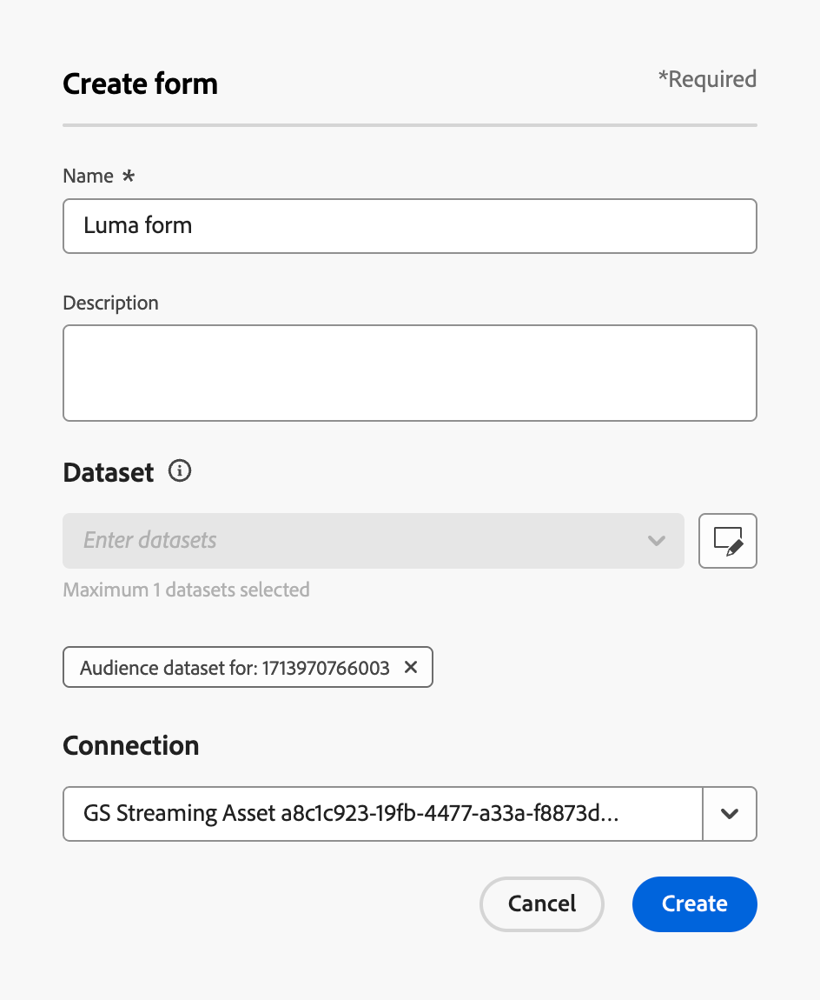

# Utilisation de formulaires dans vos pages de destination {#lp-forms}

>[!AVAILABILITY]
>
>Cette fonctionnalité est en disponibilité limitée. Contactez votre représentant ou représentante Adobe pour en obtenir l’accès.

Pour capturer des données de profil avec vos pages de destination [!DNL Journey Optimizer] et enrichir vos jeux de données [!DNL Experience Platform], vous pouvez utiliser des formulaires dans vos pages de destination.

## Création d’un paramètre prédéfini de formulaire {#create-form-preset}

>[!CONTEXTUALHELP]
>id="ajo_lp_form_connection"
>title="Sélectionner le point d’entrée à utiliser"
>abstract="Définissez le point d’entrée de diffusion en continu où les données sont envoyées lors de l’envoi du formulaire."
>additional-url="https://experienceleague.adobe.com/en/docs/experience-platform/sources/ui-tutorials/create/streaming/http" text="Créer une connexion en continu d’API HTTP"

>[!CONTEXTUALHELP]
>id="ajo_lp_form_dataset"
>title="Sélectionner un jeu de données"
>abstract="Définissez un jeu de données dans lequel les réponses du formulaire seront stockées et reflétées. Vous pouvez saisir pour rechercher un jeu de données spécifique ou le sélectionner dans la liste."

Avant de pouvoir créer un formulaire, vous devez créer un préréglage dédié où vous sélectionnez le point d’entrée de connexion où les données d’envoi du formulaire sont envoyées et le jeu de données où les données capturées par le biais du formulaire seront stockées.

Lorsque des données arrivent sur le point d’entrée de diffusion en continu, elles sont liées aux informations du jeu de données. À l’aide des connexions source/cible générées et du flux source, les données sont ensuite intégrées au jeu de données.

Lors de la création d’un paramètre prédéfini :

* Vous pouvez configurer plusieurs préréglages à l’aide de différentes combinaisons de jeux de données et de connexions en continu.
* Le même jeu de données ou la même connexion en continu peut être réutilisé sur plusieurs paramètres prédéfinis.
* Chaque connexion en continu génère automatiquement des ressources telles que :
   * **Connexion Source** - d&#39;où proviennent les données.
   * **Connexion cible** - emplacement de stockage ou d’utilisation des données.
   * **flux Source** - pipeline qui déplace les données de la connexion source vers [!DNL Experience Platform], gérant le mappage, la transformation et la validation.

>[!NOTE]
>
> Pour accéder aux paramètres prédéfinis de formulaire et les modifier, vous devez disposer de l’autorisation **[!UICONTROL Gérer les paramètres prédéfinis de formulaire]** dans le sandbox de production. En savoir plus sur les autorisations dans [cette section](../administration/high-low-permissions.md#administration-permissions).<!--TBC-->

1. Pour accéder à l’inventaire **[!UICONTROL Préréglages de formulaire]**, sélectionnez **[!UICONTROL Administration]** > **[!UICONTROL Canaux]** >**[!UICONTROL Paramètres de formulaire]** dans le menu de gauche.

1. Cliquez sur **[!UICONTROL Créer un paramètre prédéfini de formulaire]**.

1. Mettez à jour le nom pour le récupérer plus facilement et ajoutez une description si nécessaire.

   {width=80%}

1. Sélectionnez la **[!UICONTROL Connexion en continu]** à utiliser pour ce formulaire. Il s’agit du point d’entrée de diffusion en continu où les données sont envoyées lors de l’envoi du formulaire.

   >[!NOTE]
   >
   >Pour en savoir plus sur la création d’une connexion source par flux, consultez la documentation d’[Experience Platform](https://experienceleague.adobe.com/en/docs/experience-platform/sources/ui-tutorials/create/streaming/http){target="_blank"}.

1. Sélectionnez un **[!UICONTROL Jeu de données]** à lier au formulaire. C’est là que les réponses au formulaire seront stockées et reflétées. Vous pouvez saisir pour rechercher un jeu de données spécifique ou le sélectionner dans la liste.

   >[!NOTE]
   >
   >Actuellement, seuls [!DNL Adobe Experience Platform] jeux de données peuvent être sélectionnés. Un seul jeu de données peut être sélectionné à la fois.

1. Cliquez sur **[!UICONTROL Publier]**. Votre paramètre prédéfini est maintenant prêt à être utilisé dans un formulaire.

## Accéder aux formulaires et les gérer {#access-forms}

Pour accéder à la liste des formulaires, sélectionnez **[!UICONTROL Gestion de contenu]** > **[!UICONTROL Forms]** dans le menu de gauche.

Tous les formulaires existants s’affichent. Vous pouvez filtrer les formulaires en fonction de leur statut, de leur date de création ou de modification.

## Création et conception d’un formulaire {#create-form}

>[!CONTEXTUALHELP]
>id="ajo_lp_form_preset"
>title="Sélection d’un paramètre prédéfini"
>abstract="Sélectionnez un paramètre prédéfini qui contient la connexion à utiliser et un jeu de données prédéfini pour votre formulaire."
>additional-url="https://experienceleague.adobe.com/en/docs/journey-optimizer/using/content-management/landing-pages/lp-forms#create-form-preset" text="Création d’un paramètre prédéfini de formulaire"

Pour créer un formulaire, procédez comme suit.

1. Dans la liste **[!UICONTROL Forms]**, cliquez sur **[!UICONTROL Créer un formulaire]**.

1. Ajoutez un nom. Si nécessaire, vous pouvez ajouter une description.

   

1. Sélectionnez un **[!UICONTROL Paramètre prédéfini]** qui contient la connexion à utiliser et un jeu de données prédéfini pour votre formulaire. [Découvrez comment créer un paramètre prédéfini de formulaire](#create-form-preset)

1. Cliquez sur **[!UICONTROL Créer]**.

   <!--{width=50%}-->

1. Le concepteur de formulaire s’ouvre. Ajoutez [composants](../email/content-components.md#add-content-components) pour créer le contenu de votre formulaire. Vous pouvez utiliser les composants [Texte](../email/content-components.md#text) et **[!UICONTROL Champ]**.

1. Avec le composant **[!UICONTROL Champ]**, vous pouvez sélectionner des attributs en fonction du schéma du jeu de données sélectionné.

   >[!NOTE]
   >
   >Pour mapper les données collectées avec un profil, sélectionnez un champ d’identité de profil. Pour identifier les champs d’identité de la liste des attributs, recherchez les champs marqués comme **[!UICONTROL Obligatoire]**.<!--Explain-->

   Par exemple, vous pouvez définir l’adresse e-mail et l’ID de personne. Lorsque les utilisateurs renseignent ces champs, les informations saisies sont enregistrées dans le jeu de données sélectionné.

   

1. Vous pouvez spécifier chaque **[!UICONTROL Détails du champ]** tels que des instructions, une valeur par défaut, un message de validation, une longueur maximale, etc.

   

1. Vous pouvez ajuster la disposition, le style et les dimensions du formulaire selon vos besoins à l’aide du volet **[!UICONTROL Styles]**. [En savoir plus sur le style](../email/get-started-email-style.md)

1. Cliquez sur **[!UICONTROL Enregistrer et fermer]**.

1. Configurez la page de remerciement. [Voici comment procéder](#thank-you-page)

1. **[!UICONTROL Publier]** le formulaire pour qu’il puisse être sélectionné dans les pages de destination.

### Configuration de la page de remerciement {#thank-you-page}

>[!CONTEXTUALHELP]
>id="ajo_lp_forms_thankyou_page"
>title="Page de remerciement"
>abstract="Configurez ce qui se produit lorsqu’une personne remplit ou transfère le formulaire."

Dans la section **[!UICONTROL Page de remerciement]**, configurez ce qui se passe lorsqu’un utilisateur remplit le formulaire.

{width=70%}

Configurez l’une des actions suivantes :

* **[!UICONTROL Rester sur la page]** - Cette option permet de conserver le visiteur sur la même page après l’envoi du formulaire.
* **[!UICONTROL Page de destination]** - Sélectionnez une [page de destination](create-lp.md) publiée vers laquelle l’utilisateur est redirigé après l’envoi du formulaire.
* **[!UICONTROL URL externe]** - Saisissez l’URL complète souhaitée comme page de suivi. Une fois que l’utilisateur a envoyé le formulaire, il est redirigé vers l’URL spécifiée.
* **[!UICONTROL Redirection conditionnelle]** - Configurez des règles pour afficher de manière dynamique différentes actions de suivi en fonction des réponses du formulaire.

  Vous pouvez définir une règle pour chaque audience spécifique. Par exemple, vous pouvez afficher une page de destination spécifique pour les résidents des États-Unis, une autre page pour les résidents du Canada, etc. Enfin, configurez une action par défaut pour les utilisateurs qui n’appartiennent à aucune des règles que vous avez définies.

  >[!NOTE]
  >
  >Les conditions définies dans une règle sont lues de manière séquentielle.

  {width=40%}

## Utiliser le formulaire dans une page de destination {#leverage-form-in-lp}

Vous pouvez désormais incorporer ce formulaire dans une page de destination afin de capturer les données correspondant aux attributs que vous avez définis dans le formulaire et de les enregistrer dans le jeu de données sélectionné. Suivez les étapes ci-après.

1. Créez une landing page. [Voici comment procéder](create-lp.md#create-landing-page)

1. Sélectionnez **[!UICONTROL Capture de données]** comme type de page de destination, puis cliquez sur **[!UICONTROL Créer]**.

   {width=65%}

1. Configurez la page principale. [Voici comment procéder](create-lp.md#configure-primary-page)

1. Ouvrez le [ concepteur de page de destination ](design-lp.md).

1. Effectuez un glisser-déposer d’un **[!UICONTROL composant de structure]** dans votre contenu. Faites glisser et déposez un composant **[!UICONTROL Form]** dans cette structure.

   >[!NOTE]
   >
   >Seuls les formulaires publiés peuvent être sélectionnés dans une page de destination.

1. Dans la section **[!UICONTROL Incorporer le formulaire]**, sélectionnez le formulaire que vous avez créé.

   

   >[!NOTE]
   >
   >Vous pouvez mettre à jour le formulaire sélectionné à l’aide du bouton **[!UICONTROL Modifier le formulaire]**. Le formulaire s’ouvre dans un nouvel onglet. Les étapes de modification du contenu du formulaire sont identiques à celles décrites dans [cette section](#create-form).

1. Dans la section **[!UICONTROL Type de suivi]**, configurez ce qui se passe lorsqu’un utilisateur remplit le formulaire :

   * Choisissez **[!UICONTROL Formulaire défini]** pour sélectionner l’action définie dans le formulaire incorporé. [En savoir plus](#thank-you-page)

   * Vous pouvez également sélectionner une [page de destination](create-lp.md) publiée vers laquelle l’utilisateur sera redirigé après l’envoi du formulaire.

   * Vous pouvez également définir une **[!UICONTROL URL externe]** comme page de relance dans laquelle les utilisateurs sont redirigés lorsqu’ils envoient le formulaire.

1. Enregistrez et testez votre page de destination. [Voici comment procéder](create-lp.md#test-landing-page)

Une fois votre page de destination [publiée](create-lp.md#publish-landing-page) et utilisée dans un parcours, lorsque les utilisateurs remplissent le formulaire, les informations saisies sont ingérées dans le jeu de données sélectionné.

>[!NOTE]
>
>Si vous dépubliez un formulaire utilisé dans une page de destination, modifiez ce formulaire et publiez-le à nouveau, la page de destination utilise toujours la dernière version publiée du formulaire.
