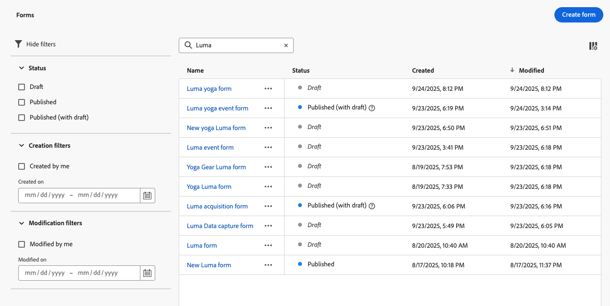
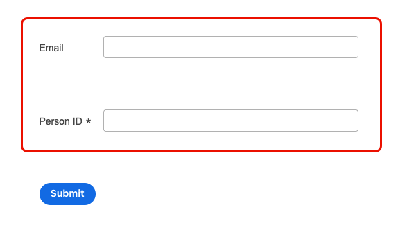
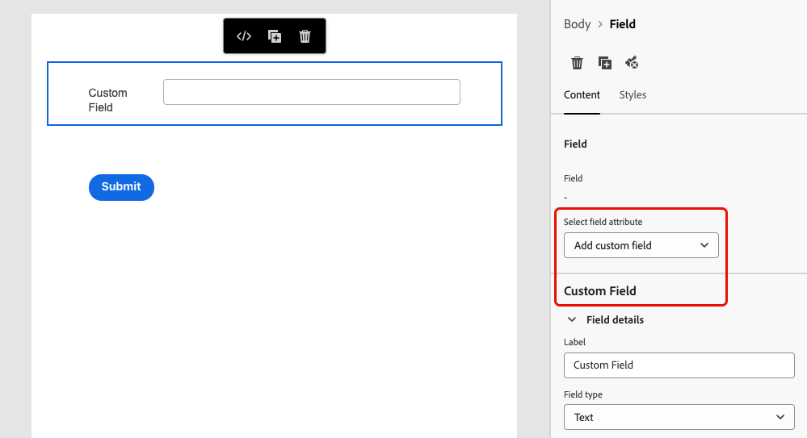

# Utiliser des formulaires dans vos pages de destination {#lp-forms}

>[!AVAILABILITY]
>
>Cette fonctionnalité est actuellement en disponibilité limitée pour les personnes situées aux États-Unis et en Australie. Contactez votre représentant ou représentante Adobe pour en bénéficier.

Pour capturer des données de profil avec vos pages de destination [!DNL Journey Optimizer] et enrichir vos jeux de données [!DNL Experience Platform], vous pouvez utiliser des formulaires dans vos pages de destination.

## Créer un préréglage de formulaire {#create-form-preset}

>[!CONTEXTUALHELP]
>id="ajo_lp_form_connection"
>title="Sélectionner le point d’entrée à utiliser"
>abstract="Définissez le point d&#39;entrée de streaming où les données sont envoyées lors de l’envoi du formulaire."
>additional-url="https://experienceleague.adobe.com/fr/docs/experience-platform/sources/ui-tutorials/create/streaming/http" text="Créer une connexion de streaming d’API HTTP"

>[!CONTEXTUALHELP]
>id="ajo_lp_form_dataset"
>title="Sélectionner un jeu de données"
>abstract="Définissez un jeu de données dans lequel les réponses du formulaire seront stockées et reflétées. Vous pouvez saisir du texte pour rechercher un jeu de données spécifique ou le sélectionner dans la liste."

Avant de pouvoir créer un formulaire, vous devez définir un paramètre prédéfini dédié où vous sélectionnez le point d’entrée de connexion où les données d’envoi du formulaire sont envoyées et le jeu de données où les données capturées par le biais du formulaire seront stockées.

Une fois les données sur le point d’entrée de streaming, celles-ci sont liées aux informations du jeu de données. À l’aide des connexions source/cible générées et du flux source, les données sont ensuite intégrées au jeu de données.

Lors de la création d’un paramètre prédéfini :

* Vous pouvez configurer plusieurs préréglages à l’aide de différentes combinaisons de jeux de données et de connexions en streaming.
* Le même jeu de données ou la même connexion en streaming peut être réutilisé sur plusieurs paramètres prédéfinis.
* Chaque connexion en streaming génère automatiquement des ressources :
   * **Connexion Source** - emplacement d’où proviennent les données.
   * **Connexion cible** - emplacement de stockage ou d’utilisation des données.
   * **Flux source** - pipeline qui déplace les données de la connexion source vers [!DNL Experience Platform], gérant le mappage, la transformation et la validation.

<!--
>[!NOTE]
>
> To access and edit form presets, you must have the **[!UICONTROL Manage form presets]** permission on the production sandbox. Learn more about permissions in [this section](../administration/high-low-permissions.md#administration-permissions).TBC
-->

Pour créer un préréglage de formulaire, suivez les étapes ci-dessous.

1. Pour accéder à l’inventaire **[!UICONTROL Paramètres prédéfinis de formulaire]**, sélectionnez **[!UICONTROL Administration]** > **[!UICONTROL Canaux]** > **[!UICONTROL Paramètres de formulaire]** dans le menu de gauche.

1. Cliquez sur **[!UICONTROL Créer un paramètre prédéfini de formulaire]**.

1. Mettez à jour son nom pour le récupérer plus facilement et ajoutez une description si nécessaire.

   {width=80%}

1. Sélectionnez la **[!UICONTROL connexion en streaming]** à utiliser pour ce formulaire. Il s’agit du point d’entrée en streaming où les données sont envoyées lors de l’envoi du formulaire.

   Pour en savoir plus sur la création d’une connexion source en streaming, consultez la [documentation d’Experience Platform](https://experienceleague.adobe.com/fr/docs/experience-platform/sources/ui-tutorials/create/streaming/http){target="_blank"}.

   >[!IMPORTANT]
   >
   >Pour qu’une connexion en streaming d’API HTTP s’affiche dans la liste déroulante, elle doit répondre aux exigences suivantes lorsqu’elle est créée dans Adobe Experience Platform :
   >
   >* **Type de données** doit être défini sur **XDM** (et non sur Données brutes).
   >* **Authentification** doit être défini sur **désactivée** (connexion non authentifiée).
   >
   >Si votre connexion en streaming n’apparaît pas dans la liste, vérifiez que ces deux conditions sont remplies. <!--Learn how to [create a non-authenticated connection with XDM data type](https://experienceleague.adobe.com/fr/docs/experience-platform/sources/ui-tutorials/create/streaming/http#create-a-streaming-connection){target="_blank"}.-->

1. Sélectionnez un **[!UICONTROL jeu de données]** à lier au formulaire. C’est là que les réponses au formulaire seront stockées et reflétées. Vous pouvez saisir du texte pour rechercher un jeu de données spécifique ou le sélectionner dans la liste.

   >[!NOTE]
   >
   >Actuellement, seuls les jeux de données **activés pour Profil** et **non activés pour Profil** [!DNL Adobe Experience Platform] peuvent être sélectionnés. Un seul jeu de données peut être sélectionné à la fois. Les jeux de données système ne peuvent pas être utilisés pour enregistrer les données de formulaire. [En savoir plus sur les jeux de données](../data/get-started-datasets.md)

1. Cliquez sur **[!UICONTROL Publier]**. Votre paramètre prédéfini peut maintenant être utilisé dans un formulaire.

## Accéder aux formulaires et les gérer {#access-forms}

Pour accéder à la liste des formulaires, sélectionnez **[!UICONTROL Gestion de contenu]** > **[!UICONTROL Formulaires]** dans le menu de gauche.

Tous les formulaires existants s’affichent. Vous pouvez les filtrer selon leur état, mais aussi selon leur date de création ou de modification.

## Créer et concevoir un formulaire {#create-form}

>[!CONTEXTUALHELP]
>id="ajo_lp_form_preset"
>title="Sélectionner un paramètre prédéfini"
>abstract="Sélectionnez un paramètre prédéfini qui contient la connexion à utiliser et un jeu de données prédéfini pour votre formulaire."
>additional-url="https://experienceleague.adobe.com/fr/docs/journey-optimizer/using/content-management/landing-pages/lp-forms#create-form-preset" text="Créer un préréglage de formulaire"

Pour créer un formulaire, suivez les étapes ci-dessous.

1. Dans la liste **[!UICONTROL Formulaires]**, cliquez sur **[!UICONTROL Créer un formulaire]**.

1. Ajoutez un nom. Si nécessaire, vous pouvez ajouter une description.

   

1. Sélectionnez un **[!UICONTROL paramètre prédéfini]** qui contient la connexion à utiliser et un jeu de données prédéfini pour votre formulaire. [Découvrez comment créer un paramètre prédéfini de formulaire](#create-form-preset)

1. Cliquez sur **[!UICONTROL Créer]**. Le concepteur de formulaire s’ouvre, ce qui vous permet d’ajouter des structures et des [composants](../email/content-components.md#add-content-components) pour créer votre contenu. Vous pouvez utiliser les composants [Texte](../email/content-components.md#text) et **[!UICONTROL Champ]**.

1. Pour capturer les données et les attributs de profil, ajoutez des champs spécifiques à votre formulaire. [En savoir plus](#define-fields)

1. Configurez et concevez ces champs. [En savoir plus](#configure-fields)

1. Vous pouvez ajuster la disposition, le style et les dimensions du formulaire selon vos besoins à l’aide du volet **[!UICONTROL Styles]**. [En savoir plus sur le style](../email/get-started-email-style.md)

1. Une fois tous les champs configurés, cliquez sur **[!UICONTROL Enregistrer et fermer]**.

1. Configurez la page Remerciements. [Voici comment procéder](#thank-you-page)

1. **[!UICONTROL Publiez]** le formulaire pour qu’il puisse être sélectionné dans les pages de destination.

### Définir des champs spécifiques {#define-fields}

Pour ajouter des champs spécifiques à votre formulaire, faites glisser et déposez une structure dans la zone de travail, puis faites glisser un composant **[!UICONTROL Champ]** à l’intérieur.<!--**[!UICONTROL Select field attribute]** or **[!UICONTROL Add custom field]**.-->

Puis, sélectionnez l’une des options suivantes :

>[!BEGINTABS]

>[!TAB Sélectionner un attribut de champ]

Utilisez cette option pour sélectionner un attribut en fonction du schéma du jeu de données lié à votre formulaire.

>[!NOTE]
>
>Le jeu de données est défini dans le paramètre prédéfini sélectionné pour votre formulaire. [En savoir plus](#create-form-preset)

{width=100%}

Par exemple, vous pouvez définir l’adresse e-mail et l’ID de personne. Lorsque les utilisateurs ou les utilisatrices renseignent ces champs, les informations saisies sont enregistrées dans le jeu de données sélectionné.

{width=55%}

Pour mapper les données collectées avec un profil, sélectionnez un champ d’identité de profil. Les champs d’identité sont marqués comme **[!UICONTROL Obligatoires]** dans la liste des attributs. Vous pouvez les filtrer.

{width=65%}

>[!TAB Ajouter un champ personnalisé]

Avec cette option, vous pouvez simplement définir un champ libre sans le mapper à un champ du jeu de données lié.

{width=85%}

>[!ENDTABS]

### Configurer et concevoir un champ {#configure-fields}

Une fois que vous avez sélectionné un attribut de champ ou ajouté un champ personnalisé, vous pouvez ajuster ses détails ainsi que son comportement lors de l’envoi du formulaire.

1. Dans la section **[!UICONTROL Détails du champ]** de l’onglet **[!UICONTROL Contenu]** à droite, vous pouvez spécifier les éléments suivants selon vos besoins :

   * Définissez le **[!UICONTROL Libellé]** pour le rendre clair pour les destinataires de votre formulaire.
   * Modifiez le **[!UICONTROL type de champ]** selon vos besoins. Il peut s’agir d’une case à cocher, d’une devise, d’une date, d’un curseur, d’une URL, etc.

     >[!NOTE]
     >
     >Les autres détails de champ peuvent varier en fonction du type de champ sélectionné.

   * Ajoutez un **[!UICONTROL espace réservé]**.<!--To explain-->
   * Spécifiez des **[!UICONTROL instructions]**.<!--How will they be displayed in the form? To explain-->
   * Saisissez une **[!UICONTROL valeur par défaut]** qui s’affichera avant que les utilisateurs et les utilisatrices de votre formulaire ne remplissent le champ.
   * Vous pouvez définir un **[!UICONTROL message de validation]** personnalisé.
   * Définissez une **[!UICONTROL longueur maximale]**. Un message d’erreur s’affiche si les destinataires du formulaire dépassent la limite lors du remplissage du champ.

   {width=85%}

1. Dans la section **[!UICONTROL Comportements de champ]**, vous pouvez définir les éléments suivants :

   * Sélectionnez **[!UICONTROL Obligatoire]** pour rendre ce champ obligatoire. Si les utilisateurs et les utilisatrices ne remplissent pas le champ, le formulaire n’est pas envoyé.
   * Sélectionnez **[!UICONTROL Sensible]** pour que le champ soit sensible à la casse.<!--To confirm - do you mean retain capitalization when added to the dataset?-->
   * Sélectionnez **[!UICONTROL Préremplissage activé]** pour renseigner le champ à partir des informations de profil, le cas échéant.<!--Even for a custom field, or a field not mapped to a profile? What happens if no data is available?-->
   * Sélectionnez **[!UICONTROL Activer le masque de saisie]** pour remplacer les entrées des utilisateurs et des utilisatrices par des caractères génériques. Vous pouvez utiliser *9* pour signifier n’importe quel nombre, *a* pour signifier n’importe quelle lettre ou * pour signifier n’importe quel nombre ou lettre.<!--Not sure how you define that in the form-->

   {width=75%}

### Configurer la page Remerciements {#thank-you-page}

>[!CONTEXTUALHELP]
>id="ajo_lp_forms_thankyou_page"
>title="Page de remerciements"
>abstract="Configurez ce qui se produit lorsqu’une personne remplit ou transfère le formulaire."

De nouveau dans les détails du formulaire, dans la section **[!UICONTROL Page de remerciements]**, configurez ce qui se passe lorsqu’un utilisateur ou une utilisatrice remplit le formulaire.

Configurez l’une des actions suivantes :

* **[!UICONTROL Rester sur la page]** - cette option permet de conserver la personne sur la même page après l’envoi du formulaire.
* **[!UICONTROL Page de destination]** - sélectionnez une [page de destination](create-lp.md) publiée vers laquelle la personne est redirigée après l’envoi du formulaire.
* **[!UICONTROL URL externe]** - saisissez l’URL complète souhaitée comme page de suivi. Une fois que la personne a envoyé le formulaire, celle-ci est redirigée vers l’URL spécifiée.
* **[!UICONTROL Redirection conditionnelle]** - configurez des règles pour afficher de manière dynamique différentes actions de suivi en fonction des réponses du formulaire.

  Vous pouvez définir une règle pour chaque audience spécifique. Par exemple, vous pouvez afficher une page de destination spécifique pour les personnes vivant aux États-Unis, une autre pour les personnes vivant au Canada, etc. Enfin, configurez une action par défaut pour les utilisateurs et les utilisatrices qui n’appartiennent à aucune des règles que vous avez définies.

  >[!NOTE]
  >
  >Les conditions définies dans une règle sont lues de manière séquentielle.

  {width=40%}

## Modifier un formulaire publié {#edit-form}

Une fois qu’un formulaire est publié, vous pouvez toujours le modifier. Suivez les étapes ci-après.

1. Accédez à la [liste des formulaires](#access-forms) et sélectionnez un formulaire publié.

1. Cliquez sur le bouton **[!UICONTROL Modifier le formulaire]**.

   {width=90%}

1. Une nouvelle version du formulaire est créée avec le statut brouillon. Cliquez sur **[!UICONTROL Créer un brouillon]**.

1. Mettez le formulaire à jour selon vos besoins et cliquez sur **[!UICONTROL Enregistrer]**. Le formulaire a maintenant le statut **[!UICONTROL Publié (avec brouillon)]** :

   * La version actuelle conserve le statut **[!UICONTROL Publié]** jusqu’à ce que vous publiiez la version mise à jour.

   * La version mise à jour a le statut **[!UICONTROL Brouillon]**.

1. Dans le résumé du formulaire, vous pouvez naviguer entre les deux versions du formulaire.

   {width=70%}

1. Dans la section **[!UICONTROL Brouillon]**, vous pouvez publier ou ignorer le brouillon, mais aussi modifier les détails ou le contenu du formulaire.

   {width=75%}

## Utiliser le formulaire dans une page de destination {#leverage-form-in-lp}

Vous pouvez désormais intégrer ce formulaire à une page de destination afin de capturer les données correspondant aux attributs que vous avez définis dans le formulaire et de les enregistrer dans le jeu de données sélectionné. Suivez les étapes ci-après.

1. Créez une page de destination. [Voici comment procéder](create-lp.md#create-landing-page)

1. Sélectionnez **[!UICONTROL Capture de données]** comme type de page de destination, puis cliquez sur **[!UICONTROL Créer]**.

   {width=65%}

1. Configurez la page principale. [Voici comment procéder](create-lp.md#configure-primary-page)

1. Ouvrez le [concepteur de page de destination](design-lp.md).

1. Faites glisser et déposez un **[!UICONTROL composant de structure]** dans votre contenu. Faites glisser et déposez un composant **[!UICONTROL Formulaire]** dans cette structure.

   >[!NOTE]
   >
   >Seuls les formulaires publiés peuvent être sélectionnés dans une page de destination.

1. Dans la section **[!UICONTROL Incorporer le formulaire]**, sélectionnez le formulaire que vous avez créé.

   

   >[!NOTE]
   >
   >Vous pouvez mettre à jour le formulaire sélectionné à l’aide du bouton **[!UICONTROL Modifier le formulaire]**. Le formulaire s’ouvre dans un nouvel onglet. Les étapes pour modifier le contenu du formulaire sont présentées dans [cette section](#create-form).

1. Dans la section **[!UICONTROL Type de suivi]**, configurez ce qui se passe lorsqu’un utilisateur ou une utilisatrice remplit le formulaire :

   * Choisissez **[!UICONTROL Formulaire défini]** pour sélectionner l’action définie dans le formulaire incorporé. [En savoir plus](#thank-you-page)

   * Vous pouvez également sélectionner une [page de destination](create-lp.md) publiée vers laquelle la personne sera redirigée après l’envoi du formulaire.

   * Vous pouvez également définir une **[!UICONTROL URL externe]** comme page de suivi vers laquelle les utilisateurs et utilisatrices sont redirigés lorsqu’ils envoient le formulaire.

1. Enregistrez et testez votre page de destination. [Voici comment procéder](create-lp.md#test-landing-page)

Une fois votre page de destination [publiée](create-lp.md#publish-landing-page) et utilisée dans un parcours, lorsque les utilisateurs et utilisatrices remplissent le formulaire, les informations saisies sont ingérées dans le jeu de données sélectionné.

>[!NOTE]
>
>Si vous dépubliez un formulaire utilisé dans une page de destination, modifiez ce formulaire et publiez-le à nouveau. La page de destination utilise toujours la dernière version publiée du formulaire.
