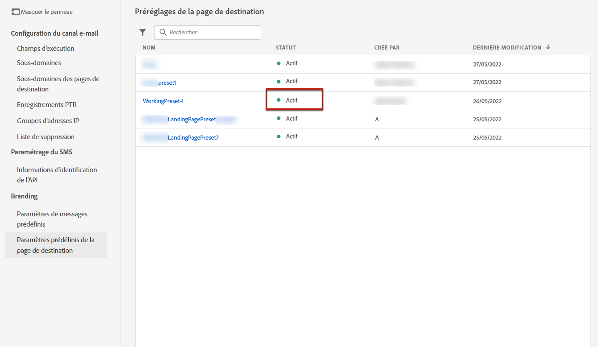

# Définition des paramètres prédéfinis de page d’entrée {#lp-presets}

>[!CONTEXTUALHELP]
>id="ajo_admin_config_lp_subdomain_header"
>title="Créer un paramètre prédéfini de landing page"
>abstract="Pour créer une landing page et l’exploiter via Journey Optimizer, vous devez créer un paramètre prédéfini de page d’entrée qui inclut le sous-domaine à utiliser."

When [création d&#39;une landing page](../landing-pages/create-lp.md#create-a-lp), vous devez sélectionner un paramètre prédéfini de page d’entrée pour pouvoir créer la page d’entrée et l’exploiter au moyen de la fonction **[!DNL Journey Optimizer]**.

## Accès aux paramètres prédéfinis de page d’entrée {#access-lp-presets}

Pour accéder aux paramètres prédéfinis de landing page, procédez comme suit.

1. Accédez au **[!UICONTROL Administration]** > **[!UICONTROL Channels]** .

1. Sélectionner **[!UICONTROL Branding]** > **[!UICONTROL Landing page presets]**.

   

1. Cliquez sur un libellé de paramètre prédéfini pour accéder aux détails du paramètre prédéfini de page d’entrée.

   

## Créer un paramètre prédéfini de landing page {#lp-create-preset}

Pour créer un paramètre prédéfini de page d’entrée, procédez comme suit.

>[!NOTE]
>
>Pour pouvoir créer un paramètre prédéfini, vérifiez que vous avez déjà configuré au moins un sous-domaine de landing page. [Découvrez comment](lp-subdomains.md)

1. Accédez au **[!UICONTROL Administration]** > **[!UICONTROL Channels]** , puis sélectionnez **[!UICONTROL Branding]** > **[!UICONTROL Landing page presets]**.

1. Sélectionner **[!UICONTROL Create landing page preset]**.

   

1. Saisissez un nom et une description pour le paramètre prédéfini.

   >[!NOTE]
   >
   > Les noms doivent commencer par une lettre (A-Z). Elle ne peut contenir que des caractères alphanumériques. Vous pouvez également utiliser des traits de soulignement. `_`, point`.` et trait d’union `-` caractères.

1. Sélectionnez un sous-domaine de landing page dans la liste déroulante.

   

   >[!NOTE]
   >
   >Pour pouvoir sélectionner un sous-domaine, vérifiez que vous avez déjà configuré au moins un sous-domaine de landing page. [Découvrez comment](#lp-subdomains)

   Les paramètres correspondant au sous-domaine sélectionné s’affichent.

1. Si vous souhaitez sélectionner le sous-domaine de la landing page pour l&#39;URL de tracking, cochez la case **[!UICONTROL Same as landing page subdomain]** . [En savoir plus sur le tracking](../email/message-tracking.md)

   

   Par exemple, si l’URL de la landing page est &quot;pages.mail.luma.com&quot; et que l’URL de tracking est &quot;data.mail.luma.com&quot;, vous pouvez choisir &quot;pages.mail.luma.com&quot; comme sous-domaine de tracking.

1. Cliquez sur **[!UICONTROL Submit]** pour confirmer la création du paramètre prédéfini de page d’entrée. <!--You can also save the preset as draft and resume its configuration later on.-->

   <!---->

1. Une fois le paramètre prédéfini de page d’entrée créé, il s’affiche dans la liste avec la variable **[!UICONTROL Active]** statut. Il est prêt à être utilisé pour vos landing pages.

   

Vous êtes maintenant prêt à [créer des landing pages ;](../landing-pages/create-lp.md) in [!DNL Journey Optimizer].
<!--
>[!NOTE]
>
>Learn how to create channel surfaces for push notifications and emails in [this section](channel-surfaces.md).-->

**Rubriques connexes**:

* [Prise en main des landing pages](../landing-pages/get-started-lp.md)
* [Créer une landing page](../landing-pages/create-lp.md#create-a-lp)
