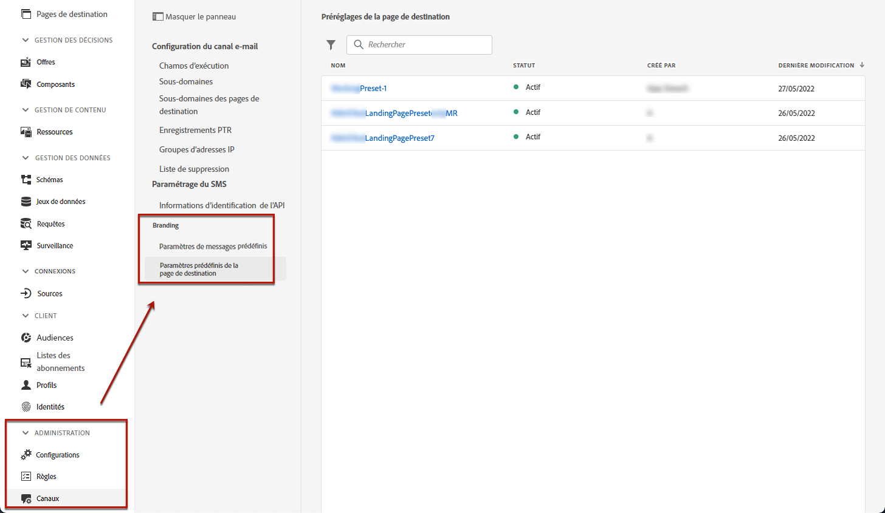
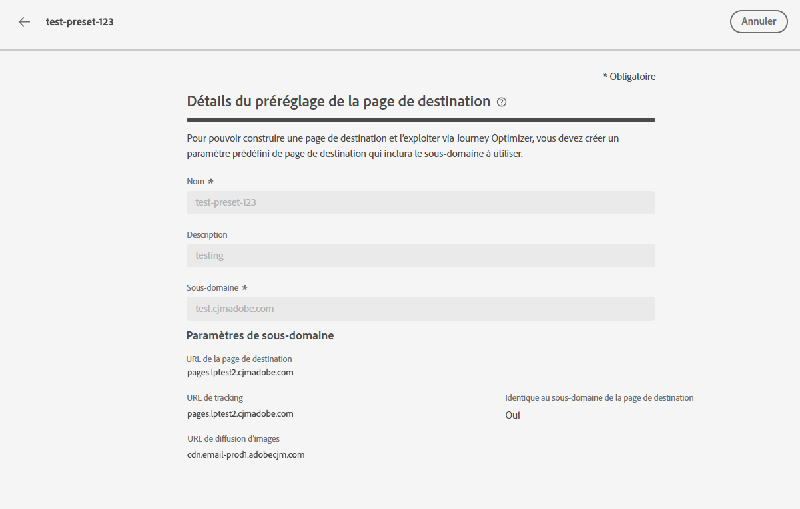
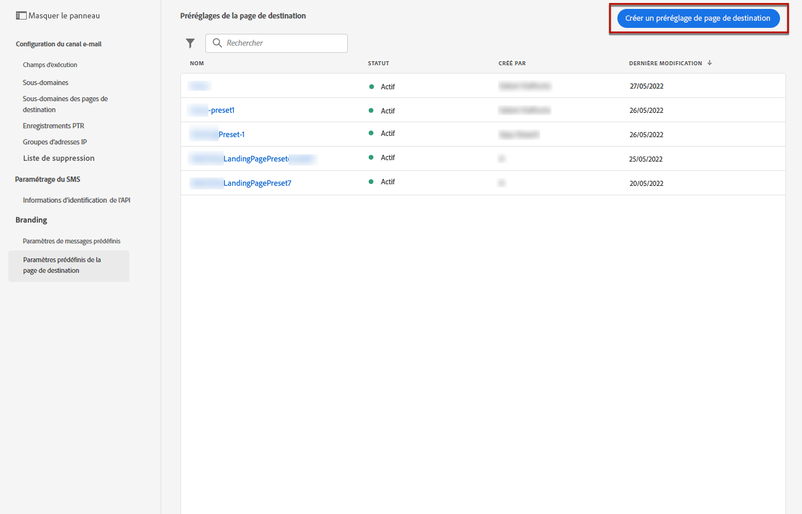
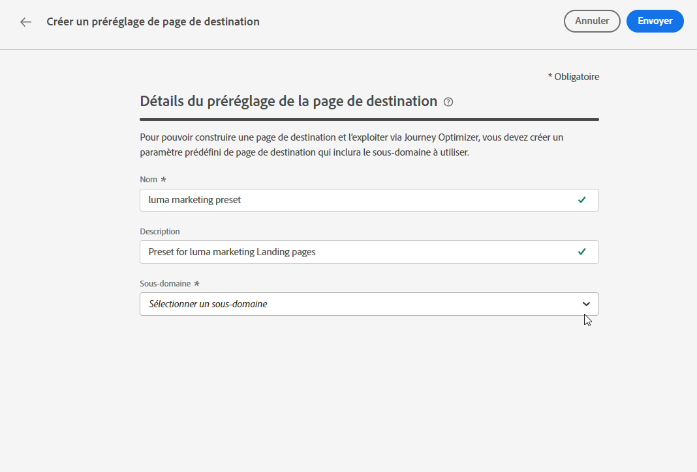
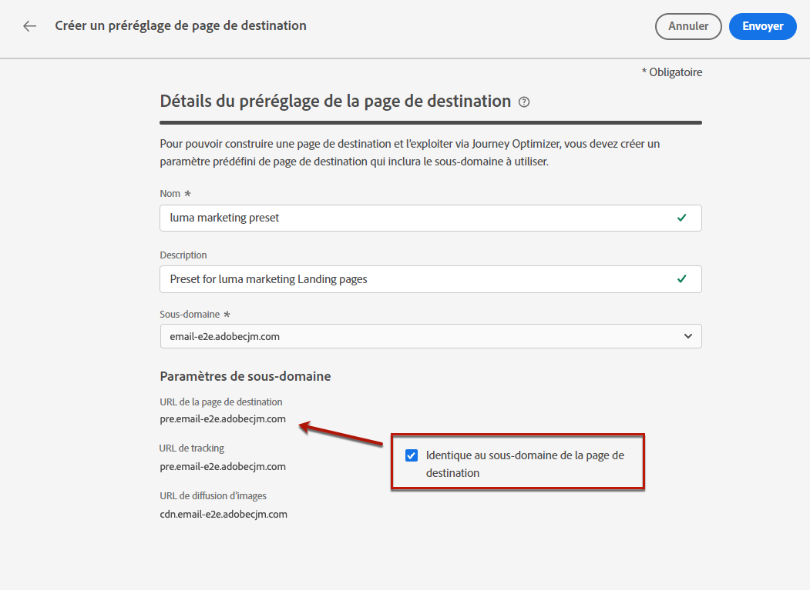
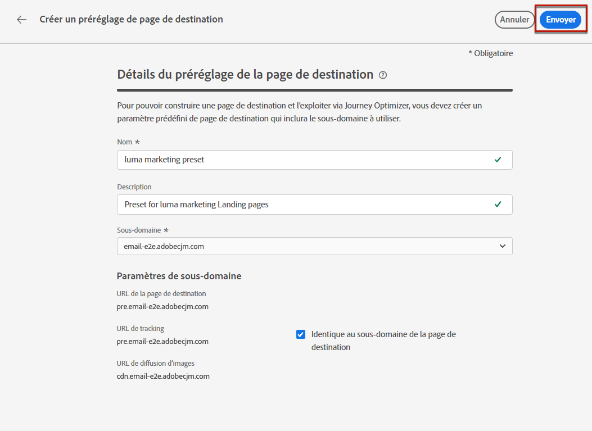

# Définir les préréglages de page de destination {#lp-presets}

>[!BEGINSHADEBOX]

**Sur cette page :** Découvrez comment les préréglages de page de destination associent un sous-domaine aux paramètres de suivi - la condition préalable que vous avez définie avant de créer et de publier vos pages de destination.

>[!ENDSHADEBOX]

>[!CONTEXTUALHELP]
>id="ajo_admin_config_lp_subdomain_header"
>title="Créer un préréglage de la page de destination"
>abstract="Pour pouvoir construire une page de destination et l’exploiter via Journey Optimizer, vous devez créer un préréglage de page de destination qui inclura le sous-domaine à utiliser."

## Commencez avec les préréglages de page de destination {#gs-lp-presets}

Lors de la [conception dʼune page de destination](../landing-pages/create-lp.md#create-lp), vous devez sélectionner un préréglage de page de destination pour la créer et lʼutiliser dans **[!DNL Journey Optimizer]**. Le préréglage comprend le sous-domaine à utiliser pour les pages de destination en fonction de ce préréglage.

Avant de créer un préréglage, vérifiez que vous avez configuré au moins un sous-domaine de page de destination. [Découvrez comment créer un sous-domaine de page de destination](lp-subdomains.md).

## Accéder aux préréglages de page de destination {#access-lp-presets}

Pour accéder aux préréglages de page de destination, procédez comme suit :

1. Accédez au menu **[!UICONTROL Administration]** > **[!UICONTROL Canaux]**.

1. Sélectionnez **[!UICONTROL Paramètres de la page de destination]** > **[!UICONTROL Paramètres prédéfinis de la page de destination]**.

   

1. Cliquez sur un libellé de préréglage de page de destination pour consulter ses détails.

   

## Créer un préréglage de la page de destination {#lp-create-preset}

Pour créer un préréglage de page de destination, procédez comme suit :

1. Accédez au menu **[!UICONTROL Administration]** > **[!UICONTROL Canaux]**, puis sélectionnez **[!UICONTROL Paramètres de la page de destination]** > **[!UICONTROL Préréglages de la page de destination]**.

1. Sélectionnez **[!UICONTROL Créer un préréglage de page de destination]**.

   

1. Saisissez un nom et une description pour le préréglage.

   Les noms doivent commencer par une lettre (A-Z) et ne peuvent contenir que des caractères alphanumériques, un trait de soulignement `_`, un point`.` et un tiret `-`.

1. Sélectionnez un sous-domaine de page de destination dans la liste déroulante.

   

   >[!NOTE]
   >
   >Avant de pouvoir sélectionner un sous-domaine, vous devez avoir configuré au moins un sous-domaine de page de destination. [Voici comment procéder](lp-subdomains.md)

   Les paramètres correspondant au sous-domaine sélectionné s’affichent.

1. Si vous souhaitez sélectionner le sous-domaine de page de destination comme **[!UICONTROL URL de suivi]**, cochez lʼoption **[!UICONTROL Identique au sous-domaine de page de destination]**. [En savoir plus sur le tracking](../email/message-tracking.md)

   

   Par exemple, si l’URL de la page de destination est « pages.mail.luma.com » et que lʼURL de tracking est « data.mail.luma.com », vous pouvez choisir « pages.mail.luma.com » comme sous-domaine de tracking.

   >[!CAUTION]
   >
   >Le sous-domaine de page de destination sélectionné est utilisé pour spécifier l’**[!UICONTROL URL de suivi]** <!--and **[!UICONTROL Image Delivery URL]** -->si ce sous-domaine a été créé à l’aide d’un [sous-domaine existant](lp-subdomains.md#lp-use-existing-subdomain).
   >
   >Si le sous-domaine a été créé à l’aide de l’option [Ajouter votre propre domaine](lp-subdomains.md#lp-configure-new-subdomain), le sous-domaine principal (c’est-à-dire le premier sous-domaine délégué) est utilisé à la place.

1. Cliquez sur **[!UICONTROL Envoyer]** pour confirmer la création du paramètre prédéfini de la page de destination. <!--You can also save the preset as draft and resume its configuration later on.-->

   <!---->

1. Une fois le préréglage de page de destination créé, il sʼaffiche dans la liste avec le statut **[!UICONTROL Actif]**. Il est prêt à être utilisé avec vos pages de destination.

Vous pouvez maintenant [créer des pages de destination](../landing-pages/create-lp.md) dans [!DNL Journey Optimizer].
<!--
>[!NOTE]
>
>Learn how to create channel configurations for push notifications and emails in [this section](channel-surfaces.md).
-->

**Rubriques connexes** :

* [Prise en main des pages de destination](../landing-pages/get-started-lp.md)
* [Créer une page de destination](../landing-pages/create-lp.md#create-lp)
