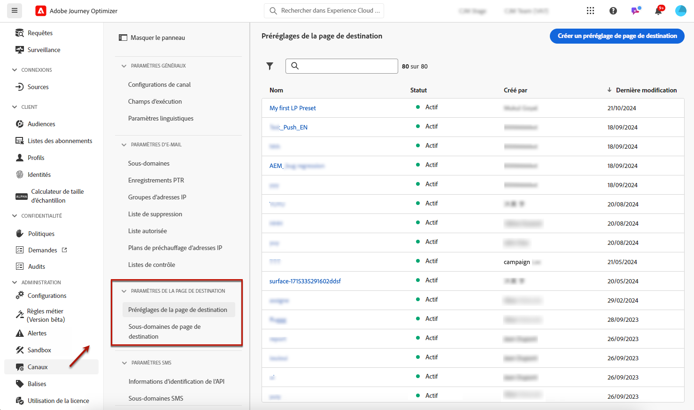
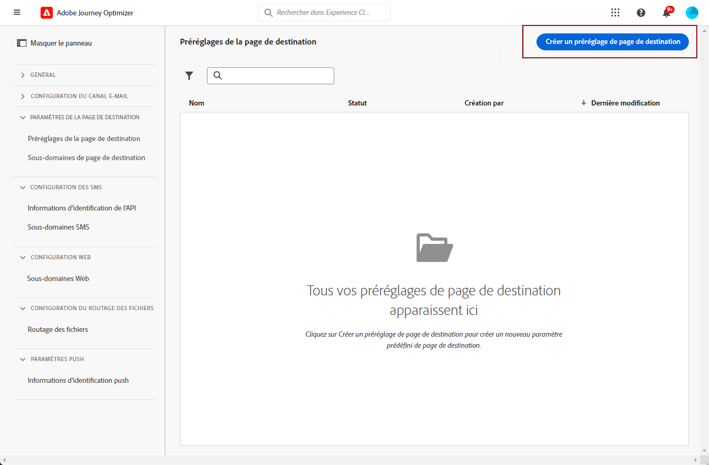

# Définir les préréglages de page de destination {#lp-presets}

>[!CONTEXTUALHELP]
>id="ajo_admin_config_lp_subdomain_header"
>title="Créer un préréglage de la page de destination"
>abstract="Pour pouvoir construire une page de destination et l’exploiter via Journey Optimizer, vous devez créer un préréglage de page de destination qui inclura le sous-domaine à utiliser."

Lors de la [conception dʼune page de destination](../landing-pages/create-lp.md#create-a-lp), vous devez sélectionner un préréglage de page de destination pour pouvoir créer la page de destination et lʼutiliser avec **[!DNL Journey Optimizer]**.

## Accéder aux préréglages de la page de destination {#access-lp-presets}

Pour accéder aux préréglages de la page de destination, procédez comme suit.

1. Accédez au menu **[!UICONTROL Administration]** > **[!UICONTROL Canaux]**.

1. Sélectionnez **[!UICONTROL Paramètres de la page de destination]** > **[!UICONTROL Paramètres prédéfinis de la page de destination]**.

   

1. Cliquez sur un libellé de préréglage de page de destination pour consulter ses détails.

   

## Créer un préréglage de la page de destination {#lp-create-preset}

Pour créer un préréglage de page de destination, procédez comme suit.

>[!NOTE]
>
>Avant de pouvoir créer un préréglage, vous devez avoir configuré au moins un sous-domaine de la page de destination. [Voici comment procéder](lp-subdomains.md)

1. Accédez au menu **[!UICONTROL Administration]** > **[!UICONTROL Canaux]**, puis sélectionnez **[!UICONTROL Paramètres de la page de destination]** > **[!UICONTROL Paramètres prédéfinis de la page de destination]**.

1. Sélectionnez **[!UICONTROL Créer un préréglage de page de destination]**.

   

1. Saisissez un nom et une description pour le préréglage.

   >[!NOTE]
   >
   > Les noms doivent commencer par une lettre (A-Z). Ils ne peuvent contenir que des caractères alphanumériques. Vous pouvez également utiliser le trait de soulignement `_`, le point`.` et le trait d&#39;union `-`.

1. Sélectionnez un sous-domaine de page de destination dans la liste déroulante.

   

   >[!NOTE]
   >
   >Avant de pouvoir sélectionner un sous-domaine, vous devez avoir configuré au moins un sous-domaine de page de destination. [Voici comment procéder](#lp-subdomains)

   Les paramètres correspondant au sous-domaine sélectionné s’affichent.

1. Si vous souhaitez sélectionner le sous-domaine de la page de destination comme URL de suivi, cochez lʼoption **[!UICONTROL Identique au sous-domaine de la page de destination]**. [En savoir plus sur le tracking.](../email/message-tracking.md)

   

   Par exemple, si l’URL de la page de destination est « pages.mail.luma.com » et que lʼURL de tracking est « data.mail.luma.com », vous pouvez choisir « pages.mail.luma.com » comme sous-domaine de tracking.

1. Cliquez sur **[!UICONTROL Envoyer]** pour confirmer la création du paramètre prédéfini de la page de destination. <!--You can also save the preset as draft and resume its configuration later on.-->

   <!---->

1. Une fois le préréglage de page de destination créé, il sʼaffiche dans la liste avec le statut **[!UICONTROL Actif]**. Il est prêt à être utilisé avec vos pages de destination.

Vous êtes maintenant prêt à [créer des pages de destination](../landing-pages/create-lp.md) dans [!DNL Journey Optimizer].
<!--
>[!NOTE]
>
>Learn how to create channel configurations for push notifications and emails in [this section](channel-surfaces.md).-->

**Rubriques connexes** :

* [Prise en main des pages de destination](../landing-pages/get-started-lp.md)
* [Création d’une page de destination](../landing-pages/create-lp.md#create-a-lp)
