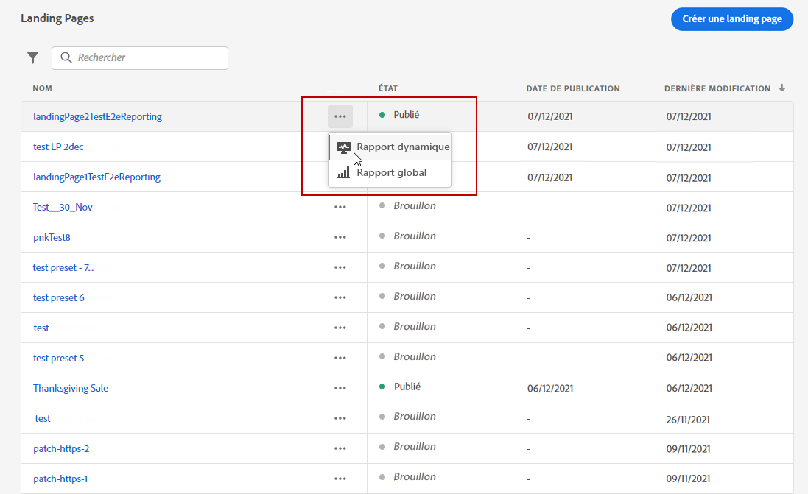
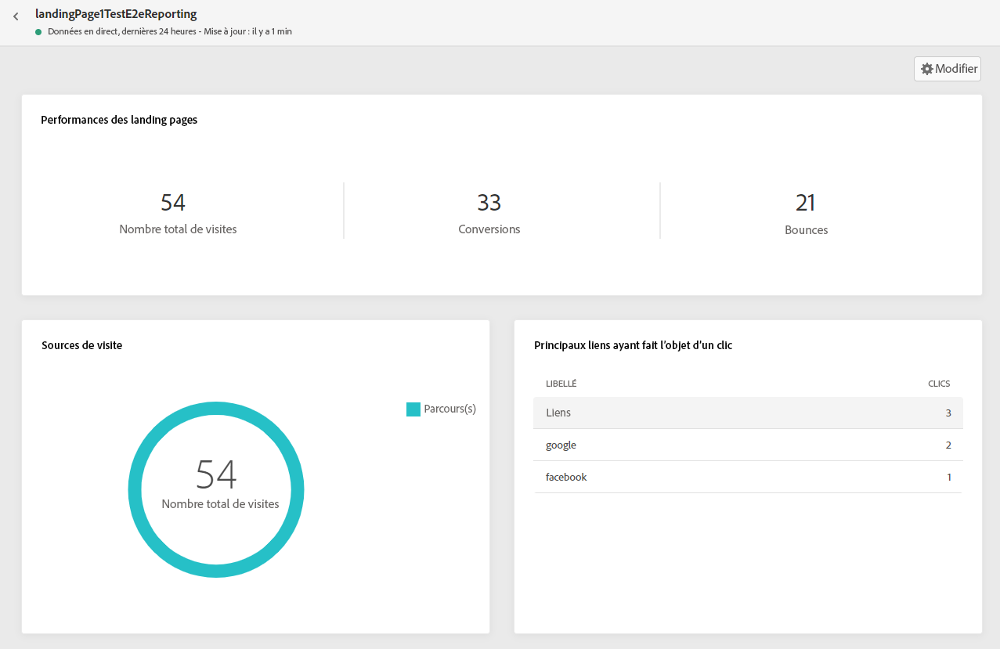
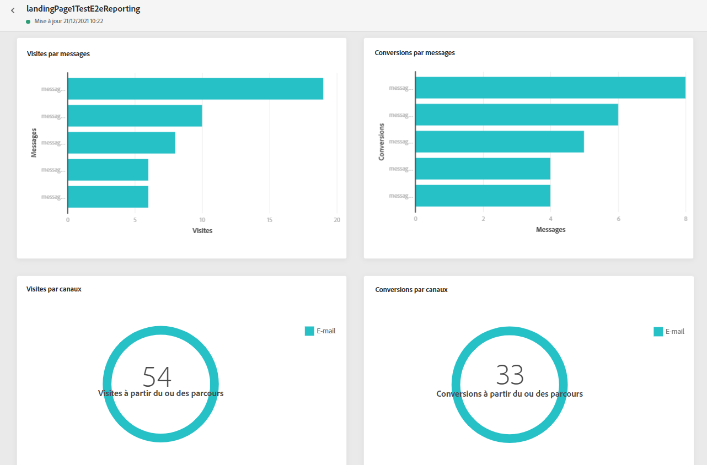
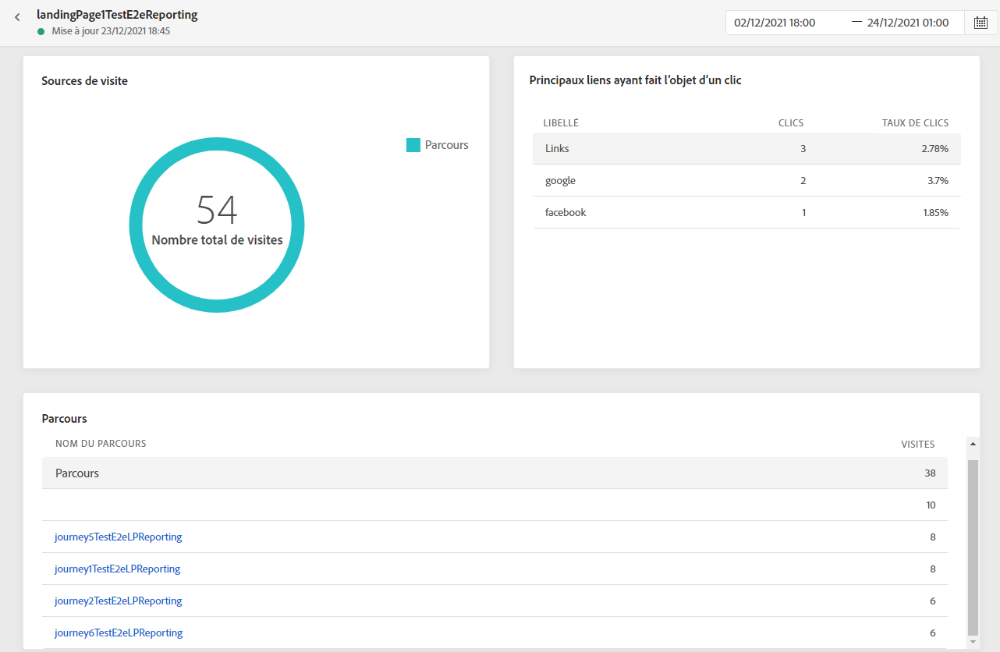
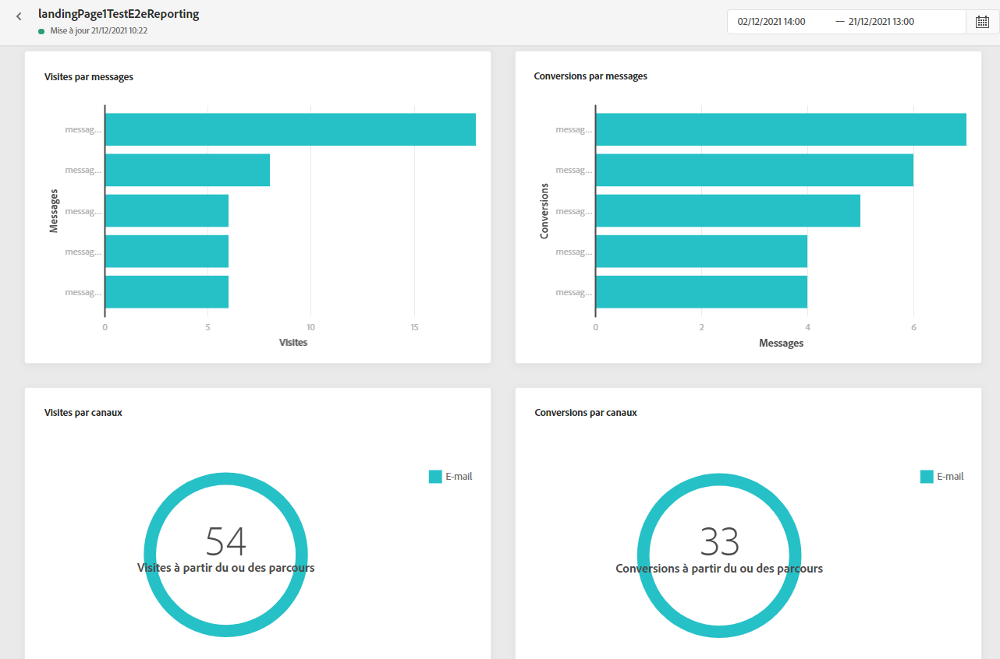

# Rapport sur les pages de destination {#lp-report}

Le rapport sur les pages de destination affiche des informations relatives à l’impact de vos pages de destination. Deux types de rapports sont disponibles :

* Le **[!UICONTROL Rapport dynamique]** permet de mesurer et de visualiser les performances de vos pages de destination au cours des dernières 24 heures uniquement.

* Le **[!UICONTROL Rapport global]** permet de mesurer et de visualiser les performances de vos pages de destination sur une période sélectionnée.

Pour accéder à vos rapports, sélectionnez **Rapport dynamique** ou **[!UICONTROL global]** dans le menu avancé de la page de destination sélectionnée.

## Rapport dynamique sur les pages de destination {#lp-live}

Le widget **[!UICONTROL Performances de la page de destination]** présente les informations principales relatives à votre message au cours des dernières 24 heures à l’aide de KPI :

* **[!UICONTROL Nombre total de visites]** : nombre total de visites sur votre page de destination à partir dʼun parcours ou dʼautres sources, y compris les visites multiples dʼun seul destinataire.

* **[!UICONTROL Conversions]** : nombre de personnes ayant interagi avec la page de destination, par exemple celles qui se sont inscrites à un formulaire.

* **[!UICONTROL Rebonds]** : nombre de personnes qui n’ont pas interagi avec la page de destination et n’ont pas effectué l’action d’inscription.

Le widget **[!UICONTROL Sources des visites]** représente la manière dont les visiteurs accèdent à votre page de destination :

* **[!UICONTROL Parcours]** : nombre de visites sur votre page de destination provenant dʼun parcours.

* **[!UICONTROL Autres sources]** : nombre de visites sur votre page de destination provenant d’une source externe au lieu d’un parcours.

Le widget **[!UICONTROL Principaux liens ayant fait l’objet d’un clic]** identifie lʼinteraction des visiteurs avec la page de destination :

* **[!UICONTROL Clics]** : nombre de clics sur un contenu de la page de destination.

Le widget **[!UICONTROL Parcours]** représente le nombre de visites sur votre page de destination à partir dʼun parcours.

Le widget **[!UICONTROL Autres sources]** représente le nombre de visites sur votre page de destination à partir d’une source externe au lieu d’un parcours.

Les graphiques **[!UICONTROL Visites par messages]** / **[!UICONTROL Conversions par messages]** représentent le nombre total de visites et de personnes ayant interagi avec votre page de destination au cours des dernières 24 heures, en fonction des messages envoyés.

Les graphiques **[!UICONTROL Visites par canaux]** / **[!UICONTROL Conversions par canaux]** représentent le nombre total de visites et de personnes ayant interagi avec votre page de destination au cours des dernières 24 heures, en fonction des canaux.

## Rapport global sur les pages de destination {#lp-global}

Les widgets **[!UICONTROL Nombre de visites]** et **[!UICONTROL Nombre de visites dans le temps]** vous permettent de mesurer l’impact de votre page de destination sur la période sélectionnée à lʼaide d’un graphique et de KPI comprenant les mesures suivantes :

* **[!UICONTROL Nombre total de visites]** : nombre total de visites sur votre page de destination provenant de parcours et de sources externes, y compris les visites multiples dʼun seul destinataire.

* **[!UICONTROL Visiteurs uniques]** : nombre de personnes ayant visité votre page de destination, les visites multiples dʼun même destinataire ne sont pas prises en compte.

Le widget **[!UICONTROL Performances de la page de destination]** présente les informations principales relatives à votre message au moyen des indicateurs clé de performance :

* **[!UICONTROL Taux de conversion]** : nombre de personnes ayant interagi avec la page de destination, par exemple le nombre dʼinscrits à un formulaire par rapport au nombre total de visites.

* **[!UICONTROL Taux de rebond]** : nombre de personnes nʼayant pas interagi avec la page de destination ni effectué lʼaction dʼinscription, par rapport au nombre total de visites.

Le widget **[!UICONTROL Sources des visites]** représente la façon dont les visiteurs accèdent à votre page de destination :

* **[!UICONTROL Parcours]** : nombre de visites sur votre page de destination provenant dʼun parcours.

* **[!UICONTROL Autres sources]** : nombre de visites de votre page de destination provenant d’une source externe au lieu d’un parcours.

Le widget **[!UICONTROL Principaux liens ayant fait l’objet d’un clic]** identifie lʼinteraction des visiteurs avec la diffusion :

* **[!UICONTROL Clics]** : nombre de clics sur un contenu de la page de destination.

* **[!UICONTROL Taux de clics]** : pourcentage de clics sur la page de destination.

Le widget **[!UICONTROL Parcours]** représente le nombre de visites sur votre page de destination à partir dʼun parcours :

* **[!UICONTROL Visites]** : nombre de visites sur votre page de destination, y compris les visites multiples d’un seul destinataire.

Le widget **[!UICONTROL Autres sources]** représente le nombre de visites sur votre page de destination à partir d’une source externe au lieu d’un parcours.

Les graphiques **[!UICONTROL Visites par messages]** / **[!UICONTROL Conversions par messages]** représentent le nombre total de visites et de personnes ayant interagi avec votre page de destination pendant la période concernée en fonction des messages envoyés.

Les graphiques **[!UICONTROL Visites par canaux]**/ **[!UICONTROL Conversions par canaux]** représentent le nombre total de visites et de personnes ayant interagi avec votre page de destination pendant la période concernée en fonction des canaux.
