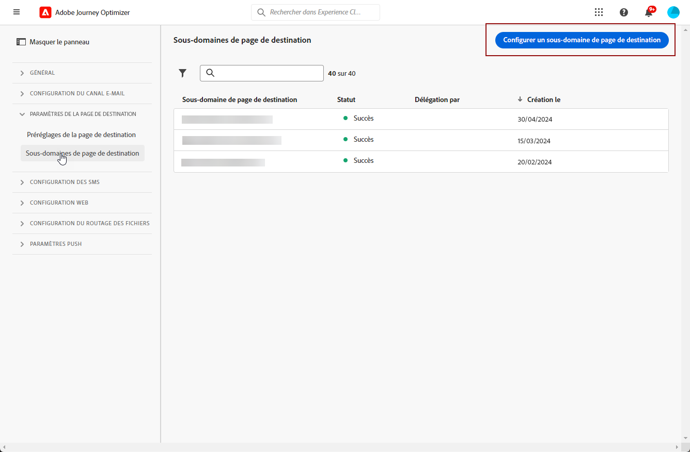

# Configuration des sous-domaines de landing page {#lp-subdomains}

>[!CONTEXTUALHELP]
>id="ajo_admin_subdomain_lp_header"
>title="Déléguer un sous-domaine de landing page"
>abstract="Vous allez configurer votre sous-domaine pour une utilisation de page d’entrée. Vous pouvez utiliser un sous-domaine déjà délégué à Adobe ou configurer un autre sous-domaine."

>[!CONTEXTUALHELP]
>id="ajo_admin_subdomain_lp"
>title="Déléguer un sous-domaine de landing page"
>abstract="Vous devez configurer un sous-domaine à utiliser pour vos landing pages, car vous aurez besoin de ce sous-domaine pour créer un paramètre prédéfini de landing page. Vous pouvez utiliser un sous-domaine déjà délégué à Adobe ou configurer un nouveau sous-domaine."
>additional-url="https://experienceleague.adobe.com/docs/journey-optimizer/using/configuration/lp-configuration/lp-presets.html" text="Créer des paramètres prédéfinis de landing page"

>[!CONTEXTUALHELP]
>id="ajo_admin_config_lp_subdomain"
>title="Créer un paramètre prédéfini de landing page"
>abstract="Pour pouvoir créer un paramètre prédéfini de page d’entrée, vérifiez que vous avez déjà configuré au moins un sous-domaine de page d’entrée à sélectionner dans la liste Nom de sous-domaine."
>additional-url="https://experienceleague.adobe.com/docs/journey-optimizer/using/configuration/lp-configuration/lp-presets.html" text="Créer des paramètres prédéfinis de landing page"

Pour être en mesure de [créer des paramètres prédéfinis de landing page](lp-presets.md), vous devez configurer les sous-domaines que vous utiliserez pour vos landing pages.

Vous pouvez utiliser un sous-domaine déjà délégué à Adobe ou configurer un autre sous-domaine. En savoir plus sur la délégation de sous-domaines à Adobe dans [cette section](../configuration/delegate-subdomain.md).

>[!CAUTION]
>
>La configuration des sous-domaines de la landing page est commune à tous les environnements. Par conséquent, toute modification apportée à un sous-domaine de page d’entrée aura également un impact sur les environnements de test de production.

Notez que les majuscules ne doivent pas être autorisées dans un sous-domaine.

## Utilisation d’un sous-domaine existant {#lp-use-existing-subdomain}

Pour utiliser un sous-domaine déjà délégué à Adobe, procédez comme suit.

1. Accédez au **[!UICONTROL Administration]** > **[!UICONTROL Channels]** , puis sélectionnez **[!UICONTROL Email configuration]** > **[!UICONTROL Landing page subdomains]**.

   

1. Cliquez sur **[!UICONTROL Set up subdomain]**.

   

1. Sélectionner **[!UICONTROL Use delegated domain]** de la **[!UICONTROL Configuration type]** .

   

1. Saisissez le préfixe qui s&#39;affichera dans l&#39;URL de votre landing page.

   >[!NOTE]
   >
   >Seuls les caractères alphanumériques et les tirets sont autorisés.

1. Sélectionnez un sous-domaine délégué dans la liste.

   >[!NOTE]
   >
   >Vous ne pouvez pas sélectionner un sous-domaine déjà utilisé comme sous-domaine de page d’entrée.

   <!--Capital letters are not allowed in subdomains. TBC by PM-->

   

   Notez que vous ne pouvez pas utiliser plusieurs sous-domaines délégués du même domaine parent. Par exemple, si &quot;marketing1.votreentreprise.com&quot; est déjà délégué à Adobe pour vos landing pages, vous ne pourrez pas utiliser &quot;marketing2.votreentreprise.com&quot;. Toutefois, les sous-domaines à plusieurs niveaux pris en charge pour les landing pages, vous pouvez continuer à utiliser un sous-domaine de &quot;marketing1.votreentreprise.com&quot; (tel que &quot;email.marketing1.votreentreprise.com&quot;) ou un autre domaine parent.

   >[!CAUTION]
   >
   >Si vous sélectionnez un domaine qui a été délégué à Adobe à l’aide de la variable [méthode CNAME](../configuration/delegate-subdomain.md#cname-subdomain-delegation), vous devez créer l’enregistrement DNS sur votre plateforme d’hébergement. Pour générer l’enregistrement DNS, le processus est le même que lorsque vous configurez un nouveau sous-domaine de landing page. Découvrez comment [cette section](#lp-configure-new-subdomain).

1. Cliquez sur **[!UICONTROL Submit]**.

1. Une fois envoyé, le sous-domaine s’affiche dans la liste avec le **[!UICONTROL Processing]** statut. Pour plus d’informations sur les statuts des sous-domaines, reportez-vous à la section [cette section](../configuration/about-subdomain-delegation.md#access-delegated-subdomains).<!--Same statuses?-->

   

   >[!NOTE]
   >
   >Avant de pouvoir utiliser ce sous-domaine pour envoyer des messages, vous devez attendre qu’Adobe effectue les vérifications requises, qui peuvent prendre jusqu’à 4 heures.<!--Learn more in [this section](delegate-subdomain.md#subdomain-validation).-->

1. Une fois les vérifications effectuées, le sous-domaine reçoit la valeur **[!UICONTROL Success]** statut. Il est prêt à être utilisé pour créer des paramètres prédéfinis de page d’entrée.

## Configuration d’un nouveau sous-domaine {#lp-configure-new-subdomain}

>[!CONTEXTUALHELP]
>id="ajo_admin_lp_subdomain_dns"
>title="Générer l’enregistrement DNS correspondant"
>abstract="Pour configurer un nouveau sous-domaine de page d’entrée, vous devez copier les informations du serveur de noms Adobe affichées dans l’interface Journey Optimizer et les coller dans votre solution d’hébergement de domaine pour générer l’enregistrement DNS correspondant. Une fois les vérifications effectuées, le sous-domaine est prêt à être utilisé pour créer des paramètres prédéfinis de page d’entrée."

Pour configurer un nouveau sous-domaine, procédez comme suit.

1. Accédez au **[!UICONTROL Administration]** > **[!UICONTROL Channels]** , puis sélectionnez **[!UICONTROL Email configuration]** > **[!UICONTROL Landing page subdomains]**.

1. Cliquez sur **[!UICONTROL Set up subdomain]**.

1. Sélectionner **[!UICONTROL Add your own domain]** de la **[!UICONTROL Configuration type]** .

   

1. Spécifiez le sous-domaine à déléguer.

   >[!CAUTION]
   >
   >Vous ne pouvez pas utiliser un sous-domaine de landing page existant.
   >
   >Les majuscules ne sont pas autorisées dans les sous-domaines.

   La délégation d’un sous-domaine non valide à Adobe n’est pas autorisée. Veillez à saisir un sous-domaine valide détenu par votre entreprise, tel que marketing.yourcompany.com.

   >[!NOTE]
   >
   >Pour les landing pages, les sous-domaines à plusieurs niveaux sont pris en charge. Par exemple, vous pouvez utiliser &quot;email.marketing.votreentreprise.com&quot;.

1. L’enregistrement à placer dans vos serveurs DNS s’affiche. Copiez cet enregistrement ou téléchargez un fichier CSV, puis accédez à votre solution d’hébergement de domaine pour générer l’enregistrement DNS correspondant.

1. Assurez-vous que l’enregistrement DNS a été généré dans votre solution d’hébergement de domaine. Si tout est configuré correctement, cochez la case &quot;Je confirme...&quot;, puis cliquez sur **[!UICONTROL Submit]**.

   

   >[!NOTE]
   >
   >Lorsque vous configurez un nouveau sous-domaine de landing page, il pointe toujours vers un enregistrement CNAME.

1. Une fois la délégation de sous-domaine envoyée, le sous-domaine s’affiche dans la liste avec la variable **[!UICONTROL Processing]** statut. Pour plus d’informations sur les statuts des sous-domaines, reportez-vous à la section [cette section](../configuration/about-subdomain-delegation.md#access-delegated-subdomains).<!--Same statuses?-->

   >[!NOTE]
   >
   >Avant de pouvoir utiliser ce sous-domaine pour envoyer des messages, vous devez attendre qu’Adobe effectue les vérifications requises, qui peuvent prendre jusqu’à 4 heures.<!--Learn more in [this section](#subdomain-validation).-->

1. Une fois les vérifications effectuées, le sous-domaine reçoit la valeur **[!UICONTROL Success]** statut. Il est prêt à être utilisé pour créer des paramètres prédéfinis de page d’entrée.

   Notez que le sous-domaine sera marqué comme **[!UICONTROL Failed]** si vous ne créez pas l’enregistrement de validation sur votre solution d’hébergement.
