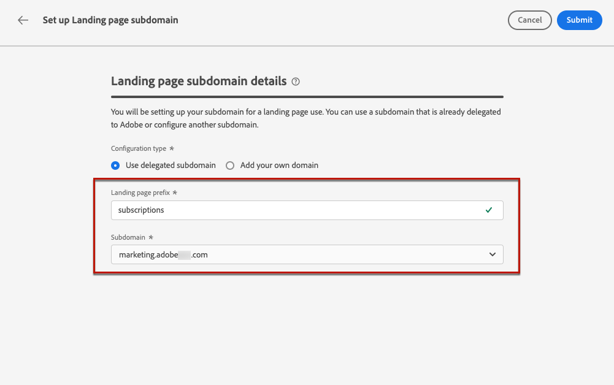
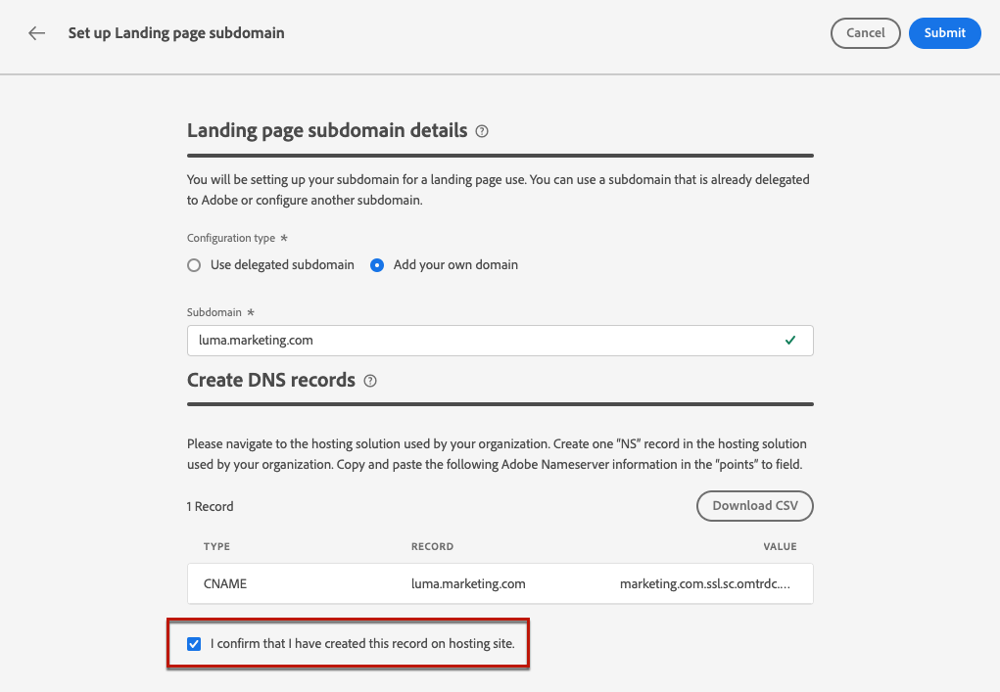

# Configurer les sous-domaines des pages de destination {#lp-subdomains}

>[!CONTEXTUALHELP]
>id="ajo_admin_subdomain_lp_header"
>title="Déléguer un sous-domaine de page de destination"
>abstract="Vous allez configurer votre sous-domaine pour une utilisation d’une page de destination. Vous pouvez utiliser un sous-domaine déjà délégué à Adobe ou en configurer un autre."

>[!CONTEXTUALHELP]
>id="ajo_admin_subdomain_lp"
>title="Déléguer un sous-domaine de page de destination"
>abstract="Vous devez configurer un sous-domaine à utiliser pour vos pages de destination, car vous aurez besoin de ce sous-domaine pour créer un préréglage de page de destination. Vous pouvez utiliser un sous-domaine déjà délégué à Adobe ou configurer un nouveau sous-domaine."
>additional-url="https://experienceleague.adobe.com/docs/journey-optimizer/using/landing-pages/lp-configuration/lp-presets.html?lang=fr#lp-create-preset" text="Créer des préréglages de page de destination"

>[!CONTEXTUALHELP]
>id="ajo_admin_config_lp_subdomain"
>title="Créer un préréglage de la page de destination"
>abstract="Pour pouvoir créer un préréglage de la page de destination, vérifiez que vous avez déjà configuré au moins un sous-domaine de la page de destination à sélectionner dans la liste Nom du sous-domaine."
>additional-url="https://experienceleague.adobe.com/docs/journey-optimizer/using/landing-pages/lp-configuration/lp-presets.html?lang=fr#lp-create-preset" text="Créer des préréglages de page de destination"

Avant de pouvoir [créer des préréglages de page de destination](lp-presets.md), vous devez avoir configuré les sous-domaines que vous utiliserez pour vos pages de destination.

Vous pouvez utiliser un sous-domaine déjà délégué à Adobe ou en configurer un autre. En savoir plus sur la délégation de sous-domaines à Adobe dans [cette section](../configuration/delegate-subdomain.md).

>[!CAUTION]
>
>La configuration des sous-domaines de la page de destination est commune à tous les environnements. Par conséquent :
>
>* Pour accéder aux sous-domaines de la page de destination et les modifier, vous devez disposer de l’autorisation **[!UICONTROL Gérer les sous-domaines de la page de destination]** dans le sandbox de production.
>
> * Toute modification apportée à un sous-domaine de page de destination aura également un impact sur les sandbox de production.

## Utiliser un sous-domaine existant {#lp-use-existing-subdomain}

Pour utiliser un sous-domaine déjà délégué à Adobe, procédez comme suit.

1. Accédez au menu **[!UICONTROL Administration]** > **[!UICONTROL Canaux]** , puis sélectionnez **[!UICONTROL Paramètres de page d’entrée]** > **[!UICONTROL Sous-domaines de page d’entrée]**.

1. Cliquez sur **[!UICONTROL Configurer le sous-domaine]**.

   

1. Sélectionnez **[!UICONTROL Utiliser le domaine délégué]** dans la section **[!UICONTROL Type de configuration]**.

   

1. Saisissez le préfixe qui sʼaffichera dans lʼURL de votre page de destination.

   >[!NOTE]
   >
   >Seuls les caractères alphanumériques et les tirets sont autorisés.

1. Sélectionnez un sous-domaine délégué dans la liste.

   >[!NOTE]
   >
   >Vous ne pouvez pas sélectionner un sous-domaine déjà utilisé comme sous-domaine de page de destination.

   <!--Capital letters are not allowed in subdomains. TBC by PM-->

   

   Notez que vous ne pouvez pas utiliser plusieurs sous-domaines délégués du même domaine parent. Par exemple, si « marketing1.yourcompany.com » est déjà délégué à Adobe pour vos pages de destination, vous ne pourrez pas utiliser « marketing2.yourcompany.com ». Cependant, les sous-domaines à plusieurs niveaux sont pris en charge pour les pages de destination. Vous pouvez dès lors utiliser un sous-domaine de « marketing1.yourcompany.com » (comme « email.marketing1.yourcompany.com ») ou un autre domaine parent.

   >[!CAUTION]
   >
   >Si vous sélectionnez un domaine qui a été délégué à Adobe à l’aide de la [méthode CNAME](../configuration/delegate-subdomain.md#cname-subdomain-delegation), vous devez créer l’enregistrement DNS sur votre plateforme d’hébergement. Pour générer l’enregistrement DNS, le processus est le même que lorsque vous configurez un nouveau sous-domaine de page de destination. Découvrez comment dans [cette section](#lp-configure-new-subdomain).

1. Cliquez sur **[!UICONTROL Envoyer]**.

1. Une fois envoyé, le sous-domaine s’affiche dans la liste avec le statut du **[!UICONTROL Traitement]**. Pour en savoir plus sur les statuts des sous-domaines, consultez [cette section](../configuration/about-subdomain-delegation.md#access-delegated-subdomains).<!--Same statuses?-->

   

   >[!NOTE]
   >
   >Avant de pouvoir utiliser ce sous-domaine pour envoyer des messages, vous devez attendre qu’Adobe effectue les vérifications nécessaires, ce qui peut prendre jusqu’à 4 heures.<!--Learn more in [this section](delegate-subdomain.md#subdomain-validation).-->

1. Une fois les vérifications effectuées, le sous-domaine obtient le statut **[!UICONTROL Succès]**. Il est prêt à être utilisé pour créer des préréglages de page de destination.

## Configurer un nouveau sous-domaine {#lp-configure-new-subdomain}

>[!CONTEXTUALHELP]
>id="ajo_admin_lp_subdomain_dns"
>title="Générer l’enregistrement DNS correspondant"
>abstract="Pour configurer un nouveau sous-domaine de page de destination, vous devez copier les informations du serveur de noms d’Adobe affichées dans l’interface de Journey Optimizer et les coller dans votre solution d’hébergement de domaine pour générer l’enregistrement DNS correspondant. Une fois les vérifications effectuées, le sous-domaine est prêt à être utilisé pour créer des paramètres prédéfinis de page de destination."

Pour configurer un nouveau sous-domaine, procédez comme suit :

1. Accédez au menu **[!UICONTROL Administration]** > **[!UICONTROL Canaux]** , puis sélectionnez **[!UICONTROL Paramètres de page d’entrée]** > **[!UICONTROL Sous-domaines de page d’entrée]**.

1. Cliquez sur **[!UICONTROL Configurer un sous-domaine]**.

1. Sélectionnez **[!UICONTROL Ajouter votre propre domaine]** de la section **[!UICONTROL Type de configuration]**.

   

1. Spécifiez le sous-domaine à déléguer.

   >[!CAUTION]
   >
   >Vous ne pouvez pas utiliser un sous-domaine de page de destination existant.
   >
   >Les majuscules ne sont pas autorisées dans les sous-domaines.

   La délégation d’un sous-domaine non valide à Adobe n’est pas autorisée. Veillez à saisir un sous-domaine valide détenu par votre entreprise, tel que marketing.votre_entreprise.com.

   >[!NOTE]
   >
   >Pour les pages de destination, les sous-domaines à plusieurs niveaux sont pris en charge. Par exemple, vous pouvez utiliser « email.marketing.yourcompany.com ».

1. L’enregistrement à placer dans les serveurs DNS s’affiche. Copiez cet enregistrement ou téléchargez un fichier CSV, puis accédez à votre solution d’hébergement de domaine pour générer l’enregistrement DNS correspondant.

1. Assurez-vous que l’enregistrement DNS a été généré dans votre solution d’hébergement de domaine. Si tout est correctement configuré, cochez la case « Je confirme... », puis cliquez sur **[!UICONTROL Envoyer]**.

   

   >[!NOTE]
   >
   >Lorsque vous configurez un nouveau sous-domaine de page de destination, il pointe toujours vers un enregistrement CNAME.

1. Une fois la délégation de sous-domaine envoyée, le sous-domaine s&#39;affiche dans la liste avec le statut **[!UICONTROL Traitement]**. Pour en savoir plus sur les statuts des sous-domaines, consultez [cette section](../configuration/about-subdomain-delegation.md#access-delegated-subdomains).<!--Same statuses?-->

   >[!NOTE]
   >
   >Avant de pouvoir utiliser ce sous-domaine pour vos pages de destination, vous devez attendre qu’Adobe effectue les vérifications nécessaires, ce qui peut prendre jusqu’à 4 heures.<!--Learn more in [this section](#subdomain-validation).-->

1. Une fois les vérifications effectuées, le sous-domaine obtient le statut **[!UICONTROL Succès]**. Il est prêt à être utilisé pour créer des préréglages de page de destination.

   Le statut du sous-domaine sera marqué comme en **[!UICONTROL Échec]** si la création de lʼenregistrement de validation sur votre solution dʼhébergement nʼa pas réussi.
