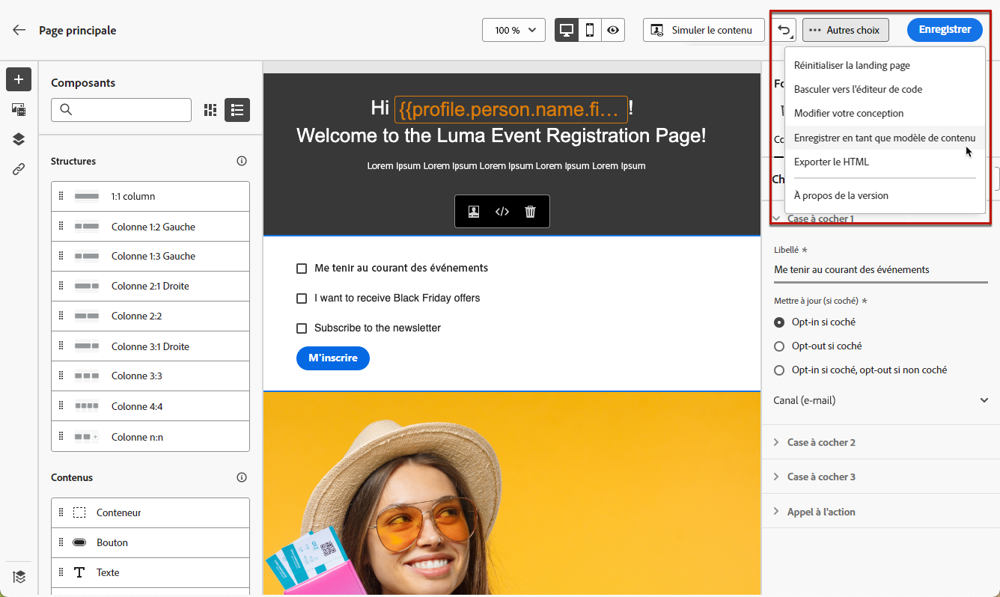
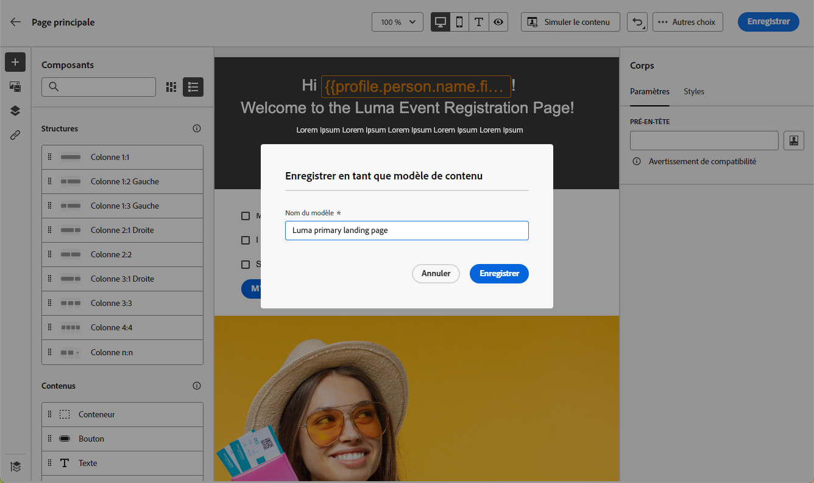
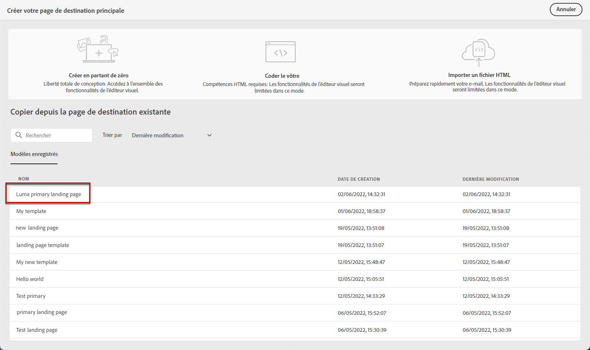
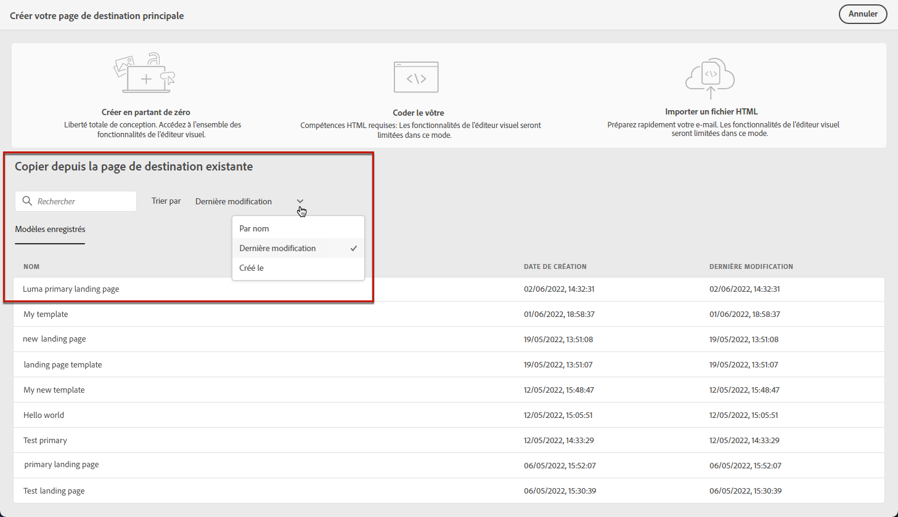
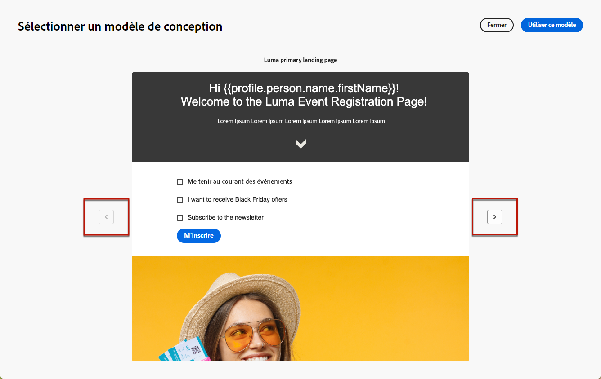

# Utilisation des modèles de page de destination {#work-with-templates}

## Enregistrement d’une page en tant que modèle {#save-as-template}

Une fois que vous avez conçu votre [contenu de page de destination](lp-content.md), vous pouvez l’enregistrer pour une réutilisation ultérieure. Pour ce faire, suivez les étapes ci-après.

1. Cliquez sur les points de suspension en haut à droite de l’écran.

1. Sélectionnez **[!UICONTROL Enregistrer le modèle de conception]** dans le menu déroulant.

   

1. Ajoutez un nom pour ce modèle.

   

1. Cliquez sur **[!UICONTROL Enregistrer]**.

La prochaine fois que vous créerez une page de destination, vous pourrez utiliser ce modèle pour créer votre contenu. Découvrez comment dans la [section](#use-saved-template) ci-dessous.

## Utilisation d’un modèle enregistré {#use-saved-template}

1. Ouvrez le [concepteur de contenu de page de destination](design-lp.md). La liste de tous les modèles précédemment enregistrés s’affiche.

1. Vous pouvez les trier : **[!UICONTROL Par nom]**, **[!UICONTROL Dernière modification]** et **[!UICONTROL Dernière création]**.

   

1. Sélectionnez le modèle de votre choix dans la liste.

1. Une fois sélectionné, vous pouvez naviguer entre tous les modèles enregistrés à l’aide des flèches droite et gauche.

   

1. Cliquez sur **[!UICONTROL Utiliser cette page de destination]**.

1. Modifiez votre contenu selon vos besoins à l&#39;aide du concepteur de page de destination.

>[!NOTE]
>
>Les modèles de page principale et les modèles de sous-page sont gérés séparément, ce qui signifie que vous ne pouvez pas utiliser un modèle de page principale pour créer une sous-page, et vice versa.
