# Cas pratiques de landing page

Vous trouverez ci-dessous quelques exemples d’utilisation [!DNL Journey Optimizer] landing pages pour que vos clients s’abonnent/se désabonnent de la réception de certaines ou de toutes vos communications.

<!--The main use cases are:
* Subscription to a service
* Opt-in
* Opt-out-->

## Abonnement à un service {#subscription-to-a-service}

L’un des cas d’utilisation les plus courants consiste à inviter vos clients à [abonnement à un service](subscription-list.md) (comme une newsletter ou un événement) via une landing page. Les principales étapes sont présentées dans le graphique ci-dessous :

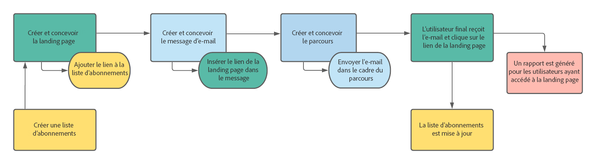

Supposons, par exemple, que vous organisiez un événement le mois prochain et que vous souhaitiez lancer une campagne d’enregistrement d’événement.<!--to keep your customers that are interested updated on that event-->. Pour ce faire, vous allez envoyer un email comprenant un lien vers une landing page qui permettra à vos destinataires de s&#39;inscrire pour cet événement. Les utilisateurs qui s’inscrivent seront ajoutés à la liste d’abonnements que vous avez créée à cet effet.

### Configurer une landing page

1. Créez la liste d’abonnements de l’enregistrement de l’événement, qui stockera les utilisateurs enregistrés. Découvrez comment créer une liste d’abonnements [here](subscription-list.md#define-subscription-list).

   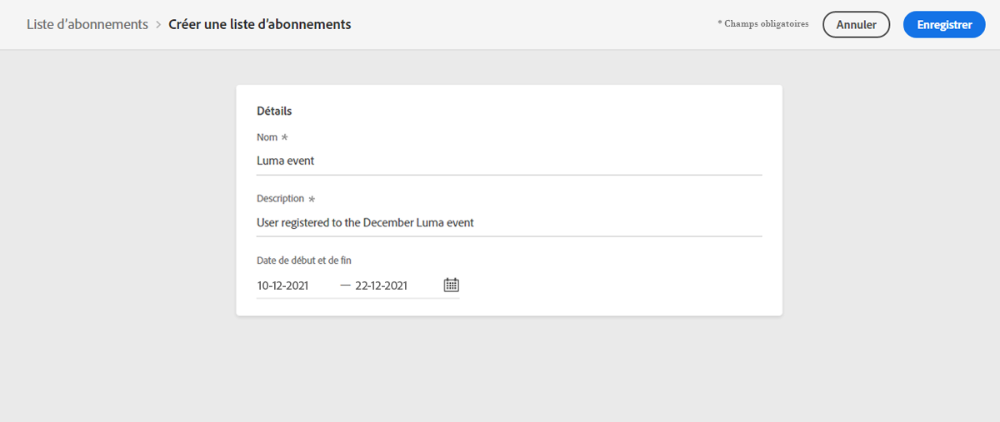

1. [Créer une landing page](create-lp.md) pour permettre aux destinataires de s&#39;inscrire à votre événement.

1. Configurer l’enregistrement [Principale landing page](create-lp.md#configure-primary-page).

1. Lors de la conception de la variable [contenu de la page d’entrée](design-lp.md), sélectionnez la liste d&#39;abonnements que vous avez créée pour la mettre à jour avec les profils qui cochent la case d&#39;enregistrement.

   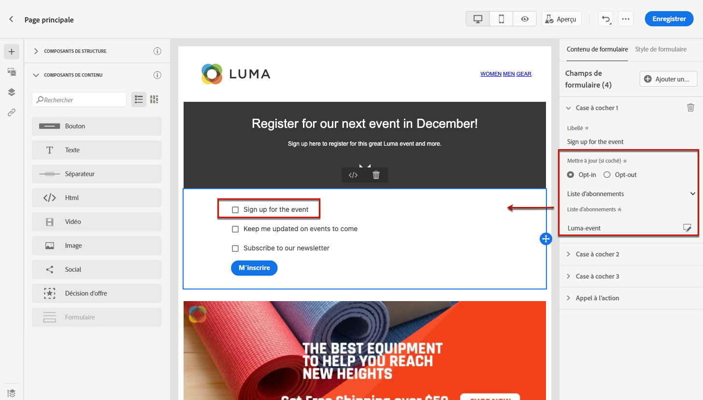

1. Créez une page de remerciement qui s&#39;affichera à vos destinataires une fois le formulaire d&#39;inscription envoyé. Découvrez comment configurer des sous-pages d’entrée [here](create-lp.md#configure-subpages).

   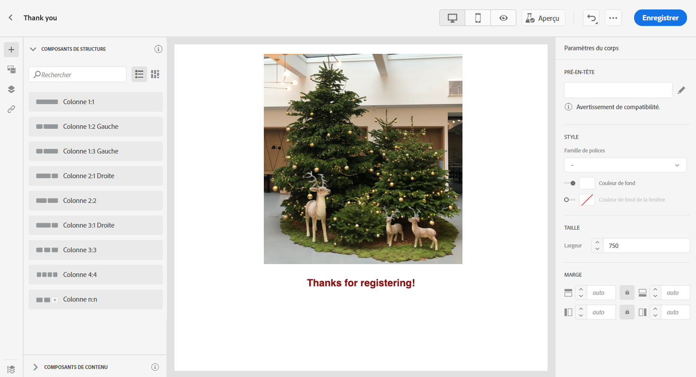

1. Publier la landing page.

1. [Création d’un message électronique](../create-message.md) pour annoncer que l’inscription est maintenant ouverte à votre événement.

1. [Insérer un lien](../message-tracking.md#insert-links) dans le contenu de votre message. Sélectionner **[!UICONTROL Landing page]** comme la propriété **[!UICONTROL Type de lien]** et sélectionnez la variable [landing page](create-lp.md#configure-primary-page) que vous avez créé pour enregistrement.

   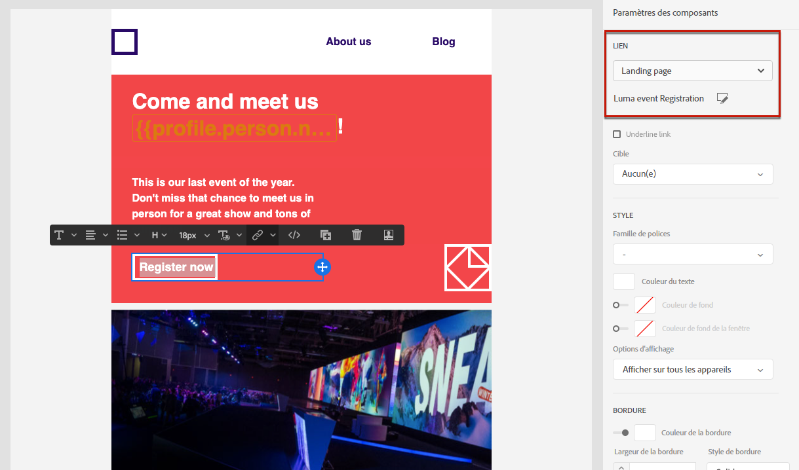

1. Enregistrez votre contenu et [publiez votre message](../publish-manage-message.md).

1. Envoyer votre message par le biais d’un [parcours](../building-journeys/journey.md) pour diriger le trafic vers la page d’entrée de l’enregistrement.

   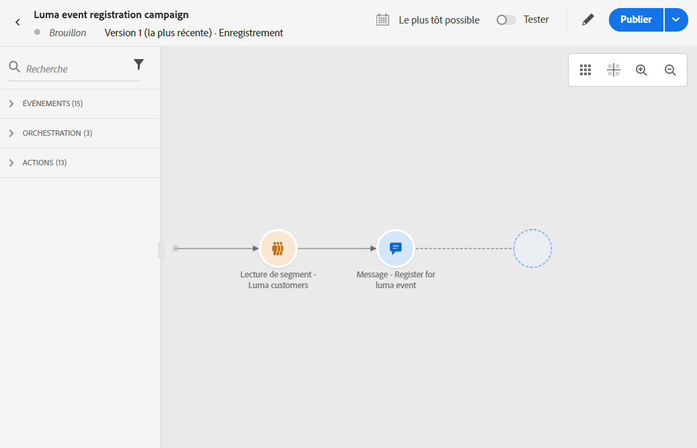

   Une fois qu&#39;ils ont reçu l&#39;email, si vos destinataires cliquent sur le lien vers la landing page, ils sont redirigés vers la page &#39;Merci&#39; et ils seront ajoutés à la liste d&#39;abonnements.

### Envoyer un email de confirmation {#send-confirmation-email}

De plus, vous pouvez envoyer un email de confirmation aux destinataires qui se sont inscrits à votre événement. Pour ce faire, procédez comme suit.

1. Créer un autre [parcours](../building-journeys/journey.md). Vous pouvez le faire directement à partir de la landing page en cliquant sur le bouton **[!UICONTROL Créer un parcours]** bouton . En savoir plus [ici](create-lp.md#configure-primary-page)

   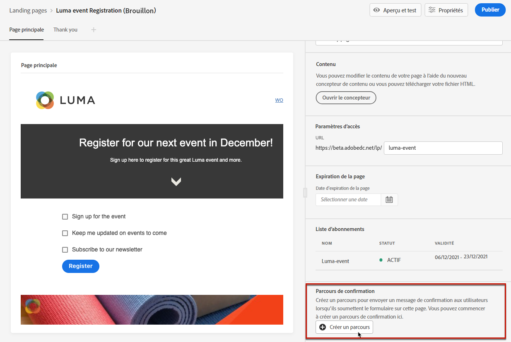

1. Développez la catégorie **[!UICONTROL Événements]** et déposez une activité de **[!UICONTROL qualification du segment]** dans la zone de travail. En savoir plus [ici](../building-journeys/segment-qualification-events.md)

1. Cliquez sur dans le **[!UICONTROL Segment]** et sélectionnez la liste d’abonnements que vous avez créée.

   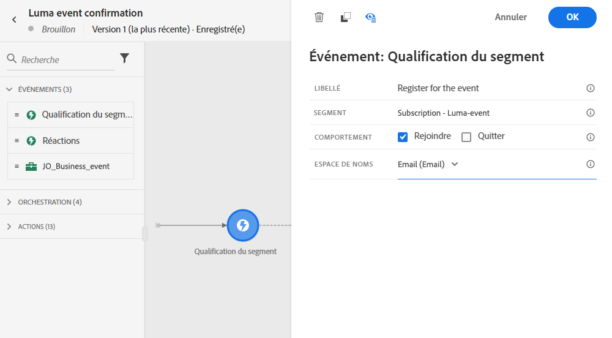

1. Sélectionnez l&#39;email de confirmation de votre choix et envoyez-le par parcours.

   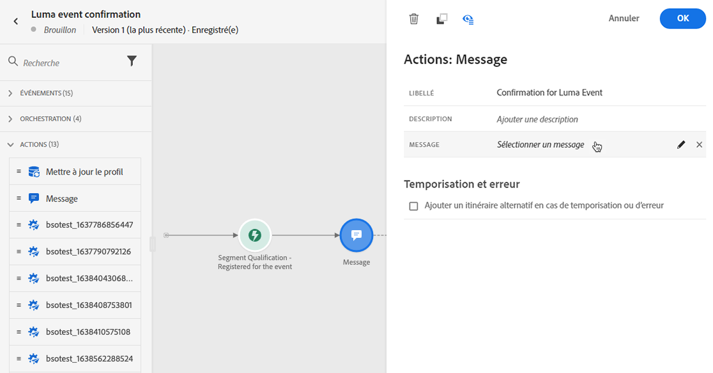

Tous les utilisateurs qui se sont inscrits à votre événement recevront l’e-mail de confirmation.

<!--The event registration's subscription list tracks the profiles who registered and you can send them targeted event updates.-->

## Exclusion {#opt-out}

Pour permettre aux destinataires de se désabonner de vos communications, vous pouvez inclure dans vos emails un lien vers une landing page d&#39;opt-out.

En savoir plus sur la gestion du consentement de vos destinataires et pourquoi cela est important dans [cette section](../consent.md).

### Gestion du droit d&#39;opposition {#opt-out-management}

La possibilité pour les destinataires de se désabonner de la réception des communications d&#39;une marque est une exigence légale. Pour en savoir plus sur la législation applicable, consultez la [documentation d’Experience Platform](https://experienceleague.adobe.com/docs/experience-platform/privacy/regulations/overview.html?lang=fr#regulations){target=&quot;_blank&quot;}.

Par conséquent, vous devez toujours inclure un **lien de désabonnement** dans chaque e-mail envoyé aux destinataires :

* Lorsqu&#39;ils cliquent sur ce lien, les destinataires sont dirigés vers une page de destination contenant un bouton pour confirmer leur désinscription.
* Lorsque vous cliquez sur le bouton d’exclusion, les données de profil sont mises à jour avec ces informations.

### Configuration du droit d’opposition {#configure-opt-out}

Pour permettre aux destinataires d&#39;un email de se désabonner de vos communications par le biais d&#39;une landing page, procédez comme suit.

1. Créez votre landing page. [En savoir plus](create-lp.md)

1. Définissez la Principale page. [En savoir plus](create-lp.md#configure-primary-page)

1. [Conception](design-lp.md) le contenu Principal de la page : utiliser une landing page spécifique **[!UICONTROL Formulaire]** composant, définir une **[!UICONTROL Exclusion]** et choisissez de mettre à jour **[!UICONTROL Canal (email)]**: le profil qui coche la zone d’exclusion sur votre page d’entrée sera exclu de toutes vos communications.

   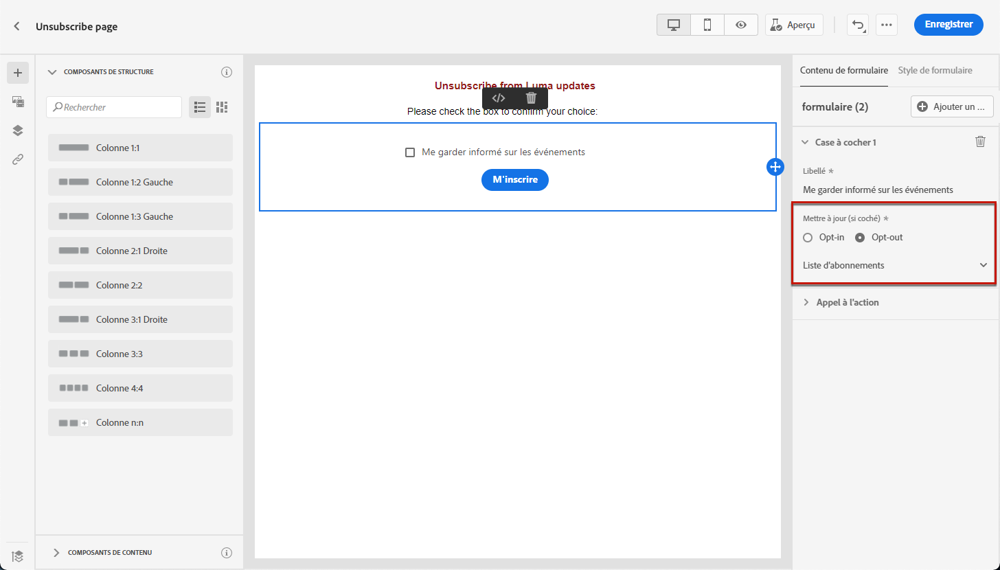

   <!--You can also build your own landing page and host it on the third-party system of your choice. To keep?-->

1. Ajouter une confirmation [subpage](create-lp.md#configure-subpages) qui s’affiche pour les utilisateurs qui envoient le formulaire.

   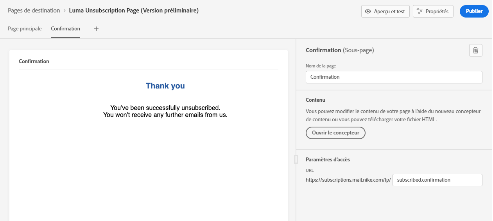

   >[!NOTE]
   >
   >Veillez à référencer la sous-page dans la variable **[!UICONTROL Formulaire]** du composant **[!UICONTROL Appel à l’action]** de la Principale page. [En savoir plus](design-lp.md)

1. Une fois que vous avez configuré et défini le contenu de vos pages, [publier](create-lp.md#publish) la landing page.

   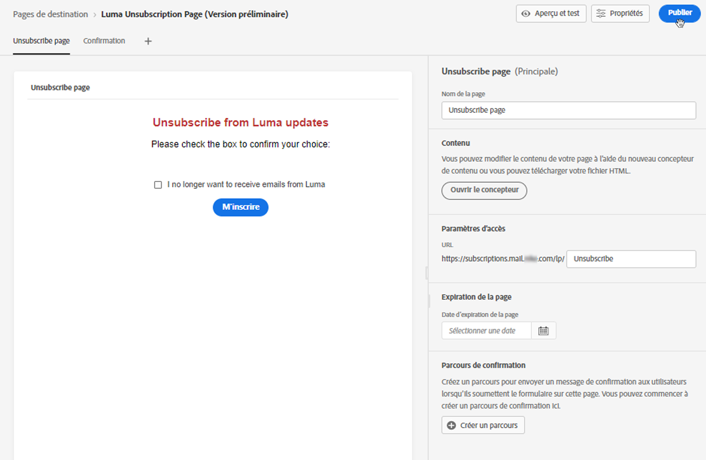

1. [Création d’un message électronique](../create-message.md) in [!DNL Journey Optimizer].

1. Sélectionnez du texte dans votre contenu et [insérer un lien](../message-tracking.md#insert-links) à l’aide de la barre d’outils contextuelle. Vous pouvez également utiliser un lien sur un bouton.

   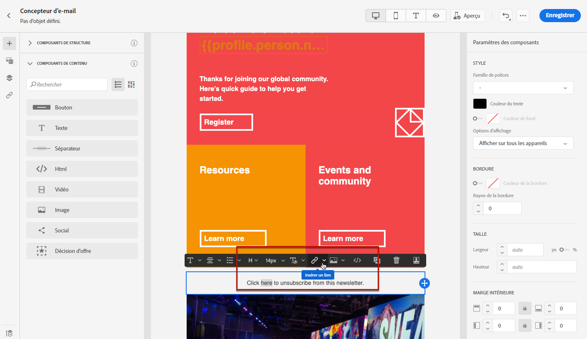

1. Sélectionner **[!UICONTROL Landing page]** de la **[!UICONTROL Type de lien]** et sélectionnez l’option [landing page](create-lp.md#configure-primary-page) que vous avez créé pour vous exclure.

   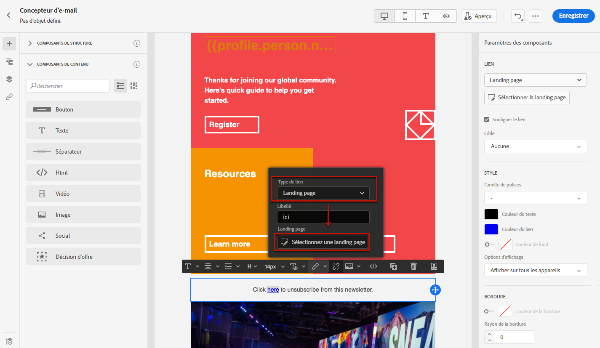

1. Enregistrez votre contenu et [publiez votre message](../publish-manage-message.md).

1. Envoyez votre message par un parcours. [En savoir plus](../building-journeys/journey.md).

1. Une fois le message reçu, si un destinataire clique sur le lien de désabonnement contenu dans l&#39;email, votre landing page s&#39;affiche.

   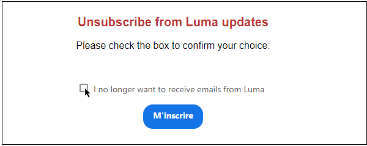

1. Sur la landing page, si le destinataire coche la case et envoie le formulaire :

   * Le destinataire opt-out est redirigé vers l&#39;écran du message de confirmation.

   * Les données de profil sont mises à jour et ne recevront aucune communication de votre marque, sauf si vous vous êtes à nouveau abonné.

Pour vérifier que le choix du profil correspondant a été mis à jour, accédez à Experience Platform et accédez au profil en sélectionnant un espace de noms d&#39;identité et une valeur d&#39;identité correspondante. Pour en savoir plus, consultez la [documentation d’Experience Platform](https://experienceleague.adobe.com/docs/experience-platform/profile/ui/user-guide.html?lang=fr#getting-started){target=&quot;_blank&quot;}.

Dans l&#39;onglet **[!UICONTROL Attributs]**, vous pouvez voir la valeur de **[!UICONTROL choice]** remplacée par **[!UICONTROL no]**.

<!--

### Other ways to opt out

You can also enable your recipients to unsubscribe whithout using landing pages.

* **One-click opt-out**

    You can add a one-click opt-out link into your email content. This will enable your recipients to quickly unsubscribe from your communications, without being redirected to a landing page where they need to confirm opting out. [Learn more](../message-tracking.md#one-click-opt-out-link)

* **Unsubscribe link in header**

    If the recipients' email client supports displaying an unsubscribe link in the email header, emails sent with [!DNL Journey Optimizer] automatically include this link. [Learn more](../consent.md#unsubscribe-email)
-->
