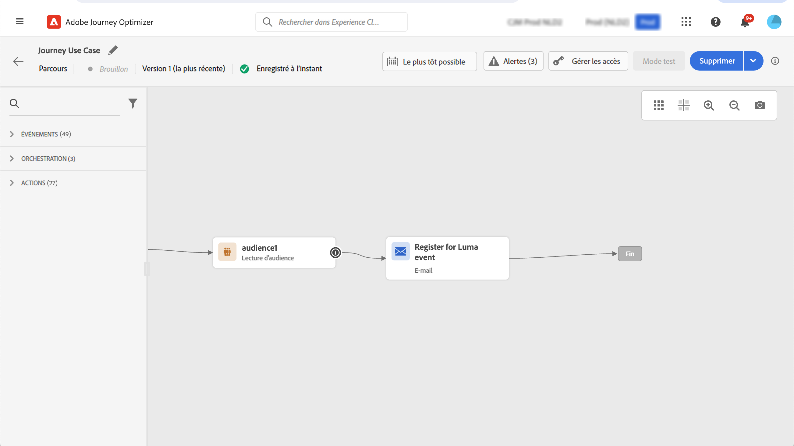
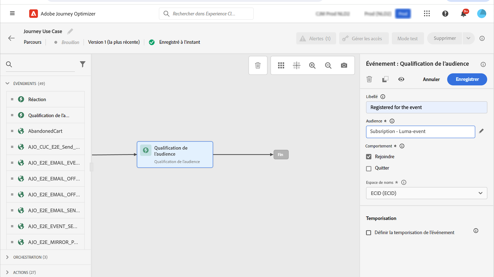

# Cas pratiques de landing page {#lp-use-cases}

Vous trouverez ci-dessous quelques exemples d’utilisation [!DNL Journey Optimizer] landing pages pour que vos clients s’abonnent/se désabonnent de la réception de certaines ou de toutes vos communications.

## Abonnement à un service {#subscription-to-a-service}

L’un des cas d’utilisation les plus courants consiste à inviter vos clients à [abonnement à un service](subscription-list.md) (comme une newsletter ou un événement) via une landing page. Les principales étapes sont présentées dans le graphique ci-dessous :

Supposons, par exemple, que vous organisiez un événement le mois prochain et que vous souhaitiez lancer une campagne d’enregistrement d’événement.<!--to keep your customers that are interested updated on that event-->. Pour ce faire, vous allez envoyer un email comprenant un lien vers une landing page qui permettra à vos destinataires de s&#39;inscrire pour cet événement. Les utilisateurs qui s’inscrivent seront ajoutés à la liste d’abonnements que vous avez créée à cet effet.

### Configurer une landing page {#set-up-lp}

1. Créez la liste d’abonnements de l’enregistrement de l’événement, qui stockera les utilisateurs enregistrés. Découvrez comment créer une liste d’abonnements [here](subscription-list.md#define-subscription-list).

   

1. [Créer une landing page](create-lp.md) pour permettre aux destinataires de s&#39;inscrire à votre événement.

   

1. Configurer l’enregistrement [page d’entrée principale](create-lp.md#configure-primary-page).

1. Lors de la conception de la variable [contenu de la page d’entrée](design-lp.md), sélectionnez la liste d&#39;abonnements que vous avez créée pour la mettre à jour avec les profils qui cochent la case d&#39;enregistrement.

   

1. Créez une page de remerciement qui s&#39;affichera à vos destinataires une fois le formulaire d&#39;inscription envoyé. Découvrez comment configurer des sous-pages d’entrée [here](create-lp.md#configure-subpages).

   

1. [Publier](create-lp.md#publish) la landing page.

1. Dans un [parcours](../building-journeys/journey.md), ajoutez une **Email** activité pour diriger le trafic vers la landing page d’inscription.

   

1. [Concevoir l&#39;email](../email/get-started-email-design.md) pour annoncer que l’inscription est maintenant ouverte à votre événement.

1. [Insérer un lien](../email/message-tracking.md#insert-links) dans le contenu de votre message. Sélectionner **[!UICONTROL Landing page]** comme la propriété **[!UICONTROL Link type]** et sélectionnez la variable [landing page](create-lp.md#configure-primary-page) que vous avez créé pour enregistrement.

   

   >[!NOTE]
   >
   >Pour pouvoir envoyer votre message, vérifiez que la landing page sélectionnée n&#39;a pas encore expiré. Découvrez comment mettre à jour la date d’expiration [dans cette section](create-lp.md#configure-primary-page).

   Une fois qu&#39;ils ont reçu l&#39;email, si vos destinataires cliquent sur le lien vers la landing page, ils sont redirigés vers la page &#39;Merci&#39; et ils seront ajoutés à la liste d&#39;abonnements.

### Envoyer un email de confirmation {#send-confirmation-email}

De plus, vous pouvez envoyer un email de confirmation aux destinataires qui se sont inscrits à votre événement. Pour ce faire, procédez comme suit.

1. Créer un autre [parcours](../building-journeys/journey.md). Vous pouvez le faire directement à partir de la landing page en cliquant sur le bouton **[!UICONTROL Create journey]** bouton . En savoir plus [here](create-lp.md#configure-primary-page)

   

1. Développez l’objet **[!UICONTROL Events]** catégorie et déposer une **[!UICONTROL Segment Qualification]** dans votre zone de travail. En savoir plus [here](../building-journeys/segment-qualification-events.md)

1. Cliquez sur dans le **[!UICONTROL Segment]** et sélectionnez la liste d’abonnements que vous avez créée.

   

1. Ajoutez un email de confirmation de votre choix et envoyez-le tout au long du parcours.

   

Tous les utilisateurs qui se sont inscrits à votre événement recevront l’e-mail de confirmation.

<!--The event registration's subscription list tracks the profiles who registered and you can send them targeted event updates.-->

## Exclusion {#opt-out}

Pour permettre aux destinataires de se désabonner de vos communications, vous pouvez inclure dans vos emails un lien vers une landing page d&#39;opt-out.

En savoir plus sur la gestion du consentement de vos destinataires et pourquoi cela est important dans [cette section](../privacy/opt-out.md).

### Gestion des opt-out {#opt-out-management}

Fournir aux destinataires la capacité de se désabonner de recevoir des communications d’une marque est une obligation légale. En savoir plus sur la législation applicable dans la section [Documentation d’Experience Platform](https://experienceleague.adobe.com/docs/experience-platform/privacy/regulations/overview.html#regulations){target=&quot;_blank&quot;}.

Par conséquent, vous devez toujours inclure une **lien de désabonnement** dans chaque email envoyé aux destinataires :

* Lorsque vous cliquez sur ce lien, les destinataires sont redirigés vers une landing page comprenant un bouton pour confirmer leur désinscription.
* Lorsque vous cliquez sur le bouton d’exclusion, les données de profil sont mises à jour avec ces informations.

### Configuration du droit d’opposition {#configure-opt-out}

Pour permettre aux destinataires d&#39;un email de se désabonner de vos communications par le biais d&#39;une landing page, procédez comme suit.

1. Créez votre landing page. [En savoir plus](create-lp.md)

1. Définissez la page principale. [En savoir plus](create-lp.md#configure-primary-page)

1. [Conception](design-lp.md) le contenu de la page principale : utiliser une landing page spécifique **[!UICONTROL Form]** composant, définir une **[!UICONTROL Opt-out]** et choisissez de mettre à jour **[!UICONTROL Channel (email)]**: le profil qui coche la zone d’exclusion sur votre page d’entrée sera exclu de toutes vos communications.

   

   <!--You can also build your own landing page and host it on the third-party system of your choice.-->

1. Ajouter une confirmation [subpage](create-lp.md#configure-subpages) qui s’affiche pour les utilisateurs qui envoient le formulaire.

   

   >[!NOTE]
   >
   >Veillez à référencer la sous-page dans le **[!UICONTROL Call to action]** de la section **[!UICONTROL Form]** composant. [En savoir plus](design-lp.md)

1. Une fois que vous avez configuré et défini le contenu de vos pages, [publier](create-lp.md#publish) la landing page.

   

1. [Création d’un message électronique](../email/get-started-email-design.md) dans un parcours.

1. Sélectionnez du texte dans votre contenu et [insérer un lien](../email/message-tracking.md#insert-links) à l’aide de la barre d’outils contextuelle. Vous pouvez également utiliser un lien sur un bouton.

   

1. Sélectionner **[!UICONTROL Landing page]** de la **[!UICONTROL Link type]** et sélectionnez l’option [landing page](create-lp.md#configure-primary-page) que vous avez créé pour vous exclure.

   

   >[!NOTE]
   >
   >Pour pouvoir envoyer votre message, vérifiez que la landing page sélectionnée n&#39;a pas encore expiré. Découvrez comment mettre à jour la date d’expiration [dans cette section](create-lp.md#configure-primary-page).

1. Publiez et exécutez le parcours. [En savoir plus](../building-journeys/journey.md).

1. Une fois le message reçu, si un destinataire clique sur le lien de désabonnement contenu dans l&#39;email, votre landing page s&#39;affiche.

   

   Si le destinataire coche la case et envoie le formulaire :

   * Le destinataire opt-out est redirigé vers l&#39;écran du message de confirmation.

   * Les données de profil sont mises à jour et ne recevront aucune communication de votre marque, sauf si vous vous êtes à nouveau abonné.

Pour vérifier que le choix du profil correspondant a été mis à jour, accédez à Experience Platform et au profil en sélectionnant un espace de noms d’identité et une valeur d’identité correspondante. En savoir plus dans la section [Documentation d’Experience Platform](https://experienceleague.adobe.com/docs/experience-platform/profile/ui/user-guide.html#getting-started){target=&quot;_blank&quot;}.

Dans le **[!UICONTROL Attributes]** vous pouvez voir que la valeur de **[!UICONTROL choice]** a été remplacé par **[!UICONTROL no]**.

<!--

### Other ways to opt out

You can also enable your recipients to unsubscribe whithout using landing pages.

* **One-click opt-out**

    You can add a one-click opt-out link into your email content. This will enable your recipients to quickly unsubscribe from your communications, without being redirected to a landing page where they need to confirm opting out. [Learn more](../privacy/opt-out.md#one-click-opt-out-link)

* **Unsubscribe link in header**

    If the recipients' email client supports displaying an unsubscribe link in the email header, emails sent with [!DNL Journey Optimizer] automatically include this link. [Learn more](../privacy/opt-out.md#unsubscribe-header)

////////

## Leverage landing page submission event {#leverage-lp-event}

You can use information that was submitted on a landing page to send communications to your customers. For example, if a user subscribes to a given subscription list, you can leverage that information to send an email recommending other subscription lists to that user.

To do this, you need to create an event containing the landing page submission information and use it in a journey. Follow the steps below.

1. Go to **[!UICONTROL Administration]** > **[!UICONTROL Configurations]**, and in the **[!UICONTROL Events]** section, select **[!UICONTROL Manage]**.

    

1. The list of events displays. Select **[!UICONTROL Create Event]**.

    

1. The event configuration pane opens on the right side of the screen. Configure a rule-based unitary event. [Learn more](../event/about-creating.md)

1. Define the schema: select **[!UICONTROL AJO Email Tracking Experience Event Schema v.1]** (available by default in [!DNL Journey Optimizer]).

    

1. In the **[!UICONTROL Fields]** section, select the following elements:

    * **[!UICONTROL _experience]** > **[!UICONTROL customerJourneyManagement]** > **[!UICONTROL messageInteraction]** > **[!UICONTROL Interaction Type]**
    
    * **[!UICONTROL _experience]** > **[!UICONTROL customerJourneyManagement]** > **[!UICONTROL messageInteraction]** > **[!UICONTROL Landing Page Details]** > **[!UICONTROL Landing Page ID]**

    

1. Click inside the **[!UICONTROL Event ID condition]** field. Using the simple expression editor, define the condition for the **[!UICONTROL Interaction Type]** and **[!UICONTROL Landing Page ID]** fields. This will be used by the system to identify the events that will trigger your journey.

    

    >[!NOTE]
    >
    >To find the landing page ID, you can insert the landing page as a link into an email and select the source code from the contextual toolbar to display the landing page information.
    >
    >

1. Save your changes.

1. Create a [journey](../building-journeys/journey.md). You can do it directly from the landing page by clicking the **[!UICONTROL Create journey]** button. Learn more [here](create-lp.md#configure-primary-page)

    

1. In the journey, unfold the **[!UICONTROL Events]** category and drop the event that you created into the canvas. Learn more [here](../building-journeys/segment-qualification-events.md)

    

1. Unfold the **[!UICONTROL Actions]** category and drop an email action into the canvas.

    

///How do you use the information from the event to send an email to the users? -->
