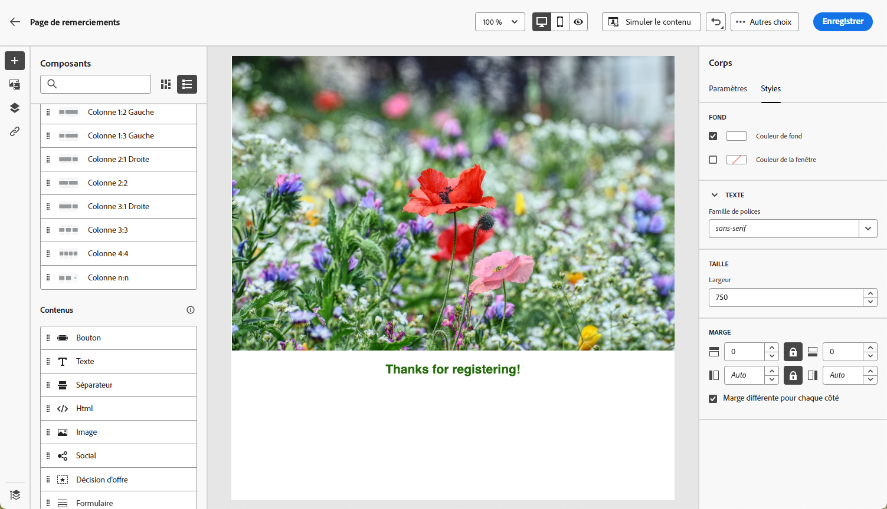
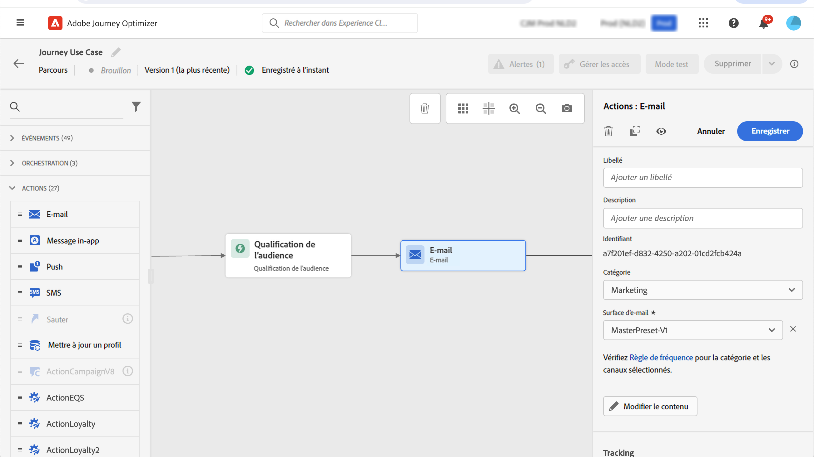

# Cas d’utilisation de pages de destination {#lp-use-cases}

Retrouvez ci-dessous quelques exemples sur la façon dont vous pouvez utiliser les pages de destination de [!DNL Journey Optimizer] afin que vos clientes et clients puissent donner leur opt-in ou opt-out concernant la réception de certaines ou de toutes vos communications.

## S’abonner à un service {#subscription-to-a-service}

L’un des cas d’utilisation les plus courants consiste à inviter vos clients à [sʼabonner à un service](subscription-list.md) (comme une newsletter ou un événement) par le biais dʼune page de destination. Retrouvez les étapes principales dans le graphique ci-dessous :

Supposons, par exemple, que vous organisiez un événement le mois prochain et que vous souhaitiez lancer une campagne d’inscription à cet événement<!--to keep your customers that are interested updated on that event-->. Pour ce faire, vous allez envoyer un e-mail qui contient un lien vers une page de destination sur laquelle vos destinataires pourront sʼinscrire à cet événement. Les utilisateurs qui s’inscrivent seront ajoutés à la liste d’abonnements que vous avez créée à cet effet.

### Configurer une page de destination {#set-up-lp}

Pour configurer une page de destination pour l’enregistrement à un événement, vous allez créer une liste d’abonnements, concevoir la page de destination avec un formulaire d’enregistrement et configurer les pages et paramètres nécessaires. Procédez comme suit :

1. Créez la liste d’abonnements relative aux inscriptions à l’événement, qui stockera les utilisateurs inscrits. Découvrez comment créer une liste d’abonnements [ici](subscription-list.md#define-subscription-list).

   

1. [Créez une page de destination](create-lp.md) pour permettre aux destinataires de sʼinscrire à votre événement.

   

1. Configurez la [page principale de la page de destination](create-lp.md#configure-primary-page).

1. Lors de la conception du [contenu de la page de destination](design-lp.md), sélectionnez la liste dʼabonnements créée pour la mettre à jour avec les profils ayant coché la case dʼinscription.

   

1. Créez une page de remerciement qui sʼaffichera pour vos destinataires une fois le formulaire dʼinscription envoyé. Découvrez comment configurer des sous-pages de page de destination [ici](create-lp.md#configure-subpages).

   

1. [Publier](create-lp.md#publish-landing-page) la page de destination.

1. Dans un [parcours](../building-journeys/journey.md), ajoutez une activité **E-mail** pour diriger le trafic vers la page de destination d’inscription.

   

1. [Concevez un e-mail](../email/get-started-email-design.md) pour annoncer que l’inscription à lʼévénement a débuté.

1. [Insérez un lien](../email/message-tracking.md#insert-links) dans le contenu de votre message. Sélectionnez **[!UICONTROL Page de destination]** en tant que **[!UICONTROL Type de lien]** et sélectionnez la [Page de destination](create-lp.md#configure-primary-page) que vous avez créée pour lʼinscription.

   

   >[!NOTE]
   >
   >Pour pouvoir envoyer votre message, vérifiez que la page de destination sélectionnée n’a pas encore expiré. Découvrez comment mettre à jour la date d’expiration [dans cette section](create-lp.md#configure-primary-page).

   Une fois que vos destinataires ont reçu lʼe-mail, sʼils cliquent sur le lien vers la page de destination, ils seront redirigés vers la page de remerciement et seront ajoutés à la liste dʼabonnements.

### Envoi d’un e-mail de confirmation {#send-confirmation-email}

Vous pouvez également envoyer un e-mail de confirmation aux destinataires qui se sont inscrits à votre événement. Pour ce faire, procédez comme suit.

1. Créez un autre [parcours](../building-journeys/journey.md). Vous pouvez le faire directement à partir de la page de destination en cliquant sur le bouton **[!UICONTROL Créer un parcours]**. [En savoir plus](create-lp.md#configure-primary-page).

   

1. Développez la catégorie **[!UICONTROL Événements]** et déposez une activité de **[!UICONTROL qualification d’audience]** dans la zone de travail. [En savoir plus](../building-journeys/audience-qualification-events.md).

1. Cliquez dans le champ **[!UICONTROL Audience]** et sélectionnez la liste d’abonnements que vous avez créée.

   

1. Ajoutez lʼe-mail de confirmation de votre choix et envoyez-le par le biais du parcours.

   

Tous les utilisateurs inscrits à votre événement recevront l’e-mail de confirmation.

<!--The event registration's subscription list tracks the profiles who registered and you can send them targeted event updates.-->

## Page de destination d’opt-out {#opt-out}

Pour permettre aux personnes destinataires de se désabonner de vos communications, vous pouvez inclure dans vos e-mails un lien vers une page de destination d’opt-out.

>[!NOTE]
>
>En savoir plus sur la gestion du consentement de vos destinataires et son importance dans [cette section](../privacy/opt-out.md).

### Gestion du droit d&#39;opposition {#opt-out-management}

La possibilité pour les destinataires de se désabonner de la réception des communications d&#39;une marque est une exigence légale. Pour en savoir plus sur la législation applicable, consultez la [documentation Experience Platform](https://experienceleague.adobe.com/docs/experience-platform/privacy/regulations/overview.html?lang=fr#regulations){target="_blank"}.

Par conséquent, vous devez toujours inclure un **lien de désabonnement** dans chaque e-mail envoyé aux destinataires :

* Lorsqu&#39;ils cliquent sur ce lien, les destinataires sont dirigés vers une page de destination contenant un bouton pour confirmer leur désinscription.
* Lorsque le destinataire clique sur le bouton d&#39;opt-out, les données de son profil sont mises à jour avec ces informations.

### Configurer la procédure d’opt-out des e-mails {#configure-opt-out}

Pour permettre aux personnes destinataires dʼun e-mail dʼannuler leur abonnement à vos communications par le biais dʼune page de destination, procédez comme suit :

1. Créez votre page de destination. [En savoir plus](create-lp.md)

1. Définissez la page principale. [En savoir plus](create-lp.md#configure-primary-page)

1. [Configurez](design-lp.md) le contenu de la page principale. Pour ce faire, utilisez le composant **[!UICONTROL Formulaire]**, spécialement conçu pour la page de destination, définissez une case à cocher **[!UICONTROL Opt-out]** et choisissez de mettre à jour le **[!UICONTROL Canal (e-mail)]** : le profil qui active la case d&#39;opt-out sur votre page de destination sera désinscrit de toutes vos communications.

   

   <!--You can also build your own landing page and host it on the third-party system of your choice.-->

1. Ajoutez une [sous-page](create-lp.md#configure-subpages) de confirmation qui s’affichera pour les utilisateurs qui soumettent le formulaire.

   

   >[!NOTE]
   >
   >Veillez à référencer la sous-page dans la section **[!UICONTROL Appel à l’action]** de la page principale du composant **[!UICONTROL Formulaire]**. [En savoir plus](design-lp.md)

1. Une fois que vous avez configuré et défini le contenu de vos pages, [publiez](create-lp.md#publish-landing-page) la page de destination.

1. [Créez un e-mail](../email/get-started-email-design.md) dans un parcours.

1. Sélectionnez du texte dans votre contenu et [insérez un lien](../email/message-tracking.md#insert-links) à l’aide de la barre d’outils contextuelle. Vous pouvez également employer un lien sur un bouton.

1. Sélectionnez **[!UICONTROL Page de destination]** dans la liste déroulante **[!UICONTROL Type de lien]**, puis sélectionnez la [page de destination](create-lp.md#configure-primary-page) que vous avez créée pour le désabonnement.

   

   >[!NOTE]
   >
   >Pour pouvoir envoyer votre message, vérifiez que la page de destination sélectionnée n’a pas encore expiré. Découvrez comment mettre à jour la date d’expiration [dans cette section](create-lp.md#configure-primary-page).

1. Publiez et exécutez le parcours. [En savoir plus](../building-journeys/journey.md).

1. Une fois le message reçu, si le destinataire clique sur le lien de désabonnement présent dans lʼe-mail, votre page de destination s’affiche.

   

   Si le destinataire coche la case et soumet le formulaire :

   * Le destinataire qui sʼest désabonné est redirigé vers lʼécran du message de confirmation.

   * Les données de son profil sont mises à jour et il ne recevra plus de communications de votre marque, sauf sʼil sʼabonne à nouveau.

Pour vérifier que le choix du profil correspondant a été mis à jour, accédez à Experience Platform puis au profil en sélectionnant un espace de noms d’identité et une valeur d’identité correspondante. Pour en savoir plus, consultez la [documentation Experience Platform](https://experienceleague.adobe.com/docs/experience-platform/profile/ui/user-guide.html?lang=fr#getting-started){target="_blank"}.

Dans l’onglet **[!UICONTROL Attributs]**, la valeur du **[!UICONTROL choix]** a été remplacée par **[!UICONTROL non]**.

Les informations concernant les désinscriptions sont stockées dans le **Jeu de données du service de consentement**. [En savoir plus sur les jeux de données](../data/get-started-datasets.md)

>[!NOTE]
>
>Si la méthode de fusion de votre politique de fusion de **[!UICONTROL profils]** [Adobe Experience Platform](https://experienceleague.adobe.com/docs/experience-platform/profile/home.html?lang=fr){target="_blank"} par défaut est **[!UICONTROL Précédence du jeu de données]**, veillez à activer le **[!UICONTROL jeu de données du service de consentement AJO]** et à lui donner la priorité dans la politique de fusion. [En savoir plus](https://experienceleague.adobe.com/docs/experience-platform/profile/merge-policies/ui-guide.html?lang=fr#dataset-precedence-profile){target="_blank"}
>
>Même si aucun lot n’a été ajouté à ce jeu de données, il contiendra toujours les informations d’opt-in et d’opt-out.

**Voir également :**

* [Opt-out en un clic](../email/email-opt-out.md#one-click-opt-out)
* [Lien d’exclusion dans l’en-tête de l’e-mail](../email/email-opt-out.md#unsubscribe-header)

<!--

### Other ways to opt out

You can also enable your recipients to unsubscribe whithout using landing pages.

* **One-click opt-out**

    You can add a one-click opt-out link into your email content. This will enable your recipients to quickly unsubscribe from your communications, without being redirected to a landing page where they need to confirm opting out. [Learn more](../privacy/opt-out.md#opt-out-personalization)

* **Unsubscribe link in header**

    If the recipients' email client supports displaying an unsubscribe link in the email header, emails sent with [!DNL Journey Optimizer] automatically include this link. [Learn more](../email/email-opt-out.md#unsubscribe-header)

-->

## Exploiter l’événement de soumission de la page de destination {#leverage-lp-event}

Vous pouvez utiliser les informations envoyées sur une page de destination pour effectuer d’autres actions. Par exemple, si un utilisateur s’abonne à une liste d’abonnements donnée, vous pouvez exploiter ces informations pour envoyer un e-mail recommandant d’autres listes d’abonnements à cet utilisateur.

Pour ce faire, vous devez créer un [événement unitaire basé sur des règles](../event/about-creating.md) basé sur le **[!UICONTROL Schéma d’événement d’expérience de tracking d’e-mail AJO]** contenant les informations d’envoi et [utiliser cet événement dans un parcours ](../building-journeys/general-events.md).

>[!NOTE]
>
>Lorsque vous utilisez des événements d’envoi de page de destination, sachez que le champ de `interactionType` d’événement peut ne pas toujours refléter précisément l’action spécifique de l’utilisateur. Pour déterminer avec précision si un utilisateur s’est désabonné, s’est abonné ou a effectué une autre action, vérifiez toujours les attributs de profil réels (comme les préférences de consentement) ou les valeurs de champ de formulaire plutôt que de vous fier uniquement au `interactionType` d’événement.

<!--DETAILED STEPS TBC:

Follow the steps below.

1. Go to **[!UICONTROL Administration]** > **[!UICONTROL Configurations]**, and in the **[!UICONTROL Events]** section, select **[!UICONTROL Manage]**.

    

1. The list of events displays. Select **[!UICONTROL Create Event]**.

    

1. The event configuration pane opens on the right side of the screen. Configure a rule-based unitary event. [Learn more](../event/about-creating.md)

1. Define the schema: select **[!UICONTROL AJO Email Tracking Experience Event Schema v.1]** (available by default in [!DNL Journey Optimizer]).

    

1. In the **[!UICONTROL Fields]** section, select the following elements:

    * **[!UICONTROL _experience]** > **[!UICONTROL customerJourneyManagement]** > **[!UICONTROL messageInteraction]** > **[!UICONTROL Interaction Type]**
    
    * **[!UICONTROL _experience]** > **[!UICONTROL customerJourneyManagement]** > **[!UICONTROL messageInteraction]** > **[!UICONTROL Landing Page Details]** > **[!UICONTROL Landing Page ID]**

    

1. Click inside the **[!UICONTROL Event ID condition]** field. Using the simple personalization editor, define the condition for the **[!UICONTROL Interaction Type]** and **[!UICONTROL Landing Page ID]** fields. This will be used by the system to identify the events that will trigger your journey.

    

    >[!NOTE]
    >
    >To find the landing page ID, you can insert the landing page as a link into an email and select the source code from the contextual toolbar to display the landing page information.
    >
    >

1. Save your changes.

1. Create a [journey](../building-journeys/journey.md). You can do it directly from the landing page by clicking the **[!UICONTROL Create journey]** button. Learn more [here](create-lp.md#configure-primary-page)

    

1. In the journey, unfold the **[!UICONTROL Events]** category and drop the event that you created into the canvas. Learn more [here](../building-journeys/audience-qualification-events.md)

    

1. Unfold the **[!UICONTROL Actions]** category and drop an email action into the canvas.

    

///How do you use the information from the event to send an email to the users? -->
