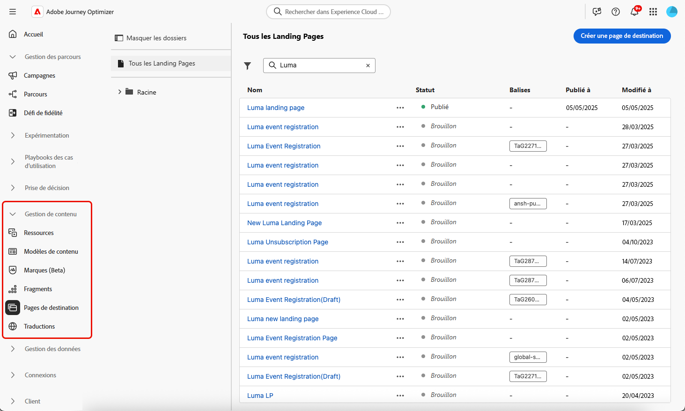

# Gestion des pages de destination {#manage-lp}

## Accéder aux pages de destination {#access-landing-pages}

Pour accéder à la liste des pages de destination, sélectionnez **[!UICONTROL Gestion du contenu]** > **[!UICONTROL Pages de destination]** dans le menu de gauche.

Toutes les pages de destination existantes s’affichent.

Le volet de gauche vous permet d’organiser les pages de destination en dossiers. Par défaut, tous les éléments s’affichent. Lors de la sélection d’un dossier, seules les pages de destination et les dossiers inclus dans le dossier sélectionné s’affichent. [En savoir plus](#folders)

Pour trouver un élément spécifique, commencez à saisir un nom dans le champ de recherche. Lorsqu’un [dossier](#folders) est sélectionné, la recherche s’applique à toutes les pages de destination ou à tous les dossiers du premier niveau de la hiérarchie de ce dossier<!--(not nested items)-->.

Vous pouvez filtrer les pages de destination en fonction de leur statut, de leur date de modification ou de leurs balises.

Dans cette liste, vous pouvez cliquer sur les trois points en regard d’une page de destination et sélectionner l’action souhaitée :

* Pour les pages de destination [publiées](create-lp.md#publish-landing-page), accédez au [rapport sur les pages de destination](../reports/lp-report-global-cja.md) et au [rapport dynamique sur les dernières 24 heures](../reports/lp-report-live.md).

* **Supprimer** et **Dépublier** une page de destination. Vous ne pouvez pas supprimer une page de destination [publiée](create-lp.md#publish-landing-page). Pour la supprimer, vous devez d’abord la dépublier.

  >[!CAUTION]
  >
  >Si vous dépubliez une page de destination référencée dans un message, le lien vers celle-ci est rompu et les personnes qui tentent d’y accéder verront une page d’erreur.

* **Dupliquer** toute page de destination.

* Modifiez les [balises](../start/search-filter-categorize.md#tags) associées à une page de destination.

* Déplacez la page de destination vers un dossier. [En savoir plus](#folders)

## Utiliser des dossiers pour gérer les pages de destination {#folders}

>[!CONTEXTUALHELP]
>id="ajo_lp_folders"
>title="Organisation de vos pages de destination en dossiers"
>abstract="Utilisez des dossiers pour classer et gérer vos pages de destination en fonction des besoins de votre organisation."

Pour parcourir facilement vos pages de destination, vous pouvez utiliser des dossiers pour les organiser plus efficacement dans une hiérarchie structurée. Vous pouvez ainsi classer et gérer les éléments en fonction des besoins de votre organisation.

1. Cliquez sur le bouton **[!UICONTROL Toutes les pages de destination]** pour afficher tous les éléments créés précédemment sans le regroupement des dossiers.

   

1. Cliquez sur le dossier **[!UICONTROL racine]** pour afficher tous les dossiers créés.

   >[!NOTE]
   >
   >Si vous n’avez pas encore créé de dossiers, toutes les pages de destination s’affichent.

1. Cliquez sur n’importe quel dossier à l’intérieur du dossier **[!UICONTROL racine]** pour afficher son contenu.

1. Cliquez sur le dossier **[!UICONTROL racine]** ou sur n’importe quel autre dossier pour afficher le bouton **[!DNL Create folder]**. Sélectionnez-le.

   

1. Saisissez le nom du nouveau dossier, puis cliquez sur **[!UICONTROL Enregistrer]**. Le nouveau dossier s’affiche à l’intérieur du dossier **[!UICONTROL racine]** ou dans le dossier actuellement sélectionné.

1. Vous pouvez cliquer sur le bouton **[!UICONTROL Plus d’actions]** pour renommer ou supprimer le dossier.

   

1. À l’aide du bouton **[!UICONTROL Autres actions]**, vous pouvez également déplacer des pages de destination vers un autre dossier existant.

1. Vous pouvez maintenant accéder au dossier que vous venez de créer. Chaque nouvelle page de destination que vous [créez](create-lp.md#create-landing-page.md) est enregistrée dans le dossier actif.

   
