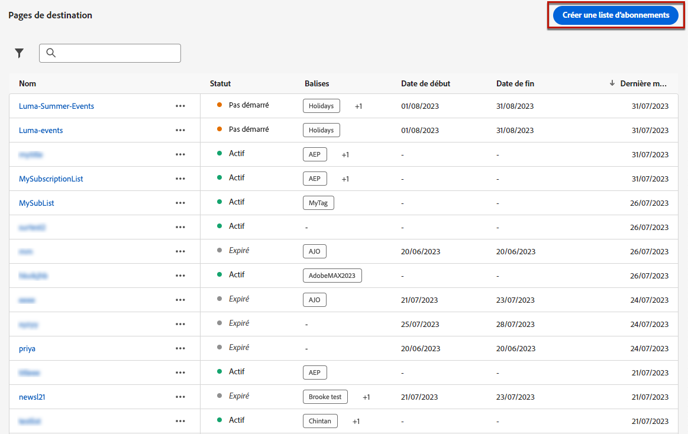
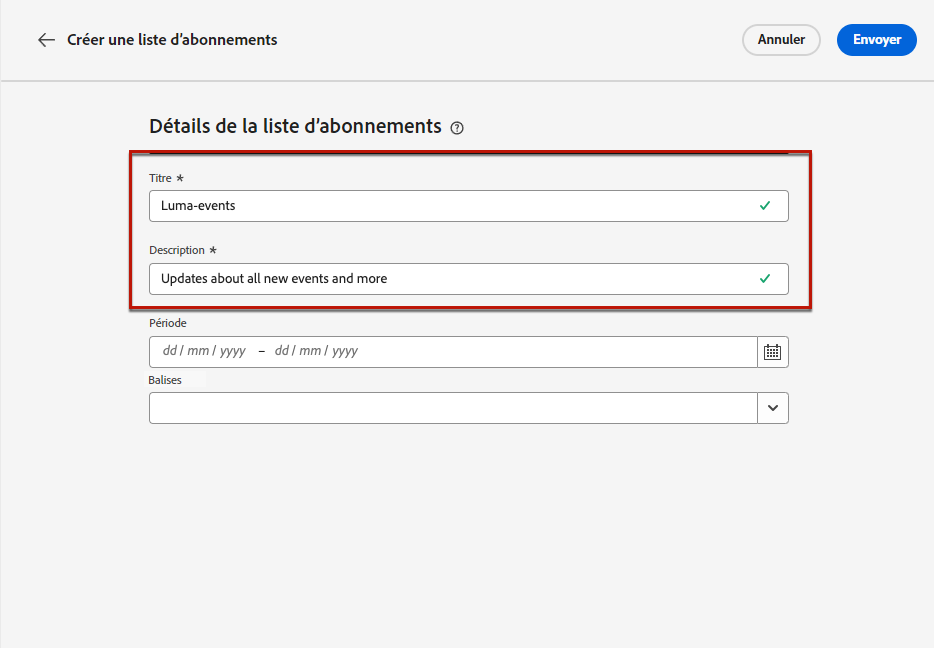
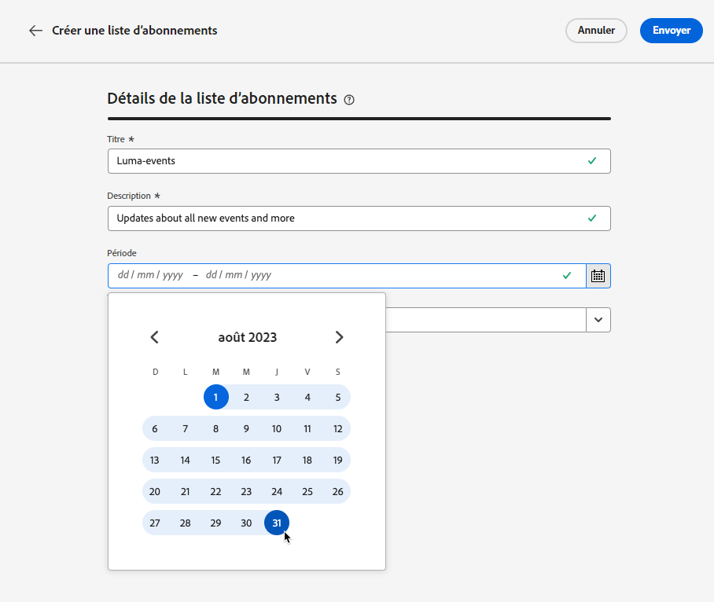
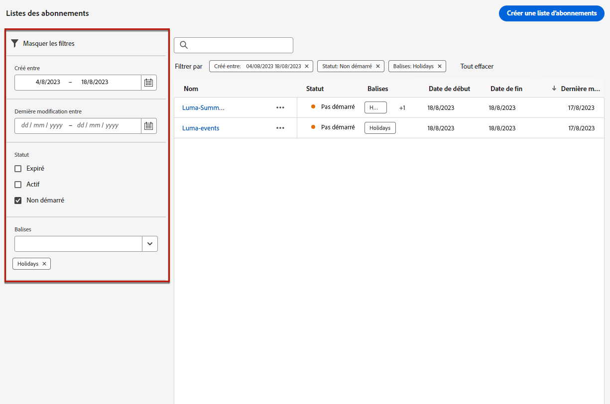

# Listes des abonnements {#create-subscription-list}

>[!CONTEXTUALHELP]
>id="ajo_subscription_list"
>title="Configurer une liste d’abonnements"
>abstract="Créez une liste d’abonnements afin de rassembler les profils ayant accepté de recevoir des communications sur un objet ou un événement spécifique. "
>additional-url="https://experienceleague.adobe.com/docs/journey-optimizer/using/content-management/landing-pages/subscription-list.html?lang=fr#define-subscription-list" text="Créer une liste dʼabonnements"

Un service d’abonnement fait référence aux produits et services marketing fournis aux clients qui ont choisi de recevoir des communications sur un sujet/événement/intérêt spécifique etc. de manière régulière. Dans [!DNL Journey Optimizer], ces clients inscrits sont regroupés dans une liste d’abonnements.

Voici quelques exemples de services dʼabonnement :

* une newsletter, par exemple : « Série de courses »
* un événement, par exemple : « Sommet 2021 »
* un webinaire, par exemple : « En savoir plus sur la crypto »
* un intérêt pour un produit/sport/service etc., par exemple : « Souhaite acheter une maison dans les 12 prochains mois »
* une préférence en matière de notification, par exemple : « Recevoir les notifications de nouvelles chansons par e-mail »

Les profils peuvent être ajoutés à une liste dʼabonnements au moyen dʼune [page de destination](create-lp.md). Retrouvez un exemple dans [cette section](lp-use-cases.md#subscription-to-a-service).

## Créer une liste dʼabonnements {#define-subscription-list}

>[!NOTE]
>
>Lorsque vous créez une liste d’abonnements, un segment de diffusion en continu associé est automatiquement généré dans Adobe Experience Platform. Pour que le segment de diffusion en continu soit créé avec succès, l’option **Active-On-Edge** doit être activée pour la politique de fusion. En savoir plus sur les critères d’éligibilité des segments de streaming dans la documentation de [Adobe Experience Platform](https://experienceleague.adobe.com/fr/docs/experience-platform/segmentation/methods/streaming-segmentation).

Pour créer une liste dʼabonnements, procédez comme suit :

1. Pour accéder aux listes dʼabonnements, sélectionnez **[!UICONTROL Client]** > **[!UICONTROL Liste dʼabonnements]**.

   

1. Cliquez sur le bouton **[!UICONTROL Créer une liste dʼabonnements]**.

   

1. Donnez-lui un titre et une description. Ces champs sont obligatoires.

   

   >[!CAUTION]
   >
   >Actuellement, vous ne pouvez pas utiliser d’espacement ou saisir un nom qui existe déjà pour une autre liste d’abonnements dans le champ **[!UICONTROL Titre]**.

1. Vous pouvez définir une date de début et de fin.

   

1. Sélectionnez ou créez des balises Adobe Experience Platform à partir du champ **[!UICONTROL Balises]** pour classer votre page de destination en vue d’une recherche améliorée. [En savoir plus](../start/search-filter-categorize.md#tags).

1. Cliquez sur **[!UICONTROL Enregistrer]**.

## Utiliser une liste dʼabonnements {#use-subscription-lists}

Une fois la liste d’abonnements créée, vous pouvez :

* Ajouter des profils à la liste d’abonnements

  Vous pouvez inviter des personnes à **rejoindre la liste**, en vous abonnant à une newsletter ou en vous inscrivant à un événement. Vous pouvez également **envoyer des messages personnalisés** aux personnes abonnées.

  Par exemple, pour inviter une audience à s’inscrire à un événement ou à s’abonner à une newsletter, vous pouvez lui envoyer un message avec un lien vers une page de destination afin qu’elle puisse rejoindre l’événement ou s’abonner. Les profils abonnés via le formulaire de la page de destination sont ajoutés à la liste d’abonnements que vous avez créée à cet effet.

* Envoyer des messages aux personnes abonnées

  Vous pouvez également utiliser les listes d’abonnements comme des audiences lorsque vous créez des parcours et ajoutez une personnalisation supplémentaire.

  Par exemple, lorsqu’une personne s’abonne à un service de streaming, elle peut déclencher l’envoi immédiat d’une série d’e-mails de bienvenue, ce qui l’incite à se connecter pour la première fois à l’application et à définir ses préférences de visionnage.

Découvrez comment utiliser votre liste d’abonnements dans [ce cas d’utilisation](lp-use-cases.md#subscription-to-a-service).

## Parcourir vos listes d’abonnements {#browse-subscription-lists}

La liste reprend toutes les listes dʼabonnements créées. Vous pouvez les filtrer en fonction de leur date de création ou de modification et de leur statut.

Voici les statuts possibles :

* **[!UICONTROL Non démarrée]** : vous avez défini une date de début postérieure à la date du jour en cours. Les profils abonnés ne recevront pas encore les communications relatives à cette liste dʼabonnements.
* **[!UICONTROL En direct]** : le jour en cours est compris entre les dates de début et de fin de la liste d’abonnements, ou vous n’avez pas défini de dates de fin/début, ce qui signifie que la liste d’abonnements est toujours active.
* **[!UICONTROL Expirée]** : la date de fin est dépassée, la liste dʼabonnements nʼest donc plus valide. Tout profil abonné ne recevra plus de communications relatives à cette liste dʼabonnements.

## Surveiller vos listes d’abonnements {#monitor-subscription-lists}

Vous pouvez surveiller lʼimpact de votre liste d’abonnements grâce à des rapports spécifiques. Vous pouvez accéder à deux types de rapports :

* Rapport dynamique sur les listes d’abonnements

  Les rapports dynamiques, accessibles à partir de l’onglet Dernières 24 heures, affichent les événements qui se sont produits au cours des dernières 24 heures, avec un intervalle de temps minimal de deux minutes à compter de l’occurrence de l’événement. [En savoir plus](../reports/subscription-report-live.md)

* Les rapports à toute heure sur les listes d’abonnements, avec Customer Journey Analytics

  Ces rapports globaux portent sur les événements qui se sont produits il y a au moins deux heures et couvrent les événements sur une période sélectionnée. Le **Rapport sur les abonnements** offre des informations essentielles sur les abonnements et désabonnements des profils associés à des listes spécifiques, vous aidant à comprendre l’efficacité des différentes campagnes et initiatives d’abonnement pour stimuler l’engagement et les conversions. [En savoir plus](../reports/subscription-report-global-cja.md)
