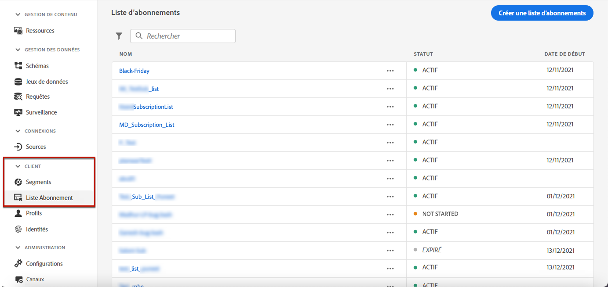
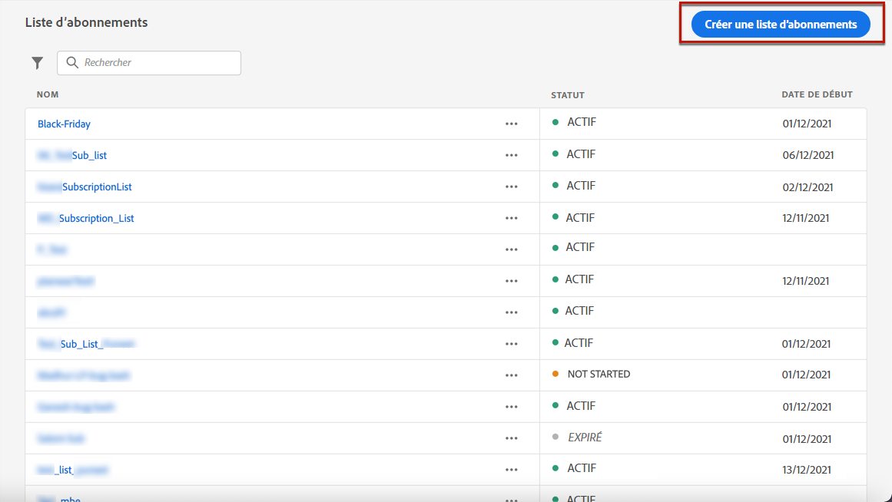
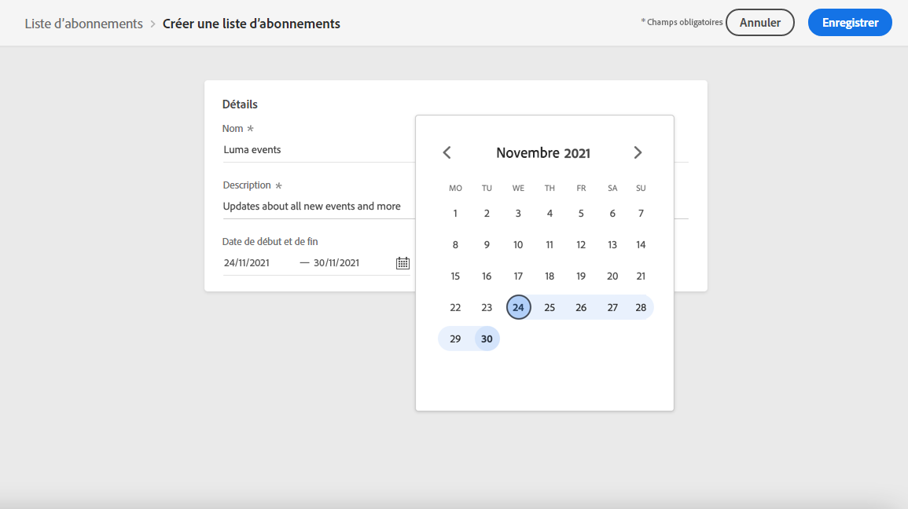
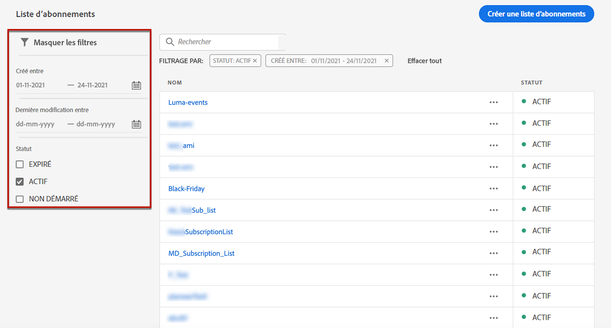

# Créer une liste d’abonnements {#create-subscription-list}

## Qu&#39;est-ce qu&#39;une liste d&#39;abonnements ?

Un service d’abonnement se rapporte aux produits et services marketing fournis aux clients qui ont choisi de recevoir des communications sur un sujet/événement/intérêt/etc. spécifique. sur une base continue. Dans [!DNL Journey Optimizer], ces clients inscrits sont regroupés dans une liste d’abonnements.

Un service d&#39;abonnement peut être :

* une newsletter, par exemple &quot;Série en cours&quot; ;
* un événement, par exemple &quot;Summit 2021&quot; ;
* un webinaire, par exemple &quot;En savoir plus sur le crypto&quot; ;
* un intérêt sur un produit/un sport/un service/etc. particulier, par exemple &quot;Intéressé à acheter une maison dans les 12 prochains mois&quot; ;
* une préférence sur la manière d’être informé, par exemple &quot;Recevoir de nouvelles notifications de chanson par email&quot; ;

Les profils peuvent être ajoutés à une liste d’abonnements au moyen d’un [landing page](create-lp.md). Un exemple est présenté dans la section [cette section](get-started-lp.md#subscription-to-a-service).

## Définition d’une liste d’abonnements {#define-subscription-list}

Pour créer une liste d&#39;abonnements, procédez comme suit.

1. Pour accéder aux listes d&#39;abonnements, sélectionnez **[!UICONTROL Client]** > **[!UICONTROL Liste d&#39;abonnements]**.

   

1. Dans la liste d’abonnements, cliquez sur **[!UICONTROL Créer un abonnement]** liste.

   

1. Ajoutez un nom et une description. Ces champs sont obligatoires.

1. Vous pouvez définir une date de début et une date de fin.

   

1. Cliquez sur **[!UICONTROL Enregistrer]**.

La liste affiche toutes les listes d&#39;abonnements créées. Vous pouvez les filtrer selon la date de création ou de modification.

Les statuts possibles sont les suivants :

* **[!UICONTROL Pas démarré]**: Vous avez défini une date de début postérieure à la date du jour en cours. Les profils abonnés à cette liste ne recevront pas encore de communications relatives à cette liste d&#39;abonnements.
* **[!UICONTROL En direct]**: Le jour en cours se compose de la date de début et de fin de la liste d’abonnements ou vous n’avez pas défini de date de fin/début, ce qui signifie que la liste d’abonnements est toujours active.
* **[!UICONTROL Expiré]**: La date de fin est passée, la liste d&#39;abonnements n&#39;est plus valide. Les profils inscrits à cette liste ne recevront aucune communication relative à cette liste d&#39;abonnements.

Une fois la liste d&#39;abonnements créée, vous pouvez l&#39;utiliser dans une landing page afin que les profils puissent s&#39;inscrire via un formulaire et être ajoutés à la liste. [En savoir plus](design-lp.md)

Vous pouvez également utiliser des listes d’abonnements comme segments lors de la création de parcours et de personnalisation.

<!--

**Questions**

* Can't see the newly created subscription list in UI because their name included spacing > bug - to follow up (should be fixed for Dec. release)

* How do you handle the different statuses? Live, Not started, Expired? Is it only through start/end dates?

* What does it mean when a subscription list is expired or not started? You can't use it in a LP? And if a user is subscribed to this service, then he won't receive communications any more?

* What else can you currently do with subscription lists apart from attach them to a landing page?

* Can you update the subscription list in a way other than through a LP? Not in UI but with APIs > to follow up with Fred

-->