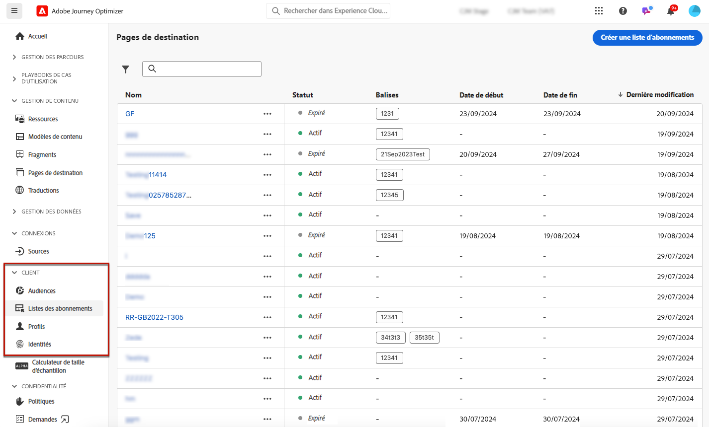

# Listes d&#39;abonnements {#create-subscription-list}

## Qu&#39;est-ce qu&#39;une liste d&#39;abonnements ? {#subscription-list-definition}

>[!CONTEXTUALHELP]
>id="ajo_subscription_list"
>title="Configurer une liste d’abonnements"
>abstract="Créez une liste d’abonnements afin de rassembler les profils ayant accepté de recevoir des communications sur un sujet ou un événement spécifique. "
>additional-url="https://experienceleague.adobe.com/docs/journey-optimizer/using/landing-pages/subscription-list.html#define-subscription-list" text="Créer une liste d’abonnements"

Un service d’abonnement se rapporte aux produits et services marketing fournis aux clients qui ont choisi de recevoir des communications sur un sujet/événement/intérêt/etc. spécifique. sur une base continue. Dans [!DNL Journey Optimizer], ces clients inscrits sont regroupés dans une liste d’abonnements.

Un service d&#39;abonnement peut être :

* une newsletter, par exemple : &quot;Série en cours&quot;
* un événement, par exemple : &quot;Summit 2021&quot;
* un webinaire, par exemple : &quot;En savoir plus sur le crypto&quot;
* un intérêt sur un produit/un sport/un service/etc., par exemple : &quot;Intéressé à acheter une maison dans les 12 prochains mois&quot;
* une préférence sur le mode de notification, par exemple : &quot;Recevez de nouvelles notifications de chanson par email&quot;

Les profils peuvent être ajoutés à une liste d’abonnements au moyen d’un [landing page](create-lp.md). Un exemple est présenté dans la section [cette section](lp-use-cases.md#subscription-to-a-service).

## Créer une liste d’abonnements {#define-subscription-list}

Pour créer une liste d&#39;abonnements, procédez comme suit.

1. Pour accéder aux listes d&#39;abonnements, sélectionnez **[!UICONTROL Customer]** > **[!UICONTROL Subscription list]**.

   

1. Sélectionnez la **[!UICONTROL Create subscription list]** bouton .

   

1. Ajoutez un titre et une description. Ces champs sont obligatoires.

   

   >[!CAUTION]
   >
   >Actuellement, vous ne pouvez pas utiliser d’espacement ou saisir un nom qui existe déjà pour une autre liste d’abonnements dans la variable **[!UICONTROL Title]** champ .

1. Vous pouvez définir une date de début et une date de fin.

   

1. Cliquez sur **[!UICONTROL Save]**.

La liste affiche toutes les listes d&#39;abonnements créées. Vous pouvez les filtrer selon la date de création ou de modification, et leur état.

Les statuts possibles sont les suivants :

* **[!UICONTROL Not started]**: Vous avez défini une date de début postérieure à la date du jour en cours. Les profils abonnés ne recevront pas encore de communications relatives à cette liste d&#39;abonnements.
* **[!UICONTROL Live]**: Le jour en cours se compose de la date de début et de fin de la liste d’abonnements ou vous n’avez pas défini de date de fin/début, ce qui signifie que la liste d’abonnements est toujours active.
* **[!UICONTROL Expired]**: La date de fin est dépassée, la liste d&#39;abonnements n&#39;est donc plus valide. Aucun profil abonné ne recevra aucune communication relative à cette liste d’abonnements.

Une fois la liste d&#39;abonnements créée, vous pouvez l&#39;utiliser dans une landing page. Les profils qui se connectent par le biais du formulaire de landing page seront ajoutés à la liste. [En savoir plus](design-lp.md)

Vous pouvez également utiliser des listes d’abonnements comme segments lorsque [création de parcours](../building-journeys/journey-gs.md#jo-build) et l’ajout de la personnalisation.

>[!NOTE]
>
>Vous pouvez surveiller les impacts de votre liste d’abonnements par le biais de rapports spécifiques. [En savoir plus](../reports/subscription-report-live.md)
