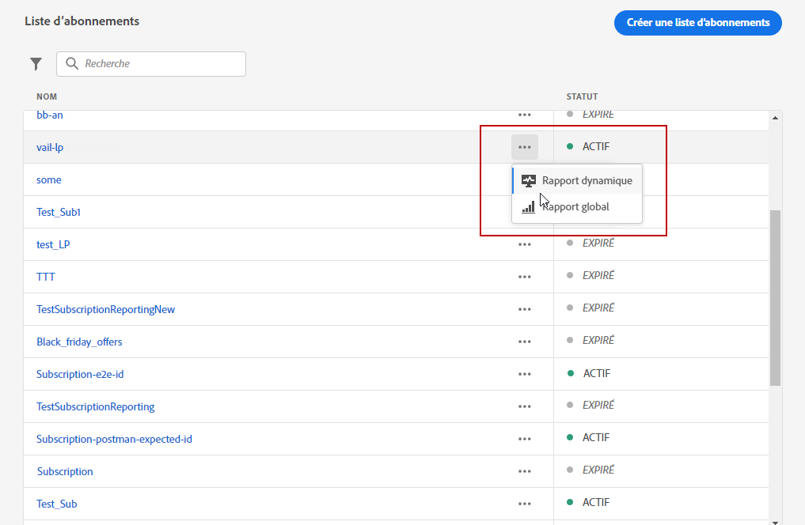
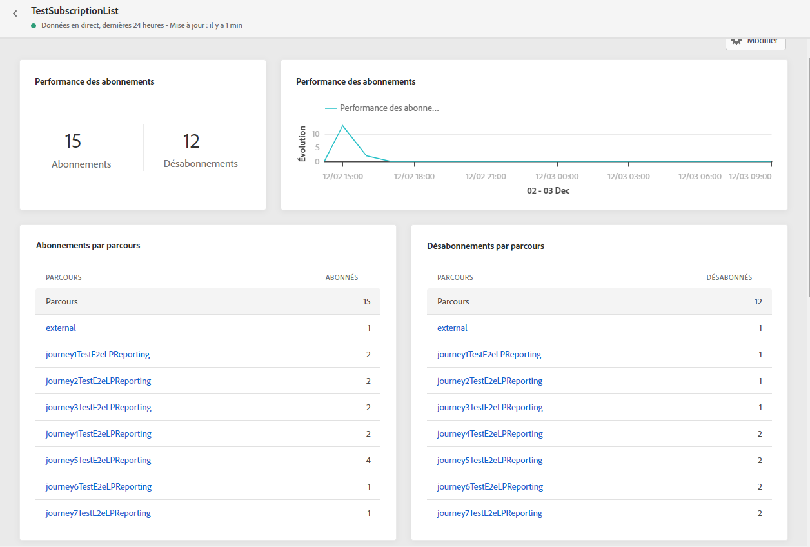
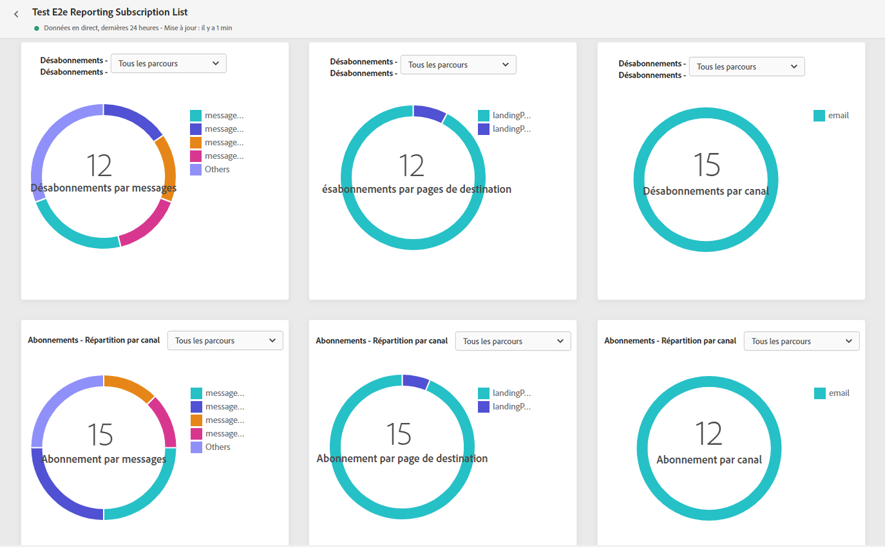
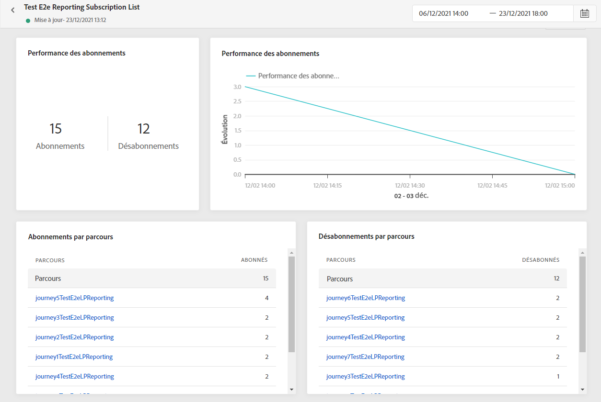
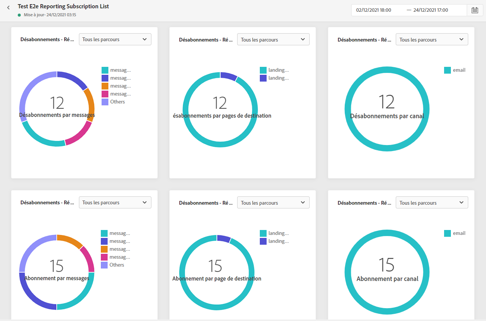

# Rapport d&#39;inscription {#subscription-report}

Le rapport d’abonnement affiche des détails sur l’activité de vos abonnés. Deux types de rapports sont disponibles :

* Le **[!UICONTROL Rapport en direct]** pour mesurer et visualiser les abonnements et désabonnements de vos diffusions sur les dernières 24 heures uniquement.

* Le **[!UICONTROL Rapport global]** pour mesurer et visualiser les abonnements et désabonnements de vos diffusions sur une période sélectionnée.

Pour accéder à vos rapports, sélectionnez **En direct** ou **[!UICONTROL Rapport global]** dans le menu avancé de la liste d’abonnements sélectionnée.

## Rapport d’inscription en direct {#subscription-live}

Le **[!UICONTROL Performances de l&#39;abonnement]** les indicateurs de performance clés et les **[!UICONTROL Abonnements par parcours]**/**[!UICONTROL Désabonnement par parcours]** les tableaux détaillent les informations principales relatives à l’engagement des visiteurs sur votre page d’entrée. Les tableaux et les indicateurs de performance clés contiennent les données disponibles liées à votre landing page, telles que :

* **[!UICONTROL Abonnements]**: Nombre total d&#39;abonnements au cours des dernières 24 heures.

* **[!UICONTROL Désabonne]**: Nombre total de désabonnements au cours des dernières 24 heures.

Le **[!UICONTROL Performances de l&#39;abonnement]** Le graphique présente l’évolution des abonnements au cours des dernières 24 heures.

Le **Abonnements - Ventilation** et **Désabonnements - Ventilation** les graphiques représentent le nombre total de personnes qui se sont inscrites ou se sont désabonnés au cours des dernières 24 heures, selon les messages, landing pages et canaux.

## Rapport global d&#39;inscription {#subscription-global}

Le **[!UICONTROL Performances de l&#39;abonnement]** les indicateurs de performance clés et les **[!UICONTROL Abonnements par parcours]**/**[!UICONTROL Désabonnement par parcours]** les tableaux détaillent les informations principales relatives à l’engagement des visiteurs sur votre page d’entrée. Les tableaux et les indicateurs de performance clés contiennent les données disponibles liées à votre landing page, telles que :

* **[!UICONTROL Abonnements]**: Nombre total d&#39;abonnements sur la période correspondante.

* **[!UICONTROL Désabonne]**: Nombre total de désabonnements sur la période correspondante.

Le **[!UICONTROL Performances de l&#39;abonnement]** Le graphique montre l&#39;évolution des inscriptions sur la période correspondante.

Le **Abonnements - Ventilation** et **Désabonnements - Ventilation** représente le nombre total de personnes qui se sont inscrites ou se sont désabonnés sur la période sélectionnée en fonction des messages, landing pages et canaux.

