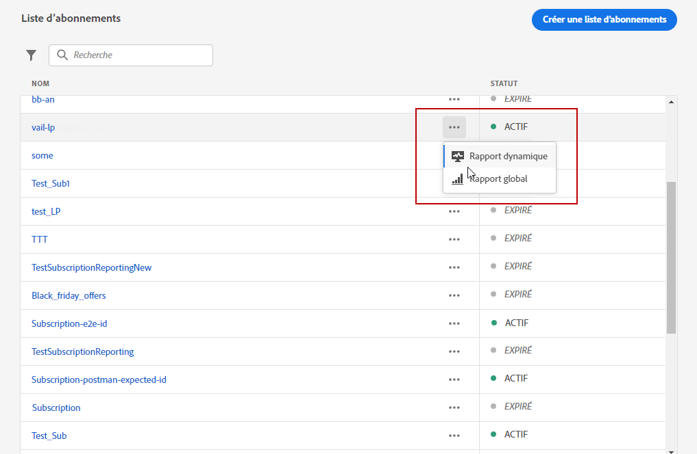
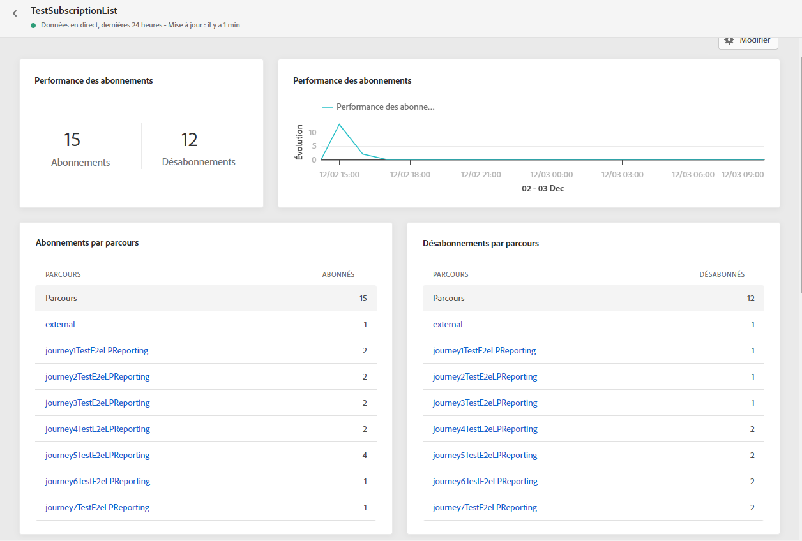
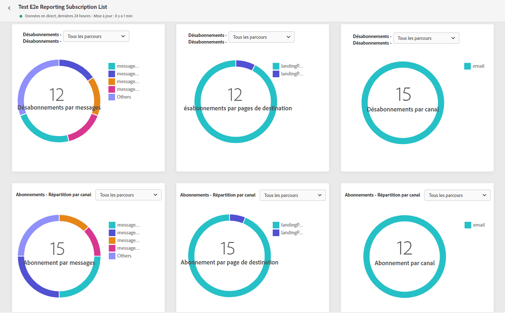
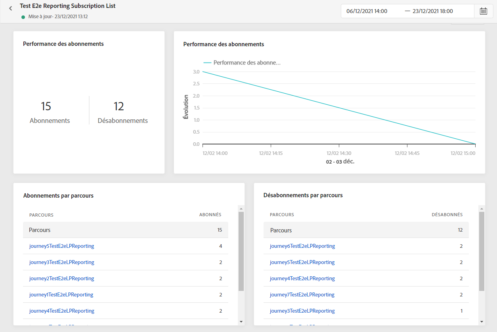
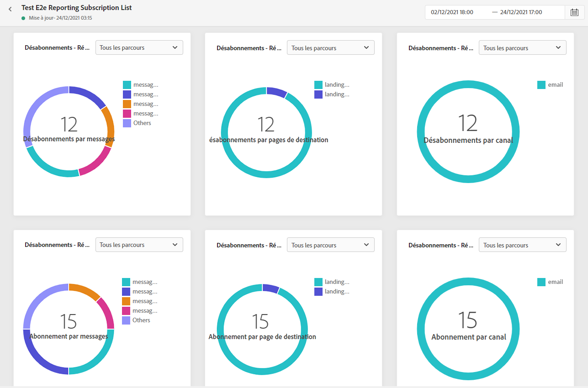

# Rapport dʼabonnement {#subscription-report}

Le rapport dʼabonnement affiche des informations sur lʼactivité de vos abonnés. Deux types de rapports sont disponibles :

* Le **[!UICONTROL Rapport dynamique]** vous permet de mesurer et de visualiser les abonnements et désabonnements relatifs à vos diffusions au cours des dernières 24 heures uniquement.

* Le **[!UICONTROL Rapport global]** vous permet de mesurer et de visualiser les abonnements et désabonnements relatifs à vos diffusions au cours dʼune période sélectionnée.

Pour accéder aux rapports, sélectionnez **Rapport dynamique** ou **[!UICONTROL global]** dans le menu avancé de la liste d’abonnements sélectionnée.

## Rapport dʼabonnement dynamique {#subscription-live}

Les KPI des **[!UICONTROL Performances de lʼabonnement]** et les tableaux **[!UICONTROL Abonnements par parcours]**/**[!UICONTROL Désabonnements par parcours]** affichent les principales informations relatives à l’engagement des visiteurs sur votre page de destination. Les tableaux et les KPI contiennent les données disponibles relatives à votre page de destination, par exemple :

* **[!UICONTROL Abonnements]** : nombre total dʼabonnements au cours des dernières 24 heures.

* **[!UICONTROL Désabonnements]** : nombre total de désabonnements au cours des dernières 24 heures.

Le graphique **[!UICONTROL Performances de lʼabonnement]** montre l’évolution des abonnements au cours des dernières 24 heures.

Les graphiques **Abonnements - Ventilation** et **Désabonnements - Ventilation** représentent le nombre total de personnes qui se sont abonnées ou désabonnées au cours des dernières 24 heures en fonction des messages, des pages de destination et des canaux.

## Rapport dʼabonnement global {#subscription-global}

Les KPI des **[!UICONTROL Performances de lʼabonnement]** et les tableaux **[!UICONTROL Abonnements par parcours]**/**[!UICONTROL Désabonnements par parcours]** affichent les principales informations relatives à l’engagement des visiteurs sur votre page de destination. Les tableaux et les KPI contiennent les données disponibles relatives à votre page de destination, par exemple :

* **[!UICONTROL Abonnements]** : nombre total dʼabonnements sur la période correspondante.

* **[!UICONTROL Désabonnements]** : nombre total de désabonnements sur la période correspondante.

Le graphique **[!UICONTROL Performances de lʼabonnement]** montre lʼévolution des abonnements sur la période correspondante.

Les graphiques **Abonnements - Ventilation** et **Désabonnements - Ventilation** représentent le nombre total de personnes qui se sont abonnées ou désabonnées au cours de la période sélectionnée en fonction des messages, des pages de destination et des canaux.
