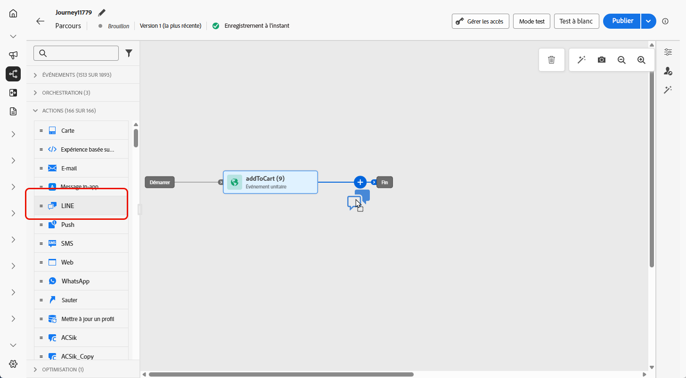
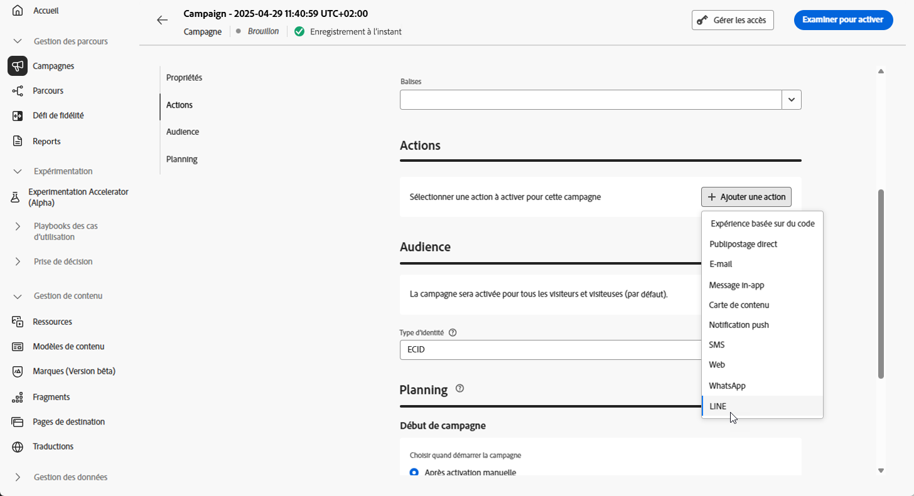

# Créer un message LINE {#create-line}

## Ajouter un message LINE {#create-line-journey-campaign}

Accédez aux onglets ci-dessous pour savoir comment ajouter un message LINE dans une campagne ou un parcours.

>[!BEGINTABS]

>[!TAB Ajouter un message LINE à un parcours]

1. Ouvrez votre parcours, puis effectuez un glisser-déposer d’une activité **LINE** depuis la section **Actions** de la palette.

   

1. Fournissez des informations de base sur votre message (libellé, description, catégorie), puis choisissez la configuration de message à utiliser.

   Pour plus d’informations sur la configuration de votre parcours, consultez [cette page](../building-journeys/journey-gs.md).

   Par défaut, le champ de **[!UICONTROL configuration]** est prérempli avec la dernière configuration utilisée par l’utilisateur ou l’utilisatrice pour ce canal.

Vous pouvez maintenant commencer à concevoir le contenu de votre message SMS en cliquant sur le bouton **[!UICONTROL Modifier le contenu]**, comme illustré ci-dessous.

>[!TAB Ajouter un message LINE à une campagne]

1. Accédez au menu **[!UICONTROL Campagnes]**, puis cliquez sur **[!UICONTROL Créer une campagne]**.

1. Sélectionner le type de campagne que vous souhaitez exécuter.

   * **Scheduled - Marketing** : permet d’exécuter la campagne immédiatement ou à une date spécifiée. Les campagnes planifiées visent à envoyer des messages marketing. Elles sont configurées et exécutées à partir de l’interface d’utilisation.

   * **Déclenchée par API - Marketing/Transactionnelle** : permet d’exécuter la campagne à l’aide d’un appel API. Les campagnes déclenchées par API sont destinées à envoyer des messages marketing, ou transactionnels, c’est-à-dire des messages envoyés suite à une action effectuée par une personne : réinitialisation du mot de passe, abandon de panier, etc.

1. Dans la section **[!UICONTROL Propriétés]**, modifiez le **[!UICONTROL Titre]** et la **[!UICONTROL Description]** de votre campagne.

1. Cliquez sur le bouton **[!UICONTROL Sélectionner une audience]** pour définir l’audience à cibler à partir de la liste des audiences Adobe Experience Platform disponibles. [En savoir plus](../audience/about-audiences.md).

1. Dans le champ **[!UICONTROL Espace de noms d’identité]**, choisissez l’espace de noms à utiliser pour identifier les personnes à partir de l’audience sélectionnée. [En savoir plus](../event/about-creating.md#select-the-namespace).

1. Dans la section **[!UICONTROL Actions]**, sélectionnez **[!UICONTROL LINE]** et sélectionnez ou créez une nouvelle configuration.

   Pour en savoir plus sur la configuration de LINE, consultez [cette page](line-configuration.md).

   

1. Cliquez sur **[!UICONTROL Créer une expérience]** pour commencer à configurer votre expérience de contenu et créer des traitements afin de mesurer leurs performances et d’identifier la meilleure option pour votre audience cible. [En savoir plus](../content-management/content-experiment.md).

1. Dans la section **[!UICONTROL Tracking des actions]**, indiquez si vous souhaitez effectuer le tracking des clics sur les liens de votre SMS.

1. Les campagnes sont conçues pour être exécutées à une date spécifique ou à une fréquence récurrente. Découvrez comment configurer le **[!UICONTROL Planning]** de votre campagne dans [cette section](../campaigns/create-campaign.md#schedule).

1. Dans le menu **[!UICONTROL Déclencheurs d’action]**, choisissez la variable **[!UICONTROL Fréquence]** de votre SMS :

   * Une fois
   * Quotidien
   * Hebdomadaire
   * Mois

Vous pouvez maintenant commencer à concevoir le contenu de votre message texte en cliquant sur le bouton **[!UICONTROL Modifier le contenu]**, comme illustré ci-dessous.

>[!ENDTABS]

## Définir votre contenu LINE{#line-content}

Pour configurer votre contenu LINE, procédez comme suit.

1. Dans l’écran de configuration des parcours ou des campagnes, cliquez sur le bouton **[!UICONTROL Modifier le contenu]** pour configurer le contenu du SMS.

1. Cliquez sur **[!UICONTROL Modifier le code]** pour modifier le contenu JSON.

1. Utilisez l’éditeur de personnalisation pour définir le contenu, ajouter de la personnalisation ou du contenu dynamique. Vous pouvez utiliser n’importe quel attribut, comme le nom du profil ou la ville. Vous pouvez également définir des règles conditionnelles. Accédez aux pages suivantes pour en savoir plus sur la [personnalisation](../personalization/personalize.md) et le [contenu dynamique](../personalization/get-started-dynamic-content.md) dans l’éditeur de personnalisation.

1. Cliquez sur **[!UICONTROL Enregistrer]** et vérifiez votre message dans l’aperçu.

1. Cliquez sur le bouton **[!UICONTROL Simuler le contenu]** pour prévisualiser le contenu de votre message LINE et le contenu personnalisé.

Une fois que vous avez effectué vos tests et validé le contenu, vous pouvez envoyer votre message LINE à votre audience. Ces étapes sont présentées sur [cette page](send-line.md).

Après leur envoi, vous pouvez mesurer l’impact de vos messages LINE dans les rapports de campagne ou de parcours. Pour plus d’informations sur les rapports, consultez [cette section](../reports/campaign-global-report-cja.md).
