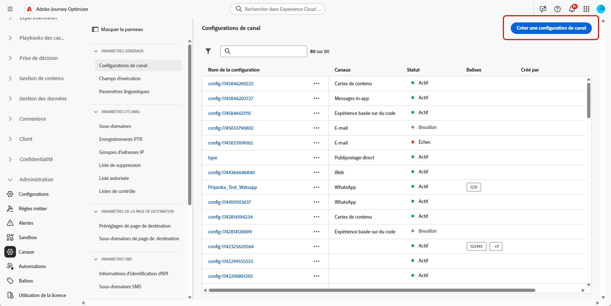
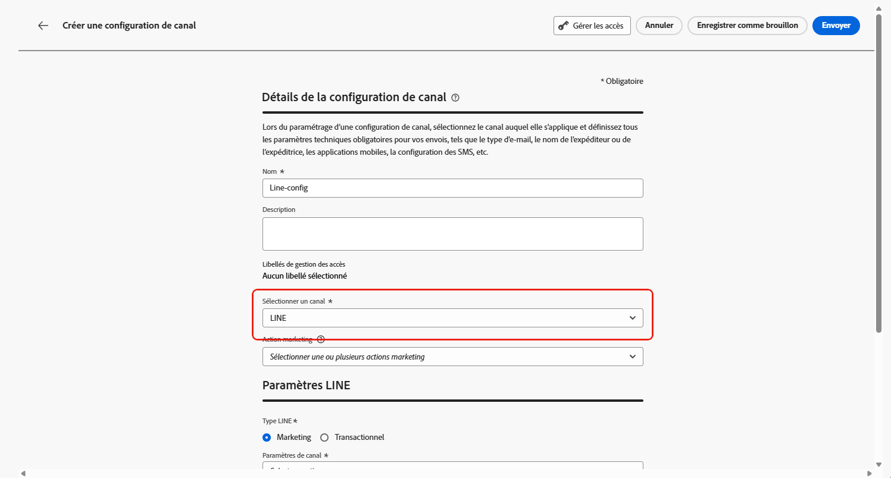

# Configuration du canal LINE dans Journey Optimizer {#line-configuration}

1. Accédez au menu **[!UICONTROL Canaux]** > **[!UICONTROL Paramètres généraux]** > **[!UICONTROL Configurations des canaux]**, puis cliquez sur **[!UICONTROL Créer une configuration des canaux]**.

   

1. Saisissez un nom et une description (facultatif) pour la configuration, puis sélectionnez le canal à configurer.

   >[!NOTE]
   >
   > Les noms doivent commencer par une lettre (A-Z). Ils ne peuvent contenir que des caractères alphanumériques. Vous pouvez également utiliser le trait de soulignement `_`, le point`.` et le trait d&#39;union `-`.

1. Pour attribuer des libellés d’utilisation des données personnalisés ou de base à la configuration, vous pouvez sélectionner **[!UICONTROL Gérer l’accès]**. [En savoir plus sur le contrôle d’accès au niveau de l’objet (OLAC)](../administration/object-based-access.md).

1. Sélectionnez le canal **LINE**.

   

1. Sélectionnez une **[!UICONTROL Action marketing]** ou plusieurs pour associer des politiques de consentement aux messages utilisant cette configuration. Toutes les politiques de consentement associées à cette action marketing sont utilisées afin de respecter les préférences de vos clientes et clients. [En savoir plus](../action/consent.md#surface-marketing-actions)

1. Sélectionnez le type de message pour la configuration :

   * **Marketing** : pour les messages promotionnels, tels que les promotions hebdomadaires pour un magasin de vente au détail. Ces messages nécessitent le consentement de l&#39;utilisateur et doivent être conformes à la politique de LINE concernant les opt-ins des utilisateurs.
   * **Transactionnel** : pour les messages non commerciaux tels que les confirmations de commande, les notifications de réinitialisation de mot de passe ou les mises à jour de diffusion. Ces messages peuvent être envoyés même aux utilisateurs qui se sont désabonnés des communications marketing, mais sont strictement limités à des contextes transactionnels spécifiques.

1. Sélectionnez vos **[!UICONTROL paramètres de canal]**.

   Contactez votre représentant Adobe pour configurer vos **[!UICONTROL paramètres de canal]**.

   

1. Sélectionnez l’identifiant utilisateur **[!UICONTROL LINE]** que vous souhaitez mapper. Il s’agit de l’identifiant utilisé pour lier les messages à des utilisateurs individuels dans votre canal LINE.

1. Saisissez votre **[!UICONTROL nom de l’expéditeur]** tel que le nom de votre marque.

1. Soumettez vos modifications.

Vous pouvez maintenant sélectionner votre configuration lors de la création de votre message LINE.
