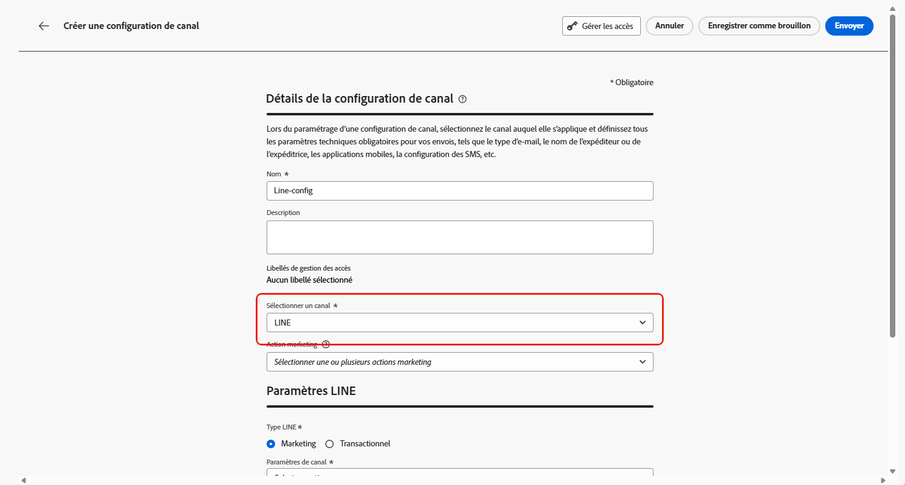

# Configurer le canal LINE dans Journey Optimizer {#line-configuration}

1. Accédez au menu **[!UICONTROL Canaux]** > **[!UICONTROL Paramètres généraux]** > **[!UICONTROL Configurations des canaux]**, puis cliquez sur **[!UICONTROL Créer une configuration des canaux]**.

   

1. Saisissez un nom et une description (facultatif) pour la configuration, puis sélectionnez le canal à configurer.

   >[!NOTE]
   >
   > Les noms doivent commencer par une lettre (A-Z). Ils ne peuvent contenir que des caractères alphanumériques. Vous pouvez également utiliser le trait de soulignement `_`, le point`.` et le trait d&#39;union `-`.

1. Pour attribuer des libellés d’utilisation des données personnalisés ou de base à la configuration, vous pouvez sélectionner **[!UICONTROL Gérer l’accès]**. [En savoir plus sur le contrôle d’accès au niveau de l’objet (OLAC)](../administration/object-based-access.md).

1. Sélectionnez le canal **LINE**.

   

1. Sélectionnez une **[!UICONTROL Action marketing]** ou plusieurs pour associer des politiques de consentement aux messages utilisant cette configuration. Toutes les politiques de consentement associées à cette action marketing sont utilisées afin de respecter les préférences de vos clientes et clients. [En savoir plus](../action/consent.md#surface-marketing-actions)

1. Sélectionnez le type de message pour la configuration :

   * **Marketing** : pour les messages promotionnels, tels que les promotions hebdomadaires d’un magasin de vente au détail. Ces messages nécessitent le consentement des destinataires et doivent être conformes à la politique de LINE concernant les opt-ins des utilisateurs et utilisatrices.
   * **Transactionnel** : pour les messages non commerciaux tels que la confirmation de commande, les notifications de réinitialisation de mot de passe ou les informations de diffusion, par exemple. Ces messages peuvent être envoyés même aux personnes qui se sont désabonnées des communications marketing, mais sont strictement limités à des contextes transactionnels spécifiques.

1. Sélectionnez les **[!UICONTROL paramètres du canal]**.

   Contactez votre représentant ou représentante Adobe pour configurer les **[!UICONTROL paramètres du canal]**.

   

1. Sélectionnez l’**[!UICONTROL ID de l’utilisateur ou l’utilisatrice LINE]** que vous souhaitez mapper. Il s’agit de l’identifiant utilisé pour lier les messages à chaque utilisateur et utilisatrice de votre canal LINE.

1. Saisissez votre **[!UICONTROL nom d’expéditeur]**, tel que le nom de votre marque.

1. Soumettez vos modifications.

Vous pouvez maintenant sélectionner votre configuration lors de la création du message LINE.

## Configurer l’API des paramètres du canal LINE {#line-api}

Cette API configure les paramètres de canal qui stockent les détails d’autorisation et de configuration nécessaires pour la connexion à l’API LINE Messaging. Ces paramètres permettent à Adobe Journey Optimizer de s’authentifier et d’envoyer des messages via LINE à l’aide des informations d’identification fournies.

**Point d’entrée**

```
POST https://platform.adobe.io/journey/imp/config/channel-settings
```

| Nom de l’en-tête | Description |
|-|-|
| Autorisation | Jeton de l’utilisateur ou l’utilisatrice de votre compte technique |
| x-api-key | ID du client à partir d’Adobe Developer Console |
| x-gw-ims-org-id | Votre ID d’organisation IMS |
| x-sandbox-name | Nom du sandbox, par exemple prod |
| Content-Type | Doit être application/json. |


**Corps de la requête**

```json
{
    "name": "your_defined_name",
    "channelRegistryId": "line",
    "channel": "line",
    "channelSettings": {
        "channelId": "your_line_channel_id",
        "channelSecret": "your_line_channel_secret"
    }
}
```

**Réponse des paramètres de canal**

```json
{
"id": "3603ed66-ae86-42b8-8a90-d4b4e54e7c3b",
"name": "your_defined_name",
"channelRegistryId": "line",
"channel": "line",
"channelSettings": {
    "channelId": "your_line_channel_id",
    "channelSecret": "your_line_channel_secret"
    },
    "channelPublicationId": "v1_line",
    "createdAt": "2025-07-30T12:00:00.000Z",
    "modifiedAt": "2025-07-30T12:00:00.000Z",
    "isFromLatestVersion": true,
    "_etag": "\"eab98d24-18af-48ae-90f9-e59d4f8cfb2b\""
}
```
