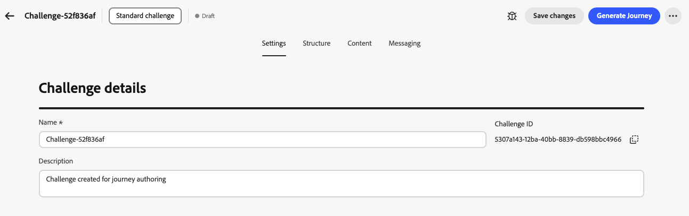
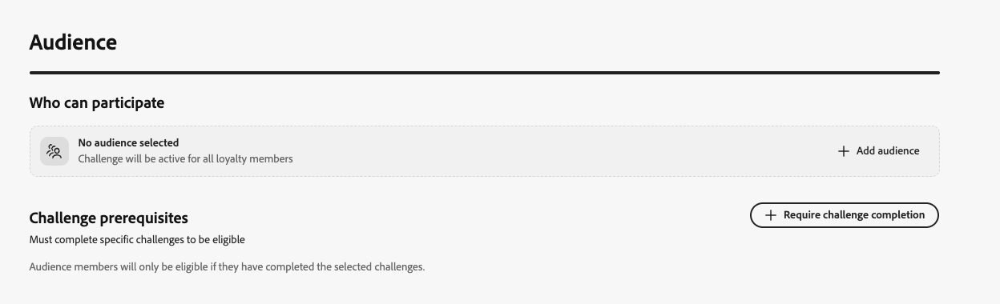
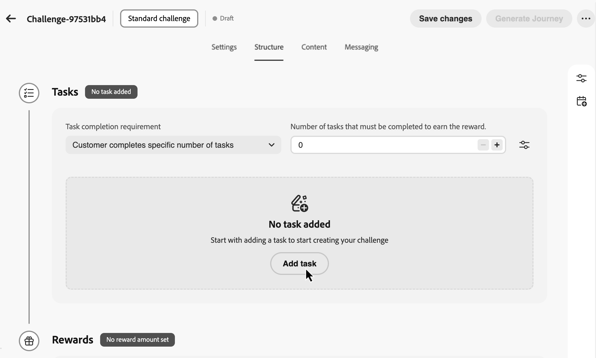
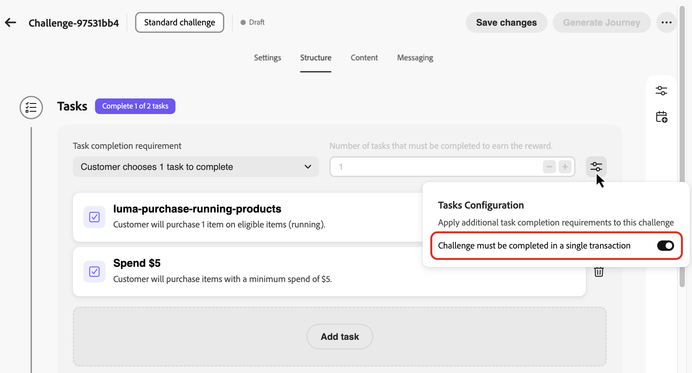
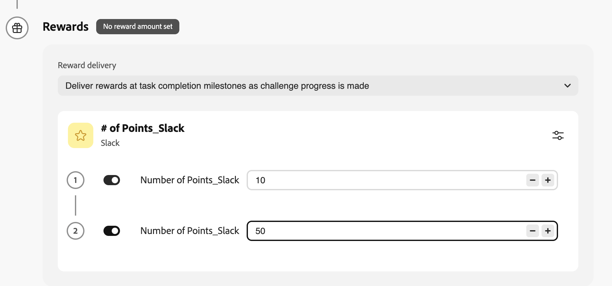
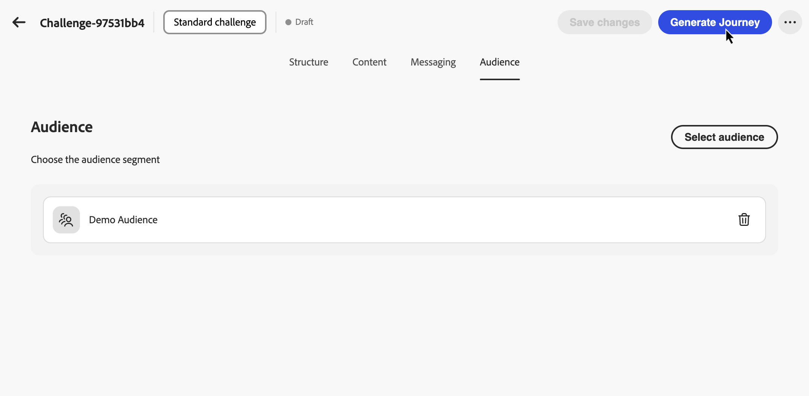

# Créer des défis {#create-challenges}

>[!BEGINSHADEBOX]

**Table des matières**

[Prise en main des défis de fidélité](get-started.md)

<table style="table-layout:fixed">
<tr style="border: 0;">
<td style="vertical-align:top;">

**Créer et gérer des défis**

* [Accéder aux défis et aux tâches et les gérer](access-loyalty-challenges.md)
* **Créer des défis** ◀︎ **Vous êtes ici**
* [Création de tâches](create-tasks.md)
* [Surveillance des performances des défis de fidélité](loyalty-reporting.md)

</td>
<td style="vertical-align:top;">

**Configuration et intégration**

* [Configuration des défis de fidélité](loyalty-admin.md)
* [Données et jeux de données de fidélité](loyalty-data-and-datasets.md)
* [Référence de l’API pour les défis de fidélité](https://developer.adobe.com/journey-optimizer-apis/references/loyalty-challenges){target="_blank"}

</td>
</tr>
</table>

>[!ENDSHADEBOX]

>[!AVAILABILITY]
>
>Cette fonctionnalité est actuellement en version bêta **privée**. Pour plus d’informations sur le cycle de publication et les phases de disponibilité, consultez le [cycle de publication de Journey Optimizer](../rn/releases.md).

Cette page couvre l’ensemble du processus de création d’un défi de fidélité, de la sélection du type de défi et de la configuration des paramètres, de la structure, du contenu et des messages à la génération et la publication du parcours qui fournit le défi à vos clients.

## Créer le défi {#create-the-challenge}

1. Accédez à **[!UICONTROL Défis de fidélité (Beta)]** dans Journey Optimizer.

1. Sélectionnez l’onglet **[!UICONTROL Défis]** et sélectionnez **[!UICONTROL Créer un défi]**.

   

1. Choisissez le type de défi :

   * **[!UICONTROL Standard]** : les clients effectuent un nombre spécifié de tâches dans n’importe quel ordre\
     *Exemple : effectuez 3 des 5 tâches disponibles*

   * **[!UICONTROL Streak]** : les clients effectuent la même tâche plusieurs fois de suite\
     *Exemple : effectuez un achat sur 7 jours consécutifs*

   * **[!UICONTROL Séquentiel]** : les clients exécutent des tâches dans un ordre défini\
     *Exemple : achat → révision → partage (doit être effectué dans cet ordre)*

   * **[!UICONTROL Apporter vos propres données]** : sélectionnez **[!UICONTROL Apporter vos propres données]** lorsque vous souhaitez que le framework de défi, comme les tâches et les récompenses, soit assemblé à partir de votre intégration de données Défis de fidélité. Lorsque ce type est sélectionné, l’onglet **[!UICONTROL Structure]** est en lecture seule. Configurez **[!UICONTROL Paramètres]**, **[!UICONTROL Contenu]** et **[!UICONTROL Messagerie]** de la même manière que les autres types de défis.

     >[!AVAILABILITY]
     >
     >Le type de défi **[!UICONTROL Apportez vos propres données]** est actuellement disponible pour un nombre restreint d’organisations et sera disponible à une plus grande échelle dans une prochaine version.

   Après avoir sélectionné un type de défi, l’éditeur de défi s’ouvre avec les onglets suivants : **[!UICONTROL Paramètres]**, **[!UICONTROL Structure]**, **[!UICONTROL Contenu]** et **[!UICONTROL Messagerie]**. Commencez par **[!UICONTROL Paramètres]** pour définir les détails du défi, l’audience, le planning et les règles. Configurez ensuite **[!UICONTROL Structure]** (tâches et récompenses) pour tous les types, à l’exception de **[!UICONTROL Apporter vos propres données]**.

## Configurer les paramètres de défi {#settings}

Dans l’onglet **[!UICONTROL Paramètres]**, configurez les propriétés au niveau du défi : qui peut participer, à quel moment le défi s’exécute, comment les membres s’inscrivent et obtiennent la progression, et les métadonnées facultatives.

### Détails du défi {#challenge-details}

>[!CONTEXTUALHELP]
>id="ajo_loyalty_challenge_properties"
>title="Détails du défi"
>abstract="Définissez le nom et la description du défi. L’ID de défi est attribué automatiquement lorsque le défi est créé et peut être copié pour une utilisation dans le cadre d’une API ou d’une intégration."

1. Dans la section **[!UICONTROL Détails du défi]**, définissez les éléments suivants :

   * **[!UICONTROL Nom]** : saisissez un nom explicite pour votre défi. Ce nom apparaît dans l’inventaire des défis.
   * **[!UICONTROL Identifiant du défi]** : identifiant unique attribué lors de la création du défi. Utilisez le contrôle de copie pour référencer cet identifiant dans les API ou les systèmes externes.
   * **[!UICONTROL Description]** : saisissez une description qui explique l’objectif et les objectifs du défi.

   

### Audience {#audience}

>[!CONTEXTUALHELP]
>id="ajo_loyalty_challenge_audience"
>title="Audience"
>abstract="Choisissez qui peut participer au défi. Ajoutez une audience Adobe Experience Platform ou laissez le champ d’audience vide afin que les membres du programme de fidélité soient éligibles. Vous pouvez également exiger que d’autres défis soient réalisés au préalable."

Définissez qui peut participer à votre défi de fidélité.

1. Dans la section **[!UICONTROL Audience]**, sélectionnez **[!UICONTROL Ajouter une audience]** pour limiter le défi à une audience Adobe Experience Platform spécifique. [Découvrez comment utiliser les audiences](../audience/about-audiences.md).

   

1. Sous **[!UICONTROL Conditions préalables au défi]**, sélectionnez **[!UICONTROL Exiger l&#39;accomplissement du défi]** pour restreindre l&#39;éligibilité aux membres qui ont déjà terminé un ou plusieurs défis sélectionnés.

### Planning {#schedule}

>[!CONTEXTUALHELP]
>id="ajo_loyalty_challenge_schedule"
>title="Planning du défi"
>abstract="Définissez quand le défi est actif en utilisant la date et l’heure de début et de fin, ainsi qu’un fuseau horaire. Dans la fenêtre d’achèvement de la tâche, choisissez le moment où les clientes et clients peuvent terminer les tâches pendant la période de défi."

Configurez le moment où votre défi s’exécute :

1. Dans la section **[!UICONTROL Planifier]**, définissez :

   * **[!UICONTROL Date et heure de début]** : date à laquelle le défi est disponible pour les clients.
   * **[!UICONTROL Date et heure de fin]** : à l’expiration du défi et lorsque vous n’acceptez plus de nouvelles tâches terminées.
   * **[!UICONTROL Fuseau horaire]** : fuseau horaire utilisé pour le planning du défi.

   

1. Sous **[!UICONTROL Fenêtre d’achèvement de la tâche]**, choisissez le moment où les clients peuvent terminer les tâches :

   * **[!UICONTROL À tout moment pendant le défi]** : les clients peuvent effectuer des tâches à tout moment entre les dates de début et de fin du défi.
   * **[!UICONTROL À des heures spécifiques de la journée]** : limitez la fin de la tâche à des heures spécifiques de la journée en définissant **[!UICONTROL Heure de début]** et **[!UICONTROL Heure de fin]**.

### Règles {#rules}

Configurez la manière dont les membres s’inscrivent, le moment où la progression de la tâche compte pour le défi et le nombre de fois où le défi peut être terminé.

* **[!UICONTROL Déclencheur d’opt-in]** :

   * **[!UICONTROL Méthode d’accord préalable]** : indiquez si les clients rejoignent le défi manuellement ou par le biais d’un déclencheur d’événement.
   * **[!UICONTROL Événement]** : pour l’accord préalable basé sur un événement, sélectionnez l’événement qui déclenche l’accord préalable. Les administrateurs peuvent cliquer sur le bouton  pour créer une définition d’événement. [Découvrez comment configurer des définitions d’événement](loyalty-admin.md#event-definitions)

* **[!UICONTROL Commencer à suivre la progression]** :

   * **[!UICONTROL Début du suivi de la progression de la tâche]** : sélectionnez le moment où les tâches terminées sont prises en compte pour la progression du défi. Par exemple, sélectionnez **[!UICONTROL Lorsque le défi commence (après l’opt-in)]** la progression commence donc une fois que le membre a donné son accord et que le défi est actif.

     Vous pouvez effectuer un découplage lorsqu’un défi est visible pour les membres, à partir du moment où la progression est suivie. Par exemple, une carte de défi peut s’afficher et accepter les opt-ins avant que les tâches terminées ne commencent à compter pour la progression à une date ultérieure.

   * **[!UICONTROL Début]** : lorsque vous choisissez une option de début personnalisée, définissez la date et l’heure de début du suivi de la progression.

* **[!UICONTROL Limites de répétition]** :

   * **[!UICONTROL Le défi peut être terminé]** : choisissez si le défi peut être terminé une fois ou plusieurs fois. Par exemple, **[!UICONTROL Une fois]** ou un nombre défini d’éléments terminés.

   * **[!UICONTROL Nombre de fois qu’il peut être terminé]** : lorsque la répétition est activée, spécifiez le nombre de fois qu’un membre peut terminer le défi.

* **[!UICONTROL Conditions d’achèvement]** *(défis standard uniquement)* :

   * **[!UICONTROL Terminer dans une seule transaction]** : lorsqu’elle est activée, les clients doivent terminer toutes les tâches dans une seule transaction. Lorsqu’elles sont désactivées, les tâches peuvent être effectuées sur des transactions distinctes.

### Métadonnées personnalisées {#custom-metadata}

Dans la section **[!UICONTROL Métadonnées personnalisées]**, sélectionnez **[!UICONTROL Ajouter une paire clé/valeur]** pour ajouter des métadonnées personnalisées. Utilisez des métadonnées pour le suivi ou l’intégration à des systèmes externes.

## Configurer la structure de défi {#structure}

Dans l’onglet **[!UICONTROL Structure]**, définissez les tâches que les clients doivent effectuer et les récompenses qu’ils gagnent. Cet onglet n’est pas utilisé pour les défis **[!UICONTROL Apportez vos propres données]**.

### Ajouter des tâches {#add-tasks}

>[!CONTEXTUALHELP]
>id="ajo_loyalty_challenge_tasks"
>title="Tâches"
>abstract="Sélectionnez les tâches à effectuer pour relever le défi. Ensuite, configurez la manière dont le défi est relevé : les options disponibles dépendent de votre type de défi (Standard, Série ou Séquentiel)."

Les tâches définissent les actions spécifiques que les clients doivent effectuer pour gagner des récompenses. Vous pouvez configurer les types de tâches (achat, dépense ou événement personnalisé), les quantités, les filtres de produit et d’autres attributs.

Pour ajouter des tâches à votre défi, procédez comme suit :

1. Dans la section **[!UICONTROL Tâches]**, sélectionnez **[!UICONTROL Ajouter une tâche]**.

   

1. L’**[!UICONTROL Inventaire des tâches]** s’ouvre. Sélectionnez une ou plusieurs tâches dans la liste, puis sélectionnez **[!UICONTROL Ajouter]**. Pour créer une nouvelle tâche, sélectionnez **[!UICONTROL Nouveau]**. [Découvrez comment créer et configurer des tâches](create-tasks.md).

1. Spécifier le moment où le défi est considéré comme terminé. Les paramètres disponibles dépendent du type de défi :

   +++Défis standard

   Dans le menu déroulant **[!UICONTROL Exigence d’achèvement de la tâche]**, choisissez entre :

   * **[!UICONTROL Le client choisit 1 tâche à effectuer]** - *Les clients peuvent sélectionner et exécuter n’importe quelle tâche pour gagner des récompenses*
   * **[!UICONTROL Le client effectue un nombre spécifique de tâches]** - *Les clients doivent effectuer un nombre défini de tâches. Spécifiez le nombre requis de tâches à effectuer.*

   +++

   +++Défis en série

   Dans le menu déroulant **[!UICONTROL Type de diffusion]** choisissez entre :

   * **Consécutive** : les clientes et clients doivent terminer la tâche pendant plusieurs jours consécutifs, sans interruption. *Exemple : un achat effectué lundi, mardi ou mercredi, un jour manquant rompt la série.*

   * **Non consécutif** : les clients peuvent terminer la tâche avec des écarts entre les terminaisons. *Exemple : effectuez 7 achats sur 30 jours, avec des pauses autorisées.*

   Dans le champ **[!UICONTROL Longueur de la séquence]**, indiquez le nombre de fois où la tâche doit être terminée. *Exemple : définissez sur 7 pour une « série d’achats de 7 jours »*

   +++

   +++Défis séquentiels

   Dans le menu déroulant **[!UICONTROL Exigence d’achèvement de la tâche]**, choisissez entre :

   * **[!UICONTROL Le client choisit 1 tâche à effectuer]** - *Les clients peuvent sélectionner et exécuter n’importe quelle tâche pour gagner des récompenses*
   * **[!UICONTROL Le client effectue un nombre spécifique de tâches]** - *Les clients doivent effectuer un nombre défini de tâches dans l’ordre exact que vous définissez. Une tâche manquante ou ignorée rompt la séquence. Spécifiez le nombre requis de tâches à effectuer*

   +++

1. Par défaut, les défis standard et séquentiels permettent aux clients d’effectuer des tâches sur plusieurs transactions. Pour exiger que toutes les tâches soient terminées dans une seule transaction, ouvrez le menu des options de tâche et activez l&#39;option de transaction unique.

   

Après avoir ajouté des tâches à votre défi, configurez les récompenses que les clients obtiendront pour les avoir effectuées.

### Configurer les récompenses {#rewards}

>[!CONTEXTUALHELP]
>id="ajo_loyalty_challenge_rewards"
>title="Récompenses"
>abstract="Choisissez le moment où les clientes et clients gagnent des points : lorsqu’ils relèvent l’intégralité du défi ou aux jalons de la tâche au fur et à mesure de leur progression. Sélectionnez votre fournisseur de récompense (votre solution de fidélité qui gère les points et les récompenses), puis définissez les montants : un montant total unique pour l’achèvement complet, ou des valeurs par tâche pour les jalons, en activant les récompenses uniquement pour les tâches que vous souhaitez payer."

Les récompenses sont les points de fidélité ou les avantages que les clients reçoivent pour relever les défis.

Pour configurer quand et comment les récompenses sont diffusées :

1. Dans le menu déroulant **[!UICONTROL Diffusion de récompenses]** choisissez à quel moment diffuser les récompenses :

   * **[!UICONTROL Remettre des récompenses lorsque le défi est terminé]** : récompensez les clients lorsqu’ils relèvent l’ensemble du défi\
     *Exemple : Attribuez 100 points après avoir effectué les 5 tâches*

   * **[!UICONTROL Offrir des récompenses aux jalons d’achèvement de tâche au fur et à mesure de la progression du défi]** : récompensez progressivement les clients lorsqu’ils effectuent des tâches individuelles (uniquement pour les défis nécessitant plus d’une tâche)\
     *Exemple : Attribuer 10 points après la tâche 1, 20 points après la tâche 2 et 50 points après la tâche 3*

1. Sélectionnez votre fournisseur de récompense. Il s’agit de votre solution de fidélité qui gère les points et les récompenses des clients. Les fournisseurs de récompenses sont créés dans le menu **[!UICONTROL Administration de la fidélité]** avant que vous ne créiez des défis. [Découvrez comment configurer des fournisseurs de récompenses](loyalty-admin.md#reward-providers)

   

1. Configurez les montants de récompense en fonction de la méthode de diffusion sélectionnée :

   +++Diffuser des récompenses lorsque le défi est terminé

   Spécifiez le montant total de récompense à accorder lorsque les clients relèvent l’ensemble du défi.

   *Dans l’exemple ci-dessous, les clients obtiennent 100 points pour relever le défi.*

   

   +++

   +++Diffuser des récompenses aux jalons d’achèvement de la tâche

   Spécifiez les montants de récompense pour les jalons d’achèvement de la tâche. Cette option vous permet de créer des récompenses progressives qui augmentent la motivation du client au fur et à mesure qu’il relève le défi.

   Pour toute tâche pour laquelle vous souhaitez offrir une récompense, activez l’option Récompense et indiquez le nombre de points à accorder lorsque les clients effectuent cette tâche spécifique. Vous pouvez choisir de ne récompenser que certaines tâches terminées ; par exemple, si vous avez 10 tâches, vous pouvez récompenser uniquement les tâches 1, 5 et 10.

   *Dans l’exemple ci-dessous, les clients obtiennent 10 points lorsqu’ils effectuent la première tâche, puis 50 points supplémentaires lorsqu’ils effectuent la seconde tâche.*

   

   +++

Après avoir configuré la structure du défi avec des tâches et des récompenses, vous pouvez éventuellement configurer la manière dont le défi est représenté aux clients. Si vous n’avez pas besoin de contenu de défi, ignorez cette étape et passez directement à [Configurer la messagerie](#configure-messaging).

## Configurer le contenu du défi (facultatif) {#configure-content-cards}

>[!CONTEXTUALHELP]
>id="ajo_loyalty_challenge_content"
>title="Contenu"
>abstract="Configurez la manière dont votre défi est représenté dans les emplacements où les membres du programme de fidélité accèdent aux défis et suivent leur progression. Utilisez Ajouter une action pour choisir la carte Contenu afin d’afficher une expérience de style carte ou une expérience basée sur du code afin de diffuser du contenu via votre propre implémentation personnalisée."

L’onglet **[!UICONTROL Contenu]** contrôle la manière dont le défi est représenté aux emplacements où les membres du programme de fidélité accèdent aux défis et suivent leur progression.

Pour configurer le contenu du défi :

1. Accédez à l’onglet **[!UICONTROL Contenu]** et cliquez sur **[!UICONTROL Ajouter une action]**.

1. Choisissez le type d&#39;action :

   * **[!UICONTROL Carte de contenu]** : affiche le défi sous la forme d’une expérience de style carte sur les appareils des clients. Sélectionnez une **[!UICONTROL configuration de canal]** et cliquez sur **[!UICONTROL Modifier le contenu]** pour concevoir et personnaliser la carte. [En savoir plus sur les cartes de contenu](../content-card/create-content-card.md).
   * **[!UICONTROL Expérience basée sur le code]** : fournit du contenu complexe par le biais de votre propre implémentation personnalisée à l’aide du canal basé sur le code Journey Optimizer. Sélectionnez une **[!UICONTROL Configuration du canal]** et cliquez sur **[!UICONTROL Modifier le contenu]** pour définir le contenu. [En savoir plus sur les expériences basées sur du code](../code-based/create-code-based.md).

   

   Vous pouvez ajouter plusieurs actions pour représenter le défi sur différentes surfaces.

Après avoir configuré le contenu, configurez la messagerie pour impliquer les clients tout au long du cycle de vie du défi.

### Configurer les messages {#configure-messaging}

>[!CONTEXTUALHELP]
>id="ajo_loyalty_challenge_messaging"
>title="Message"
>abstract="Les messages contribuent à l’engagement tout au long du cycle de vie du défi. Dans l’onglet Messages, ajoutez des messages pour chaque étape : Lancement (lorsque le défi commence), En cours (rappels et mises à jour de progression) et Terminé (célébrer la réussite et confirmer les récompenses). Pour chaque étape, ajoutez un message, choisissez le canal, sélectionnez une configuration des canaux, puis sélectionnez Modifier pour concevoir le contenu du message."

Configurez des messages multicanaux pour impliquer les clients aux étapes clés du cycle de vie du défi. La messagerie est facultative, mais recommandée pour optimiser l’engagement du client.

1. Accédez à l’onglet **[!UICONTROL Messagerie]** et configurez les messages pour chaque étape du cycle de vie :

   * Message **Launch** : avertissez les clients lorsque le défi commence
   * Message **En cours** : pour que les clients restent engagés dans les rappels et les mises à jour de progression
   * Message **Achèvement** : célébrer le succès et confirmer l’attribution de la récompense

1. Pour chaque étape, cliquez sur le bouton Ajouter un message pour créer un message pour cette étape.

1. Choisissez le canal de votre choix : **[!UICONTROL In-app]**, **[!UICONTROL Email]** ou **[!UICONTROL Notification push]** et sélectionnez la configuration de canal associée.

1. Sélectionnez l’icône  et choisissez **[!UICONTROL Modifier]** pour concevoir le contenu de votre message.

   

Découvrez comment créer des messages pour des canaux spécifiques dans les sections suivantes : [Messages in-app](../in-app/get-started-in-app.md) - [E-mails](../email/get-started-email.md) - [Notifications push](../push/get-started-push.md)

Votre défi est maintenant entièrement configuré avec ses paramètres, sa structure, son contenu et sa messagerie. Pour le lancer, vous devez publier le défi et son parcours associé.

## Lancer le défi {#launch}

Le lancement d’un défi nécessite **trois étapes** : (1) publier le défi, (2) générer le parcours, (3) publier le parcours. Les trois doivent être terminés pour que le défi soit relevé aux clients.

1. Vérifiez votre configuration de défi pour vous assurer que tous les champs obligatoires sont renseignés.

1. Cliquez sur l’icône  et sélectionnez **[!UICONTROL Publier]**.

   

1. Sélectionnez **[!UICONTROL Générer le Parcours]** pour créer le parcours qui orchestrera votre diffusion de défi.

   

1. Journey Optimizer crée automatiquement un parcours au statut « Brouillon ». Le parcours apparaît dans votre inventaire de parcours avec le format de nom *« Parcours : [Nom du défi]«*. [En savoir plus sur l’inventaire des parcours ](../building-journeys/journey-ui.md).

   

1. Ouvrez le parcours et publiez-le. Le parcours démarrera automatiquement à la date de début du défi que vous avez spécifiée et diffusera le contenu et les messages en fonction de votre configuration. [Découvrez comment publier un parcours ](../building-journeys/publish-journey.md).

1. Une fois votre défi lancé, surveillez les KPI du programme, les résultats des défis et les mesures au niveau de la tâche dans les [rapports de défi de fidélité](loyalty-reporting.md). Vous pouvez également surveiller la diffusion des messages dans le rapport de parcours .

>[!NOTE]
>
>Le parcours généré automatiquement peut être personnalisé pour ajouter une logique ou un message supplémentaire. Toutefois, les modifications apportées directement au parcours ne sont pas resynchronisées avec la configuration de défi. Si vous modifiez le défi ultérieurement, toutes les personnalisations de parcours seront perdues lorsque le parcours sera régénéré.
