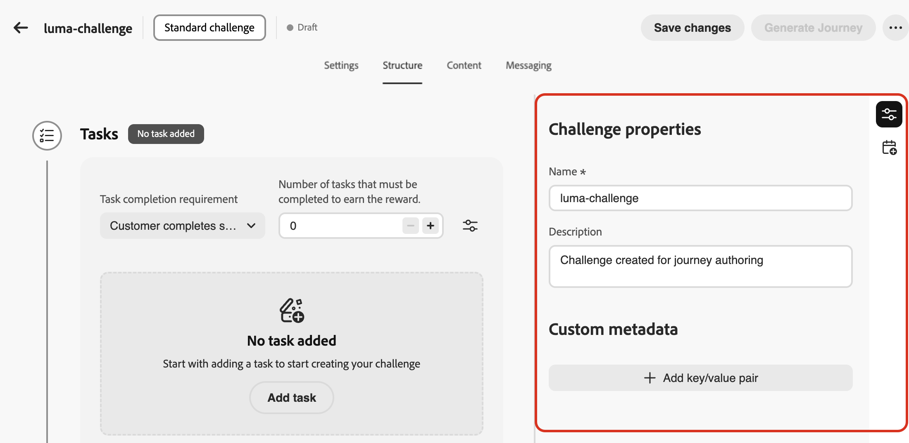

# Créer des défis {#create-challenges}

>[!BEGINSHADEBOX]

**Documentation sur les défis de fidélité :**

* [Prise en main des défis de fidélité](get-started.md)
* [Accéder aux défis et aux tâches et les gérer](access-loyalty-challenges.md)
* **Créer des défis** ◀︎ **Vous êtes ici**
* [Création de tâches](create-tasks.md)
* [Référence de l’API pour les défis de fidélité](https://developer.adobe.com/journey-optimizer-apis/references/loyalty-challenges){target="_blank"}

>[!ENDSHADEBOX]

>[!AVAILABILITY]
>
>Cette fonctionnalité est actuellement en version bêta **privée**. Pour plus d’informations sur le cycle de publication et les phases de disponibilité, consultez le [cycle de publication de Journey Optimizer](../rn/releases.md).

Cette page couvre l’ensemble du processus de création d’un défi de fidélité, de la sélection du type de défi et de la configuration de ses propriétés à la génération et la publication du parcours qui proposera le défi à vos clients.

## Créer le défi {#create-the-challenge}

1. Accédez à **[!UICONTROL Défis de fidélité (Beta)]** dans Journey Optimizer.

1. Sélectionnez l’onglet **[!UICONTROL Défis]** et sélectionnez **[!UICONTROL Créer un défi]**.

   

1. Choisissez le type de défi :

   * **[!UICONTROL Standard]** : les clients effectuent un nombre spécifié de tâches dans n’importe quel ordre\
     *Exemple : effectuez 3 des 5 tâches disponibles*

   * **[!UICONTROL Streak]** : les clients effectuent la même tâche plusieurs fois de suite\
     *Exemple : effectuez un achat sur 7 jours consécutifs*

   * **[!UICONTROL Séquentiel]** : les clients exécutent des tâches dans un ordre défini\
     *Exemple : achat → révision → partage (doit être effectué dans cet ordre)*

   Après avoir sélectionné un type de défi, l’interface de création de défi s’ouvre avec plusieurs onglets de configuration. Commencez par configurer la structure du défi.

## Configurer la structure de défi {#structure}

Dans l’onglet **[!UICONTROL Structure]**, définissez l’organisation de votre défi : ses propriétés, son planning, les tâches à effectuer et les récompenses à diffuser.

### Définir les propriétés du défi et utiliser des métadonnées personnalisées {#properties}

>[!CONTEXTUALHELP]
>id="ajo_loyalty_challenge_properties"
>title="Propriétés du défi"
>abstract="Dans le volet Propriétés du défi , définissez le nom et la description du défi, puis ajoutez des métadonnées clé/valeur personnalisées pour le suivi ou les intégrations externes."

1. Dans le volet **[!UICONTROL Propriétés du défi]**, définissez les paramètres globaux du défi :

   * **[!UICONTROL Nom]** : saisissez un nom explicite pour votre défi. Ce nom apparaît dans l’inventaire des défis.
   * **[!UICONTROL Description]** : saisissez une description qui explique l’objectif et les objectifs du défi.

1. Utilisez la section **[!UICONTROL Métadonnées personnalisées]** pour ajouter des métadonnées personnalisées à l’aide de paires clé/valeur. Ces métadonnées peuvent être utilisées pour le suivi ou l’intégration à des systèmes externes.

   

### Planifier le défi {#schedule}

>[!CONTEXTUALHELP]
>id="ajo_loyalty_challenge_schedule"
>title="Planning des défis"
>abstract="Utilisez le planning pour définir le moment où le défi est actif : définissez la date et l’heure de début auxquelles il devient disponible pour les clients, ainsi que la date et l’heure de fin auxquelles il cesse d’accepter les fins de production. Sélectionnez un fuseau horaire et choisissez quand les clients peuvent terminer les tâches dans la section **[!UICONTROL Fenêtre de fin de tâche]**."

Configurez le moment où votre défi s’exécute :

1. Sélectionnez l’icône **[!UICONTROL Ouvrir le planning]** :

   

1. Configurez les options de planification suivantes :

   * **[!UICONTROL Date et heure de début]** : à définir lorsque le défi est disponible pour les clients.
   * **[!UICONTROL Date et heure de fin]** : défini lorsque le défi expire et n’accepte plus de nouvelles tâches terminées.
   * **[!UICONTROL Fuseau horaire]** : le défi utilise par défaut le fuseau horaire local du destinataire.
   * **[!UICONTROL Les tâches doivent être terminées]** : choisissez le moment où les clients peuvent terminer les tâches :

      * **[!UICONTROL À tout moment pendant le défi]** : les clients peuvent effectuer des tâches à tout moment entre les dates de début et de fin du défi.
      * **[!UICONTROL À des heures spécifiques de la journée]** : limitez la fin de la tâche à des heures quotidiennes spécifiques en définissant les paramètres **[!UICONTROL Heure de début]** et **[!UICONTROL Heure de fin]**.

Le planning du défi est maintenant configuré. Ajoutez ensuite les tâches que les clients doivent effectuer.

### Ajouter des tâches {#add-tasks}

>[!CONTEXTUALHELP]
>id="ajo_loyalty_challenge_tasks"
>title="Tâches"
>abstract="Sélectionnez les tâches à effectuer pour relever le défi. Ensuite, configurez la manière dont le défi est terminé : les options disponibles dépendent de votre type de défi (Standard, Séquentiel ou Séquentiel)."

Les tâches définissent les actions spécifiques que les clients doivent effectuer pour gagner des récompenses. Vous pouvez configurer les types de tâches (achat, dépenses), les quantités, les filtres de produit et d’autres attributs.

Pour ajouter des tâches à votre défi, procédez comme suit :

1. Dans la section **[!UICONTROL Tâches]**, sélectionnez **[!UICONTROL Ajouter une tâche]**.

   

1. L’**[!UICONTROL Inventaire des tâches]** s’ouvre. Sélectionnez une ou plusieurs tâches dans la liste, puis sélectionnez **[!UICONTROL Ajouter]**. Pour créer une nouvelle tâche, sélectionnez **[!UICONTROL Nouveau]**. [Découvrez comment créer et configurer des tâches](create-tasks.md).

1. Spécifier le moment où le défi est considéré comme terminé. Les paramètres disponibles dépendent du type de défi :

   +++Défis standard

   Dans le menu déroulant **[!UICONTROL Exigence d’achèvement de la tâche]**, choisissez entre :

   * **[!UICONTROL Le client choisit 1 tâche à effectuer]** - *Les clients peuvent sélectionner et exécuter n’importe quelle tâche pour gagner des récompenses*
   * **[!UICONTROL Le client effectue un nombre spécifique de tâches]** - *Les clients doivent effectuer un nombre défini de tâches. Spécifiez le nombre requis de tâches à effectuer.*

   +++

   +++Défis en série

   Dans le menu déroulant **[!UICONTROL Type de diffusion]** choisissez entre :

   * **Consécutive** : les clientes et clients doivent terminer la tâche pendant plusieurs jours consécutifs, sans interruption. *Exemple : un achat effectué lundi, mardi ou mercredi, un jour manquant rompt la série.*

   * **Non consécutif** : les clients peuvent terminer la tâche avec des écarts entre les terminaisons. *Exemple : effectuez 7 achats sur 30 jours, avec des pauses autorisées.*

   Dans le champ **[!UICONTROL Longueur de la séquence]**, indiquez le nombre de fois où la tâche doit être terminée. *Exemple : définissez sur 7 pour une « série d’achats de 7 jours »*

   +++

   +++Défis séquentiels

   Dans le menu déroulant **[!UICONTROL Exigence d’achèvement de la tâche]**, choisissez entre :

   * **[!UICONTROL Le client choisit 1 tâche à effectuer]** - *Les clients peuvent sélectionner et exécuter n’importe quelle tâche pour gagner des récompenses*
   * **[!UICONTROL Le client effectue un nombre spécifique de tâches]** - *Les clients doivent effectuer un nombre défini de tâches dans l’ordre exact que vous définissez. Une tâche manquante ou ignorée rompt la séquence. Spécifiez le nombre requis de tâches à effectuer*

   +++

1. Par défaut, les défis standard et séquentiels permettent aux clients d’effectuer des tâches sur plusieurs transactions. Pour exiger que toutes les tâches soient effectuées dans une seule transaction, sélectionnez l’icône **[!UICONTROL Paramètres]** et activez l’option ci-dessous.

   

Après avoir ajouté des tâches à votre défi, configurez les récompenses que les clients obtiendront pour les avoir effectuées.

### Configurer les récompenses {#rewards}

>[!CONTEXTUALHELP]
>id="ajo_loyalty_challenge_rewards"
>title="Récompenses"
>abstract="Choisissez le moment où les clients gagnent des points : lorsqu’ils relèvent l’ensemble du défi ou aux jalons de la tâche au fur et à mesure de leur progression. Sélectionnez votre fournisseur de récompense (votre solution de fidélité qui gère les points et les récompenses), puis définissez les montants : un total unique pour l’achèvement complet, ou des valeurs par tâche pour les jalons, en activant les récompenses uniquement pour les tâches que vous souhaitez payer."

Les récompenses sont les points de fidélité ou les avantages que les clients reçoivent pour relever les défis.

Pour configurer quand et comment les récompenses sont diffusées :

1. Dans le menu déroulant **[!UICONTROL Diffusion de récompenses]** choisissez à quel moment diffuser les récompenses :

   * **[!UICONTROL Remettre des récompenses lorsque le défi est terminé]** : récompensez les clients lorsqu’ils relèvent l’ensemble du défi\
     *Exemple : Attribuez 100 points après avoir effectué les 5 tâches*

   * **[!UICONTROL Offrir des récompenses aux jalons d’achèvement de tâche au fur et à mesure de la progression du défi]** : récompensez progressivement les clients lorsqu’ils effectuent des tâches individuelles (uniquement pour les défis nécessitant plus d’une tâche)\
     *Exemple : Attribuer 10 points après la tâche 1, 20 points après la tâche 2 et 50 points après la tâche 3*

1. Sélectionnez votre fournisseur de récompense. Il s’agit de votre solution de fidélité qui gère les points et les récompenses des clients.

   

1. Configurez les montants de récompense en fonction de la méthode de diffusion sélectionnée :

   +++Diffuser des récompenses lorsque le défi est terminé

   Spécifiez le montant total de récompense à accorder lorsque les clients relèvent l’ensemble du défi.

   *In the example below, customers are awarded 100 points when completing the challenge.*

   

   +++

   +++Deliver rewards at task completion milestones

   Specify reward amounts for task completion milestones. This option allows you to create progressive rewards that increase customer motivation as they progress through the challenge.

   For any task where you want to deliver a reward, toggle on the reward option and specify how many points to award when customers complete that specific task. You can choose to reward only certain task completions—for example, if you have 10 tasks, you might reward only tasks 1, 5, and 10.

   *In the example below, customers are awarded 10 points when completing the first task, then 50 additional points after completing the second task.*

   

   +++

After configuring the challenge structure with tasks and rewards, design the content cards to display the challenge to customers.

## Configure content cards {#configure-content-cards}

>[!CONTEXTUALHELP]
>id="ajo_loyalty_challenge_content"
>title="Contenu"
>abstract="Configure the content card that represents your challenge on customer devices and shows challenge information, progress, and rewards. Enter a name for the card, select a channel configuration so delivery uses the right technical settings (for example headers, subdomain, or mobile apps), then select Edit content to design and personalize the card experience."

Content cards visually represent your challenge on customer devices, displaying challenge information, progress, and rewards. [Learn more about content cards](../content-card/create-content-card.md).

To configure content cards for your challenge:

1. Navigate to the **[!UICONTROL Content]** tab and enter a **[!UICONTROL Name]** for the content card.

1. Select the **[!UICONTROL Channel configuration]**. Channel configurations contain all the technical parameters for sending messages, such as header parameters, subdomain, mobile apps, etc. [Learn more about channel configurations](../configuration/channel-surfaces.md).

1. Select **[!UICONTROL Edit content]** to design your content card. [Learn how to design and personalize content cards](../content-card/design-content-card.md).

   

After configuring the content card, set up messaging to engage customers throughout the challenge lifecycle.

### Configure messaging {#configure-messaging}

>[!CONTEXTUALHELP]
>id="ajo_loyalty_challenge_messaging"
>title="Message"
>abstract="Messaging helps engagement across the challenge lifecycle. On the Messaging tab, add messages for each stage: Launch (when the challenge starts), In-progress (reminders and progress updates), and Completion (celebrate success and confirm rewards). For each stage, add a message, choose the channel, select a channel configuration, then select Edit to design the message content."

Set up multi-channel messages to engage customers at key stages of the challenge lifecycle. La messagerie est facultative, mais recommandée pour optimiser l’engagement du client.

1. Accédez à l’onglet **[!UICONTROL Messagerie]** et configurez les messages pour chaque étape du cycle de vie :

   * Message **Launch** : avertissez les clients lorsque le défi commence
   * Message **En cours** : pour que les clients restent engagés dans les rappels et les mises à jour de progression
   * Message **Achèvement** : célébrer le succès et confirmer l’attribution de la récompense

1. Pour chaque étape, cliquez sur le bouton Ajouter un message pour créer un message pour cette étape.

1. Choisissez le canal de votre choix : **[!UICONTROL In-app]**, **[!UICONTROL Email]** ou **[!UICONTROL Notification push]** et sélectionnez la configuration de canal associée.

1. Sélectionnez l’icône  et choisissez **[!UICONTROL Modifier]** pour concevoir le contenu de votre message.

   

Découvrez comment créer des messages pour des canaux spécifiques dans les sections suivantes : [Messages in-app](../in-app/get-started-in-app.md) - [E-mails](../email/get-started-email.md) - [Notifications push](../push/get-started-push.md)

Une fois la configuration de la messagerie terminée, définissez les clients éligibles pour participer au défi.

## Sélectionner l’audience du défi {#audience}

>[!CONTEXTUALHELP]
>id="ajo_loyalty_challenge_audience"
>title="Audience"
>abstract="Dans l’onglet Audience , choisissez qui peut participer au défi parmi les audiences Adobe Experience Platform disponibles."

Définir quels clients peuvent participer à votre défi de fidélité.

1. Accédez à l’onglet **[!UICONTROL Audience]** et cliquez sur le bouton **[!UICONTROL Sélectionner une audience]**.

   

1. Dans la boîte de dialogue de sélection d’audience, sélectionnez votre audience cible dans la liste des audiences Adobe Experience Platform disponibles, puis sélectionnez **[!UICONTROL Ajouter une audience]**. [Découvrez comment utiliser les audiences](../audience/about-audiences.md).

Votre défi est maintenant entièrement configuré avec sa structure, son contenu, sa messagerie et son audience cible. Pour le lancer, vous devez publier le défi et son parcours associé.

## Lancer le défi {#launch}

Le lancement d’un défi nécessite **trois étapes** : (1) publier le défi, (2) générer le parcours, (3) publier le parcours. Les trois doivent être terminés pour que le défi soit relevé aux clients.

1. Vérifiez votre configuration de défi pour vous assurer que tous les champs obligatoires sont renseignés.

1. Cliquez sur l’icône  et sélectionnez **[!UICONTROL Publier]**.

   

1. Sélectionnez **[!UICONTROL Générer le Parcours]** pour créer le parcours qui orchestrera votre diffusion de défi.

   

1. Journey Optimizer crée automatiquement un parcours au statut « Brouillon ». Le parcours apparaît dans votre inventaire de parcours avec le format de nom *« Parcours : [Nom du défi]«*. [En savoir plus sur l’inventaire des parcours ](../building-journeys/journey-ui.md).

   

1. Ouvrez le parcours et publiez-le. Le parcours démarrera automatiquement à la date de début du défi que vous avez spécifiée et diffusera le contenu et les messages en fonction de votre configuration. [Découvrez comment publier un parcours ](../building-journeys/publish-journey.md).

1. Une fois votre défi lancé, surveillez les performances et la diffusion des messages dans le rapport de parcours .

>[!NOTE]
>
>Le parcours généré automatiquement peut être personnalisé pour ajouter une logique ou un message supplémentaire. Toutefois, les modifications apportées directement au parcours ne sont pas resynchronisées avec la configuration de défi. Si vous modifiez le défi ultérieurement, toutes les personnalisations de parcours seront perdues lorsque le parcours sera régénéré.
