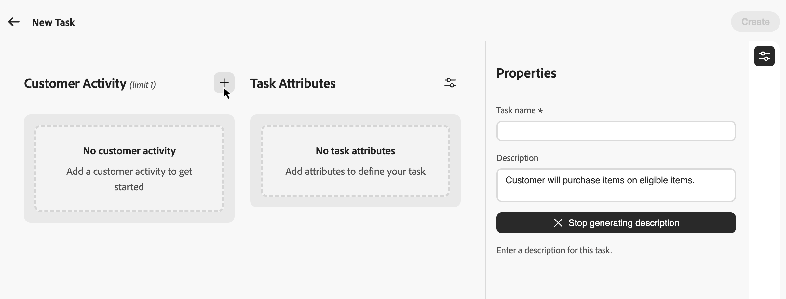
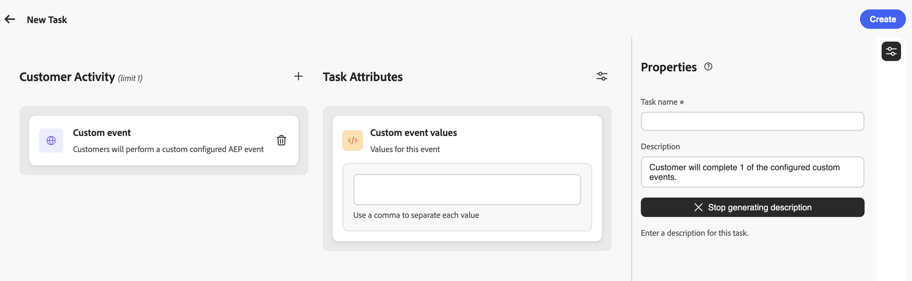
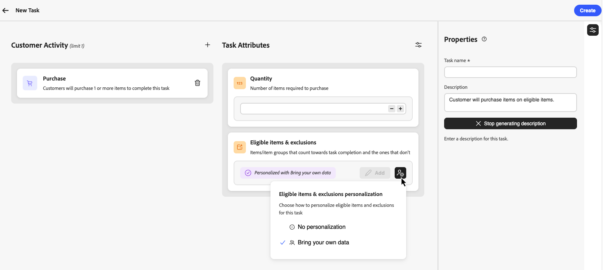

# Création de tâches {#create-tasks}

>[!BEGINSHADEBOX]

**Table des matières**

[Prise en main des défis de fidélité](get-started.md)

<table style="table-layout:fixed">
<tr style="border: 0;">
<td style="vertical-align:top;">

**Créer et gérer des défis**

* [Accéder aux défis et aux tâches et les gérer](access-loyalty-challenges.md)
* [Créer des défis](create-challenges.md)
* **Créer des tâches** ◀︎ **Vous êtes ici**
* [Surveillance des performances des défis de fidélité](loyalty-reporting.md)

</td>
<td style="vertical-align:top;">

**Configuration et intégration**

* [Configuration des défis de fidélité](loyalty-admin.md)
* [Données et jeux de données de fidélité](loyalty-data-and-datasets.md)
* [Référence de l’API pour les défis de fidélité](https://developer.adobe.com/journey-optimizer-apis/references/loyalty-challenges){target="_blank"}

</td>
</tr>
</table>

>[!ENDSHADEBOX]

>[!AVAILABILITY]
>
>Cette fonctionnalité est actuellement en version bêta **privée**. Pour plus d’informations sur le cycle de publication et les phases de disponibilité, consultez le [cycle de publication de Journey Optimizer](../rn/releases.md).

Les tâches définissent les actions ou jalons spécifiques que les clients doivent effectuer pour gagner des récompenses dans un défi de fidélité. Vous pouvez configurer des tâches d’achat et de dépense ou des tâches **[!UICONTROL Événement personnalisé]** qui effectuent le suivi des événements d’expérience Adobe Experience Platform que votre organisation capture déjà.

Chaque tâche représente une action mesurable qui contribue à l&#39;achèvement du défi. Les tâches sont des composants réutilisables qui peuvent être créés indépendamment, puis ajoutés à un ou plusieurs défis, ou créés directement au sein d’un défi.

## Créer une tâche {#create-task}

>[!CONTEXTUALHELP]
>id="ajo_loyalty_task_create"
>title="Créer une tâche"
>abstract="Sélectionnez une activité client (achat, dépense ou événement personnalisé), puis configurez des attributs spécifiques à l’activité. Dans le volet Propriétés, définissez le nom et la description de la tâche."

Vous pouvez créer des tâches à partir de deux points d’entrée. Le processus de configuration est le même, quel que soit l’endroit où vous commencez.

>[!BEGINTABS]

>[!TAB Dans l’inventaire des tâches]

Sélectionnez l’onglet **[!UICONTROL Tâches]** et sélectionnez **[!UICONTROL Créer une tâche]**. Les tâches créées à partir de l’inventaire sont enregistrées et disponibles pour réutilisation à travers plusieurs défis.

>[!TAB À partir d’un défi]

Ouvrir un défi existant ou en créer un nouveau. Sélectionnez **[!UICONTROL Ajouter une tâche]** et cliquez sur le bouton **[!UICONTROL Nouveau]**. Les tâches créées de cette manière sont automatiquement ajoutées à votre défi et sont également enregistrées dans l’inventaire des tâches pour être réutilisées dans d’autres défis.

>[!ENDTABS]

## Choisir l’activité du client {#choose-activity}

Sélectionnez le type d’activité que les clients doivent effectuer pour terminer cette tâche :

* **[!UICONTROL Achat]** : les clients doivent acheter un ou plusieurs articles pour terminer cette tâche
* **[!UICONTROL Dépenses]** : les clients doivent dépenser un montant spécifié pour terminer cette tâche
* **[!UICONTROL Événement personnalisé]** : les clients doivent effectuer une activité représentée par un événement d’expérience Adobe Experience Platform. Par exemple, un enregistrement à l’hôtel, une action d’application mobile ou un envoi de révision. L’événement sous-jacent doit déjà être capturé dans Experience Platform et mappé par le biais d’une définition d’événement dans le menu **[!UICONTROL Administration du programme de fidélité]**. [Découvrez comment configurer des définitions d’événement](loyalty-admin.md#event-definitions)

Pour sélectionner une activité, cliquez sur l’icône **+** et sélectionnez l’activité du client qui correspond le mieux à vos objectifs de résultat. Chaque type d’activité possède des attributs configurables spécifiques pour définir et définir plus en détail les exigences des tâches.

## Définir les attributs de la tâche {#define-attributes}

Configurez les attributs de la tâche en fonction du type d’activité sélectionné. Parcourez les onglets ci-dessous pour afficher les attributs disponibles pour chaque type d’activité :

>[!BEGINTABS]

>[!TAB Activité d’achat]

Attributs disponibles pour les activités **Achat** :

* **[!UICONTROL Quantité]** : saisissez le nombre d’articles qui doivent être achetés pour terminer cette tâche.
* **[!UICONTROL Éléments et exclusions éligibles]** : définissez les éléments ou groupes d’éléments qui sont pris en compte dans l’achèvement de la tâche et ceux qui ne le sont pas, ou choisissez **[!UICONTROL Apporter vos propres données]** pour déterminer l’éligibilité à partir de vos données externes. [En savoir plus](#eligible-items-exclusions)
* **[!UICONTROL Montant minimum de la valeur de dépense]** : définissez une exigence de montant minimum d’achat.
* **[!UICONTROL Nombre maximum de transactions]** : limitez le nombre de transactions pouvant être utilisées pour terminer la tâche.

>[!TAB Activité de dépense]

Attributs disponibles pour les activités **Dépenses** :

* **[!UICONTROL Montant]** : saisissez le montant total des dépenses requises pour terminer la tâche.
* **[!UICONTROL Éléments et exclusions éligibles]** : définissez les éléments ou les groupes d’éléments qui sont pris en compte pour l’achèvement de la tâche, et ceux qui ne le sont pas. [En savoir plus sur les éléments et exclusions éligibles](#eligible-items-exclusions)
* **[!UICONTROL Nombre maximal de transactions]** : indiquez le nombre de transactions autorisées pour répondre à l’exigence de dépenses. Vous pouvez activer cet attribut à partir de l’icône des paramètres.

>[!TAB Activité d’événement personnalisée]

Attributs disponibles pour les activités **[!UICONTROL Événement personnalisé]** :

* **[!UICONTROL Valeurs d’événement personnalisé]** : saisissez les valeurs de l’événement personnalisé que la clientèle doit compléter. Utilisez une virgule pour séparer chaque valeur. Ces valeurs doivent correspondre aux définitions d’événement configurées dans le menu **[!UICONTROL Administration du programme de fidélité]**. [Découvrez comment configurer des définitions d’événement](loyalty-admin.md#event-definitions)

>[!ENDTABS]

## Définir les articles éligibles et les exclusions {#eligible-items-exclusions}

>[!CONTEXTUALHELP]
>id="ajo_loyalty_task_eligible_items_exclusion"
>title="Articles éligibles et exclusions"
>abstract="Pour les activités **Achat** et **Dépenses**, utilisez l’attribut **[!UICONTROL Éléments et exclusions éligibles]** pour sélectionner les éléments et les groupes qui comptent pour l’achèvement de la tâche et ceux qui sont exclus. Recherchez des articles ou des groupes dans l&#39;inventaire de produits configuré par les administrateurs, puis incluez-les ou excluez-les si nécessaire."

<!-- SCREENSHOT: Eligible items & exclusions picker showing the item and group table with Include and Exclude actions -->

Pour les activités **Achat** et **Dépenses**, vous pouvez utiliser la section **[!UICONTROL Articles et exclusions éligibles]** pour définir les articles et groupes éligibles et ceux qui sont exclus. Cela vous permet de cibler des produits, des catégories ou des emplacements spécifiques pour vous aligner sur les objectifs de votre défi.

Les éléments et les groupes disponibles dans le sélecteur sont définis par les utilisateurs administrateurs dans le menu **[!UICONTROL Administrateur de la fidélité]**. Les administrateurs chargent l’inventaire des produits utilisés pour les articles éligibles et configurent les exclusions à l’échelle de l’organisation qui sont automatiquement appliquées lorsque les spécialistes marketing créent des tâches. [Découvrez comment configurer l’inventaire des produits](loyalty-admin.md#product-inventory) et les [ exclusions](loyalty-admin.md#exclusions)

**[!UICONTROL Événement personnalisé]** les tâches n’utilisent pas d’éléments et d’exclusions éligibles ; l’achèvement est déterminé par les **[!UICONTROL valeurs d’événement personnalisé]** que vous configurez.

Par exemple, vous pouvez limiter une tâche à des catégories de produits spécifiques ou exclure les cartes-cadeaux ou les articles promotionnels du comptage pour terminer la tâche.

### Définir les éléments éligibles pour la tâche

Pour définir des éléments éligibles, sélectionnez **[!UICONTROL Ajouter]** dans la section **[!UICONTROL Éléments éligibles et exclusions]**.

Dans le sélecteur, sélectionnez les éléments ou les groupes qui doivent être pris en compte pour l’achèvement de la tâche, puis sélectionnez **[!UICONTROL Inclure]**. Les éléments et groupes inclus sont ajoutés à la liste éligible.

Si aucun article ou groupe éligible n&#39;est sélectionné, les achats ne sont pas limités à un jeu de stock spécifique, sauf si des exclusions sont configurées.

### Exclure des éléments de la tâche

Pour exclure des éléments de la tâche, sélectionnez **[!UICONTROL Ajouter]** dans la section **[!UICONTROL Éléments éligibles et exclusions]**.

Sélectionnez les éléments ou les groupes qui ne doivent pas être pris en compte dans l’achèvement de la tâche, puis sélectionnez **[!UICONTROL Exclure]**.

Les éléments de la liste d’exclusions globale sont automatiquement ajoutés en tant qu’exclusions. Les exclusions ont la priorité sur les inclusions : les éléments répertoriés comme exclus ne sont pas pris en compte, même s’ils font également partie d’un groupe inclus.

### Apporter vos propres données pour l&#39;éligibilité et les exclusions {#byod-personalization}

>[!AVAILABILITY]
>
>L’option **[!UICONTROL Apportez vos propres données]** est actuellement disponible pour un nombre restreint d’organisations et sera disponible à une plus grande échelle dans une prochaine version.

Outre la sélection d’éléments et de groupes dans Journey Optimizer, vous pouvez également piloter l’éligibilité à partir de vos données externes de défis de fidélité au moment de l’exécution à l’aide de l’option **[!UICONTROL Apporter vos propres données]**.

Lorsque l’option **[!UICONTROL Apporter vos propres données]** est sélectionnée, l’éligibilité par participant est résolue au moment de l’exécution à partir des données synchronisées avec votre environnement de défis de fidélité au lieu d’une liste d’ID d’élément.

Pour utiliser cette option, sélectionnez l’icône de personnalisation dans **[!UICONTROL Éléments et exclusions éligibles]**, puis choisissez **[!UICONTROL Apporter vos propres données]**.

>[!IMPORTANT]
>
>Lorsque vous affectez cette tâche à un défi, sélectionnez **[!UICONTROL Standard]** comme type de défi. Ne sélectionnez pas **[!UICONTROL Apporter vos propres données]** au niveau du défi, car cette option est réservée aux défis entièrement axés sur les données où l’ensemble de la structure, y compris les tâches et les récompenses, est fournie en externe.

## Définir les propriétés de la tâche {#define-task-properties}

Dans le volet **[!UICONTROL Propriétés]** de la tâche, configurez les informations de base sur la tâche :

* **[!UICONTROL Nom de la tâche]** : saisissez un nom explicite pour la tâche.
* **[!UICONTROL Description de la tâche]** : la description est générée automatiquement en fonction de l’activité et des attributs configurés. Pour saisir une description personnalisée, désactivez l’option de génération automatique et saisissez la description dans le champ de texte.

Après avoir configuré tous les attributs et propriétés, sélectionnez **[!UICONTROL Créer]** pour enregistrer la tâche. La tâche est enregistrée dans votre inventaire de tâches et, si elle est créée à partir d’un défi, est automatiquement ajoutée à ce défi.
