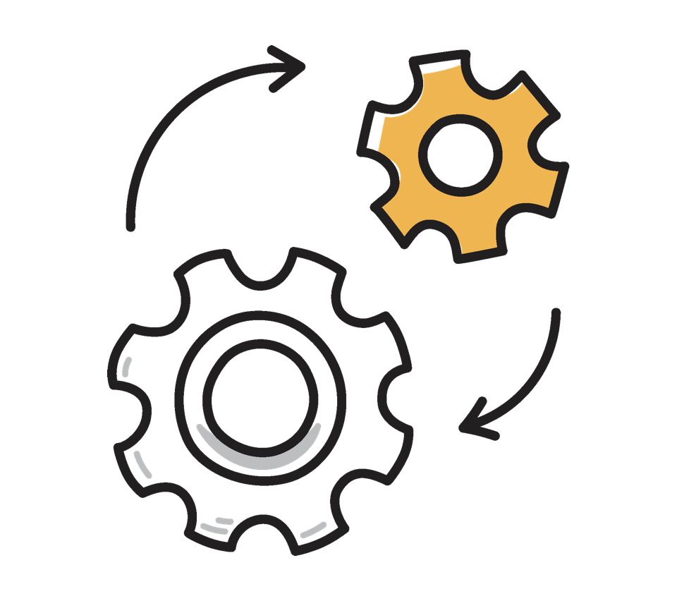

# Prise en main des défis de fidélité {#get-started-loyalty-challenges}

>[!BEGINSHADEBOX]

**Table des matières**

**[Prise en main des défis de fidélité](get-started.md)** ◀︎ **Vous êtes ici**

<table style="table-layout:fixed">
<tr style="border: 0;">
<td style="vertical-align:top;">

**Créer et gérer des défis**

* [Accéder aux défis et aux tâches et les gérer](access-loyalty-challenges.md)
* [Créer des défis](create-challenges.md)
* [Création de tâches](create-tasks.md)
* [Surveillance des performances des défis de fidélité](loyalty-reporting.md)

</td>
<td style="vertical-align:top;">

**Configuration et intégration**

* [Configuration des défis de fidélité](loyalty-admin.md)
* [Données et jeux de données de fidélité](loyalty-data-and-datasets.md)
* [Référence de l’API pour les défis de fidélité](https://developer.adobe.com/journey-optimizer-apis/references/loyalty-challenges){target="_blank"}

</td>
</tr>
</table>

>[!ENDSHADEBOX]

>[!AVAILABILITY]
>
>Cette fonctionnalité est actuellement en version bêta **privée**. Pour plus d’informations sur le cycle de publication et les phases de disponibilité, consultez le [cycle de publication de Journey Optimizer](../rn/releases.md).

## Vue d’ensemble {#overview}

>[!CONTEXTUALHELP]
>id="ajo_loyalty_inventory"
>title="Défis de fidélité"
>abstract="Les défis de fidélité vous permettent de créer des programmes de fidélité attrayants et ludiques qui stimulent le comportement client et renforcent la relation avec la marque. Créez des défis qui récompensent les clientes et clients pour des actions spécifiques, qu’il s’agisse d’acheter ou de rédiger des avis, de communiquer sur les réseaux sociaux ou de parrainer des proches."

Les défis de fidélité vous permettent de créer des programmes de fidélité attrayants et ludiques qui stimulent le comportement client et renforcent la relation avec la marque. Créez des défis qui récompensent les clientes et clients pour des actions spécifiques, qu’il s’agisse d’acheter ou de rédiger des avis, de communiquer sur les réseaux sociaux ou de parrainer des proches.

Grâce aux défis de fidélité, vous pouvez :

* **Concevez des types de défis flexibles** : créez des défis standard, en série ou séquentiels pour répondre aux objectifs de votre entreprise
* **Configurer les récompenses de manière stratégique** : attribuez des points aux jalons de la tâche ou à l’achèvement complet pour maintenir l’engagement
* **Personnaliser l’expérience** : utilisez des cartes de contenu et la messagerie multicanale pour créer des expériences immersives de marque
* **Intégration transparente** : entrez en contact avec vos fournisseurs de fidélité existants et exploitez les données Experience Platform
* **Suivi automatique** : surveiller les progrès des clients par le biais de parcours générés automatiquement sans développement personnalisé
* **Mesurer les performances** : utilisez des tableaux de bord de rapports intégrés pour effectuer le suivi des indicateurs clés de performance des programmes, des résultats des défis et des mesures au niveau des tâches

Vous pouvez créer les types d’expériences de défi suivants :

* **Défis standard** : les clients effectuent un nombre spécifié de tâches dans n’importe quel ordre. Utilisez ce type lorsque vous souhaitez de la flexibilité et que vous souhaitez terminer plusieurs chemins d’accès.\
  *Exemple : « Summer Wellness Challenge » - Effectuez 3 des 5 tâches suivantes : acheter des produits de santé, partager sur les médias sociaux, recommander un ami, écrire un commentaire ou assister à un événement virtuel*

* **Défis de Streak** : les clients effectuent la même tâche plusieurs fois de suite. Utilisez ce type pour encourager un comportement cohérent et répété au fil du temps.\
  *Exemple : « Semaine des amoureux du café » - Achetez des produits de café pendant 7 jours consécutifs pour débloquer une récompense de boisson gratuite*

* **Défis séquentiels** : les clients exécutent des tâches dans un ordre défini. Utilisez ce type pour guider les clients tout au long d’un processus d’intégration ou de parcours spécifique.\
  *Exemple : « Nouveau Parcours membre » - Inscrivez-vous aux e-mails → Effectuez votre premier achat → Rédiger un avis sur le produit → Recommander un ami (dans cet ordre exact)*

* **Apportez vos propres défis de données** (disponibilité limitée) : le framework de défi (tâches et récompenses) est assemblé à partir de votre intégration de données Défis de fidélité. Vous configurez les paramètres, le contenu et la messagerie comme vous le feriez pour tout autre type de défi.

## Fonctionnement {#how-it-works}

La création et le lancement d’un défi de fidélité suivent ce workflow :

1. **Créer un défi** - Choisissez le type de défi (Standard, Séquentiel, Séquentiel ou Apporter vos propres données lorsqu’elles sont disponibles). [Découvrez comment choisir un type de défi](create-challenges.md#create-the-challenge).

1. **Configurer les paramètres** - Dans l’onglet Paramètres , définissez les détails du défi, l’audience, le planning, les règles (opt-in, suivi de progression, limites de répétition) et les métadonnées facultatives. [En savoir plus sur les paramètres de défi](create-challenges.md#settings).

1. **Ajouter des tâches et des récompenses** - Dans l’onglet Structure , définissez des tâches et des récompenses (cela n’est pas obligatoire pour relever les défis liés à l’utilisation de vos propres données).

1. **Conception de cartes de contenu** - Créez la représentation visuelle de votre défi à l’aide de cartes de contenu Journey Optimizer qui s’affichent sur les appareils des clients.

1. **Configurer la messagerie** (facultatif) - Configurez des messages multicanaux (in-app, e-mail, push) pour les étapes clés du cycle de vie : lancement, en cours et achèvement.

1. **Lancer le défi** - Publiez le défi, puis générez un parcours. Journey Optimizer crée automatiquement le parcours pour votre défi. Publiez le parcours généré automatiquement pour mettre le défi à la disposition des clients.

Pour obtenir des instructions détaillées, voir [Créer des défis](create-challenges.md).

## Conditions préalables {#prerequisites}

Avant d’utiliser les défis de fidélité, vérifiez que vous disposez des éléments suivants :

+++Autorisations nécessaires

Pour utiliser les défis de fidélité, vous avez besoin des autorisations appropriées dans Journey Optimizer et Adobe Experience Platform.

**Journey Optimizer:**

* `journeys.read`
* `journeys.write`
* `journeys.delete`
* `journeys.publish`
* `journeys_events.read`
* `journeys_events.write`
* `journeys_events.delete`
* `journeys_report.read`
* `messages.read`
* `messages_report.read`

**Adobe Experience Platform:**

* `segments.read`
* `profiles.read`
* `identity_namespace.read`

Contactez votre administrateur si vous ne pouvez pas accéder à la fonctionnalité ou si vous avez besoin d’autorisations supplémentaires.

+++

+++Configuration du programme de fidélité (administrateurs)

Les administrateurs configurent les fournisseurs de récompenses, les définitions d’événement, l’inventaire des produits, les exclusions et les paramètres globaux dans le menu **[!UICONTROL Administrateur de fidélité]**. Les marketeurs qui ne créent que des défis n’ont pas besoin d’accéder à ce menu. [Découvrez comment configurer les défis de fidélité](loyalty-admin.md)

Contactez votre administrateur si le menu **[!UICONTROL Administration du programme de fidélité]** n’est pas visible dans le volet de navigation de gauche.

+++

+++Audience cible

Assurez-vous que l’audience cible dont vous avez besoin existe dans Adobe Experience Platform avant de créer votre défi. Lors de la configuration du défi, vous sélectionnerez l’audience qui définit les clients éligibles à participer. [Découvrez comment utiliser les audiences](../audience/about-audiences.md).

+++

## Explorons plus en détail. {#lets-dive-deeper}

Maintenant que vous connaissez les défis de fidélité et leur fonctionnement, il est temps d’entrer dans les détails. Explorez les rubriques suivantes pour accéder à l’interface, créer votre premier défi et définir les tâches que vos clients effectueront.

<table style="table-layout:fixed">
<tr style="border: 0;">
  <td>
    
    

    <a href="access-loyalty-challenges.md"><strong>Accéder aux défis et aux tâches et les gérer</strong></a>
    

    

    <em>Découvrez comment accéder à l’inventaire et gérer les défis et les tâches</em>
    

  </td>
  <td>
    
    

    <a href="create-challenges.md"><strong>Créer des défis</strong></a>
    

    

    <em>Découvrez comment créer et configurer votre premier défi de fidélité</em>
    

  </td>
  <td>
    
    

    <a href="create-tasks.md"><strong>Créer des tâches</strong></a>
    

    

    <em>Découvrez comment définir les tâches que les clients effectuent pour relever les défis</em>
    

  </td>
  <td>
    
    

    <a href="loyalty-reporting.md"><strong>Surveillance des performances</strong></a>
    

    

    <em>Suivre les KPI du programme, les résultats des défis et les mesures des tâches avec des tableaux de bord intégrés</em>
    

  </td>
  <!--
    <a href="loyalty-admin.md"><strong>Configure the loyalty program</strong></a>
  <td>
    <a href="loyalty-admin.md">
    <em>Set up reward providers, event definitions, and org settings for fulfillment</em>
    </a>
    

  -->
    <a href="loyalty-admin.md"><strong>Configurer les défis de fidélité</strong></a>
    

    

    <em>Configurez les fournisseurs de récompenses, les définitions d’événement et les paramètres d’organisation</em>
    

  </td>
</tr>
</table>

## Référence d’API {#api-reference}

Pour gérer les défis de fidélité par programmation, utilisez l’API [Loyalty Challenges](https://developer.adobe.com/journey-optimizer-apis/references/loyalty-challenges){target="_blank"}. L’API vous permet de créer, mettre à jour et gérer des défis et des tâches via des points d’entrée REST.
