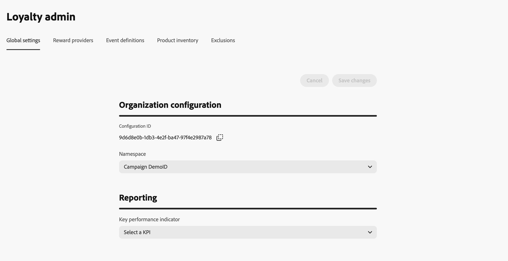
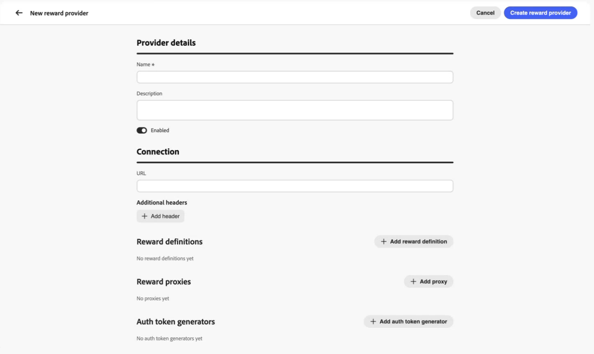
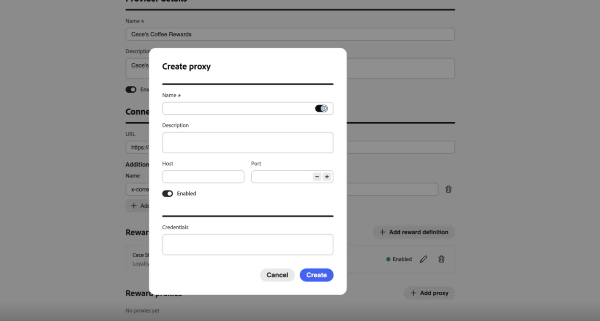
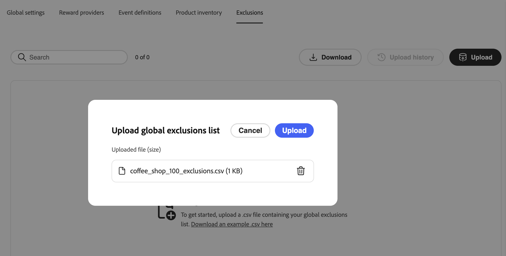

# Configuration du programme de fidélité {#loyalty-admin}

>[!BEGINSHADEBOX]

**Documentation sur les défis de fidélité :**

* [Prise en main des défis de fidélité](get-started.md)
* [Accéder aux défis et aux tâches et les gérer](access-loyalty-challenges.md)
* [Créer des défis](create-challenges.md)
* [Création de tâches](create-tasks.md)
* [Surveillance des performances des défis de fidélité](loyalty-reporting.md)
* **Configurer le programme de fidélité** ◀︎ **Vous êtes ici**
* [Référence de l’API pour les défis de fidélité](https://developer.adobe.com/journey-optimizer-apis/references/loyalty-challenges){target="_blank"}

>[!ENDSHADEBOX]

>[!AVAILABILITY]
>
>Cette fonctionnalité est actuellement en version bêta **privée**. Pour plus d’informations sur le cycle de publication et les phases de disponibilité dans [!DNL Journey Optimizer], voir [cycle de publication](../rn/releases.md).

Utilisez la configuration du programme de fidélité dans [!DNL Journey Optimizer] pour vous connecter à vos systèmes de fidélité externes. Les marketeurs utilisent **[!UICONTROL Loyalty Challenges (Beta)]** pour concevoir des défis, des tâches, du contenu et des messages. La configuration du programme de fidélité est une zone distincte réservée aux administrateurs et administratrices pour l’exécution des récompenses, le mappage des événements, l’inventaire des produits et les exclusions.

## Conditions préalables {#prerequisites}

La configuration du programme de fidélité est destinée aux administrateurs. Outre les autorisations requises pour les défis de fidélité, vous avez besoin d’un accès de niveau administrateur à votre instance [!DNL Journey Optimizer]. Contactez votre administrateur Adobe pour demander l’accès.

## Accéder à la configuration du programme de fidélité {#access-loyalty-admin}

Accédez à **[!UICONTROL Loyalty]** et sélectionnez **[!UICONTROL Loyal admin]** pour accéder à l’interface de configuration du programme de fidélité.

L’interface est organisée en onglets :

* **Paramètres globaux** — Définissez l’espace de noms d’identité Experience Platform. [Découvrez comment configurer des paramètres globaux](#global-settings)
* **Fournisseurs de récompenses** : connectez des API externes qui offrent des récompenses, notamment les types de récompense, les proxys et l’authentification. [Découvrez comment configurer des fournisseurs de récompenses](#reward-providers)
* **Définitions d’événement** — Mappez les événements d’expérience entrants aux activités que vous pouvez utiliser dans les tâches **[!UICONTROL Événement personnalisé]**. [Découvrez comment configurer des définitions d’événement](#event-definitions)
* **Inventaire de produits** — Chargez les mises en correspondance article-à-groupe afin de pouvoir utiliser les groupes de produits dans les règles d&#39;éligibilité des tâches. [Découvrez comment configurer l’inventaire des produits](#product-inventory)
* **Exclusions** — Chargez les exclusions d&#39;articles et de groupes à l&#39;échelle de l&#39;organisation qui s&#39;appliquent lorsque les spécialistes marketing configurent des tâches. [Découvrez comment configurer des exclusions](#exclusions)

## Paramètres globaux {#global-settings}

>[!CONTEXTUALHELP]
>id="ajo_loyalty_admin_global_settings"
>title="Paramètres globaux"
>abstract="Sélectionnez l’espace de noms d’identité Adobe Experience Platform de votre programme de fidélité."

Ouvrez l’onglet **[!UICONTROL Paramètres globaux]**. Pour l’instant, la principale configuration disponible dans cet onglet est de sélectionner l’espace de noms d’identité Adobe Experience Platform utilisé par votre programme de fidélité dans le menu déroulant **[!UICONTROL Espace de noms]**.

➡️ [Découvrez comment utiliser les espaces de noms d’identité](https://experienceleague.adobe.com/fr/docs/experience-platform/identity/features/namespaces){target="_blank"}

## Fournisseurs de récompenses {#reward-providers}

Un **fournisseur de récompense** indique aux [!DNL Journey Optimizer] où envoyer des appels d’exécution lorsqu’une progression du défi est enregistrée ou qu’un défi est terminé ; par exemple, une API qui attribue des points de fidélité ou des étoiles à un compte de membre.

Une configuration de fournisseur de récompense comprend :

* Détails de base de la connexion (nom, description, URL, en-têtes).
* **[!UICONTROL Définitions de récompense]** — types de récompense que ce fournisseur peut émettre (par exemple, étoiles ou milles).
* **[!UICONTROL Proxy Reward]** : proxy intermédiaire par lequel les appels sont acheminés au lieu de votre point d’entrée directement.
* **[!UICONTROL Générateurs de jetons d’authentification]** : mécanisme utilisé par [!DNL Journey Optimizer] pour obtenir des jetons d’accès avant d’appeler votre API.

Pour créer un fournisseur de récompense, procédez comme suit :

1. Ouvrez l’onglet **[!UICONTROL Fournisseurs de récompenses]** et sélectionnez **[!UICONTROL Créer un fournisseur de récompense]**.

1. Saisissez un **[!UICONTROL Nom]** et un **[!UICONTROL Description]**.

1. Dans le champ **[!UICONTROL URL]**, saisissez l’URL d’API qui reçoit les demandes d’exécution.

1. Ajoutez des **[!UICONTROL en-têtes]** selon les besoins de votre API (par exemple, des clés API ou des types de contenu).

1. Configurez les ressources ci-dessous associées à votre fournisseur de récompense. Pour plus d’informations, développez chaque section :

   +++Définitions de récompense : une entrée par récompense prise en charge par votre fournisseur (par exemple, points ou étoiles de programme, crédit d’argent)

   Pour chaque définition :

   * Saisissez un nom et une description.
   * Indiquez si la définition est **[!UICONTROL Activée]**.
   * Activez/désactivez l’option **![!UICONTROL Default]** pour marquer une définition comme définition par défaut pour ce fournisseur.
   * Spécifiez la **payload** envoyée avec des appels d’exécution.

   

   +++

   +++Proxy de récompense : achemine les appels d’exécution via un serveur intermédiaire plutôt que directement vers le point d’entrée .

   * Indiquez un nom et une description.
   * Saisissez les informations **[!UICONTROL Hôte]**, **[!UICONTROL Port]**.
   * Spécifiez si le proxy est **[!UICONTROL Activé]**.
   * Ajoutez le proxy **[!UICONTROL Informations d’identification]**.

   

   +++

   +++Générateur de jeton d’authentification - Si votre API requiert un jeton porteur pour l’authentification

   * Saisissez un nom et une description.
   * Dans le champ Type d’authentification , saisissez le type d’authentification (par exemple, porteur).
   * Sélectionnez la méthode HTTP à utiliser (par exemple, POST).
   * Saisissez l’URL du point d’entrée du jeton. et ajoutez la **[!UICONTROL clé de jeton]** dans la réponse (par exemple, `access_token`).
   * Spécifiez si le générateur de jetons d’authentification est **[!UICONTROL Activé]**.
   * Ajoutez les en-têtes requis par le point d’entrée du jeton, le cas échéant.

   [!DNL Journey Optimizer] utilise cette configuration pour obtenir un nouveau jeton avant d’appeler votre API de récompense.

   

   +++

1. Sélectionnez **[!UICONTROL Créer un fournisseur de récompense]**. Le fournisseur et toutes les ressources configurées sont enregistrés ensemble.

Après l’enregistrement, le fournisseur apparaît dans la liste des fournisseurs de récompenses. Les marketeurs peuvent sélectionner ce fournisseur lors de la configuration des récompenses du défi. [Découvrez comment configurer les récompenses du défi](create-challenges.md#rewards)

Pour modifier un fournisseur de récompense existant, ouvrez l’onglet **[!UICONTROL Fournisseurs de récompense]**, sélectionnez le fournisseur et mettez à jour les champs en place. Les modifications apportées aux ressources enfants (définitions de récompense, proxys, générateurs de jetons d’authentification) sont enregistrées lorsque vous les mettez à jour.

>[!NOTE]
>
>**[!UICONTROL Apportez vos propres données]** les défis génèrent des récompenses grâce à votre propre intégration de données. Les fournisseurs de récompenses configurés ici ne s’appliquent pas à ces défis. [Découvrez comment créer vos propres défis de données](create-challenges.md#create-the-challenge)

## Définitions d’événement (facultatif) {#event-definitions}

**[!UICONTROL Définitions des événements]** mappez les événements d’expérience de vos systèmes (par exemple, achat, enregistrement à l’hôtel) aux activités sur lesquelles les défis de fidélité peuvent agir, notamment les tâches **[!UICONTROL Événement personnalisé]**. Lorsque des événements arrivent, [!DNL Journey Optimizer] utilise ces définitions pour décider de les traiter ou non. Les événements qui ne correspondent à aucune définition sont ignorés.

### Création d’une définition d’événement {#create-event-definition}

1. Ouvrez l’onglet **[!UICONTROL Définitions d’événement]** et créez une définition.

   

1. Saisissez un **[!UICONTROL Nom]** pour l’événement (par exemple, `Coffee purchase`) — il s’agit du nom que les spécialistes marketing voient lors de la configuration d’une tâche **[!UICONTROL Événement personnalisé]**.

1. Spécifiez la manière dont [!DNL Journey Optimizer] reconnaît l’événement dans les payloads entrants. Fournissez un **[!UICONTROL chemin d’accès à l’identifiant]**, un **[!UICONTROL identifiant de schéma XDM]** ou les deux :

   * **[!UICONTROL Chemin d&#39;accès de l&#39;identifiant]** — Chemin d&#39;accès au champ qui identifie l&#39;événement ou le membre (par exemple, `data.memberId`). Utilisez cette option lors de la mise en correspondance des événements par valeurs dans la payload.
   * **[!UICONTROL Valeurs de l&#39;identifiant]** — Valeurs du chemin d&#39;accès de l&#39;identifiant qui doit être présent pour que cette définition corresponde.
   * **[!UICONTROL Identifiant du schéma XDM]** : identifiant du schéma XDM Experience Platform pour ce type d’événement. Utilisez cette option lorsque des événements sont capturés par rapport à un schéma connu.

1. Lorsque les marques envoient des événements dans leur propre format JSON, collez des chaînes dans **[!UICONTROL Schéma]** et **[!UICONTROL Transformateur]** afin que [!DNL Journey Optimizer] puissiez identifier les données, les analyser et décider de les suivre ou non.

   * **[!UICONTROL Schéma]** — Chaîne de validation de la payload entrante.
   * **[!UICONTROL Transformateur]** — Expression de transformation (par exemple, JSONata) qui mappe votre payload au format attendu par Loyalty Challenges.

1. Enregistrez la définition de l’événement. Elle apparaît dans la liste **[!UICONTROL Définitions des événements]**. Vous pouvez désormais l’utiliser pour les défis. [Découvrez comment créer des défis](create-challenges.md)

## Inventaire des produits {#product-inventory}

L&#39;onglet **[!UICONTROL Inventaire des produits]** vous permet de regrouper les articles du catalogue afin de les cibler dans des tâches sans répertorier chaque ID d&#39;article. Vous téléchargez un **fichier CSV** qui mappe chaque identifiant d’élément à un ou plusieurs **groupes de produits** (un même élément peut apparaître dans plusieurs groupes). Après l’importation, ces groupes sont disponibles lorsque vous configurez l’éligibilité de la tâche. [Découvrez comment créer des tâches](create-tasks.md)

1. Préparez un fichier CSV qui mappe chaque identifiant d’élément à un ou plusieurs groupes de produits. Développez la section ci-dessous pour afficher un exemple.

   +++Exemple de fichier CSV d’inventaire de produit

   

   +++

1. Ouvrez l’onglet **[!UICONTROL Inventaire des produits]**.

1. Cliquez sur le bouton **[!UICONTROL Télécharger]** et sélectionnez votre fichier CSV.

   

1. Vérifiez le fichier importé dans la liste d&#39;inventaire. La liste affiche une ligne par élément. Dans la colonne **[!UICONTROL Groupes inclus dans]**, vous voyez chaque groupe de produits auquel cet élément appartient. Chaque groupe apparaît sous la forme d’une pilule (plusieurs pilules si l’élément se trouve dans plusieurs groupes).

   

1. Pour afficher chaque élément d’un groupe de produits, sélectionnez la pilule de ce groupe dans la colonne **[!UICONTROL Groupes inclus dans]** sur n’importe quelle ligne. La vue Détails du groupe répertorie tous les éléments du groupe, et pas seulement l’élément de la ligne que vous avez sélectionnée.

   

1. Utilisez **[!UICONTROL Historique de chargement]** pour afficher les chargements précédents de fichiers CSV.

## Exclusions {#exclusions}

L’onglet **[!UICONTROL Exclusions]** vous permet de définir les éléments de catalogue et les groupes qui sont exclus de votre programme de fidélité sans répertorier chaque ID d’élément dans chaque tâche. Vous téléchargez un **fichier CSV** qui mappe chaque identifiant d’élément à un ou plusieurs **groupes d’exclusion** (un même élément peut apparaître dans plusieurs groupes). Après l’importation, ces éléments et groupes sont disponibles dans le créateur de tâches : les éléments exclus sont marqués automatiquement et ne peuvent pas être inclus dans une tâche ; les groupes d’exclusions peuvent uniquement être ajoutés à la liste d’exclusion de la tâche, et non à la liste d’inclusion. [Découvrez comment définir des éléments éligibles et des exclusions sur les tâches](create-tasks.md#eligible-items-exclusions)

1. Préparez un fichier CSV qui mappe chaque identifiant d’élément à un ou plusieurs groupes d’exclusion. Développez la section ci-dessous pour afficher un exemple.

   +++Exemple CSV d’exclusions

   

   +++

1. Ouvrez l’onglet **[!UICONTROL Exclusions]**.

1. Cliquez sur le bouton **[!UICONTROL Télécharger]** et sélectionnez votre fichier CSV.

   

1. Vérifiez le fichier importé dans la liste des exclusions. La liste affiche une ligne par élément. Dans la colonne **[!UICONTROL Groupes inclus dans]**, vous voyez chaque groupe d’exclusion auquel cet élément appartient. Chaque groupe apparaît sous la forme d’une pilule (plusieurs pilules si l’élément se trouve dans plusieurs groupes).

1. Pour afficher chaque élément d’un groupe d’exclusion, sélectionnez la pilule de ce groupe dans la colonne **[!UICONTROL Groupes inclus dans]** sur n’importe quelle ligne. La vue Détails du groupe répertorie tous les éléments du groupe, et pas seulement l’élément de la ligne que vous avez sélectionnée.

1. Utilisez **[!UICONTROL Historique de chargement]** pour afficher les chargements précédents de fichiers CSV.
