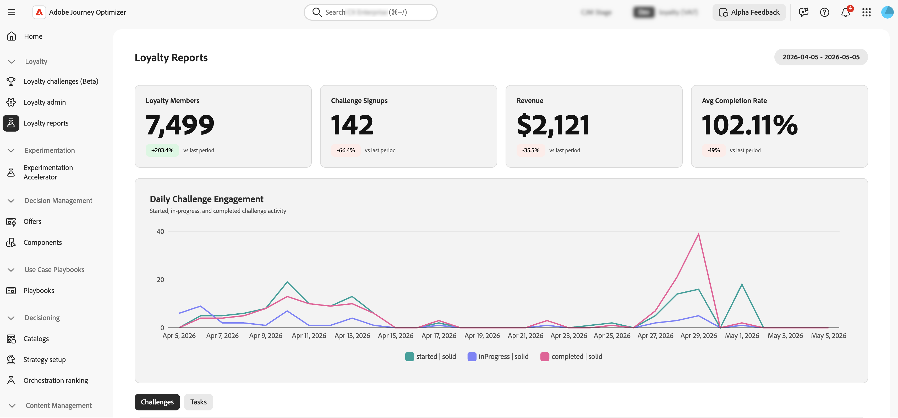

# Surveillance des performances des défis de fidélité {#loyalty-reporting}

>[!BEGINSHADEBOX]

**Documentation sur les défis de fidélité**

[Prise en main des défis de fidélité](get-started.md)

+++Créer et gérer des défis

* [Accéder aux défis et aux tâches et les gérer](access-loyalty-challenges.md)
* [Créer des défis](create-challenges.md)
* [Création de tâches](create-tasks.md)
* **Surveillance des performances du défi de fidélité** ◀︎ **Vous êtes ici**

+++

+++Configuration et intégration

<!-- * [Configure loyalty challenges](loyalty-admin.md) -->
* [Données et jeux de données de fidélité](loyalty-data-and-datasets.md)
* [Référence de l’API pour les défis de fidélité](https://developer.adobe.com/journey-optimizer-apis/references/loyalty-challenges){target="_blank"}

+++

>[!ENDSHADEBOX]

>[!AVAILABILITY]
>
>Cette fonctionnalité est actuellement en version bêta **privée**. Pour plus d’informations sur le cycle de publication et les phases de disponibilité, consultez le [cycle de publication de Journey Optimizer](../rn/releases.md).

La création de rapports sur les défis de fidélité fournit des tableaux de bord au niveau du défi afin que vous puissiez suivre des mesures clés telles que les performances d’audience funnel, les taux d’achèvement des tâches, l’émission de récompenses et l’impact sur le chiffre d’affaires. Toutes les données sont sourcées à partir d’Adobe Customer Journey Analytics et présentées dans une interface personnalisée spécialement conçue à cet effet.

<!--
A direct **Analyze in CJA** button will be added to the reporting interface before the feature reaches general availability.
-->

## Accès aux rapports de fidélité {#access-reports}

Pour ouvrir les tableaux de bord de rapports de fidélité, accédez à **[!UICONTROL Défis de fidélité (Beta)]** dans Journey Optimizer, puis sélectionnez **[!UICONTROL Rapports de fidélité]** dans le volet de navigation de gauche.

L’interface de création de rapports propose trois vues, chacune offrant un niveau de détail différent. La **[Présentation](#overview)** affiche un résumé de tous vos défis actifs. En dessous, deux onglets permettent de basculer entre des vues plus granulaires :

* **[Défis](#challenges-view)** : une répartition par défi avec une fonctionnalité d’analyse en profondeur,
* **[Tâches](#tasks-view)** : vue au niveau de la tâche des mesures de chiffre d’affaires et d’achèvement.

Vous pouvez ajuster la période de tous les modes à l’aide du sélecteur de date situé en haut de la page. Des paramètres prédéfinis de date standard sont également disponibles.

## Vue d’ensemble {#overview}

La page **Aperçu** affiche les mesures agrégées pour tous les défis actifs pour la période sélectionnée.

Le haut de la page affiche les mesures suivantes :

**Membres du programme de fidélité** - Nombre de membres du programme de fidélité actifs pendant la période sélectionnée.
**Inscriptions au défi** - Nombre total de nouvelles inscriptions au défi pour tous les défis.
**Chiffre d’affaires** - Chiffre d’affaires total lié à l’activité Défi pendant la période.
**Taux d’achèvement moyen** - Pourcentage de clients inscrits qui ont terminé au moins un défi.

En dessous de ces mesures, une chronologie **Engagement quotidien au défi** montre l’évolution de la participation au défi au cours de la période, en traçant trois séries :

* Les clients qui **ont commencé** un défi,
* Clients ayant passé au statut **en cours**,
* Les clients qui **ont terminé** un défi.

## Vue Défis {#challenges-view}

L’onglet **Défis** répartit les performances par défi individuel. Chaque défi est répertorié avec des colonnes clés telles que Type, Statut, Inscription, Achèvement, etc. La liste est triée par date de dernière modification et affiche dix défis à la fois. Utilisez le bouton **Suivant** en bas pour continuer la navigation.

Sélectionnez un défi dans la liste pour ouvrir sa vue détaillée. Le rapport comprend plusieurs blocs de mesures tels que le chiffre d’affaires total, l’inscription, le taux d’achèvement et des graphiques de tendances, ainsi qu’une répartition quotidienne.

+++Exemple de rapport de défi

+++

## Vue Tâches {#tasks-view}

L’onglet **Tâches** fournit une vue des performances des tâches sur plusieurs défis. Vous pouvez basculer entre les tâches principales par chiffre d’affaires et les tâches principales par achèvement pour vous concentrer sur la mesure qui vous intéresse le plus.

L’onglet met également en surbrillance les 6 premières tâches par chiffre d’affaires, ce qui donne un aperçu rapide des tâches qui génèrent le plus de valeur.

Sous le graphique en radar, une liste de tâches affiche chaque tâche avec des colonnes clés telles que les Achèvements, le Chiffre d’affaires et les défis auxquels chaque tâche appartient. La liste est triée par chiffre d’affaires et affiche dix tâches à la fois. Utilisez le bouton **Suivant** pour continuer la navigation.

