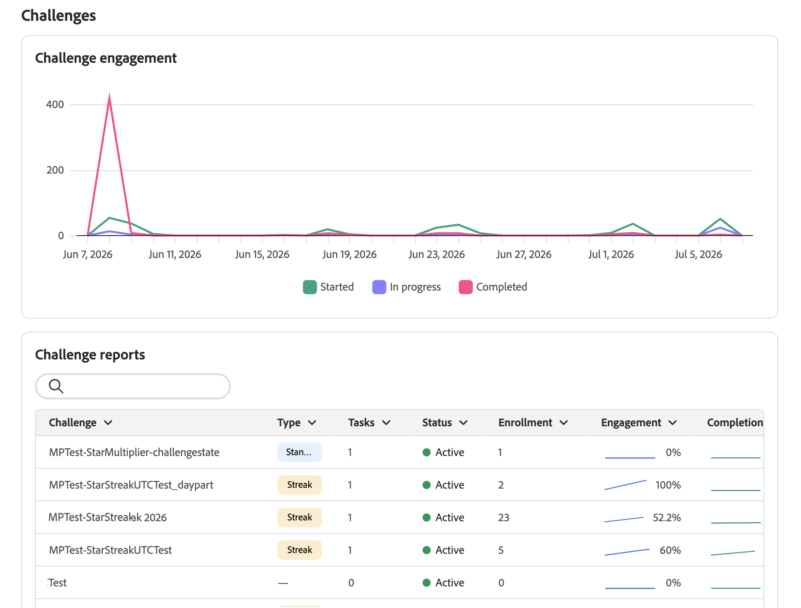

# Surveillance des performances des défis de fidélité {#loyalty-reporting}

>[!BEGINSHADEBOX]

**Table des matières**

[Prise en main des défis de fidélité](get-started.md)

<table style="table-layout:fixed">
<tr style="border: 0;">
<td style="vertical-align:top;">

**Créer et gérer des défis**

* [Accéder aux défis et aux tâches et les gérer](access-loyalty-challenges.md)
* [Créer des défis](create-challenges.md)
* [Création de tâches](create-tasks.md)
* **Surveillance des performances du défi de fidélité** ◀︎ **Vous êtes ici**

</td>
<td style="vertical-align:top;">

**Configuration et intégration**

* [Configuration des défis de fidélité](loyalty-admin.md)
* [Données et jeux de données de fidélité](loyalty-data-and-datasets.md)
* [Référence de l’API pour les défis de fidélité](https://developer.adobe.com/journey-optimizer-apis/references/loyalty-challenges){target="_blank"}

</td>
</tr>
</table>

>[!ENDSHADEBOX]

>[!AVAILABILITY]
>
>Cette fonctionnalité est actuellement en version bêta **privée**. Pour plus d’informations sur le cycle de publication et les phases de disponibilité, consultez le [cycle de publication de Journey Optimizer](../rn/releases.md).

Utilisez la création de rapports sur les défis de fidélité pour voir comment vos défis se comportent. Vérifiez qui s’inscrit, qui relève les défis et combien de revenus génère votre programme, le tout en un seul endroit. Les données proviennent d’Adobe Customer Journey Analytics.

Pour ouvrir les tableaux de bord de rapports, accédez à **[!UICONTROL Défis de fidélité (Beta)]** dans Journey Optimizer, puis sélectionnez **[!UICONTROL Rapports de fidélité]** dans le volet de navigation de gauche.

L’interface de création de rapports comporte deux onglets :

* **[Rapports](#reports-view)** : chiffres et graphiques pour vos défis.
* **[Insights](#insights-cards)** : cartes qui mettent en évidence ce qui mérite votre attention en ce moment.

## Vue Rapports {#reports-view}

L’onglet **Rapports** vous donne un aperçu des performances de votre programme pour la période sélectionnée. Utilisez le sélecteur de date en haut de la page et sélectionnez le bouton **[!UICONTROL Appliquer le filtre]** pour modifier la période de création des rapports et afficher les nombres et les graphiques mis à jour.

La zone **Mesures clés** présente quatre chiffres en un coup d’œil. Chaque mesure affiche également un pourcentage de modification par rapport à la période précédente.

* **Membres du programme de fidélité** : nombre de membres du programme de fidélité actifs au cours de la période.
* **Inscriptions au défi** : nombre de fois où les membres se sont inscrits à un défi.
* **Chiffre d’affaires** : chiffre d’affaires total lié à l’activité de défi.
* **Taux d’achèvement moyen** : pourcentage de membres inscrits qui ont terminé au moins un défi.

Le panneau **Dernières informations** sur la droite affiche les informations les plus récentes générées par l’IA depuis votre programme. Sélectionnez **[!UICONTROL Afficher tout]** pour ouvrir l’onglet **Insights** complet.

Sous les mesures clés, la section **Défis** vous donne deux vues de l’activité de défi.

* **Engagement du défi** : un calendrier indiquant le nombre de membres qui ont commencé, qui sont en cours et qui ont terminé les défis au cours de la période.
* **Rapports de défis** : un tableau de tous vos défis avec des détails tels que le type, les tâches, le statut et les numéros d’inscription. Utilisez la barre de recherche pour trouver un défi spécifique. Sélectionnez un défi pour afficher son rapport complet avec les tendances d’engagement et les détails de performance.

  +++Exemple de rapport de défi

  

  +++

## Onglet Informations {#insights-cards}

L’onglet **Insights** affiche les cartes générées par l’IA qui signalent les anomalies, les tendances et les opportunités de votre programme de fidélité. Chaque carte représente une observation unique et est classée en fonction de son importance par rapport aux données actuelles de votre programme.

Un horodatage **Dernière explorée** en haut à droite indique la date du dernier traitement des données de votre programme par le moteur insight.

### Actions de carte {#insight-card-actions}

Chaque carte comporte un menu  avec deux actions :

* **Ignorer** : supprime définitivement la carte de la liste des insights.
* **Répéter** : masque temporairement la carte. Optez pour une sieste pendant **1 jour** **3 jours** ou **7 jours**. La carte réapparaît à la fin de la période de réveil.

<!--
### Priority badges {#insight-badges}

Each card has a priority badge — **High**, **Medium**, or **Low** — based on how significant the underlying signal is relative to your current program data. These levels are relative: there are always a few **High** cards, even in a quiet week. **High** means "most relevant right now", not that a fixed threshold was crossed.
-->

### Balises de catégorie {#insight-category-tags}

Chaque carte comporte une **balise de catégorie** qui identifie la partie de votre programme à laquelle insight se rapporte.

| Catégorie | Ce qu’il couvre |
| --- | --- |
| **À l&#39;échelle du programme** | État général et performances de votre programme de fidélité |
| **Niveau** | Bénéficiez de taux, de déplacement et de répartition entre les niveaux de membres. |
| **Défi** | Activité, taux d’achèvement et anomalies pour un défi spécifique ou entre plusieurs défis |
| **Produit** | Performances du catalogue de produits, y compris les vues, les rachats et les tendances au niveau du catalogue |
| **Cycle de vie du membre** | Comment les membres progressent par étapes d’inscription, d’engagement et d’attrition |
| **tendance** | Modèles temporels tels que les cycles hebdomadaires, les pics saisonniers ou les inversions de tendance |
