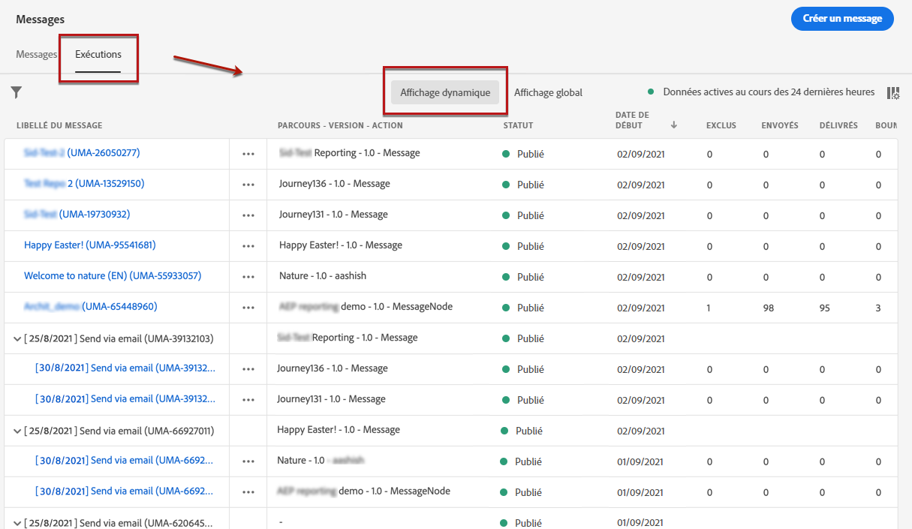
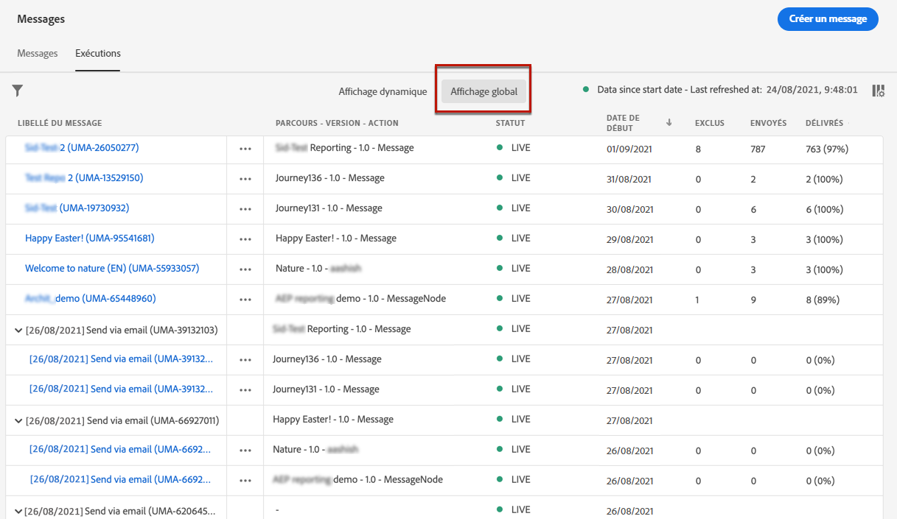
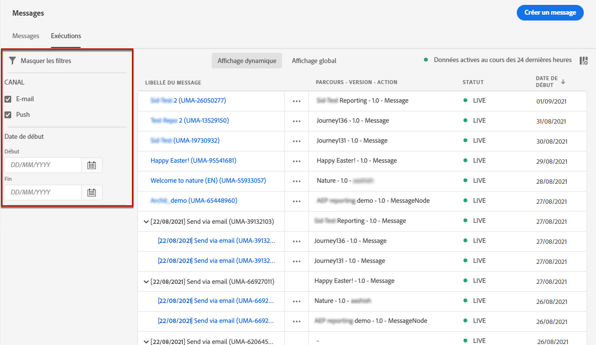
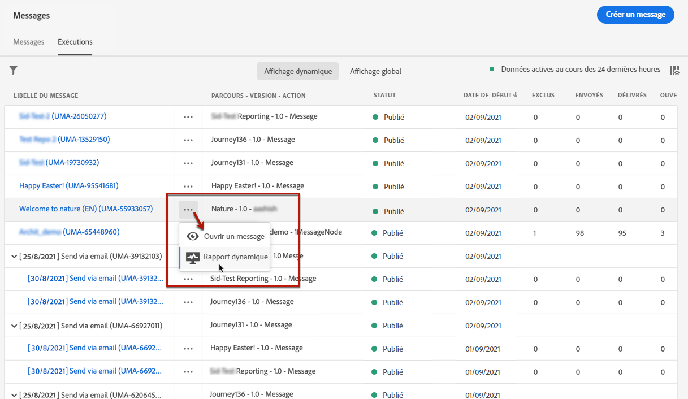

# Surveillance des messages {#monitor-message-execution}

Pour vous assurer que vos messages sont exécutés, envoyés et diffusés avec succès, [!DNL Journey Optimizer] offre des fonctionnalités permettant de surveiller les messages actuellement publiés et déclenchés. Vous pouvez voir comment vos messages se comportent entre les parcours <!--and APIs--> en temps réel à partir de la liste **[!UICONTROL Exécutions]**.

Pour accéder à cette liste, sur la page d’accueil de **[!DNL Journey Optimizer]**, sélectionnez **[!UICONTROL Messages]**, puis cliquez sur l’onglet **[!UICONTROL Exécutions]**.

Cet onglet propose deux affichages : **[!UICONTROL Affichage dynamique]** et **[!UICONTROL Affichage global]**.

* L’onglet **[!UICONTROL Affichage dynamique]** donne un **aperçu en temps réel de tous les messages exécutés** déclenchés par un ou plusieurs [parcours](building-journeys/journey.md) **au cours des 24 dernières heures uniquement**.

   

   Cette liste est automatiquement actualisée toutes les 60 secondes. Si aucune exécution n’a eu lieu au cours des 24 dernières heures pour un message spécifique, toutes les colonnes affichent des valeurs nulles (0) pour ce message.

* L’onglet **[!UICONTROL Affichage global]** donne un **aperçu de tous les messages exécutés** déclenchés par un ou plusieurs [parcours](building-journeys/journey.md) **depuis la date de début du message**.

   

   Cette liste est automatiquement actualisée toutes les 90 minutes. Les données sont agrégées au fil du temps depuis chaque date de début du message.

Si un message est publié mais n’est pas encore déclenché par un parcours, il n’est répertorié dans aucun des onglets. Seuls les éléments suivants sont répertoriés :
* Messages ayant été déclenchés mais pas encore démarrés (en attente).
* Messages ayant été déclenchés et en cours d’exécution (en cours).

<!--For multichannel messages, one row per channel is displayed for each message. STILL VALID? looks like NOT-->

>[!NOTE]
>
>Si un message a été utilisé dans plusieurs parcours, une ligne par parcours est affichée pour chaque exécution.

<!---->

<!--If a message has been used in several journeys, the **[!UICONTROL Source]** column displays **[!UICONTROL Multiple]**.-->

Par défaut, les messages s’affichent à partir de la date d’exécution la plus récente. Cliquez sur l’icône **[!UICONTROL Filtres]** pour rechercher les messages en fonction du canal, de la date de début et/ou de la date de fin.

La <!--**[!UICONTROL Quick action]**-->seconde colonne permet d’ouvrir le [message](create-message.md) correspondant et d’accéder au [Rapport dynamique](reports/live-report.md) si vous êtes dans l’**[!UICONTROL Affichage dynamique]** ou au [Rapport global](reports/global-report.md) si vous êtes dans l’**[!UICONTROL Affichage global]**.

Pour chaque exécution de message, plusieurs indicateurs s’affichent :

* **[!UICONTROL Libellé du message]** : titre du message que vous avez défini lors de la [création du message](create-message.md). L’ID d’exécution, qui est généré automatiquement, est affiché entre parenthèses.

   <!--**[!UICONTROL Execution ID]**: Automatically generated identifier.
  **[!UICONTROL Source]**: Name of the journey leveraging that message.-->

* **[!UICONTROL Parcours - Version - Action]** : Nom du parcours exploitant le message, la version du parcours et le libellé de l’action exploitant le message dans le parcours.

* **[!UICONTROL État]** : Etat d&#39;exécution du message.  <!--List all the possible statuses? For now only Live status? The user cannot stop or cancel the execution. TBC by Fred-->

* **[!UICONTROL Date de début]** : date et heure auxquelles le message a été exécuté à partir du parcours.

   <!--Targeted: Number of targeted profiles for each message execution. To come?-->

* **[!UICONTROL Exclus]** : nombre de profils ayant été exclus de la cible initiale en raison de règles d’exclusion.

* **[!UICONTROL Envoyés]** : nombre de messages ayant été envoyés.

* **[!UICONTROL Délivrés]** : nombre de messages délivrés avec succès dans la boîte aux lettres du destinataire (email) ou sur l’appareil (push) sans générer de bounce ou une autre erreur de diffusion.

* **[!UICONTROL Bounces]** : nombre de messages ne pouvant pas être délivrés en raison d’un échec de diffusion. [En savoir plus sur les rebonds](suppression-list.md).

* **[!UICONTROL Ouvertures]** : nombre de messages ayant été ouverts.

* **[!UICONTROL Clics]** : nombre de clics effectués sur des liens dans un email.

   >[!NOTE]
   >
   >Les clics n’existent pas pour les notifications push : lorsqu’un utilisateur clique sur une notification push, une application s’ouvre, qui ne peut être considérée que comme une ouverture.

* **[!UICONTROL Erreurs]** : nombre de messages qui ne peuvent pas être envoyés en raison d’une défaillance technique.

* **[!UICONTROL Réclamations relatives aux spams]** : Nombre de messages marqués comme spam par les destinataires. [En savoir plus sur les plaintes](https://experienceleague.adobe.com/docs/deliverability-learn/deliverability-best-practice-guide/metrics-for-deliverability/complaints.html?lang=fr#metrics-for-deliverability).

Cliquer sur chaque lien hypertexte entraîne l’ouverture de la vue de synthèse de message correspondante. [En savoir plus sur les messages](create-message.md).
