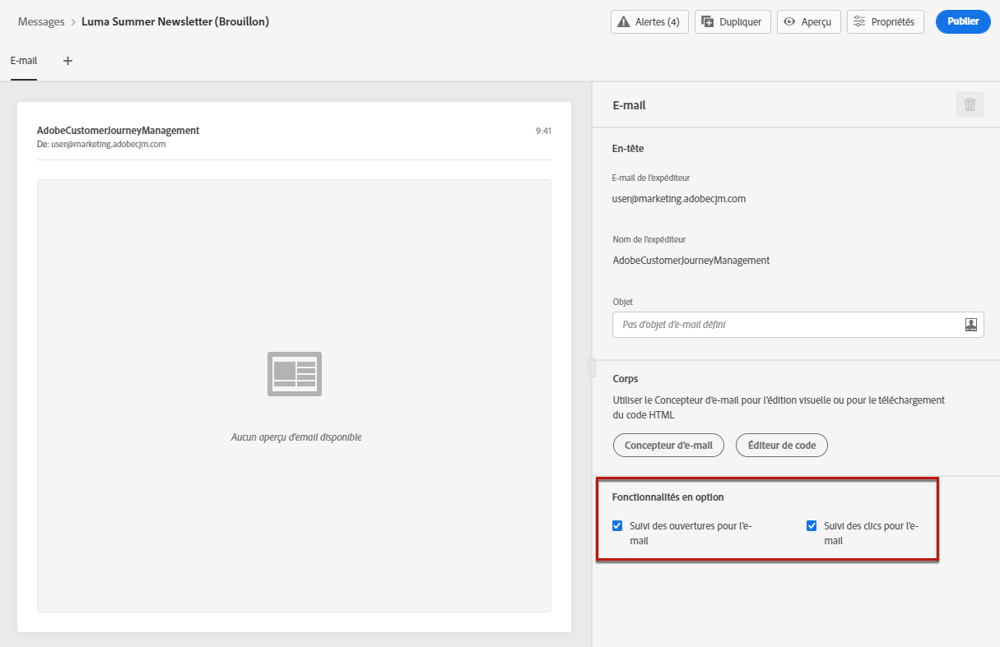
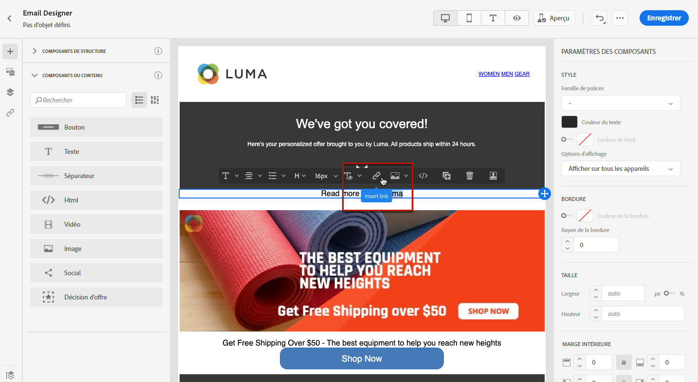
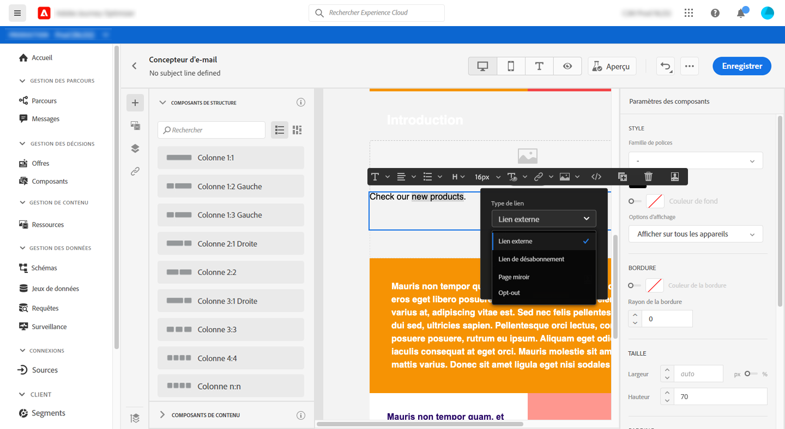
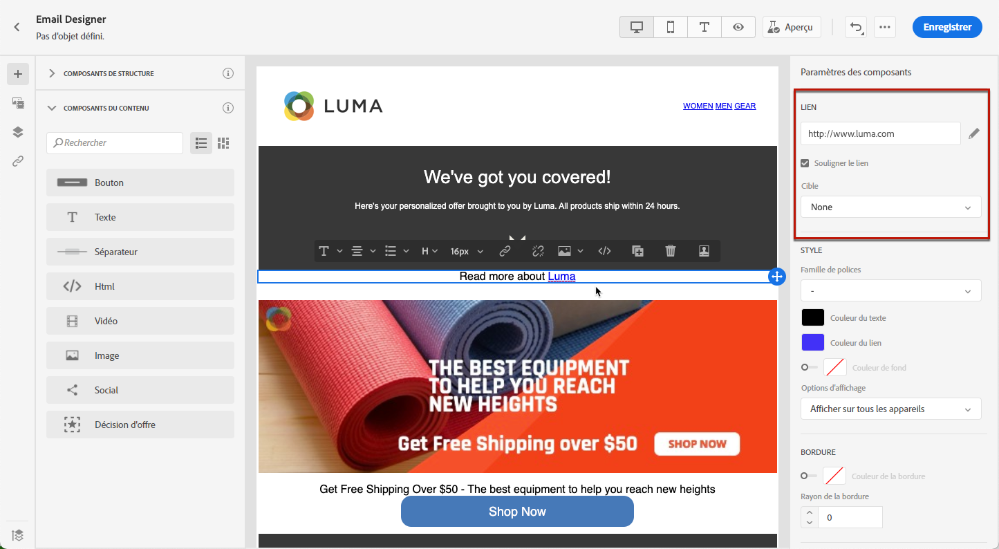
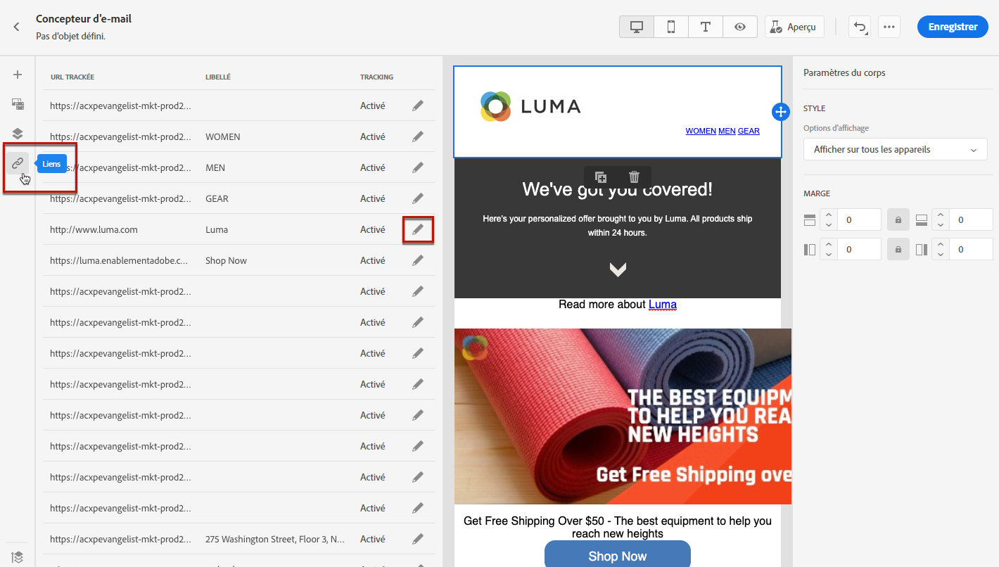

# Tracking des messages {#tracking}

Utilisez [!DNL Journey Optimizer] pour tracker les messages envoyés et le comportement de vos destinataires.

## Activer le suivi {#enable-tracking}

Vous pouvez activer le tracking au niveau du message en cochant les options **[!UICONTROL Ouvrir le tracking pour les emails]** et/ou **[!UICONTROL Suivi des clics pour les emails]** lors de la [création de votre message](create-message.md).

>[!NOTE]
>
>Les deux options sont activées par défaut.

Vous pourrez ainsi tracker le comportement de vos destinataires par :
* **[!UICONTROL Ouvrir le tracking des emails]** : Messages ouverts.
* **[!UICONTROL Cliquez sur Suivi pour les courriers électroniques]** : Clics sur les liens d’un email.

## Insérer des liens {#insert-links}

Lors de la conception d&#39;un message, vous pouvez ajouter des liens à votre contenu.

>[!NOTE]
>
>Lorsque le [tracking est activé](#enable-tracking), tous les liens inclus dans le contenu du message sont suivis.

Pour insérer des liens dans le contenu de votre email, procédez comme suit :

1. Sélectionnez un élément et cliquez sur **[!UICONTROL Insérer un lien]** dans la barre d&#39;outils contextuelle.

   

1. Choisissez le type de lien que vous souhaitez créer :

   * **[!UICONTROL Lien]** externe : Insérez un lien vers une URL externe.

   * **[!UICONTROL Lien]** de désabonnement : Insérez un lien pour vous désabonner de la réception des communications de votre marque. Pour en savoir plus sur la gestion des opt-out, consultez [cette section](consent.md#opt-out-management).

   * **[!UICONTROL Page miroir]** : Insérez un lien pour afficher le contenu de l&#39;email dans un navigateur web.

   

1. Vous pouvez personnaliser vos liens à l’aide d’une expression simple uniquement. Pour en savoir plus sur la personnalisation, consultez [cette section](personalization/personalization-syntax.md).

1. Enregistrez vos modifications.

1. Une fois le lien créé, vous pouvez toujours le modifier à partir du volet **[!UICONTROL Paramètres des composants]** à droite.

   * Cliquez sur l’icône représentant un crayon pour modifier le lien.
   * Vous pouvez souligner le lien ou non en cochant l&#39;option correspondante.

   

## Gérer le suivi {#manage-tracking}

Le [Concepteur d’email](create-email-content.md) permet de gérer les URL trackées, comme l’édition du type de tracking pour chaque lien.

1. Cliquez sur l’icône **[!UICONTROL Liens]** dans le volet de gauche pour afficher la liste de toutes les URL de votre contenu qui seront trackées.

   Cette liste permet d&#39;avoir une vue centrale et de localiser chaque URL dans le contenu de l&#39;email.

1. Pour modifier un lien, cliquez sur l’icône de crayon correspondante.

   

1. Si nécessaire, vous pouvez modifier le **[!UICONTROL Type de suivi]** :

   

   Pour chaque URL trackée, vous pouvez définir le mode de tracking sur l&#39;une de ces valeurs :

   * **[!UICONTROL Suivi]** : Active le tracking sur cette URL.
   * **[!UICONTROL Exclusion]** : Considère cette URL comme une URL d’opt-out ou de désabonnement.
   * **[!UICONTROL Page miroir]** : considère cette URL comme une URL de page miroir.
   * **[!UICONTROL Jamais]** : N’active jamais le suivi de cette URL.  <!--This information is saved: if the URL appears again in a future message, its tracking is automatically deactivated.-->

Le nombre de messages ayant été ouverts et le nombre de liens ayant fait l’objet d’un clic sont répertoriés dans l’onglet [Exécutions](message-monitoring.md).

La création de rapports sur les ouvertures et les clics est disponible dans le [rapport Envoyer par messagerie en direct](reports/email-live-report.md) et dans le [Rapport global par courriel](reports/email-global-report.md).

