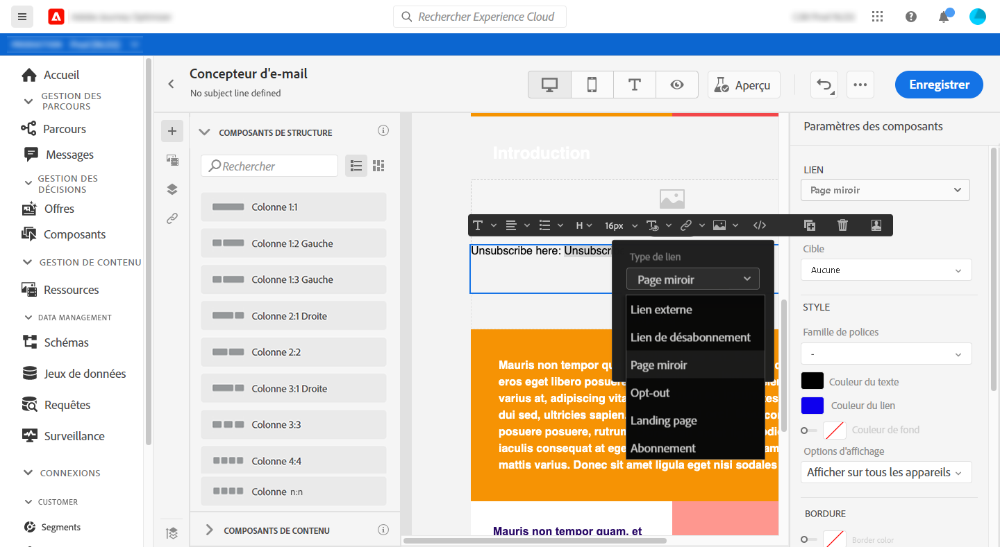

# Ajout de liens et suivi des messages {#tracking}

Utilisez [!DNL Journey Optimizer] pour ajouter des liens à votre contenu et suivre les messages envoyés afin de surveiller le comportement de vos destinataires.

## Activation du suivi {#enable-tracking}

Vous pouvez activer le suivi au niveau des messages en cochant les options **[!UICONTROL Suivi des ouvertures pour les e-mails]** et/ou **[!UICONTROL Suivi des clics pour les e-mails]** lorsque vous [créez votre message](create-message.md).

>[!NOTE]
>
>Les deux options sont activées par défaut.

Vous pourrez ainsi suivre le comportement de vos destinataires via :
* **[!UICONTROL Suivi des ouvertures pour les e-mails]** : messages ouverts.
* **[!UICONTROL Suivi des clics pour les e-mails]** : clics sur les liens d&#39;un e-mail.

## Insertion de liens {#insert-links}

Lors de la conception d&#39;un message, vous pouvez ajouter des liens à votre contenu.

>[!NOTE]
>
>Lorsque le [suivi est activé](#enable-tracking), tous les liens inclus dans le contenu du message sont suivis.

Pour insérer des liens dans le contenu de votre e-mail, procédez comme suit :

1. Sélectionnez un élément et cliquez sur **[!UICONTROL Insérer un lien]** dans la barre d&#39;outils contextuelle.

   

1. Choisissez le type de lien que vous souhaitez créer :

   * **[!UICONTROL Lien externe]** : insérez un lien vers une URL externe.

   * **[!UICONTROL Lien de désabonnement]** : insérez un lien pour se désabonner de la réception des communications de votre marque. En savoir plus sur la gestion des opt-outs dans [cette section](consent.md#opt-out-management).

   * **[!UICONTROL Page miroir]** : insérez un lien pour afficher le contenu de l&#39;e-mail dans un navigateur web. En savoir plus dans [cette section](#mirror-page).

   

1. Vous pouvez personnaliser vos liens à l&#39;aide d&#39;une expression simple uniquement. Pour en savoir plus sur la personnalisation, consultez [cette section](personalization/personalization-syntax.md).

1. Enregistrez vos modifications.

1. Une fois le lien créé, vous pouvez toujours le modifier à partir du volet **[!UICONTROL Paramètres des composants]** à droite.

   * Cliquez sur l&#39;icône représentant un crayon pour modifier le lien.
   * Vous pouvez souligner le lien ou non en cochant l&#39;option correspondante.

   

## Lien vers une page miroir {#mirror-page}

La page miroir est une page HTML accessible en ligne via un navigateur web. Son contenu est identique à celui de votre email.

Pour ajouter un lien vers une page miroir dans votre email, [insérez un lien](#insert-links) et sélectionnez **[!UICONTROL Page miroir]** comme type de lien.

La page miroir est automatiquement créée.

>[!NOTE]
>
>Vous ne pouvez pas modifier le lien généré automatiquement.

Une fois l&#39;email envoyé, lorsque les destinataires cliquent sur le lien de la page miroir, le contenu de l&#39;email s&#39;affiche dans leur navigateur web par défaut.

>[!NOTE]
>
>Dans la balise [BAT](preview.md#send-proofs) envoyée aux profils de test, le lien vers la page miroir n’est pas principal. Il n&#39;est activé que dans les messages finaux.

La période de conservation d’une page miroir est de 60 jours. Après ce délai, la page miroir ne sera plus disponible.

## Gestion du suivi {#manage-tracking}

Le [Concepteur d&#39;e-mail](create-email-content.md) permet de gérer les URL suivies, par exemple modifier le type de suivi pour chaque lien.

1. Cliquez sur l&#39;icône **[!UICONTROL Liens]** du volet de gauche pour afficher la liste de toutes les URL de votre contenu qui feront l&#39;objet d&#39;un suivi.

   Cette liste permet d&#39;avoir une vue centrale et de localiser chaque URL dans le contenu de l&#39;e-mail.

1. Pour modifier un lien, cliquez sur l&#39;icône de crayon correspondante.

   

1. Si nécessaire, vous pouvez modifier le **[!UICONTROL Type de suivi]** :

   

   Pour chaque URL suivie, vous pouvez définir le mode de suivi sur l&#39;une de ces valeurs :

   * **[!UICONTROL Suivi]** : active le suivi de cette URL.
   * **[!UICONTROL Opt-out]** : considère cette URL comme une option d&#39;opt-out ou une URL de désabonnement.
   * **[!UICONTROL Page miroir]** : considère cette URL comme une URL de page miroir.
   * **[!UICONTROL Jamais]** : n&#39;active jamais le suivi de cette URL. <!--This information is saved: if the URL appears again in a future message, its tracking is automatically deactivated.-->

Le nombre de messages ayant été ouverts et le nombre de liens ayant fait l&#39;objet d&#39;un clic sont répertoriés dans l&#39;onglet [Exécutions](message-monitoring.md).

La création de rapports sur les ouvertures et les clics est disponible dans le [rapport dynamique sur les e-mails](reports/email-live-report.md) et dans le [Rapport global sur les e-mails](reports/email-global-report.md).

