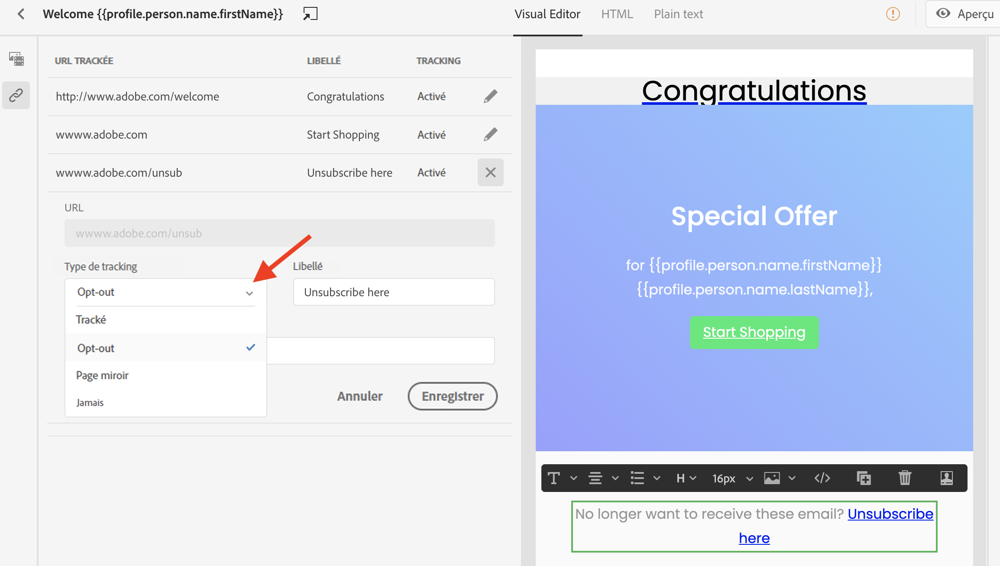

# Suivi des messages {#tracking}

Journey Optimizer vous permet de suivre les messages envoyés et le comportement de vos destinataires.

Vous pouvez activer le suivi au niveau des messages en cochant les options **[!UICONTROL Suivi des ouvertures pour l’email]** et/ou **[!UICONTROL Suivi des clics pour l’email]**. Vous pourrez ainsi suivre le comportement de vos destinataires à travers les ouvertures et/ou les clics sur les liens. [En savoir plus sur la création de messages](create-message.md).

Lors de la conception d’un message, vous pouvez ajouter des liens suivis à votre contenu. De plus, le Concepteur d’email vous permet de gérer les URL qui seront suivies (par exemple, l’activation/la désactivation du suivi ou la modification du type de suivi pour chaque lien). [En savoir plus sur l’utilisation du Concepteur d’email](create-email-content.md) .

Le nombre de messages ayant été ouverts et le nombre de liens ayant fait l’objet d’un clic sont répertoriés dans l’onglet [Exécutions](message-monitoring.md).
