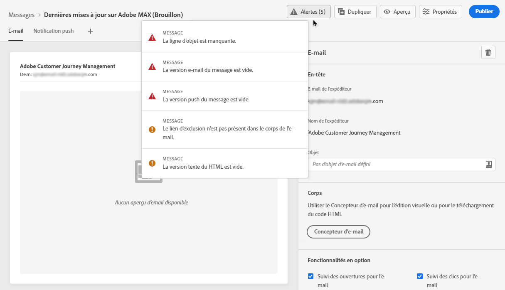

# Vérification des alertes sur vos messages {#publish-manage-messages}

## Vérifications avant publication {#message-alerting}

Lorsque vous créez votre message, des alertes vous avertissent si vous devez effectuer des opérations importantes avant de le publier.

Les alertes s’affichent en haut à droite de l’écran, comme illustré ci-dessous :

>[!NOTE]
>
>Si ce bouton ne s’affiche pas, aucune alerte n’a été détectée.

Deux types d’alertes peuvent avoir lieu :

* Les **avertissements** se rapportent aux recommandations et aux bonnes pratiques. Par exemple, un message s’affiche si le lien de d’opt-out est manquant.

* Les **erreurs** vous empêchent de publier le message tant qu’elles ne sont pas corrigées. Par exemple, un message vous avertit que l’objet est manquant.

Tous les avertissements et erreurs possibles sont détaillés [ci-dessous](#alerts-and-warnings).

>[!CAUTION]
>
> Vous devez résoudre toutes les alertes d’**erreur** avant de procéder à la publication.

## Liste des avertissements et des erreurs {#alerts-and-warnings}

Les paramètres et les éléments vérifiés par le système sont répertoriés ci-dessous. Vous trouverez également des informations sur la façon d’adapter votre configuration pour résoudre les problèmes correspondants.

**Avertissements** :

* **[!UICONTROL Le lien d’exclusion n’est pas présent dans le corps de l’email.]**: il est recommandé d’ajouter un lien de désinscription dans votre corps d’email. Découvrez comment configurer ce lien dans [cette section](consent.md).

* **[!UICONTROL La version texte du HTML est vide.]**: n&#39;oubliez pas de définir une version texte du corps de votre email, car elle sera utilisée lorsque le contenu du HTML ne peut pas être affiché. Découvrez comment créer cette version texte dans [cette section](create-email-content.md#generate-text-version).

* **[!UICONTROL Le lien vide est présent dans le corps de l&#39;email.]**: vérifiez que tous les liens de votre email sont corrects. Découvrez comment gérer le contenu et les liens dans [cette section](create-email-content.md).

* **[!UICONTROL La taille des emails a dépassé la limite de 100 Ko.]**: pour une diffusion optimale, veillez à ce que la taille de votre email ne dépasse pas 100 Ko. Découvrez comment modifier le contenu des emails dans [cette section](create-email-content.md).

**Erreurs** :

* **[!UICONTROL L’objet est manquant.]**: l’objet de l’email est obligatoire. Découvrez comment définir et personnaliser cette ligne dans [cette section](create-email.md).

   <!--HTML is empty when Amp HTML is present-->

* **[!UICONTROL La version push du message est vide.]**: cette erreur s&#39;affiche lorsque le titre ou le corps de la notification push est manquant. Découvrez comment définir le contenu des notifications push dans [cette section](create-push.md).

* **[!UICONTROL La version email du message est vide.]**: cette erreur s&#39;affiche lorsque le contenu de l&#39;email n&#39;a pas été configuré. Découvrez comment concevoir le contenu des emails dans [cette section](design-emails.md).

* **[!UICONTROL Le paramètre prédéfini n’existe pas.]**: vous ne pouvez pas publier votre message si le paramètre prédéfini que vous avez sélectionné est supprimé après la création du message. Si cette erreur se produit, sélectionnez un autre préréglage dans les **[!UICONTROL Propriétés]** du message. Pour en savoir plus sur le branding, consultez [cette section](../configuration/about-subdomain-delegation.md).

* **[!UICONTROL La charge utile push iOS/Android a dépassé la limite de 4 Ko.]**: la taille de la notification push ne peut pas dépasser 4 Ko. Pour respecter cette limite, essayez de réduire l’utilisation des images ou des émoticônes. Découvrez comment gérer le contenu de vos notifications push dans [cette section](create-push.md).

>[!CAUTION]
>
> Pour pouvoir publier votre message, vous devez résoudre toutes les alertes d’**erreur**.

<!--Other issues can stop publication such as:
* The push notification title is empty-->
