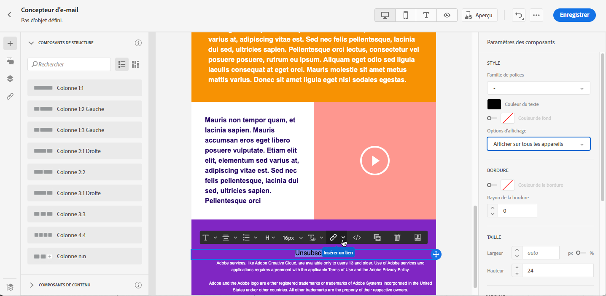
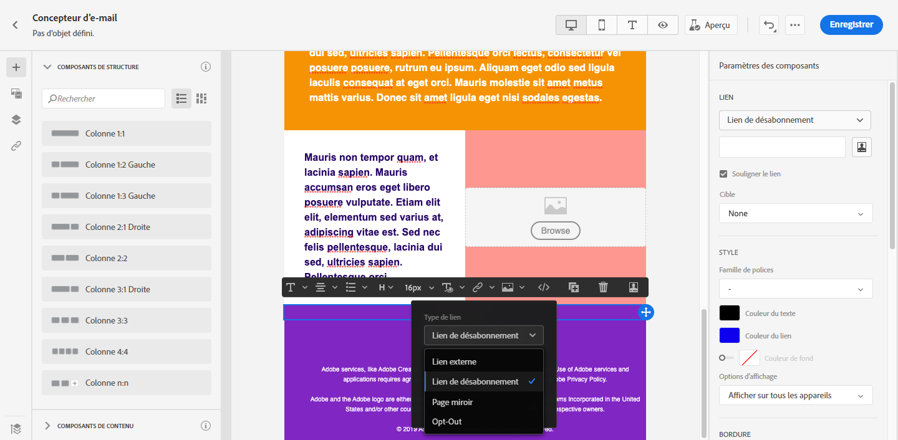
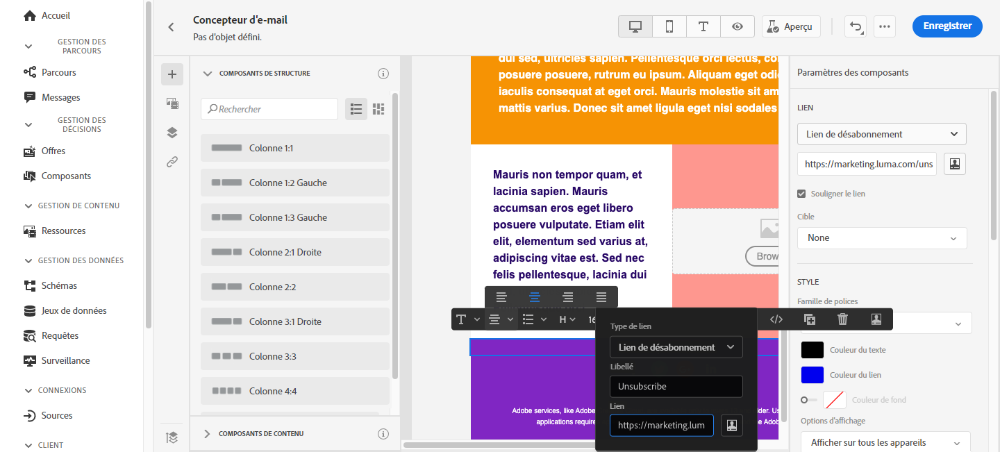
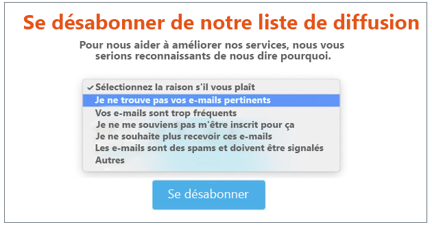
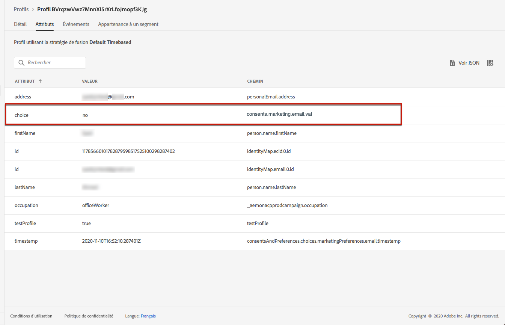
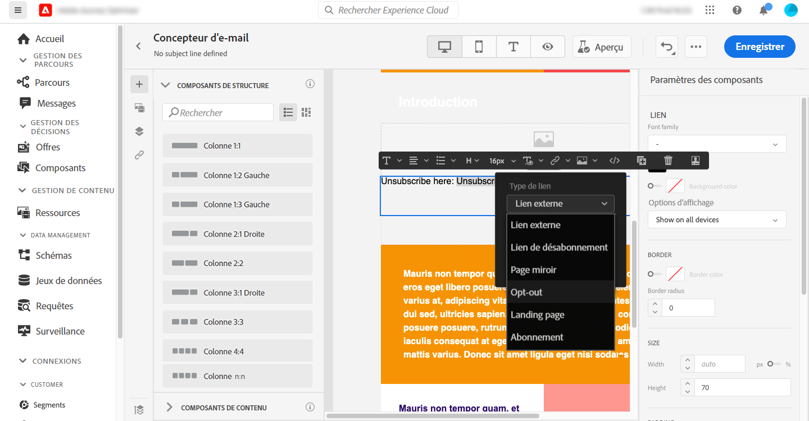
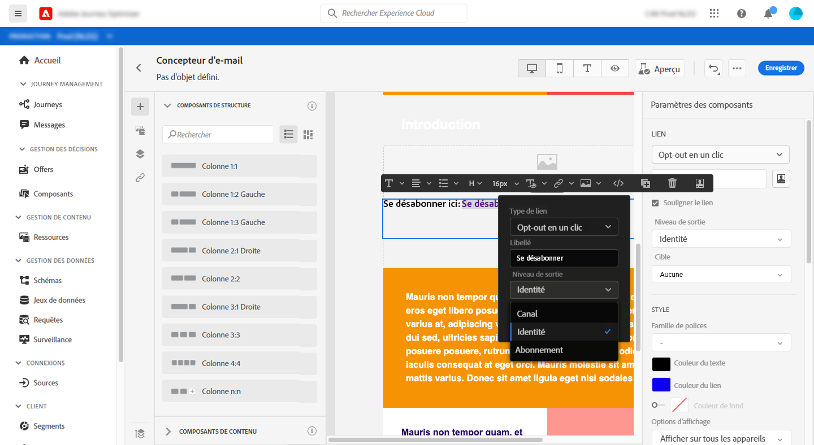
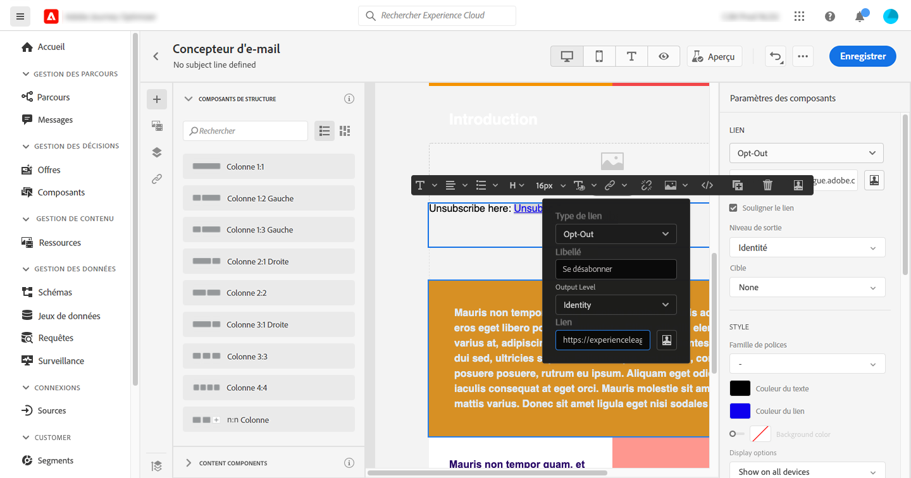
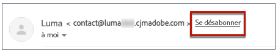

# Gestion du consentement {#consent}

Utilisez [!DNL Journey Optimizer] pour suivre le consentement de vos destinataires à la communication et comprendre comment ils veulent interagir avec votre marque en gérant leurs préférences et leurs abonnements.

Des règlements tels que le RGPD stipulent que vous devez respecter des exigences spécifiques avant de pouvoir utiliser les informations provenant de sujets de données. En outre, les sujets de données devraient pouvoir modifier leur consentement à tout moment.

**Pourquoi est-ce important ?**

* Le fait de ne pas se conformer à ces règlements introduit des risques juridiques réglementaires pour votre marque.
* Cela vous aide à éviter d&#39;envoyer des communications non sollicitées à vos destinataires, ce qui pourrait les faire marquer vos messages comme des courriers indésirables et nuire à votre réputation.

Pour en savoir plus sur la gestion de la confidentialité et les réglementations applicables, consultez la [documentation Experience Platform](https://experienceleague.adobe.com/docs/experience-platform/privacy/home.html?lang=fr){target=&quot;_blank&quot;}.

>[!NOTE]
>
>Dans [!DNL Journey Optimizer], le consentement est géré par l’Experience Platform [Schéma de consentement](https://experienceleague.adobe.com/docs/experience-platform/xdm/field-groups/profile/consents.html){target=&quot;_blank&quot;}. Par défaut, la valeur du champ de consentement est vide et traitée comme un consentement pour recevoir vos communications. Vous pouvez modifier cette valeur par défaut lors de l’intégration à l’une des valeurs possibles répertoriées. [here](https://experienceleague.adobe.com/docs/experience-platform/xdm/data-types/consents.html#choice-values){target=&quot;_blank&quot;}.

## Gestion des opt-out des emails {#opt-out-management}

La possibilité pour les destinataires de se désabonner de la réception des communications d&#39;une marque est une exigence légale. Pour en savoir plus sur la législation applicable, consultez la [documentation d’Experience Platform](https://experienceleague.adobe.com/docs/experience-platform/privacy/regulations/overview.html?lang=fr#regulations){target=&quot;_blank&quot;}.

Par conséquent, vous devez toujours inclure un **lien de désabonnement** dans chaque e-mail envoyé aux destinataires :

* Lorsque vous cliquez sur ce lien, les destinataires sont redirigés vers une landing page pour confirmer leur désinscription.
* Une fois leur choix confirmé, les données des profils seront mises à jour avec ces informations.

### Désinscription externe {#opt-out-external-lp}

Pour cela, vous pouvez insérer dans un email un lien vers une landing page externe afin de permettre aux utilisateurs de se désabonner de la réception des communications de votre marque.

#### Ajout d’un lien de désabonnement {#add-unsubscribe-link}

Vous devez d’abord ajouter un lien de désabonnement dans un message. Pour ce faire, procédez comme suit :

1. Créez votre propre landing page de désinscription.

1. Hébergez-le sur le système tiers de votre choix.

1. [Créez un message](create-message.md) dans [!DNL Journey Optimizer].

1. Sélectionnez du texte dans votre contenu et [insérez un lien](message-tracking.md#insert-links) à l’aide de la barre d’outils contextuelle.

   

1. Sélectionner **[!UICONTROL Désinscription/désinscription externe]** de la **[!UICONTROL Type de lien]** liste déroulante.

   

1. Dans le **[!UICONTROL Lien]** collez le lien vers votre page d’entrée tierce.

   

1. Cliquez sur **[!UICONTROL Enregistrer]**.

1. Enregistrez votre contenu et [publiez votre message](publish-manage-message.md).

#### Mise en oeuvre d’un appel API pour l’exclusion {#opt-out-api}

Pour que vos destinataires soient désinscrits lorsqu’ils envoient leur choix à partir de la page d’entrée, vous devez mettre en oeuvre une **Appel de l’API d’abonnement** par Adobe I/O pour mettre à jour les préférences des profils correspondants.

Cet appel Adobe I/O POST est le suivant :

Point dʼentrée : platform.adobe.io/journey/imp/consent/preferences

Paramètres de requête:

* **params** : contient la payload chiffrée
* **sig** : signature
* **pid** : ID de profil chiffré

Ces trois paramètres seront inclus dans l’URL de page d’entrée tierce envoyée à votre destinataire :


Exigences d’en-tête :

* x-api-key
* x-gw-ims-org-id
* x-sandbox-name
* autorisation (jeton utilisateur de votre compte technique)

Corps de la requête:

```
{
   "marketing": [
       {
            "type": "email",           
            "choice": "no",          
            "scope": "channel"       
        }
    ],
 
}
```

[!DNL Journey Optimizer] utilisera ces paramètres pour mettre à jour le choix du profil correspondant par le biais de l’appel d’Adobe I/O.

#### Envoyer le message avec le lien de désabonnement {#send-message-unsubscribe-link}

Une fois que vous avez configuré le lien de désabonnement sur votre page d’entrée et mis en oeuvre l’appel API , votre message est prêt à être envoyé.

1. Envoyer le message, y compris le lien par le biais d&#39;une [parcours](../building-journeys/journey.md).

1. Une fois le message reçu, si le destinataire clique sur le lien de désabonnement, votre page de destination s’affiche.

   

1. Si le destinataire envoie le formulaire (ici, en appuyant sur la fonction **Désabonner** dans votre landing page), les données de profil sont mises à jour via la fonction [Adobe I/O de l’appel](#opt-out-api).

1. Le destinataire désabonné est ensuite redirigé vers un écran de message de confirmation indiquant que la désinscription a réussi.

   

   Par conséquent, cet utilisateur ne recevra aucune communication de votre marque à moins d&#39;être de nouveau abonné.

1. Pour vérifier que le choix du profil correspondant a été mis à jour, accédez à Experience Platform puis au profil en sélectionnant un espace de noms d’identité et une valeur d’identité correspondante. Pour en savoir plus, consultez la [documentation d’Experience Platform](https://experienceleague.adobe.com/docs/experience-platform/profile/ui/user-guide.html?lang=fr#getting-started){target=&quot;_blank&quot;}.

   

   Dans l&#39;onglet **[!UICONTROL Attributs]**, vous pouvez voir la valeur de **[!UICONTROL choice]** remplacée par **[!UICONTROL no]**.

### Désinscription en un clic {#one-click-opt-out}

Comme de nombreux clients recherchent un processus plus facile pour se désabonner, vous pouvez également ajouter un lien d’exclusion en un clic dans votre contenu d’e-mail. Ce lien permettra à vos destinataires de se désabonner rapidement de vos communications, sans être redirigés vers une landing page dans laquelle ils devront confirmer leur choix, ce qui accélère le processus de désabonnement.

Pour ajouter un lien d’exclusion dans votre e-mail, procédez comme suit.

1. [Insérer un lien](message-tracking.md#insert-links) et sélectionnez **[!UICONTROL Exclusion en un clic]** comme type de lien.

   

1. Sélectionnez le mode d’application de la désinscription : au niveau du canal, de l’identité ou de l’abonnement.

   

   * **[!UICONTROL Canal]** : la désinscription s’applique aux futurs messages envoyés à la cible du profil (c’est-à-dire son adresse e-mail) pour le canal actuel. Si plusieurs cibles sont associées à un profil, la désinscription s’applique à toutes les cibles (adresses e-mail, par exemple) du profil pour ce canal.
   * **[!UICONTROL Identité]** : la désinscription s’applique aux futurs messages envoyés à la cible spécifique (c’est-à-dire l’adresse e-mail) utilisée pour le message en cours.
   * **[!UICONTROL Abonnement]** : la désinscription s’applique aux futurs messages associés à une liste d’abonnement spécifique. Cette option ne peut être sélectionnée que si le message actif est associé à une liste d’abonnement.

1. Saisissez l’URL de la page de destination vers laquelle l’utilisateur sera redirigé une fois désabonné. Cette page n’est disponible que pour confirmer que la désinscription a réussi.

   

   Vous pouvez personnaliser vos liens. Pour en savoir plus sur les URL personnalisées, consultez [cette section](../personalization/personalization-syntax.md).

1. Enregistrez vos modifications.

Une fois votre message envoyé via un [parcours](../building-journeys/journey.md), si un destinataire clique sur le lien de désinscription, il est immédiatement désinscrit. 

### Lien de désabonnement dans l’en-tête du message {#unsubscribe-email}

Si le client de messagerie des destinataires prend en charge l&#39;affichage d&#39;un lien de désabonnement dans l&#39;en-tête des e-mails, les e-mails envoyés avec [!DNL Journey Optimizer] incluent automatiquement ce lien.

Par exemple, le lien de désabonnement s&#39;affiche comme suit dans Gmail :



En fonction du client de messagerie, cliquer sur le lien de désabonnement de l&#39;en-tête aura l&#39;un des impacts suivants :

* Le profil correspondant est immédiatement exclu et ce choix est mis à jour dans Experience Platform. Pour en savoir plus, consultez la [documentation d’Experience Platform](https://experienceleague.adobe.com/docs/experience-platform/profile/ui/user-guide.html#getting-started){target=&quot;_blank&quot;}.

* Cela a le même effet que de cliquer sur le lien de désabonnement dans le contenu de l&#39;e-mail : le destinataire est redirigé vers une page de destination comprenant un bouton pour confirmer sa désinscription. En savoir plus sur la gestion des opt-outs dans [cette section](#opt-out-management).

## Gestion des désinscriptions push {#push-opt-out-management}

Les destinataires push peuvent se désabonner eux-mêmes via leurs appareils.

Par exemple, lors du téléchargement ou de l’utilisation de votre application, ils peuvent choisir d’arrêter les notifications. De même, ils peuvent modifier les paramètres de notification par le biais du système d’exploitation mobile.
