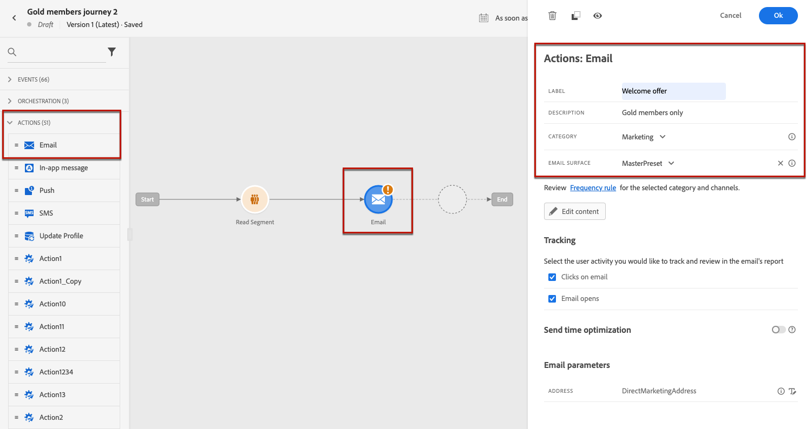
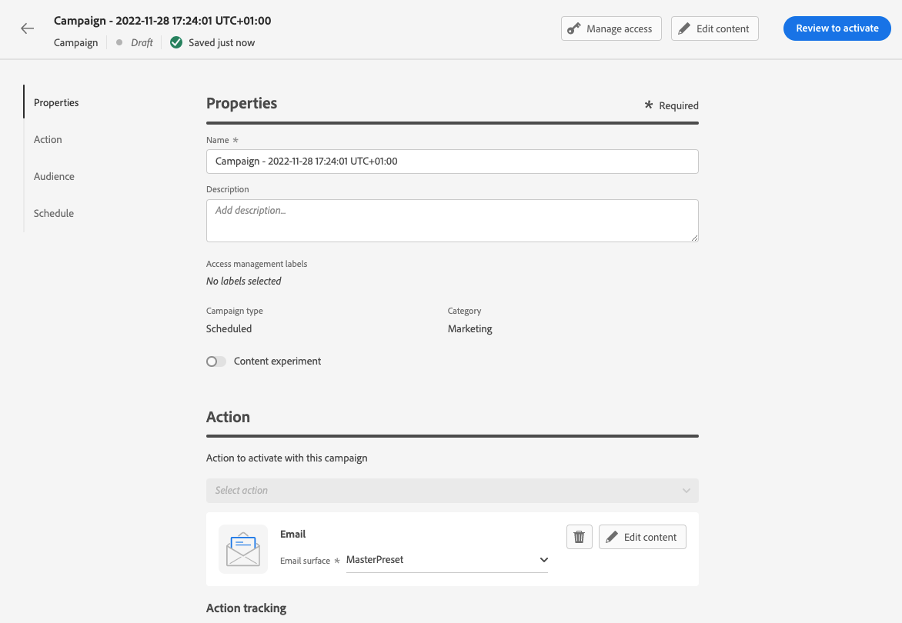

# Création d&#39;un e-mail {#create-email-bis}

Pour créer un email, procédez comme suit.

## 1. Créer un email dans un parcours ou une campagne

Ajoutez un **[!UICONTROL Email]** à un parcours ou à une campagne, et suivez les étapes ci-dessous en fonction de votre cas.

>[!BEGINTABS]

>[!TAB Ajouter un email à un parcours]

1. Ouvrez votre parcours, puis effectuez un glisser-déposer d’un **[!UICONTROL Email]** de l’activité **[!UICONTROL Actions]** de la palette.

1. Fournissez des informations de base sur votre message (libellé, description, catégorie).

1. Choisissez la [surface email] à utiliser.

   

Pour plus d’informations sur la configuration d’un parcours, reportez-vous à la section [cette page](../building-journeys/journey-gs.md).

>[!TAB Ajout d’un email à une campagne]

1. Créez une campagne planifiée ou déclenchée par une API, puis sélectionnez **[!UICONTROL Email]** comme votre action.

1. Choisissez la [surface email] à utiliser.

   

1. Cliquez sur **[!UICONTROL Créer]**.

1. Suivez les étapes pour créer une campagne par courrier électronique.

   

<!--
From the **[!UICONTROL Action]** section, specify if you want to track how your recipients react to your delivery: you can track email opens, and/or clicks on links and buttons in your email.

-->

Pour plus d&#39;informations sur le paramétrage d&#39;une opération, reportez-vous à la section [cette page](../campaigns/get-started-with-campaigns.md).

>[!ENDTABS]

## Définition du contenu de l’e-mail

1. Dans l&#39;écran de configuration des parcours ou des campagnes, cliquez sur le bouton **[!UICONTROL Modifier le contenu]** pour configurer le contenu de l&#39;email. [En savoir plus]

   

1. Dans le **[!UICONTROL En-tête]** de la section **[!UICONTROL Modifier le contenu]** l’écran **[!UICONTROL À partir du nom]**, **[!UICONTROL Adresse électronique]** et **[!UICONTROL Cci]** provient de la surface d’email que vous avez sélectionnée. [En savoir plus] <!--check if same for journey-->

   

1. Vous pouvez ajouter un objet. Saisissez du texte brut directement dans le champ correspondant ou utilisez la méthode [Editeur d&#39;expression](../personalization/personalization-build-expressions.md) pour personnaliser votre objet.

1. Cliquez sur le bouton **[!UICONTROL Modifier le corps de l’email]** pour commencer à créer votre contenu à l’aide du bouton [!DNL Journey Optimizer] Concepteur d’email. [En savoir plus]

   

   Vous pouvez également cliquer sur le bouton **[!UICONTROL Éditeur de code]** pour coder votre propre contenu en HTML brut à l’aide de la fenêtre contextuelle qui s’affiche.

   

   >[!NOTE]
   >
   >Si vous avez déjà créé ou importé du contenu par l&#39;intermédiaire du Concepteur d&#39;email, ce contenu s&#39;affiche par HTML.

## Prévisualisez l’email

Une fois le contenu de votre message défini, vous pouvez le prévisualiser afin de contrôler le rendu de votre email, et vérifier les paramètres de personnalisation avec les profils de test. [En savoir plus]

Vous devez également vérifier les alertes dans la section supérieure de l’éditeur.  Certaines d’entre elles sont de simples avertissements, mais d’autres peuvent vous empêcher d’utiliser le message. [En savoir plus](alerts.md).

## Validation du contenu de l’e-mail

Une fois votre email prêt, effectuez la configuration de votre [parcours](../building-journeys/journey-gs.md) ou [campaign](../campaigns/create-campaign.md) et activez pour envoyer le message.

>[!NOTE]
>
>Pour suivre le comportement de vos destinataires par le biais d&#39;ouvertures et/ou d&#39;interactions d&#39;email, assurez-vous que les options dédiées dans la variable **[!UICONTROL Tracking]** sont activées dans le parcours [activité email](../building-journeys/journeys-message.md) ou dans l’email [campaign](../campaigns/create-campaign.md).

Vous devez également vérifier les alertes dans la section supérieure de l’éditeur.  Certaines d’entre elles sont de simples avertissements, mais d’autres peuvent vous empêcher d’utiliser le message. [En savoir plus](alerts.md)

