# Concevoir le contenu de vos emails dans l&#39;interface utilisateur {#create-email-content}

Une fois que vous avez [créé votre message](create-message.md), vous pouvez commencer à créer le contenu de votre email.

1. Dans le message que vous venez de créer, sélectionnez **[!UICONTROL Concepteur d&#39;email]** dans la section **[!UICONTROL Corps]**.

   

1. Dans la page d&#39;accueil du Concepteur d&#39;email, choisissez la manière de concevoir votre email à l&#39;aide des options suivantes :

   * Sélectionnez **[!UICONTROL Créer en partant de zéro]** pour utiliser les fonctionnalités du Concepteur d&#39;email afin de créer le contenu de votre email. [En savoir plus](#design-scratch)

   * Sélectionnez **[!UICONTROL Démarrer à partir d’un modèle]** pour créer votre email à partir d’une liste intégrée de modèles. Notez que vous ne pouvez pas créer d’autres modèles.

   * Sélectionnez **[!UICONTROL Coder le vôtre]** pour saisir ou coller du code HTML brut. [En savoir plus](existing-content.md#import-raw-html-code).

   * Sélectionnez **[!UICONTROL Importer un fichier HTML]** pour importer un fichier HTML ou un dossier .zip. [En savoir plus](existing-content.md#import-html-content-from-file).

   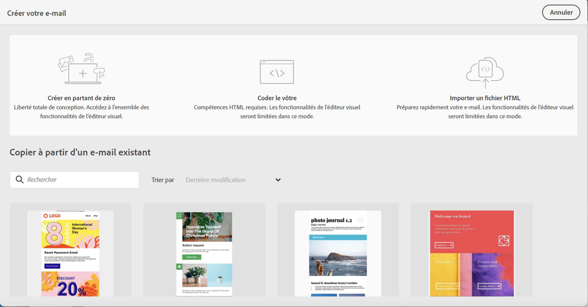

## Créer en partant de zéro {#design-scratch}

>[!CONTEXTUALHELP]
>id="ac_structure_components"
>title="À propos des composants de structure"
>abstract="Les composants de structure définissent la disposition de votre email."

>[!CONTEXTUALHELP]
>id="ac_edition_columns"
>title="Définition des colonnes de l’email"
>abstract="Le Concepteur d’email vous permet de définir facilement la disposition de votre email en définissant la structure des colonnes."

Le Concepteur d’email permet de définir facilement la structure de votre email. En ajoutant et en déplaçant des éléments structurels à l’aide de simples actions de glisser-déposer, vous pouvez concevoir la forme de votre email en quelques secondes.

Pour commencer à créer le contenu de votre email avec le Concepteur d’email, procédez comme suit :

1. Après avoir sélectionné l’option **[!UICONTROL Créer en partant de zéro]**, commencez à concevoir le contenu de votre email en faisant glisser et en déposant les **[!UICONTROL Composants de structure]** pour définir la disposition de votre email.

   >[!NOTE]
   >
   >Les colonnes empilées ne sont pas compatibles avec tous les programmes de messagerie. Lorsqu’elles ne sont pas prises en charge, les colonnes ne sont pas empilées.
   >
   >Une fois qu’ils ont été placés dans l’email, vous ne pouvez pas déplacer ni supprimer vos composants, à moins qu’un composant de contenu ou un fragment ne soit déjà placé à l’intérieur.

   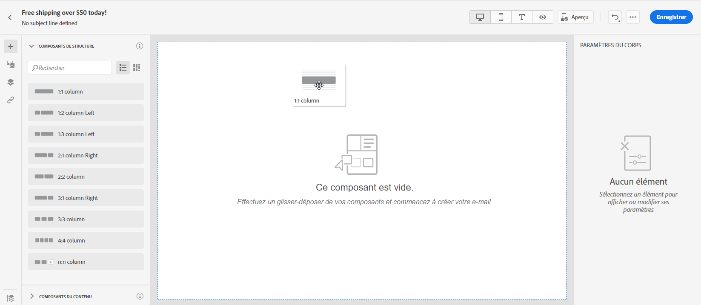

1. Ajoutez autant de **[!UICONTROL composants de structure]** que nécessaire.

   Sélectionnez le composant **[!UICONTROL n:n colonne]** pour définir le nombre de colonnes de votre choix (entre 3 et 10). Vous pouvez également définir la largeur de chaque colonne en déplaçant les flèches situées en bas de chaque colonne.

   >[!NOTE]
   >
   >La taille de chaque colonne ne peut pas être inférieure à 10 % de la largeur totale du composant de structure. Vous ne pouvez pas supprimer une colonne qui n’est pas vide.

1. Dans la liste déroulante **[!UICONTROL Composants du contenu]**, vous pouvez ajouter autant de **[!UICONTROL Composants de contenu]** que nécessaire dans votre composant de structure. [En savoir plus sur les composants de contenu](content-components.md).

   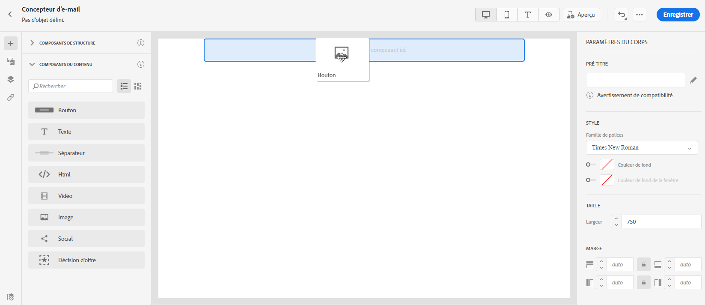

1. Chaque composant peut être davantage personnalisé via la section **[!UICONTROL Paramètres des composants]**. Par exemple, vous pouvez changer le style de texte, la marge intérieure ou la marge de votre composant. [En savoir plus sur l’alignement et la marge intérieure](#adjusting-vertical-alignment-and-padding).

   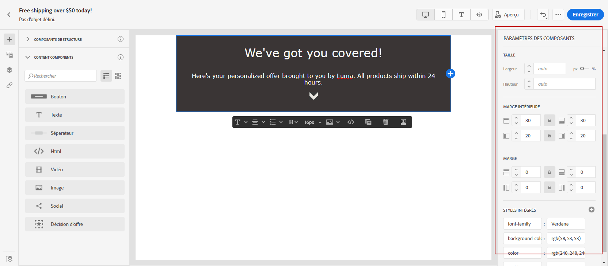

1. À partir du **[!UICONTROL sélecteur de ressources]**, vous pouvez ajouter directement à votre adresse email des ressources stockées dans la **[!UICONTROL bibliothèque de ressources]**. [En savoir plus sur la gestion des ressources](assets-essentials.md).

   Double-cliquez sur le dossier contenant vos ressources, puis faites glisser et déposez la ressource que vous souhaitez ajouter à votre email.

   

1. Ajoutez des champs de personnalisation pour personnaliser le contenu à partir des données de vos profils. [En savoir plus sur la personnalisation de contenu](../personalization/personalize.md).

   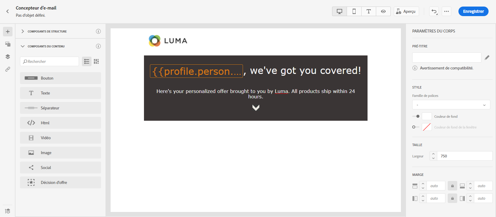

1. Dans l’onglet **[!UICONTROL Liens]** du volet de gauche, vérifiez la liste de toutes les URL de votre contenu qui feront l’objet d’un suivi. Si nécessaire, vous pouvez modifier leur **[!UICONTROL Type de tracking]**, leur **[!UICONTROL Libellé]** et leurs **[!UICONTROL Balises]**.

   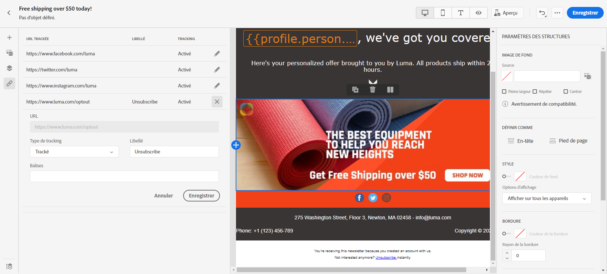

   >[!NOTE]
   >
   >Pour en savoir plus sur les liens et le suivi des messages, consultez [cette page](message-tracking.md).

1. Au besoin, vous pouvez passer à l’éditeur de code pour personnaliser davantage votre e-mail en cliquant sur **[!UICONTROL Basculer vers l’éditeur de code]** dans le menu avancé. Pour plus d’informations sur l’éditeur de code, consultez [cette page](existing-content.md#import-raw-html-code).

   >[!NOTE]
   >
   >Vous ne pourrez pas utiliser le concepteur visuel pour cet e-mail après avoir basculé vers l’éditeur de code.

   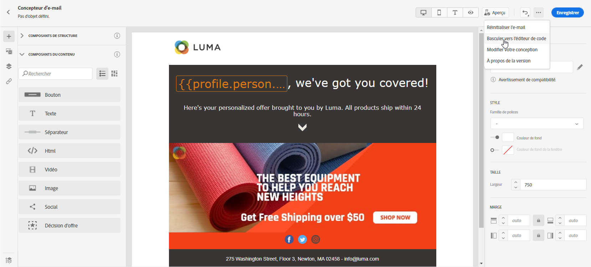

1. Cliquez sur **[!UICONTROL Afficher l&#39;aperçu]** pour vérifier le rendu de votre e-mail. Vous pouvez choisir la vue bureau ou la vue mobile.

   Pour plus d&#39;informations sur la façon de prévisualiser votre e-mail, reportez-vous à [cette page](preview.md).

   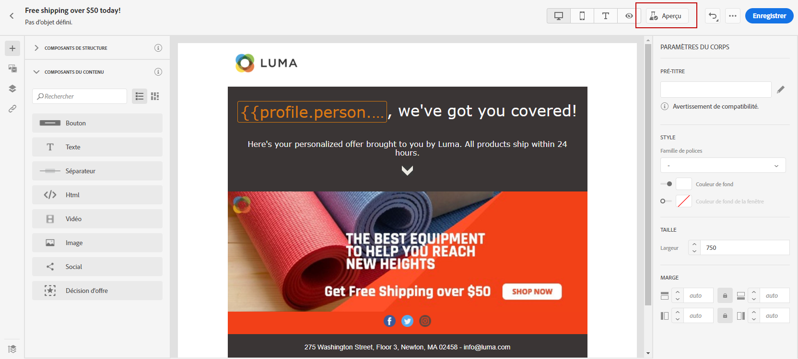

1. Lorsque votre email est prêt, cliquez sur **[!UICONTROL Enregistrer et fermer]**.

Le contenu de votre email peut maintenant être utilisé dans un message. [Découvrez comment envoyer un message](publish-manage-message.md).

## Création de la version texte d&#39;un email {#generate-text-version}

Il est recommandé de créer une version texte du corps de votre email, qui est utilisée lorsque le contenu HTML ne peut pas être affiché.

Par défaut, le Concepteur d’email crée une version en **[!UICONTROL texte brut]** de votre email, y compris des champs de personnalisation. Cette version est automatiquement générée et synchronisée avec la version HTML de votre contenu.

Si vous préférez utiliser un contenu différent pour la version en texte brut, procédez comme suit :

1. Dans votre email, sélectionnez l’onglet **[!UICONTROL Texte brut]**.

   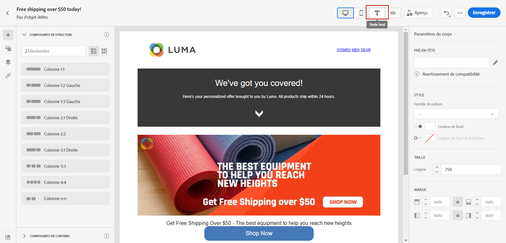

1. Utilisez le bouton bascule **[!UICONTROL Synchroniser avec le code HTML]** pour désactiver la synchronisation.

   

1. Cliquez sur la coche pour confirmer votre choix.

   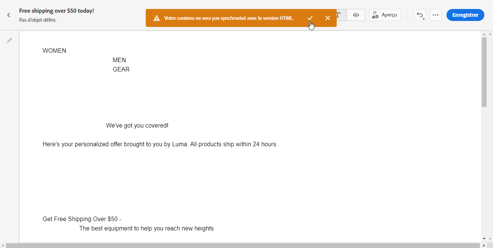

1. Vous pouvez ensuite modifier la version en texte brut comme vous le souhaitez.

>[!CAUTION]
>
>* Les modifications effectuées dans la vue **[!UICONTROL Texte brut]** ne sont pas reflétées dans la vue HTML.
>
>* Si vous réactivez l’option **[!UICONTROL Synchroniser avec le code HTML]** après la mise à jour de votre contenu en texte brut, vos modifications seront perdues et remplacées par du contenu texte généré à partir de la version HTML.

## Ajout d’un pré-titre {#preheader}

>[!CONTEXTUALHELP]
>id="ac_edition_preheader"
>title="Ajouter un pré-titre"
>abstract="Un pré-titre est un texte de résumé court qui suit l’objet d’un message lorsque vous le visualisez depuis votre client de messagerie. Dans de nombreux cas, il fournit un bref résumé de l’email et il s’agit généralement d’une seule phrase."

Un pré-titre est un texte de résumé court qui suit l’objet d’un message lorsque vous le visualisez depuis votre client de messagerie. Dans de nombreux cas, il fournit un bref résumé de l’email et il s’agit généralement d’une seule phrase.

>[!NOTE]
>
>Les en-têtes prédéfinis ne sont pas pris en charge par tous les clients de messagerie. S’il n’est pas pris en charge, le pré-titre ne s’affiche pas.

Pour définir le pré-titre de l&#39;email, procédez comme suit :

1. Depuis le Concepteur d&#39;e-mail, ajoutez des **[!UICONTROL composants de structure]** pour commencer à concevoir votre e-mail.

   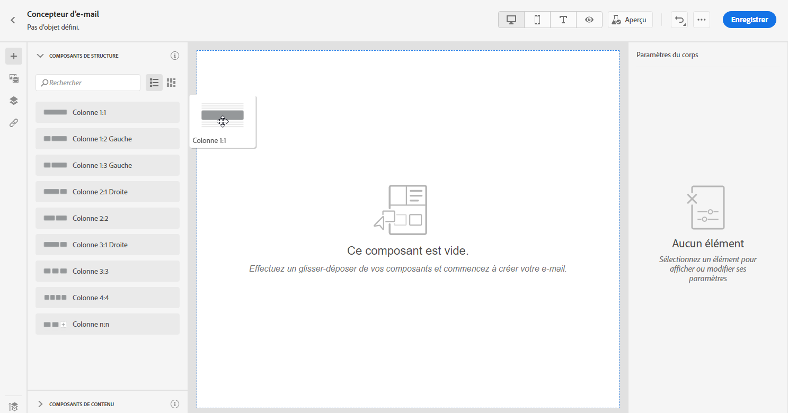

1. Dans le volet de droite **[!UICONTROL Paramètres du corps]**, cliquez sur **Modifier** en regard du champ **[!UICONTROL Pré-titre]** pour ajouter du contenu.

   

1. Ajoutez votre pré-titre. Vous pouvez le personnaliser davantage en cliquant sur l&#39;icône **[!UICONTROL Ajouter une personnalisation]**.

   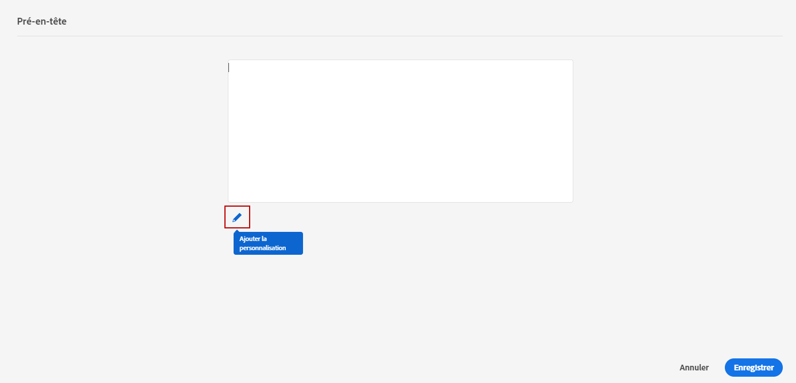

1. Dans la fenêtre **[!UICONTROL Modifier la personnalisation]**, vous pouvez ajouter **[!UICONTROL Bloc de contenu]**, **[!UICONTROL Contenu dynamique]** ou **[!UICONTROL Champs de personnalisation]**.

1. Cliquez sur **[!UICONTROL Valider]** pour vérifier la syntaxe de votre personnalisation.

   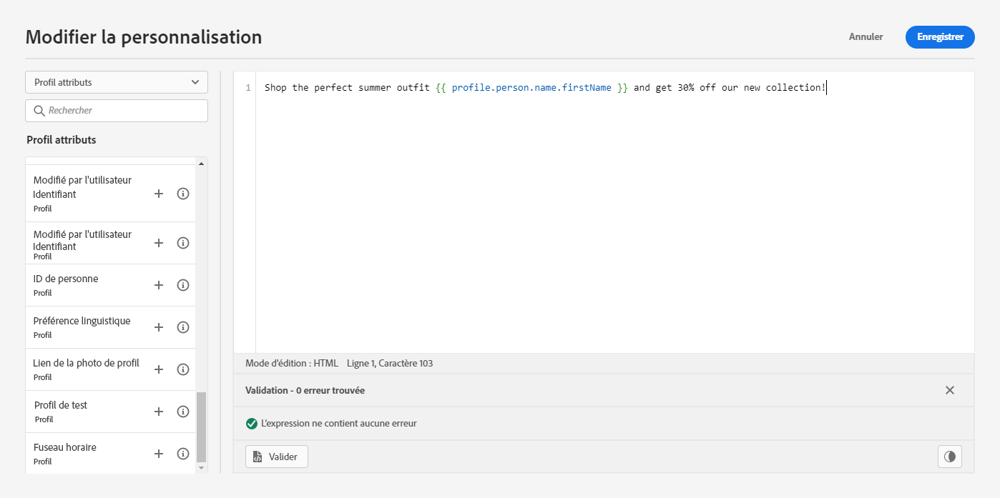

1. Cliquez sur **[!UICONTROL Enregistrer]**.

Votre pré-titre est maintenant configuré pour votre e-mail.

## Paramètres d&#39;arrière-plan {#about-backgrounds}

>[!CONTEXTUALHELP]
>id="ac_edition_backgroundimage"
>title="Paramètres d&#39;arrière-plan"
>abstract="Vous pouvez personnaliser la couleur d’arrière-plan ou l’image d’arrière-plan de votre contenu. Notez que l’image d’arrière-plan n’est pas prise en charge par tous les clients de messagerie."

Lorsqu’il s’agit de définir des arrière-plans avec le Concepteur d’email, Adobe recommande ce qui suit :

1. Appliquez une couleur de fond au corps de votre email, si votre conception l’exige.
1. Dans la plupart des cas, définissez les couleurs de fond au niveau de la colonne.
1. Essayez de ne pas utiliser de couleurs de fond sur les composants d’image ou de texte, car ceux-ci sont difficiles à gérer.

Vous trouverez ci-dessous les paramètres d’arrière-plan que vous pouvez utiliser.

* Définissez une **[!UICONTROL Couleur de fond]** pour l&#39;ensemble de l&#39;email. Assurez-vous de sélectionner les paramètres du corps dans l&#39;arborescence de navigation accessible à partir de la palette gauche.

* Définissez la même couleur de fond pour tous les composants de structure en sélectionnant **[!UICONTROL Couleur de fond de la fenêtre]**. Cette option vous permet de sélectionner un autre paramètre dans la couleur de fond.

* Définissez une couleur de fond différente pour chaque composant de structure. Sélectionnez une structure dans l’arborescence de navigation accessible via la palette de gauche pour n’appliquer une couleur de fond spécifique qu’à cette structure.

   Veillez à ne pas définir de couleur de fond de fenêtre, car celle-ci pourrait cacher les couleurs de fond de la structure.

* Définissez une **[!UICONTROL Image de fond]** pour le contenu d&#39;un composant de structure.

   >[!NOTE]
   >
   >Certaines messageries ne prennent pas en charge les images de fond. Si ces images ne sont pas prises en charge, la couleur d’arrière-plan de la ligne est utilisée à la place. Veillez à sélectionner une couleur de fond de secours appropriée au cas où l’image ne s’afficherait pas.

* Définissez une couleur de fond au niveau de la colonne.

   >[!NOTE]
   >
   >Il s’agit du cas pratique le plus courant. Adobe recommande de définir les couleurs de fond au niveau de la colonne, car cela donne une plus grande flexibilité lors de la modification du contenu entier de l’email.

   Vous pouvez également définir une image de fond au niveau de la colonne, mais ce scénario est rare.

## Ajustement de l&#39;alignement vertical et la marge intérieure {#adjusting-vertical-alignment-and-padding}

Dans cet exemple, nous allons ajuster la marge intérieure et l&#39;alignement vertical à l&#39;intérieur d&#39;un composant de structure composé de trois colonnes.

1. Sélectionnez le composant de structure directement dans l’email ou à l’aide de l’**[!UICONTROL arborescence de navigation]** disponible dans le menu de gauche.

   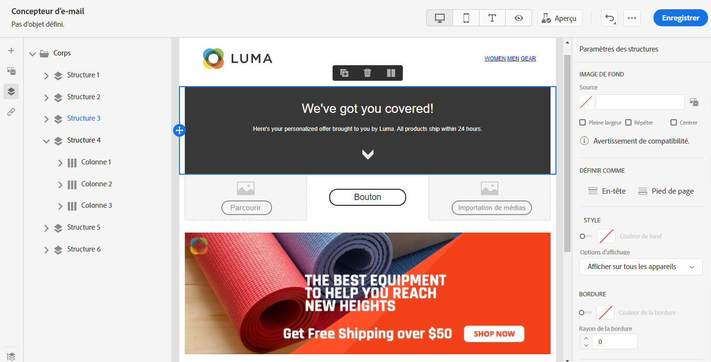

1. Dans la barre d&#39;outils, cliquez sur **[!UICONTROL Sélectionner une colonne]** et choisissez celle à modifier. Vous pouvez également la sélectionner dans l&#39;arborescence.

   Les paramètres modifiables pour cette colonne sont affichés dans le menu **[!UICONTROL Paramètres de colonne]**.

   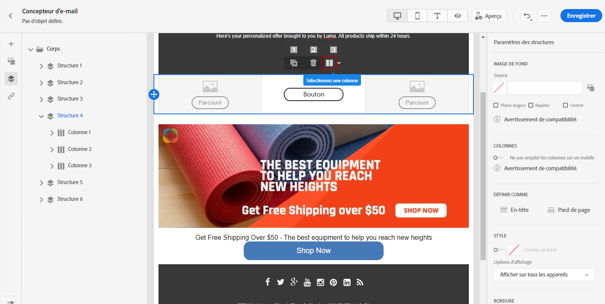

1. Sous **[!UICONTROL Alignement vertical]**, sélectionnez **[!UICONTROL Bas]**.

   Le composant de contenu se déplace en bas de la colonne.

   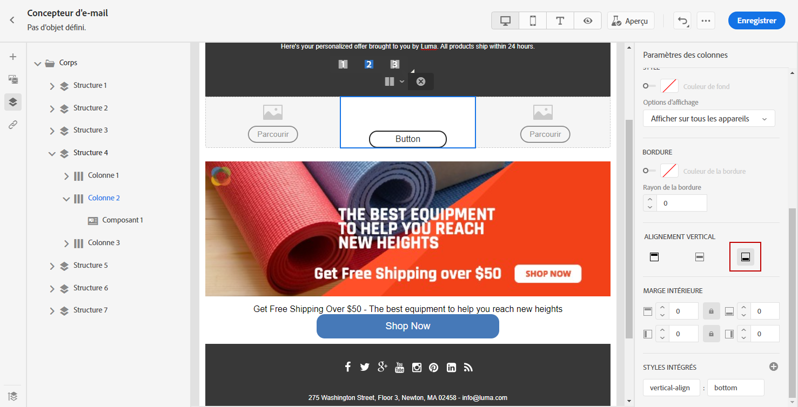

1. Sous **[!UICONTROL Marge intérieure]**, définissez la marge intérieure supérieure à l&#39;intérieur de la colonne. Cliquez sur l’icône de verrou pour interrompre la synchronisation avec la marge intérieure inférieure.

   Définissez la marge intérieure gauche et droite de cette colonne.

   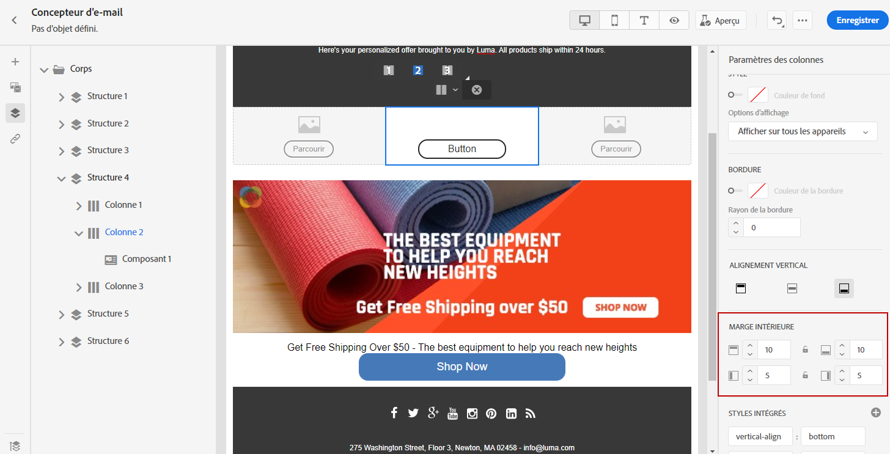

1. Procédez de la même façon pour ajuster l’alignement et la marge intérieure des autres colonnes.

1. Enregistrez vos modifications.

## Définition d’un style pour les liens {#about-styling-links}

Vous pouvez souligner un lien et sélectionner sa couleur et sa cible dans le Concepteur d&#39;email.

1. Dans un **[!UICONTROL composant de contenu]** texte où un lien est inséré, sélectionnez votre lien.

1. Dans les **[!UICONTROL paramètres du composant]**, cochez la case **[!UICONTROL Souligner le lien]** pour souligner le texte du libellé de votre lien.

   

1. Choisissez comment votre audience sera redirigée avec la liste déroulante **[!UICONTROL Cible]** :

   * **[!UICONTROL Aucune]** : ouvre le lien dans le même cadre que celui sur lequel l’utilisateur a cliqué (par défaut).
   * **[!UICONTROL Vierge]** : ouvre le lien dans une nouvelle fenêtre ou un nouvel onglet.
   * **[!UICONTROL Self]** : ouvre le lien dans le même cadre que celui sur lequel l’utilisateur a cliqué.
   * **[!UICONTROL Parent]** : ouvre le lien dans le cadre parent.
   * **[!UICONTROL Haut]** : ouvre le lien dans le corps complet de la fenêtre.

   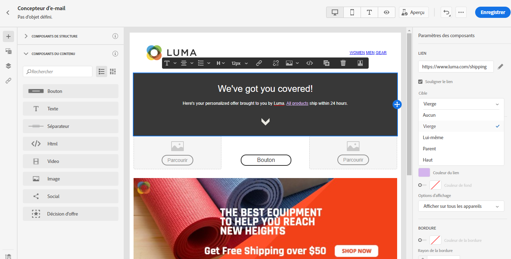

1. Pour changer la couleur de votre lien, cliquez sur **[!UICONTROL Couleur du lien]**.

   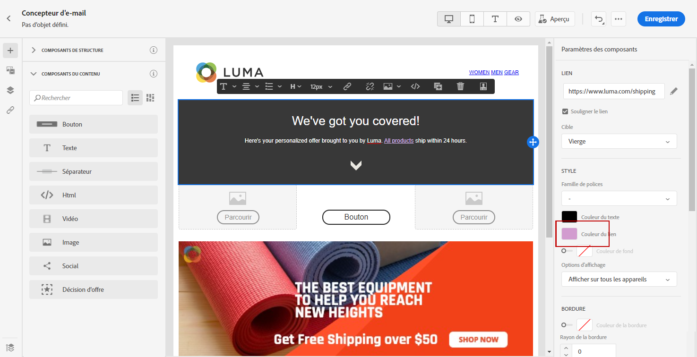

1. Choisissez la couleur dont vous avez besoin.

1. Enregistrez vos modifications.

## Ajout des attributs de style intégrés {#adding-inline-styling-attributes}

Dans l’interface du Concepteur d’email, lorsque vous sélectionnez un élément et en affichez les paramètres dans le panneau latéral, vous pouvez personnaliser les attributs intégrés et leur valeur pour cet élément spécifique.

1. Sélectionnez un élément de votre contenu.
1. Sur le panneau latéral, recherchez les paramètres de **[!UICONTROL styles intégrés]**.

1. Modifiez les valeurs des attributs existants ou ajoutez de nouveaux attributs à l’aide du bouton **+**. Vous pouvez ajouter un attribut et une valeur quelconques compatibles avec la feuille CSS.

Le style est ensuite appliqué à l’élément sélectionné. Si aucun attribut de style spécifique n’est défini pour les éléments enfants, le style de l’élément parent est hérité.
